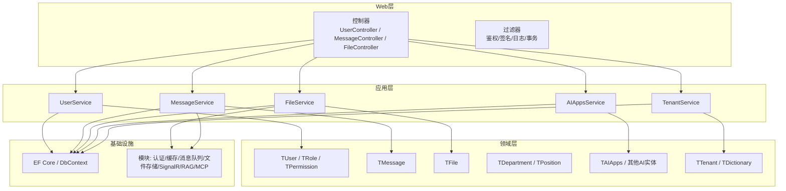
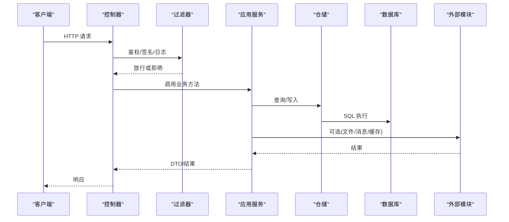
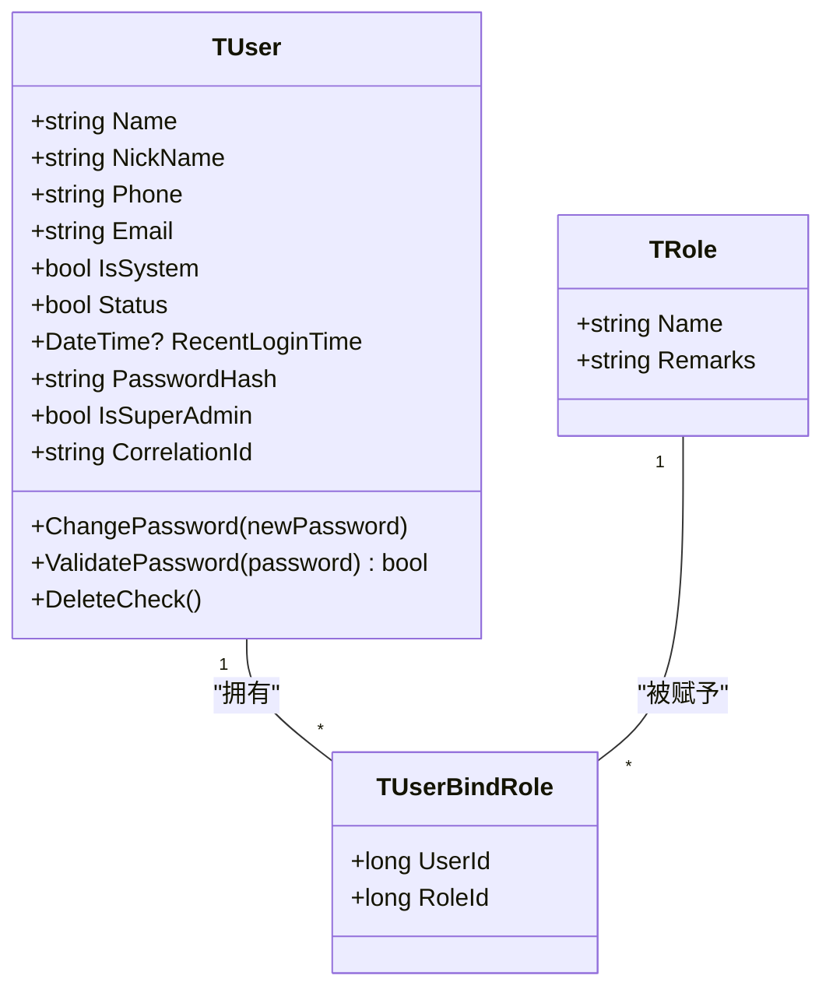
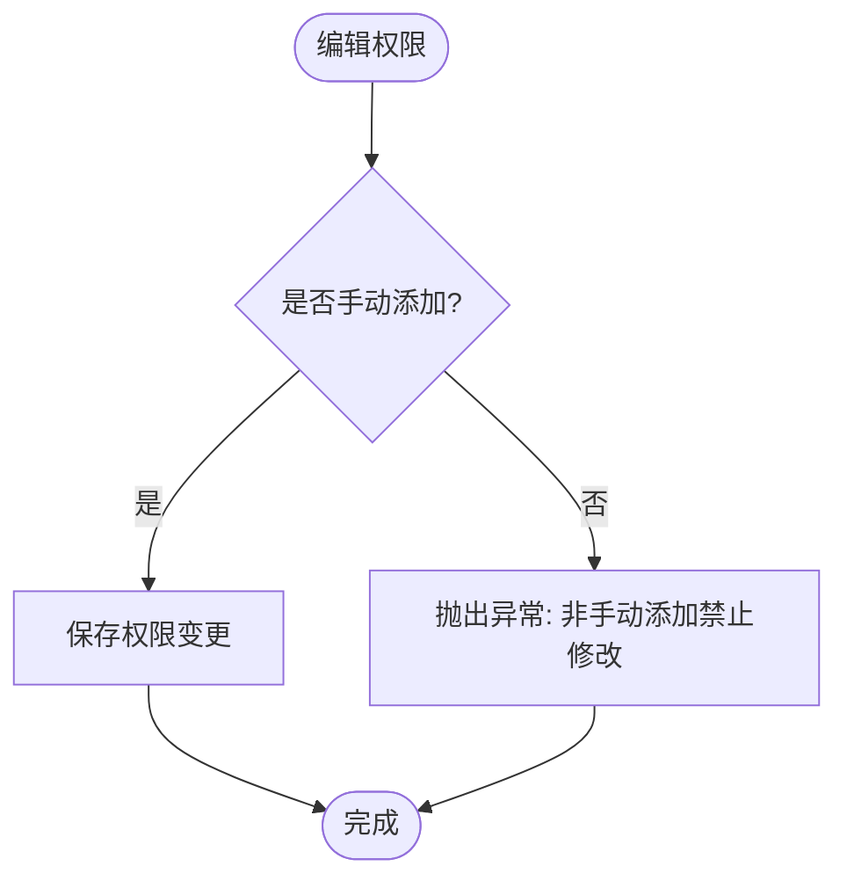
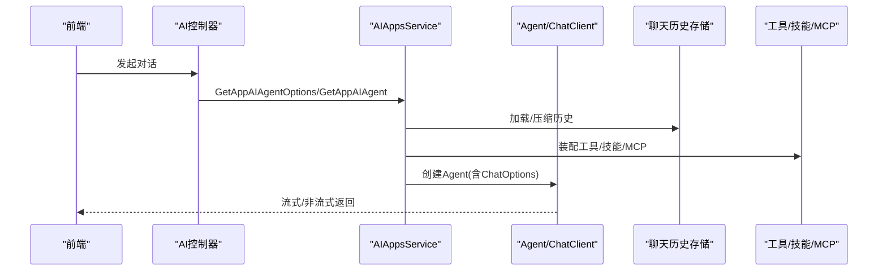
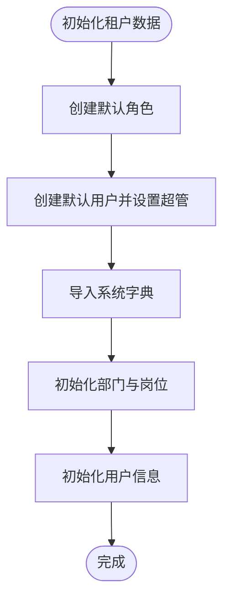
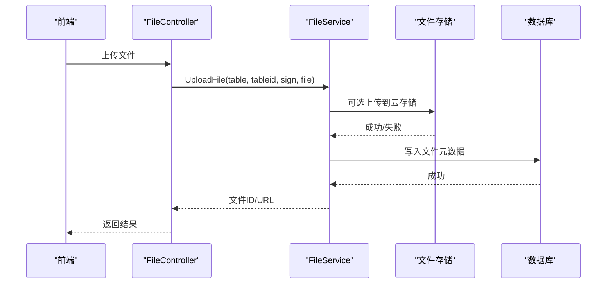
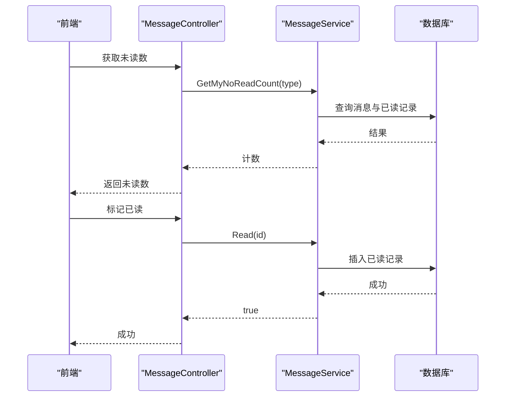
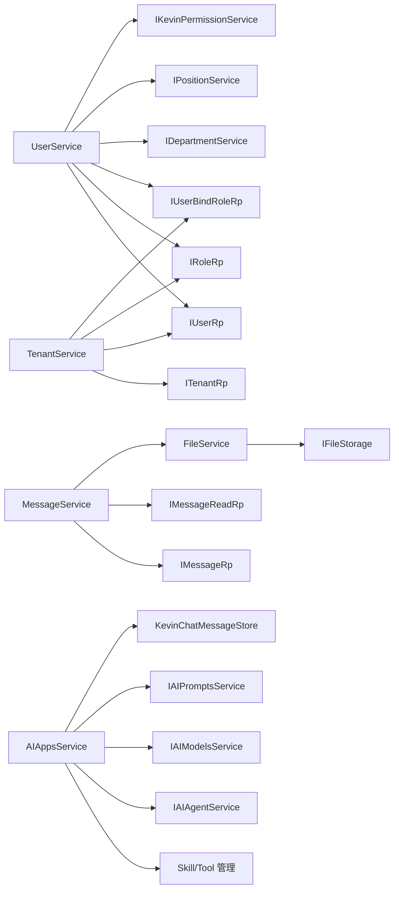

# 核心模块

<cite>
**本文引用的文件**
- [TUser.cs](file://Kevin/Domain/Entities/TUser.cs)
- [TRole.cs](file://Kevin/Domain/Entities/TRole.cs)
- [TPermission.cs](file://Kevin/Domain/Entities/TPermission.cs)
- [TMessage.cs](file://Kevin/Domain/Entities/TMessage.cs)
- [TFile.cs](file://Kevin/Domain/Entities/TFile.cs)
- [TDepartment.cs](file://Kevin/Domain/Entities/Organizational/TDepartment.cs)
- [TAIApps.cs](file://Kevin/Domain/Entities/AI/TAIApps.cs)
- [TTenant.cs](file://Kevin/Domain/Entities/TTenant.cs)
- [TDictionary.cs](file://Kevin/Domain/Entities/TDictionary.cs)
- [UserService.cs](file://Kevin/Application/Services/UserService.cs)
- [MessageService.cs](file://Kevin/Application/Services/MessageService.cs)
- [FileService.cs](file://Kevin/Application/Services/FileService.cs)
- [AIAppsService.cs](file://Kevin/Application/Services/AI/AIAppsService.cs)
- [TenantService.cs](file://Kevin/Application/Services/TenantService.cs)
</cite>

## 目录
1. [简介](#简介)
2. [项目结构](#项目结构)
3. [核心组件](#核心组件)
4. [架构总览](#架构总览)
5. [详细组件分析](#详细组件分析)
6. [依赖关系分析](#依赖关系分析)
7. [性能考虑](#性能考虑)
8. [故障排查指南](#故障排查指南)
9. [结论](#结论)
10. [附录](#附录)

## 简介
本文件面向 NetCoreKevin 框架的核心模块，围绕用户管理、权限控制、组织架构、AI智能助手、系统管理、文件管理、消息系统等关键能力进行系统化说明。文档从实体设计、服务实现、API接口、前端页面等维度展开，解释模块间的依赖与通信机制、数据流转与状态管理，并提供配置选项、性能优化建议与最佳实践，帮助开发者快速理解并扩展各模块。

## 项目结构
整体采用分层与模块化组织：
- Domain：领域实体、基础数据、事件与接口定义
- Application：业务服务层（用例编排）
- Web.Basics：控制器、过滤器、中间件等Web基础设施
- EntityFrameworkCore：数据库映射、拦截器、上下文
- RepositorieRps：仓储实现
- Kevin.Module：可插拔能力（认证、缓存、消息队列、文件存储、SignalR、RAG、MCP等）
- App：示例应用（演示业务）
- Vue前端：页面、路由、API封装

图表来源
- [UserService.cs:1-46](file://Kevin/Application/Services/UserService.cs#L1-L46)
- [MessageService.cs:1-21](file://Kevin/Application/Services/MessageService.cs#L1-L21)
- [FileService.cs:1-20](file://Kevin/Application/Services/FileService.cs#L1-L20)
- [AIAppsService.cs:1-52](file://Kevin/Application/Services/AI/AIAppsService.cs#L1-L52)
- [TenantService.cs:1-27](file://Kevin/Application/Services/TenantService.cs#L1-L27)

章节来源
- [UserService.cs:1-46](file://Kevin/Application/Services/UserService.cs#L1-L46)
- [MessageService.cs:1-21](file://Kevin/Application/Services/MessageService.cs#L1-L21)
- [FileService.cs:1-20](file://Kevin/Application/Services/FileService.cs#L1-L20)
- [AIAppsService.cs:1-52](file://Kevin/Application/Services/AI/AIAppsService.cs#L1-L52)
- [TenantService.cs:1-27](file://Kevin/Application/Services/TenantService.cs#L1-L27)

## 核心组件
- 用户管理：用户实体、角色绑定、登录校验、密码修改、手机号变更、分页查询、部门/岗位关联
- 权限控制：权限实体、菜单/功能/数据/接口权限类型、手动添加保护
- 组织架构：部门树、岗位、部门负责人、状态
- AI智能助手：AI应用配置、模型、提示词、工具/技能/MCP、对话历史压缩、流式输出
- 系统管理：租户生命周期、字典、初始化种子数据
- 文件管理：上传、下载、远程拉取、存储抽象、大小限制
- 消息系统：消息读写、已读标记、附件、按类型筛选

章节来源
- [TUser.cs:1-99](file://Kevin/Domain/Entities/TUser.cs#L1-L99)
- [TRole.cs:1-41](file://Kevin/Domain/Entities/TRole.cs#L1-L41)
- [TPermission.cs:1-154](file://Kevin/Domain/Entities/TPermission.cs#L1-L154)
- [TDepartment.cs:1-58](file://Kevin/Domain/Entities/Organizational/TDepartment.cs#L1-L58)
- [TAIApps.cs:1-230](file://Kevin/Domain/Entities/AI/TAIApps.cs#L1-L230)
- [TTenant.cs:1-56](file://Kevin/Domain/Entities/TTenant.cs#L1-L56)
- [TDictionary.cs:1-58](file://Kevin/Domain/Entities/TDictionary.cs#L1-L58)
- [TMessage.cs:1-55](file://Kevin/Domain/Entities/TMessage.cs#L1-L55)
- [TFile.cs:1-72](file://Kevin/Domain/Entities/TFile.cs#L1-L72)

## 架构总览
- 请求进入控制器后，由过滤器完成鉴权、签名、日志、事务等横切关注点
- 控制器调用应用层服务编排业务逻辑
- 服务通过仓储访问领域实体，必要时调用外部模块（文件存储、消息队列、SignalR、RAG、MCP）
- 领域实体承载数据约束与行为校验
- EF Core负责持久化，支持拦截器与子表配置

图表来源
- [UserService.cs:134-167](file://Kevin/Application/Services/UserService.cs#L134-L167)
- [MessageService.cs:48-91](file://Kevin/Application/Services/MessageService.cs#L48-L91)
- [FileService.cs:169-236](file://Kevin/Application/Services/FileService.cs#L169-L236)
- [AIAppsService.cs:322-448](file://Kevin/Application/Services/AI/AIAppsService.cs#L322-L448)

## 详细组件分析

### 用户管理模块
- 实体设计
  - 用户：用户名、昵称、手机、邮箱、是否系统用户、状态、最近登录时间、密码哈希、超级管理员标记、第三方关联ID；提供密码修改与校验、删除保护
  - 角色：名称、备注
  - 用户-角色绑定：多对多关系（在仓储与服务中维护）
- 服务实现
  - 登录：按用户名或手机号匹配，校验密码哈希，加载角色信息
  - 用户列表：支持搜索、分页、头像聚合、角色/岗位/部门信息回填
  - 新增/编辑：唯一性校验（姓名、手机号）、密码加密、角色与岗位绑定、用户信息同步
  - 删除：禁止删除自己与种子数据，软删除并级联处理角色绑定
  - 密码与手机变更：短信验证码校验后更新
- API接口
  - 控制器：UserController（登录、获取当前用户、用户CRUD、角色列表等）
- 前端页面
  - 用户列表、用户编辑、用户角色分配等页面

图表来源
- [TUser.cs:1-99](file://Kevin/Domain/Entities/TUser.cs#L1-L99)
- [TRole.cs:1-41](file://Kevin/Domain/Entities/TRole.cs#L1-L41)
- [UserService.cs:134-167](file://Kevin/Application/Services/UserService.cs#L134-L167)
- [UserService.cs:401-473](file://Kevin/Application/Services/UserService.cs#L401-L473)
- [UserService.cs:556-588](file://Kevin/Application/Services/UserService.cs#L556-L588)

章节来源
- [TUser.cs:1-99](file://Kevin/Domain/Entities/TUser.cs#L1-L99)
- [TRole.cs:1-41](file://Kevin/Domain/Entities/TRole.cs#L1-L41)
- [UserService.cs:134-167](file://Kevin/Application/Services/UserService.cs#L134-L167)
- [UserService.cs:239-338](file://Kevin/Application/Services/UserService.cs#L239-L338)
- [UserService.cs:401-473](file://Kevin/Application/Services/UserService.cs#L401-L473)
- [UserService.cs:556-588](file://Kevin/Application/Services/UserService.cs#L556-L588)

### 权限控制模块
- 实体设计
  - 权限：区域、模块名、动作名、全名、HTTP方法、是否手动添加、序号、图标、租户ID、权限类型（菜单/功能/数据/接口）
  - 非手动添加的权限禁止修改，保障系统稳定性
- 服务实现
  - 权限列表、详情、新增/编辑、删除（受“手动添加”标志保护）
- API接口
  - PermissionController
- 前端页面
  - 权限管理页面（菜单/按钮/接口级别授权）

图表来源
- [TPermission.cs:145-151](file://Kevin/Domain/Entities/TPermission.cs#L145-L151)

章节来源
- [TPermission.cs:1-154](file://Kevin/Domain/Entities/TPermission.cs#L1-L154)

### 组织架构模块
- 实体设计
  - 部门：名称、编码、描述、上级部门、负责人、排序、状态
- 服务实现
  - 部门树构建、子部门用户ID获取、岗位绑定
- API接口
  - DepartmentController、PositionController
- 前端页面
  - 组织架构图、岗位管理

章节来源
- [TDepartment.cs:1-58](file://Kevin/Domain/Entities/Organizational/TDepartment.cs#L1-L58)
- [UserService.cs:269-338](file://Kevin/Application/Services/UserService.cs#L269-L338)

### AI智能助手模块
- 实体设计
  - AI应用：名称、描述、图标、类型、会话模型ID、重排模型ID、温度、知识库ID、密钥、相似度、最大提问token、向量匹配数、回答token、提示词绑定、消息类型、是否启用工具/技能/MCP、重试次数、超时、白名单域名、消息数量限制、思考过程日志、工具调用日志、内容长度限制、安全拦截、对话轮次阈值、自动压缩开关与策略、响应格式、推理能力与输出、是否开启MCP
- 服务实现
  - 应用CRUD、可用应用列表（基于角色/用户绑定）、初始化模板、聊天选项装配、Agent装配（工具/技能/MCP/压缩历史）
- API接口
  - AIAppsController、AIChatsController、AIPromptsController、AIModelsController 等
- 前端页面
  - AI应用配置、聊天界面、提示词与模型管理

图表来源
- [AIAppsService.cs:322-448](file://Kevin/Application/Services/AI/AIAppsService.cs#L322-L448)
- [AIAppsService.cs:459-541](file://Kevin/Application/Services/AI/AIAppsService.cs#L459-L541)
- [TAIApps.cs:1-230](file://Kevin/Domain/Entities/AI/TAIApps.cs#L1-L230)

章节来源
- [TAIApps.cs:1-230](file://Kevin/Domain/Entities/AI/TAIApps.cs#L1-L230)
- [AIAppsService.cs:59-159](file://Kevin/Application/Services/AI/AIAppsService.cs#L59-L159)
- [AIAppsService.cs:167-259](file://Kevin/Application/Services/AI/AIAppsService.cs#L167-L259)
- [AIAppsService.cs:322-448](file://Kevin/Application/Services/AI/AIAppsService.cs#L322-L448)
- [AIAppsService.cs:459-541](file://Kevin/Application/Services/AI/AIAppsService.cs#L459-L541)

### 系统管理模块
- 租户管理
  - 实体：租户编码、名称、状态（激活/失效），提供失效/激活、编辑、删除、初始化数据
  - 服务：仅超级管理员可操作；初始化时批量创建角色、用户、字典、部门、岗位、用户信息
- 字典管理
  - 实体：键、值、类型、备注、是否系统内置、排序；系统内置字典禁止删除
- API接口
  - TenantController、DictionaryController
- 前端页面
  - 租户管理、字典管理

图表来源
- [TenantService.cs:159-279](file://Kevin/Application/Services/TenantService.cs#L159-L279)

章节来源
- [TTenant.cs:1-56](file://Kevin/Domain/Entities/TTenant.cs#L1-L56)
- [TenantService.cs:28-151](file://Kevin/Application/Services/TenantService.cs#L28-L151)
- [TenantService.cs:159-279](file://Kevin/Application/Services/TenantService.cs#L159-L279)
- [TDictionary.cs:1-58](file://Kevin/Domain/Entities/TDictionary.cs#L1-L58)

### 文件管理模块
- 实体设计
  - 文件：名称、路径、URL、外链表名、外链ID、标记、排序；索引优化（表名、外链ID）
- 服务实现
  - 上传：本地临时落盘→可选上传至云存储→记录元数据；支持远程文件拉取
  - 下载：根据ID读取文件流，自动推断MIME类型，支持云存储回源下载
  - 删除：软删除
  - 校验：文件大小限制（可从字典配置）
- API接口
  - FileController
- 前端页面
  - 文件上传组件、预览与下载

图表来源
- [FileService.cs:169-236](file://Kevin/Application/Services/FileService.cs#L169-L236)
- [TFile.cs:1-72](file://Kevin/Domain/Entities/TFile.cs#L1-L72)

章节来源
- [TFile.cs:1-72](file://Kevin/Domain/Entities/TFile.cs#L1-L72)
- [FileService.cs:22-25](file://Kevin/Application/Services/FileService.cs#L22-L25)
- [FileService.cs:67-91](file://Kevin/Application/Services/FileService.cs#L67-L91)
- [FileService.cs:118-167](file://Kevin/Application/Services/FileService.cs#L118-L167)
- [FileService.cs:169-236](file://Kevin/Application/Services/FileService.cs#L169-L236)
- [FileService.cs:238-253](file://Kevin/Application/Services/FileService.cs#L238-L253)

### 消息系统模块
- 实体设计
  - 消息：标题、内容、类型（系统/公告/私聊等）、发送人、接收人、关联ID/表
  - 已读记录：用户与消息的已读关系
- 服务实现
  - 未读数统计：按租户与用户过滤，排除已读
  - 分页查询：支持关键词、关联ID、用户、类型筛选，附带附件与创建者
  - 标记已读：插入已读记录
  - 新增/编辑/删除：软删除，带审计字段
- API接口
  - MessageController
- 前端页面
  - 我的消息、消息详情、已读标记

图表来源
- [MessageService.cs:26-46](file://Kevin/Application/Services/MessageService.cs#L26-L46)
- [MessageService.cs:93-104](file://Kevin/Application/Services/MessageService.cs#L93-L104)
- [TMessage.cs:1-55](file://Kevin/Domain/Entities/TMessage.cs#L1-L55)

章节来源
- [TMessage.cs:1-55](file://Kevin/Domain/Entities/TMessage.cs#L1-L55)
- [MessageService.cs:26-91](file://Kevin/Application/Services/MessageService.cs#L26-L91)
- [MessageService.cs:106-183](file://Kevin/Application/Services/MessageService.cs#L106-L183)

## 依赖关系分析
- 用户管理与权限
  - UserService 依赖 IUserRp、IRoleRp、IUserBindRoleRp、IUserInfoRp、IDepartmentService、IPositionService、IKevinPermissionService
  - 角色与用户通过绑定表建立多对多关系
- 文件管理与消息
  - FileService 依赖 IFileStorage（可替换为本地/云存储）
  - MessageService 依赖 IMessageRp、IMessageReadRp、IFileService
- AI智能助手
  - AIAppsService 依赖 IAISkillToolManagementService、IAISkillToolBindIdService、IAIAppsBindIdService、IAIAgentService、IAIModelsService、IAIPromptsService、KevinChatMessageStore
- 系统管理
  - TenantService 依赖 ITenantRp、IUserRp、IRoleRp、IUserBindRoleRp、IPermissionService

图表来源
- [UserService.cs:13-46](file://Kevin/Application/Services/UserService.cs#L13-L46)
- [MessageService.cs:6-21](file://Kevin/Application/Services/MessageService.cs#L6-L21)
- [FileService.cs:8-20](file://Kevin/Application/Services/FileService.cs#L8-L20)
- [AIAppsService.cs:16-52](file://Kevin/Application/Services/AI/AIAppsService.cs#L16-L52)
- [TenantService.cs:11-27](file://Kevin/Application/Services/TenantService.cs#L11-L27)

章节来源
- [UserService.cs:13-46](file://Kevin/Application/Services/UserService.cs#L13-L46)
- [MessageService.cs:6-21](file://Kevin/Application/Services/MessageService.cs#L6-L21)
- [FileService.cs:8-20](file://Kevin/Application/Services/FileService.cs#L8-L20)
- [AIAppsService.cs:16-52](file://Kevin/Application/Services/AI/AIAppsService.cs#L16-L52)
- [TenantService.cs:11-27](file://Kevin/Application/Services/TenantService.cs#L11-L27)

## 性能考虑
- 查询优化
  - 使用分页与只读投影，避免N+1查询；批量加载关联数据（如角色、岗位、部门、文件）
  - 对高频字段加索引（如文件表的Table与TableId）
- 并发与异步
  - 服务层广泛使用异步方法（ToListAsync、SaveChangesAsync），提高吞吐
- 文件传输
  - 大文件优先走云存储直传或分片；本地临时文件及时清理
  - 下载时按需推断MIME类型，减少额外开销
- AI对话
  - 合理设置Temperature、MaxOutputTokens、ContentLengthLimit、ConversationTurnsExceed
  - 开启对话自动压缩以减少上下文长度，降低Token消耗与延迟
- 缓存与消息
  - 结合缓存模块减少重复查询；使用消息队列解耦耗时任务（如通知、日志）

[本节为通用指导，不直接分析具体文件]

## 故障排查指南
- 常见错误
  - 登录失败：检查用户名/手机号、密码哈希、租户隔离条件
  - 权限修改失败：确认是否为“手动添加”的权限项
  - 文件上传失败：检查文件大小限制、存储可用性、远程拉取网络
  - 消息未读计数异常：核对租户与用户过滤条件、已读记录是否存在
  - AI对话异常：检查模型配置、网络超时、重试次数、工具/技能绑定
- 定位步骤
  - 查看控制器过滤器日志与全局异常捕获
  - 检查仓储SQL与EF拦截器日志
  - 核对领域实体的校验逻辑（如删除保护、状态校验）
  - 使用调试模式逐步验证服务层参数与返回值

章节来源
- [TUser.cs:76-95](file://Kevin/Domain/Entities/TUser.cs#L76-L95)
- [TPermission.cs:145-151](file://Kevin/Domain/Entities/TPermission.cs#L145-L151)
- [FileService.cs:238-253](file://Kevin/Application/Services/FileService.cs#L238-L253)
- [MessageService.cs:26-46](file://Kevin/Application/Services/MessageService.cs#L26-L46)
- [AIAppsService.cs:322-448](file://Kevin/Application/Services/AI/AIAppsService.cs#L322-L448)

## 结论
NetCoreKevin 核心模块以清晰的分层与模块化设计，提供了企业级用户与权限、组织架构、AI智能助手、系统管理、文件与消息等关键能力。通过领域实体约束、服务编排与基础设施解耦，既保证了系统的可扩展性与可维护性，也为前端集成与二次开发提供了稳定支撑。建议在实际项目中结合业务场景调整配置与优化策略，充分利用缓存、消息队列与云存储等能力，提升整体性能与用户体验。

## 附录
- 配置建议
  - 文件上传大小：通过字典配置动态调整
  - AI对话：根据模型能力设置Temperature、MaxOutputTokens、ContentLengthLimit、ConversationTurnsExceed
  - 网络与安全：配置AuthorizedDomains、IsSecurityIntercept、MaxRetries、NetworkTimeout
- 最佳实践
  - 统一使用DTO进行数据传输，避免直接暴露实体
  - 所有写操作记录审计字段（创建/更新/删除人与时间）
  - 对外部依赖（存储、消息、AI）采用接口抽象，便于替换与测试
  - 敏感操作增加二次校验与幂等设计

[本节为通用指导，不直接分析具体文件]