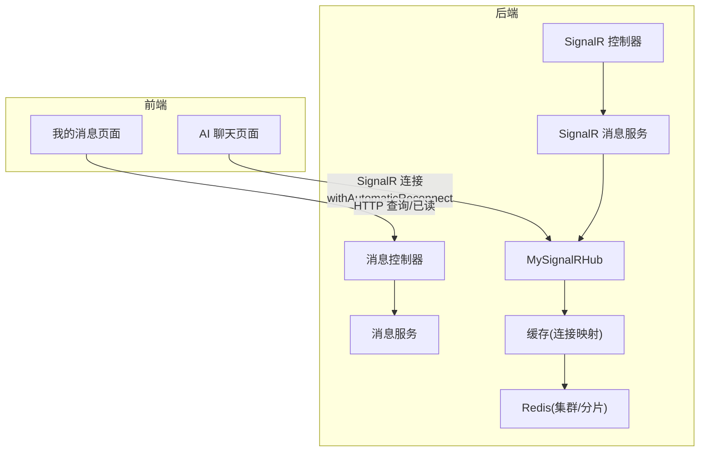
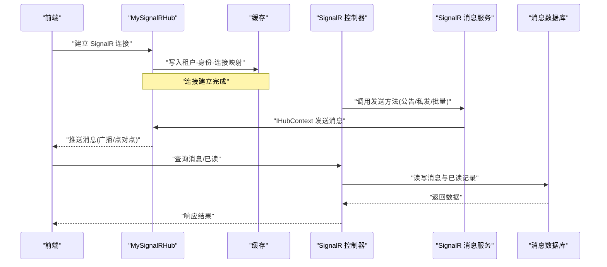
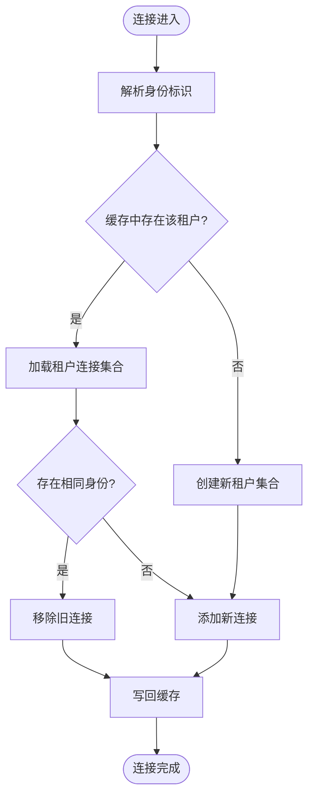
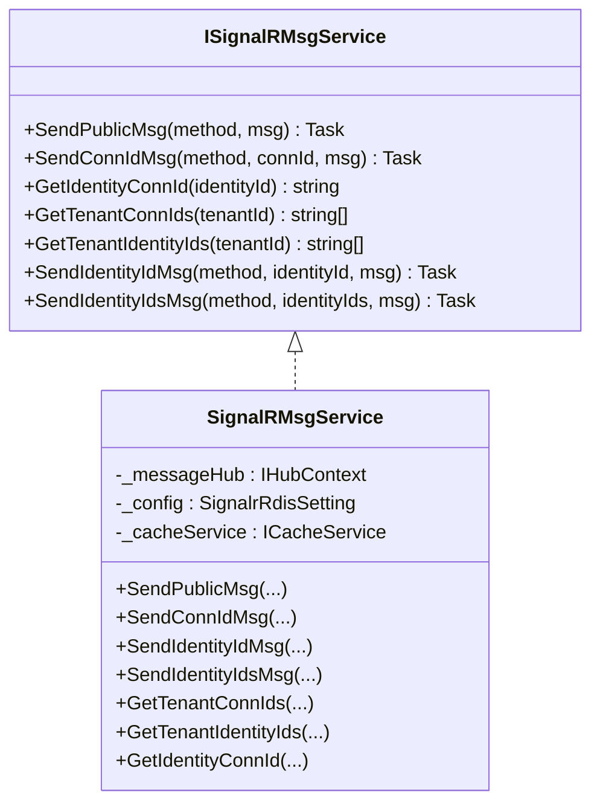
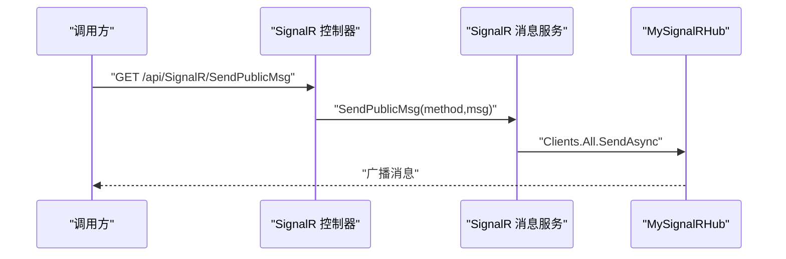
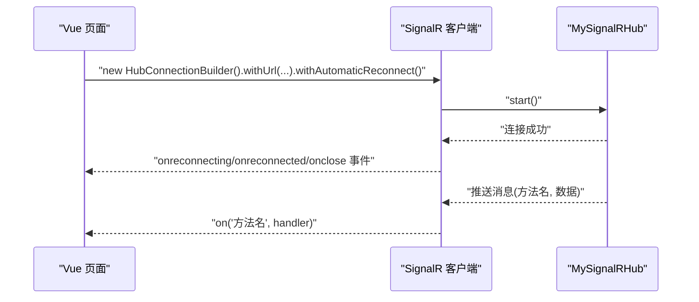
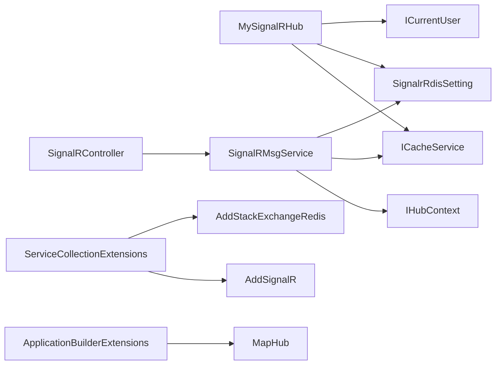

# 实时消息推送

<cite>
**本文引用的文件**
- [MySignalRHub.cs](file://Kevin/kevin.Module/Kevin.SignalR/MySignalRHub.cs)
- [SignalRMsgService.cs](file://Kevin/kevin.Module/Kevin.SignalR/Service/SignalRMsgService.cs)
- [ISignalRMsgService.cs](file://Kevin/kevin.Module/Kevin.SignalR/Service/ISignalRMsgService.cs)
- [SignalrRdisSetting.cs](file://Kevin/kevin.Module/Kevin.SignalR/Models/SignalrRdisSetting.cs)
- [SignalRCacheDto.cs](file://Kevin/kevin.Module/Kevin.SignalR/Models/SignalRCacheDto.cs)
- [ServiceCollectionExtensions.cs](file://Kevin/kevin.Module/Kevin.SignalR/ServiceCollectionExtensions.cs)
- [ApplicationBuilderExtensions.cs](file://Kevin/kevin.Module/Kevin.SignalR/ApplicationBuilderExtensions.cs)
- [SignalRController.cs](file://Kevin/ Kevin.Web.Basics/Controllers/SignalRController.cs)
- [MessageController.cs](file://Kevin/ Kevin.Web.Basics/Controllers/MessageController.cs)
- [MessageService.cs](file://Kevin/Application/Services/MessageService.cs)
- [message.js](file://vue/kevin.web.vue/src/api/message.js)
- [MyMessages.vue](file://vue/kevin.web.vue/src/pages/MyMessages.vue)
- [MyAIChat.vue](file://vue/kevin.web.vue/src/pages/ai/MyAIChat.vue)
</cite>

## 目录
1. [简介](#简介)
2. [项目结构](#项目结构)
3. [核心组件](#核心组件)
4. [架构总览](#架构总览)
5. [详细组件分析](#详细组件分析)
6. [依赖关系分析](#依赖关系分析)
7. [性能与可靠性](#性能与可靠性)
8. [故障排查指南](#故障排查指南)
9. [结论](#结论)
10. [附录：配置与客户端集成](#附录：配置与客户端集成)

## 简介
本章节概述项目中基于 SignalR 的实时消息推送能力，包括连接建立与维护、消息广播与点对点推送、用户分组（按租户与身份标识）管理、连接状态监控等。同时说明协议实现要点、重连机制、跨实例负载均衡、性能优化策略，以及优先级处理、离线消息、消息确认等可靠性保障思路，并提供配置示例与前端集成指引。

## 项目结构
- 后端模块
  - Hub 层：自定义 Hub 负责连接生命周期管理与在线映射维护
  - 服务层：封装消息发送能力（公告、私发、批量私发），并基于缓存维护连接映射
  - 控制器层：对外暴露 HTTP API 触发实时推送
  - 扩展注册：SignalR 服务与 Redis 扩展、端点映射
  - 模型与配置：Redis 连接参数、在线连接缓存数据结构
- 前端页面
  - 消息列表页：展示系统私信、私人私信、公司公告、系统消息、AI 消息等
  - AI 聊天页：使用浏览器 SignalR 客户端建立连接并自动重连
  - 消息 API：封装消息查询与已读标记接口

图表来源
- [MySignalRHub.cs:74-129](file://Kevin/kevin.Module/Kevin.SignalR/MySignalRHub.cs#L74-L129)
- [SignalRMsgService.cs:72-111](file://Kevin/kevin.Module/Kevin.SignalR/Service/SignalRMsgService.cs#L72-L111)
- [ServiceCollectionExtensions.cs:16-31](file://Kevin/kevin.Module/Kevin.SignalR/ServiceCollectionExtensions.cs#L16-L31)
- [ApplicationBuilderExtensions.cs:12-16](file://Kevin/kevin.Module/Kevin.SignalR/ApplicationBuilderExtensions.cs#L12-L16)
- [MessageController.cs:117-137](file://Kevin/ Kevin.Web.Basics/Controllers/MessageController.cs#L117-L137)
- [MessageService.cs:93-104](file://Kevin/Application/Services/MessageService.cs#L93-L104)

章节来源
- [MySignalRHub.cs:74-129](file://Kevin/kevin.Module/Kevin.SignalR/MySignalRHub.cs#L74-L129)
- [SignalRMsgService.cs:72-111](file://Kevin/kevin.Module/Kevin.SignalR/Service/SignalRMsgService.cs#L72-L111)
- [ServiceCollectionExtensions.cs:16-31](file://Kevin/kevin.Module/Kevin.SignalR/ServiceCollectionExtensions.cs#L16-L31)
- [ApplicationBuilderExtensions.cs:12-16](file://Kevin/kevin.Module/Kevin.SignalR/ApplicationBuilderExtensions.cs#L12-L16)
- [MessageController.cs:117-137](file://Kevin/ Kevin.Web.Basics/Controllers/MessageController.cs#L117-L137)
- [MessageService.cs:93-104](file://Kevin/Application/Services/MessageService.cs#L93-L104)

## 核心组件
- MySignalRHub：继承 Hub，处理 OnConnectedAsync/OnDisconnectedAsync，维护“租户-身份-连接”映射到缓存
- SignalRMsgService：提供 SendPublicMsg、SendConnIdMsg、SendIdentityIdMsg、SendIdentityIdsMsg 等方法，通过 IHubContext 调用 Hub 广播或点对点推送
- ISignalRMsgService：定义消息发送与连接查询的接口契约
- SignalrRdisSetting：SignalR 与 Redis 的配置项（URL、主机、端口、密码、数据库索引、配置频道、缓存键名）
- SignalRCacheDto：缓存中的连接映射结构（按租户分组，包含身份与连接 ID）
- ServiceCollectionExtensions：注册 SignalR、StackExchange.Redis 扩展、超时与保活间隔
- ApplicationBuilderExtensions：映射控制器与 Hub 端点
- SignalRController：对外暴露发送公告、私发、批量私发、查询身份列表等 API
- MessageController/MessageService：消息持久化、分页查询、未读数统计、已读标记

章节来源
- [MySignalRHub.cs:11-68](file://Kevin/kevin.Module/Kevin.SignalR/MySignalRHub.cs#L11-L68)
- [SignalRMsgService.cs:9-23](file://Kevin/kevin.Module/Kevin.SignalR/Service/SignalRMsgService.cs#L9-L23)
- [ISignalRMsgService.cs:6-47](file://Kevin/kevin.Module/Kevin.SignalR/Service/ISignalRMsgService.cs#L6-L47)
- [SignalrRdisSetting.cs:3-40](file://Kevin/kevin.Module/Kevin.SignalR/Models/SignalrRdisSetting.cs#L3-L40)
- [SignalRCacheDto.cs:3-28](file://Kevin/kevin.Module/Kevin.SignalR/Models/SignalRCacheDto.cs#L3-L28)
- [ServiceCollectionExtensions.cs:9-32](file://Kevin/kevin.Module/Kevin.SignalR/ServiceCollectionExtensions.cs#L9-L32)
- [ApplicationBuilderExtensions.cs:8-16](file://Kevin/kevin.Module/Kevin.SignalR/ApplicationBuilderExtensions.cs#L8-L16)
- [SignalRController.cs:21-88](file://Kevin/ Kevin.Web.Basics/Controllers/SignalRController.cs#L21-L88)
- [MessageController.cs:117-137](file://Kevin/ Kevin.Web.Basics/Controllers/MessageController.cs#L117-L137)
- [MessageService.cs:93-104](file://Kevin/Application/Services/MessageService.cs#L93-L104)

## 架构总览
- 连接建立：前端通过 SignalR 客户端连接到后端 Hub；Hub 在连接时读取当前用户身份与租户信息，将 ConnectionId 写入缓存（按租户分组）
- 消息发送：业务侧通过 SignalRController 调用 SignalRMsgService，后者根据目标（全部、指定连接、指定身份）选择 Hub 广播或点对点发送
- 连接维护：断开时从缓存移除对应连接；支持 Redis 作为分布式外置存储，便于多实例共享连接表
- 消息持久化与已读：消息落库，前端查看后调用已读接口更新读状态

图表来源
- [MySignalRHub.cs:74-129](file://Kevin/kevin.Module/Kevin.SignalR/MySignalRHub.cs#L74-L129)
- [SignalRMsgService.cs:72-111](file://Kevin/kevin.Module/Kevin.SignalR/Service/SignalRMsgService.cs#L72-L111)
- [SignalRController.cs:31-88](file://Kevin/ Kevin.Web.Basics/Controllers/SignalRController.cs#L31-L88)
- [MessageController.cs:117-137](file://Kevin/ Kevin.Web.Basics/Controllers/MessageController.cs#L117-L137)
- [MessageService.cs:93-104](file://Kevin/Application/Services/MessageService.cs#L93-L104)

## 详细组件分析

### Hub 连接与分组管理
- 身份解析：优先从请求头或查询参数获取 IdentityId，否则回退到当前用户 ID
- 连接映射：在 OnConnectedAsync 中，按租户维度维护 IdentityId 与 ConnectionId 的映射，重复连接会先清理旧映射再新增
- 断开清理：OnDisconnectedAsync 中移除该身份的映射，避免僵尸连接
- 资源释放：Dispose 中清理缓存键，防止内存泄漏

图表来源
- [MySignalRHub.cs:49-68](file://Kevin/kevin.Module/Kevin.SignalR/MySignalRHub.cs#L49-L68)
- [MySignalRHub.cs:74-129](file://Kevin/kevin.Module/Kevin.SignalR/MySignalRHub.cs#L74-L129)
- [MySignalRHub.cs:135-161](file://Kevin/kevin.Module/Kevin.SignalR/MySignalRHub.cs#L135-L161)

章节来源
- [MySignalRHub.cs:49-68](file://Kevin/kevin.Module/Kevin.SignalR/MySignalRHub.cs#L49-L68)
- [MySignalRHub.cs:74-129](file://Kevin/kevin.Module/Kevin.SignalR/MySignalRHub.cs#L74-L129)
- [MySignalRHub.cs:135-161](file://Kevin/kevin.Module/Kevin.SignalR/MySignalRHub.cs#L135-L161)

### 消息发送服务
- 公告推送：向所有客户端广播
- 点对点推送：根据 ConnectionId 精确发送
- 身份推送：根据 IdentityId 查找对应 ConnectionId 后发送
- 批量推送：根据多个 IdentityId 批量发送
- 连接查询：支持按租户获取连接 ID 列表与身份 ID 列表

图表来源
- [ISignalRMsgService.cs:6-47](file://Kevin/kevin.Module/Kevin.SignalR/Service/ISignalRMsgService.cs#L6-L47)
- [SignalRMsgService.cs:9-23](file://Kevin/kevin.Module/Kevin.SignalR/Service/SignalRMsgService.cs#L9-L23)
- [SignalRMsgService.cs:25-129](file://Kevin/kevin.Module/Kevin.SignalR/Service/SignalRMsgService.cs#L25-L129)

章节来源
- [SignalRMsgService.cs:25-129](file://Kevin/kevin.Module/Kevin.SignalR/Service/SignalRMsgService.cs#L25-L129)
- [ISignalRMsgService.cs:6-47](file://Kevin/kevin.Module/Kevin.SignalR/Service/ISignalRMsgService.cs#L6-L47)

### 控制器与 API
- SignalRController：提供发送公告、私发、批量私发、查询租户身份列表等 HTTP 接口
- MessageController：提供消息分页查询、未读数统计、已读标记等接口

图表来源
- [SignalRController.cs:31-38](file://Kevin/ Kevin.Web.Basics/Controllers/SignalRController.cs#L31-L38)
- [SignalRMsgService.cs:72-75](file://Kevin/kevin.Module/Kevin.SignalR/Service/SignalRMsgService.cs#L72-L75)

章节来源
- [SignalRController.cs:31-88](file://Kevin/ Kevin.Web.Basics/Controllers/SignalRController.cs#L31-L88)
- [MessageController.cs:117-137](file://Kevin/ Kevin.Web.Basics/Controllers/MessageController.cs#L117-L137)

### 前端集成与重连
- 连接建立：使用 HubConnectionBuilder 构建连接，附加 Authorization 头与 IdentityId
- 自动重连：启用 withAutomaticReconnect，监听 onreconnecting/onreconnected/onclose
- 消息消费：在 on 回调中处理服务端推送的方法名与消息体
- 资源清理：组件卸载时停止连接并清理定时器

图表来源
- [MyAIChat.vue:2554-2569](file://vue/kevin.web.vue/src/pages/ai/MyAIChat.vue#L2554-L2569)
- [MyAIChat.vue:2764-2770](file://vue/kevin.web.vue/src/pages/ai/MyAIChat.vue#L2764-L2770)

章节来源
- [MyAIChat.vue:2554-2569](file://vue/kevin.web.vue/src/pages/ai/MyAIChat.vue#L2554-L2569)
- [MyAIChat.vue:2764-2770](file://vue/kevin.web.vue/src/pages/ai/MyAIChat.vue#L2764-L2770)

## 依赖关系分析
- Hub 依赖：ICurrentUser、ICacheService、SignalrRdisSetting、HttpContextAccessor
- 服务依赖：IHubContext<MySignalRHub>、ICacheService、SignalrRdisSetting、ICurrentUser
- 控制器依赖：ISignalRMsgService、CurrentUser
- 扩展注册：AddSignalR + AddStackExchangeRedis，配置保活与超时；MapHub 映射端点

图表来源
- [MySignalRHub.cs:11-25](file://Kevin/kevin.Module/Kevin.SignalR/MySignalRHub.cs#L11-L25)
- [SignalRMsgService.cs:11-23](file://Kevin/kevin.Module/Kevin.SignalR/Service/SignalRMsgService.cs#L11-L23)
- [ServiceCollectionExtensions.cs:16-32](file://Kevin/kevin.Module/Kevin.SignalR/ServiceCollectionExtensions.cs#L16-L32)
- [ApplicationBuilderExtensions.cs:12-16](file://Kevin/kevin.Module/Kevin.SignalR/ApplicationBuilderExtensions.cs#L12-L16)

章节来源
- [MySignalRHub.cs:11-25](file://Kevin/kevin.Module/Kevin.SignalR/MySignalRHub.cs#L11-L25)
- [SignalRMsgService.cs:11-23](file://Kevin/kevin.Module/Kevin.SignalR/Service/SignalRMsgService.cs#L11-L23)
- [ServiceCollectionExtensions.cs:16-32](file://Kevin/kevin.Module/Kevin.SignalR/ServiceCollectionExtensions.cs#L16-L32)
- [ApplicationBuilderExtensions.cs:12-16](file://Kevin/kevin.Module/Kevin.SignalR/ApplicationBuilderExtensions.cs#L12-L16)

## 性能与可靠性
- 连接与保活
  - 服务端 KeepAliveInterval 与 ClientTimeoutInterval 已设置为较长间隔，降低心跳开销
  - 前端启用 withAutomaticReconnect，提升网络抖动下的稳定性
- 负载均衡与横向扩展
  - 使用 StackExchangeRedis 作为外置存储，多实例共享连接映射，天然支持水平扩展
  - 配置 ConnectRetry 与 SyncTimeout，增强 Redis 连接的健壮性
- 消息可靠性
  - 消息持久化：消息入库，支持分页查询与未读数统计
  - 已读标记：前端查看后调用已读接口，确保计数准确
  - 离线消息：通过数据库持久化保证离线后可恢复
  - 优先级与确认：当前代码未实现消息优先级队列与送达确认；可在服务层引入队列与重试机制以增强可靠性
- 性能优化建议
  - 批量发送：尽量使用批量身份发送接口减少多次 RPC
  - 缓存命中：连接映射集中缓存，避免频繁查库
  - 前端节流：对高频消息进行合并与节流渲染

[本节为通用指导，不直接分析具体文件]

## 故障排查指南
- 连接失败
  - 检查 SignalR 端点映射是否正确（url）
  - 检查 Redis 配置（主机、端口、密码、数据库索引、配置频道）
  - 检查前端 Authorization 头与 IdentityId 是否传递正确
- 无法收到消息
  - 确认连接已建立且身份映射已写入缓存
  - 确认发送方法名与前端 on 监听一致
  - 检查 SignalR 控制器是否被正确调用
- 消息未读计数异常
  - 确认已读接口已被调用
  - 检查消息与已读记录的租户与用户匹配

章节来源
- [SignalrRdisSetting.cs:3-40](file://Kevin/kevin.Module/Kevin.SignalR/Models/SignalrRdisSetting.cs#L3-L40)
- [SignalRController.cs:31-88](file://Kevin/ Kevin.Web.Basics/Controllers/SignalRController.cs#L31-L88)
- [MessageController.cs:117-137](file://Kevin/ Kevin.Web.Basics/Controllers/MessageController.cs#L117-L137)
- [MessageService.cs:93-104](file://Kevin/Application/Services/MessageService.cs#L93-L104)

## 结论
本项目实现了基于 SignalR 的实时消息推送能力，具备连接维护、分组管理、广播与点对点推送、消息持久化与已读标记等功能。通过 Redis 外置存储实现多实例共享与负载均衡，结合前端自动重连提升可用性。建议在后续版本中引入消息优先级、送达确认与重试机制，进一步增强可靠性与可观测性。

[本节为总结，不直接分析具体文件]

## 附录：配置与客户端集成
- 服务端配置
  - 在扩展注册中配置 SignalR 与 Redis 参数（主机、端口、密码、数据库索引、配置频道、缓存键名、Hub URL）
  - 设置保活与超时时间，平衡连接稳定性与资源占用
- 客户端集成
  - 使用 HubConnectionBuilder 建立连接，附加 Authorization 与 IdentityId
  - 启用 withAutomaticReconnect，监听重连与关闭事件
  - 订阅服务端方法名，处理消息并更新 UI
  - 组件卸载时停止连接并清理定时器
- 常用 API
  - 发送公告：/api/SignalR/SendPublicMsg
  - 私发：/api/SignalR/SendConnIdMsg
  - 按身份发送：/api/SignalR/SendIdentityIdMsg
  - 批量发送：/api/SignalR/SendIdentityIdsMsg
  - 查询租户身份：/api/SignalR/GetTenantIdentityIds
  - 消息查询与已读：/api/Message/*

章节来源
- [ServiceCollectionExtensions.cs:16-32](file://Kevin/kevin.Module/Kevin.SignalR/ServiceCollectionExtensions.cs#L16-L32)
- [SignalrRdisSetting.cs:3-40](file://Kevin/kevin.Module/Kevin.SignalR/Models/SignalrRdisSetting.cs#L3-L40)
- [SignalRController.cs:31-88](file://Kevin/ Kevin.Web.Basics/Controllers/SignalRController.cs#L31-L88)
- [MessageController.cs:117-137](file://Kevin/ Kevin.Web.Basics/Controllers/MessageController.cs#L117-L137)
- [MyAIChat.vue:2554-2569](file://vue/kevin.web.vue/src/pages/ai/MyAIChat.vue#L2554-L2569)
- [message.js:1-37](file://vue/kevin.web.vue/src/api/message.js#L1-L37)
- [MyMessages.vue:124-134](file://vue/kevin.web.vue/src/pages/MyMessages.vue#L124-L134)