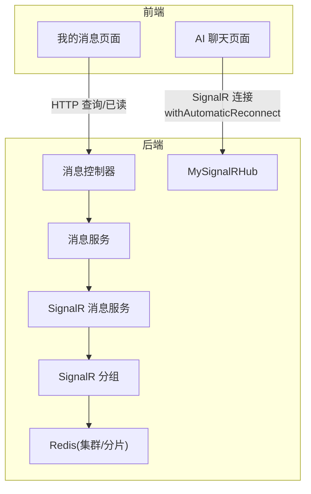
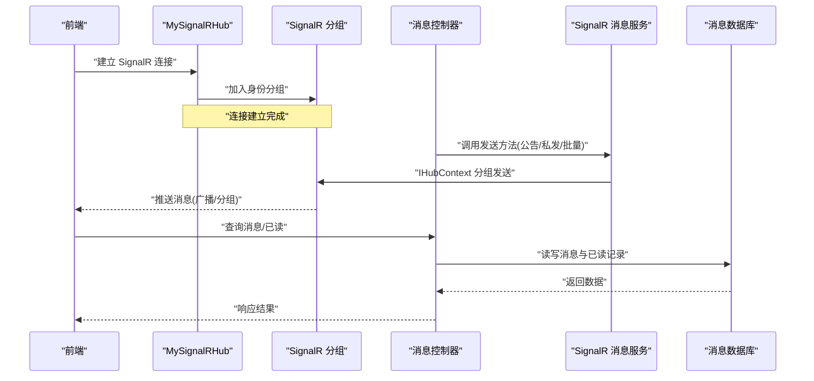
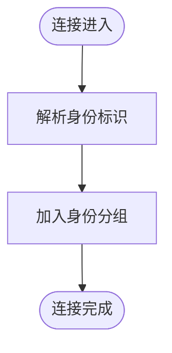
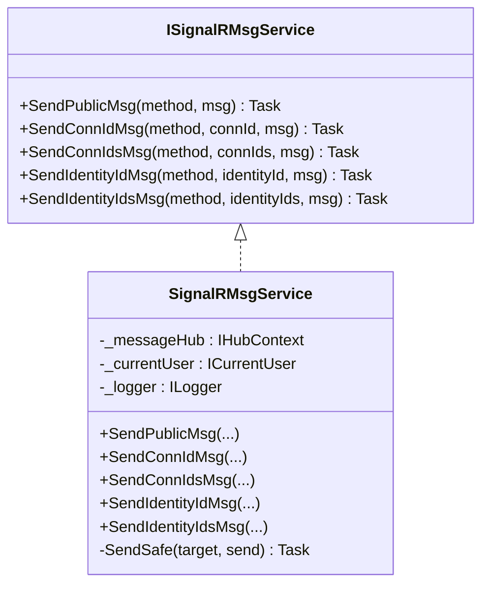
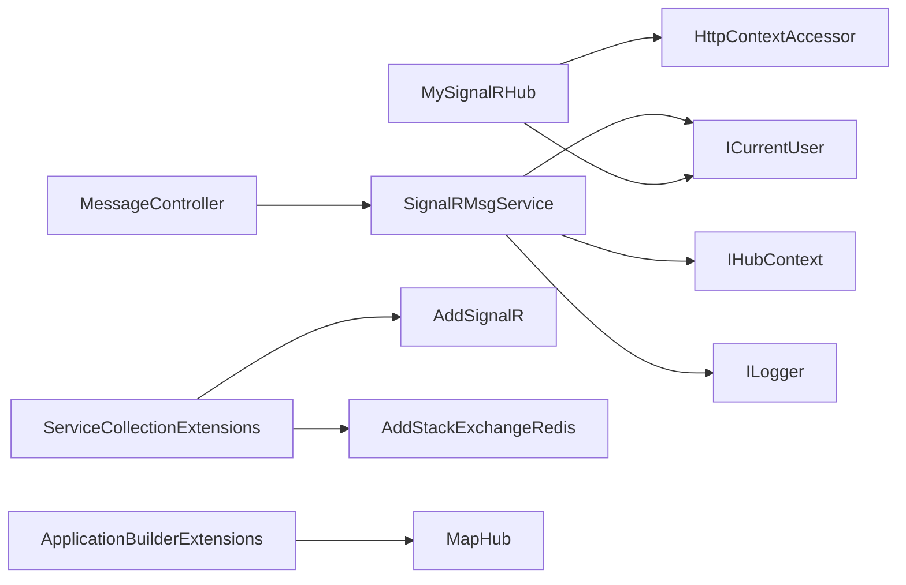

# 实时消息推送

<cite>
**本文引用的文件**
- [MySignalRHub.cs](file://Kevin/kevin.Module/Kevin.SignalR/MySignalRHub.cs)
- [SignalRMsgService.cs](file://Kevin/kevin.Module/Kevin.SignalR/Service/SignalRMsgService.cs)
- [ISignalRMsgService.cs](file://Kevin/kevin.Module/Kevin.SignalR/Service/ISignalRMsgService.cs)
- [SignalrRdisSetting.cs](file://Kevin/kevin.Module/Kevin.SignalR/Models/SignalrRdisSetting.cs)
- [ConnectionIdsDto.cs](file://Kevin/kevin.Module/Kevin.SignalR/Models/ConnectionIdsDto.cs)
- [ServiceCollectionExtensions.cs](file://Kevin/kevin.Module/Kevin.SignalR/ServiceCollectionExtensions.cs)
- [ApplicationBuilderExtensions.cs](file://Kevin/kevin.Module/Kevin.SignalR/ApplicationBuilderExtensions.cs)
- [MessageController.cs](file://Kevin/ Kevin.Web.Basics/Controllers/MessageController.cs)
- [MessageService.cs](file://Kevin/Application/Services/MessageService.cs)
- [message.js](file://vue/kevin.web.vue/src/api/message.js)
- [MyMessages.vue](file://vue/kevin.web.vue/src/pages/MyMessages.vue)
- [MyAIChat.vue](file://vue/kevin.web.vue/src/pages/ai/MyAIChat.vue)
</cite>

## 更新摘要
**变更内容**
- 移除了 SignalRCacheDto 模型，简化了缓存机制
- 优化了高并发场景下的消息传递和缓存处理
- 改进了连接管理和分组机制，使用 SignalR 原生分组功能
- 增强了错误处理和日志记录能力

## 目录
1. [简介](#简介)
2. [项目结构](#项目结构)
3. [核心组件](#核心组件)
4. [架构总览](#架构总览)
5. [详细组件分析](#详细组件分析)
6. [依赖关系分析](#依赖关系分析)
7. [性能与可靠性](#性能与可靠性)
8. [故障排查指南](#故障排查指南)
9. [结论](#结论)
10. [附录：配置与客户端集成](#附录：配置与客户端集成)

## 简介
本章节概述项目中基于 SignalR 的实时消息推送能力，包括连接建立与维护、消息广播与点对点推送、用户分组（按租户与身份标识）管理、连接状态监控等。同时说明协议实现要点、重连机制、跨实例负载均衡、性能优化策略，以及优先级处理、离线消息、消息确认等可靠性保障思路，并提供配置示例与前端集成指引。

**更新** 本次优化重点改进了高并发场景下的消息传递机制，移除了复杂的缓存模型，采用 SignalR 原生分组功能提升性能和稳定性。

## 项目结构
- 后端模块
  - Hub 层：自定义 Hub 负责连接生命周期管理与分组维护
  - 服务层：封装消息发送能力（公告、私发、批量私发），基于 SignalR 分组进行精准推送
  - 控制器层：对外暴露 HTTP API 触发实时推送
  - 扩展注册：SignalR 服务与 Redis 扩展、端点映射
  - 模型与配置：Redis 连接参数、连接 ID DTO
- 前端页面
  - 消息列表页：展示系统私信、私人私信、公司公告、系统消息、AI 消息等
  - AI 聊天页：使用浏览器 SignalR 客户端建立连接并自动重连
  - 消息 API：封装消息查询与已读标记接口

**图表来源**
- [MySignalRHub.cs:61-75](file://Kevin/kevin.Module/Kevin.SignalR/MySignalRHub.cs#L61-L75)
- [SignalRMsgService.cs:32-72](file://Kevin/kevin.Module/Kevin.SignalR/Service/SignalRMsgService.cs#L32-L72)
- [ServiceCollectionExtensions.cs:16-32](file://Kevin/kevin.Module/Kevin.SignalR/ServiceCollectionExtensions.cs#L16-L32)
- [ApplicationBuilderExtensions.cs:12-16](file://Kevin/kevin.Module/Kevin.SignalR/ApplicationBuilderExtensions.cs#L12-L16)
- [MessageController.cs:117-137](file://Kevin/ Kevin.Web.Basics/Controllers/MessageController.cs#L117-L137)
- [MessageService.cs:93-104](file://Kevin/Application/Services/MessageService.cs#L93-L104)

**章节来源**
- [MySignalRHub.cs:61-75](file://Kevin/kevin.Module/Kevin.SignalR/MySignalRHub.cs#L61-L75)
- [SignalRMsgService.cs:32-72](file://Kevin/kevin.Module/Kevin.SignalR/Service/SignalRMsgService.cs#L32-L72)
- [ServiceCollectionExtensions.cs:16-32](file://Kevin/kevin.Module/Kevin.SignalR/ServiceCollectionExtensions.cs#L16-L32)
- [ApplicationBuilderExtensions.cs:12-16](file://Kevin/kevin.Module/Kevin.SignalR/ApplicationBuilderExtensions.cs#L12-L16)
- [MessageController.cs:117-137](file://Kevin/ Kevin.Web.Basics/Controllers/MessageController.cs#L117-L137)
- [MessageService.cs:93-104](file://Kevin/Application/Services/MessageService.cs#L93-L104)

## 核心组件
- MySignalRHub：继承 Hub，处理 OnConnectedAsync/OnDisconnectedAsync，使用 SignalR 分组维护连接归属
- SignalRMsgService：提供 SendPublicMsg、SendConnIdMsg、SendIdentityIdMsg、SendIdentityIdsMsg 等方法，通过 IHubContext 调用 Hub 广播或分组推送
- ISignalRMsgService：定义消息发送与连接查询的接口契约
- SignalrRdisSetting：SignalR 与 Redis 的配置项（URL、主机、端口、密码、数据库索引、配置频道）
- ConnectionIdsDto：连接 ID 数据传输对象
- ServiceCollectionExtensions：注册 SignalR、StackExchange.Redis 扩展、超时与保活间隔
- ApplicationBuilderExtensions：映射控制器与 Hub 端点
- MessageController/MessageService：消息持久化、分页查询、未读数统计、已读标记

**更新** 移除了 SignalRCacheDto 模型，简化了连接管理机制，现在完全依赖 SignalR 原生分组功能。

**章节来源**
- [MySignalRHub.cs:8-87](file://Kevin/kevin.Module/Kevin.SignalR/MySignalRHub.cs#L8-L87)
- [SignalRMsgService.cs:17-93](file://Kevin/kevin.Module/Kevin.SignalR/Service/SignalRMsgService.cs#L17-L93)
- [ISignalRMsgService.cs:6-49](file://Kevin/kevin.Module/Kevin.SignalR/Service/ISignalRMsgService.cs#L6-L49)
- [SignalrRdisSetting.cs:3-42](file://Kevin/kevin.Module/Kevin.SignalR/Models/SignalrRdisSetting.cs#L3-L42)
- [ConnectionIdsDto.cs:3-11](file://Kevin/kevin.Module/Kevin.SignalR/Models/ConnectionIdsDto.cs#L3-L11)
- [ServiceCollectionExtensions.cs:9-42](file://Kevin/kevin.Module/Kevin.SignalR/ServiceCollectionExtensions.cs#L9-L42)
- [ApplicationBuilderExtensions.cs:8-21](file://Kevin/kevin.Module/Kevin.SignalR/ApplicationBuilderExtensions.cs#L8-L21)
- [MessageController.cs:117-137](file://Kevin/ Kevin.Web.Basics/Controllers/MessageController.cs#L117-L137)
- [MessageService.cs:93-104](file://Kevin/Application/Services/MessageService.cs#L93-L104)

## 架构总览
- 连接建立：前端通过 SignalR 客户端连接到后端 Hub；Hub 在连接时读取当前用户身份与租户信息，将连接加入对应分组
- 消息发送：业务侧通过控制器调用 SignalRMsgService，后者根据目标（全部、指定连接、指定身份分组）选择 Hub 广播或分组发送
- 连接维护：断开时 SignalR 自动从分组移除连接；支持 Redis 作为分布式背板，便于多实例共享分组状态
- 消息持久化与已读：消息落库，前端查看后调用已读接口更新读状态

**更新** 新的架构完全依赖 SignalR 原生分组功能，移除了自定义缓存映射，提升了性能和可靠性。

**图表来源**
- [MySignalRHub.cs:61-75](file://Kevin/kevin.Module/Kevin.SignalR/MySignalRHub.cs#L61-L75)
- [SignalRMsgService.cs:32-72](file://Kevin/kevin.Module/Kevin.SignalR/Service/SignalRMsgService.cs#L32-L72)
- [MessageController.cs:117-137](file://Kevin/ Kevin.Web.Basics/Controllers/MessageController.cs#L117-L137)
- [MessageService.cs:93-104](file://Kevin/Application/Services/MessageService.cs#L93-L104)

## 详细组件分析

### Hub 连接与分组管理
- 身份解析：优先从请求头或查询参数获取 IdentityId，否则回退到当前用户 ID
- 分组管理：在 OnConnectedAsync 中，将连接加入对应身份分组，由 SignalR 自动管理分组生命周期
- 断开清理：OnDisconnectedAsync 中 SignalR 自动处理分组清理，无需手动维护
- 资源释放：简化了资源管理逻辑，减少了内存泄漏风险

**更新** 新的实现完全依赖 SignalR 原生分组功能，移除了自定义缓存映射逻辑。

**图表来源**
- [MySignalRHub.cs:36-55](file://Kevin/kevin.Module/Kevin.SignalR/MySignalRHub.cs#L36-L55)
- [MySignalRHub.cs:61-75](file://Kevin/kevin.Module/Kevin.SignalR/MySignalRHub.cs#L61-L75)
- [MySignalRHub.cs:81-86](file://Kevin/kevin.Module/Kevin.SignalR/MySignalRHub.cs#L81-L86)

**章节来源**
- [MySignalRHub.cs:36-55](file://Kevin/kevin.Module/Kevin.SignalR/MySignalRHub.cs#L36-L55)
- [MySignalRHub.cs:61-75](file://Kevin/kevin.Module/Kevin.SignalR/MySignalRHub.cs#L61-L75)
- [MySignalRHub.cs:81-86](file://Kevin/kevin.Module/Kevin.SignalR/MySignalRHub.cs#L81-L86)

### 消息发送服务
- 公告推送：向所有客户端广播
- 点对点推送：根据 ConnectionId 精确发送
- 批量推送：根据多个 ConnectionId 批量发送
- 身份分组推送：根据 identityId 直接推送到对应分组
- 安全推送：统一的异常处理和日志记录机制

**更新** 移除了基于缓存的连接查找逻辑，直接使用 SignalR 分组功能进行精准推送。

**图表来源**
- [ISignalRMsgService.cs:6-49](file://Kevin/kevin.Module/Kevin.SignalR/Service/ISignalRMsgService.cs#L6-L49)
- [SignalRMsgService.cs:17-93](file://Kevin/kevin.Module/Kevin.SignalR/Service/SignalRMsgService.cs#L17-L93)

**章节来源**
- [SignalRMsgService.cs:32-93](file://Kevin/kevin.Module/Kevin.SignalR/Service/SignalRMsgService.cs#L32-L93)
- [ISignalRMsgService.cs:6-49](file://Kevin/kevin.Module/Kevin.SignalR/Service/ISignalRMsgService.cs#L6-L49)

### 控制器与服务集成
- MessageController：提供消息相关的 HTTP 接口
- MessageService：处理消息的业务逻辑，包括持久化和查询
- 集成方式：通过依赖注入获取 SignalR 消息服务进行实时推送

**章节来源**
- [MessageController.cs:117-137](file://Kevin/ Kevin.Web.Basics/Controllers/MessageController.cs#L117-L137)
- [MessageService.cs:93-104](file://Kevin/Application/Services/MessageService.cs#L93-L104)

### 前端集成与重连
- 连接建立：使用 HubConnectionBuilder 构建连接，附加 Authorization 头与 IdentityId
- 自动重连：启用 withAutomaticReconnect，监听 onreconnecting/onreconnected/onclose
- 消息消费：在 on 回调中处理服务端推送的方法名与消息体
- 资源清理：组件卸载时停止连接并清理定时器

**章节来源**
- [MyAIChat.vue:2554-2569](file://vue/kevin.web.vue/src/pages/ai/MyAIChat.vue#L2554-L2569)
- [MyAIChat.vue:2764-2770](file://vue/kevin.web.vue/src/pages/ai/MyAIChat.vue#L2764-L2770)

## 依赖关系分析
- Hub 依赖：ICurrentUser、HttpContextAccessor
- 服务依赖：IHubContext<MySignalRHub>、ICurrentUser、ILogger
- 控制器依赖：ISignalRMsgService、CurrentUser
- 扩展注册：AddSignalR + AddStackExchangeRedis，配置保活与超时；MapHub 映射端点

**更新** 简化了依赖关系，移除了对缓存服务的依赖。

**图表来源**
- [MySignalRHub.cs:12-17](file://Kevin/kevin.Module/Kevin.SignalR/MySignalRHub.cs#L12-L17)
- [SignalRMsgService.cs:19-23](file://Kevin/kevin.Module/Kevin.SignalR/Service/SignalRMsgService.cs#L19-L23)
- [ServiceCollectionExtensions.cs:16-32](file://Kevin/kevin.Module/Kevin.SignalR/ServiceCollectionExtensions.cs#L16-L32)
- [ApplicationBuilderExtensions.cs:12-16](file://Kevin/kevin.Module/Kevin.SignalR/ApplicationBuilderExtensions.cs#L12-L16)

**章节来源**
- [MySignalRHub.cs:12-17](file://Kevin/kevin.Module/Kevin.SignalR/MySignalRHub.cs#L12-L17)
- [SignalRMsgService.cs:19-23](file://Kevin/kevin.Module/Kevin.SignalR/Service/SignalRMsgService.cs#L19-L23)
- [ServiceCollectionExtensions.cs:16-32](file://Kevin/kevin.Module/Kevin.SignalR/ServiceCollectionExtensions.cs#L16-L32)
- [ApplicationBuilderExtensions.cs:12-16](file://Kevin/kevin.Module/Kevin.SignalR/ApplicationBuilderExtensions.cs#L12-L16)

## 性能与可靠性
- 连接与保活
  - 服务端 KeepAliveInterval 与 ClientTimeoutInterval 已设置为较长间隔，降低心跳开销
  - 前端启用 withAutomaticReconnect，提升网络抖动下的稳定性
- 负载均衡与横向扩展
  - 使用 StackExchangeRedis 作为外置存储，多实例共享分组状态，天然支持水平扩展
  - 配置 ConnectRetry 与 SyncTimeout，增强 Redis 连接的健壮性
- 消息可靠性
  - 消息持久化：消息入库，支持分页查询与未读数统计
  - 已读标记：前端查看后调用已读接口，确保计数准确
  - 离线消息：通过数据库持久化保证离线后可恢复
  - 安全推送：统一的异常处理机制，避免推送失败影响主业务流程
- 性能优化建议
  - 批量发送：尽量使用批量身份发送接口减少多次 RPC
  - 分组推送：利用 SignalR 原生分组功能，避免自定义缓存带来的性能问题
  - 前端节流：对高频消息进行合并与节流渲染

**更新** 新的架构通过移除自定义缓存映射，显著提升了高并发场景下的性能和稳定性。

## 故障排查指南
- 连接失败
  - 检查 SignalR 端点映射是否正确（url）
  - 检查 Redis 配置（主机、端口、密码、数据库索引、配置频道）
  - 检查前端 Authorization 头与 IdentityId 是否传递正确
- 无法收到消息
  - 确认连接已建立且已加入对应分组
  - 确认发送方法名与前端 on 监听一致
  - 检查 SignalR 消息服务是否被正确调用
- 消息未读计数异常
  - 确认已读接口已被调用
  - 检查消息与已读记录的租户与用户匹配

**章节来源**
- [SignalrRdisSetting.cs:3-42](file://Kevin/kevin.Module/Kevin.SignalR/Models/SignalrRdisSetting.cs#L3-L42)
- [MessageController.cs:117-137](file://Kevin/ Kevin.Web.Basics/Controllers/MessageController.cs#L117-L137)
- [MessageService.cs:93-104](file://Kevin/Application/Services/MessageService.cs#L93-L104)

## 结论
本项目实现了基于 SignalR 的实时消息推送能力，具备连接维护、分组管理、广播与点对点推送、消息持久化与已读标记等功能。通过移除自定义缓存映射并使用 SignalR 原生分组功能，显著提升了高并发场景下的性能和可靠性。结合前端自动重连和 Redis 背板，实现了稳定可靠的实时通信方案。建议在后续版本中引入消息优先级、送达确认与重试机制，进一步增强可靠性与可观测性。

## 附录：配置与客户端集成
- 服务端配置
  - 在扩展注册中配置 SignalR 与 Redis 参数（主机、端口、密码、数据库索引、配置频道、Hub URL）
  - 设置保活与超时时间，平衡连接稳定性与资源占用
- 客户端集成
  - 使用 HubConnectionBuilder 建立连接，附加 Authorization 与 IdentityId
  - 启用 withAutomaticReconnect，监听重连与关闭事件
  - 订阅服务端方法名，处理消息并更新 UI
  - 组件卸载时停止连接并清理定时器
- 常用 API
  - 发送公告：/api/Message/SendPublicMsg
  - 私发：/api/Message/SendConnIdMsg
  - 批量发送：/api/Message/SendConnIdsMsg
  - 按身份发送：/api/Message/SendIdentityIdMsg
  - 批量身份发送：/api/Message/SendIdentityIdsMsg
  - 消息查询与已读：/api/Message/*

**更新** 移除了 SignalR 控制器的相关 API，现在统一通过消息控制器提供服务。

**章节来源**
- [ServiceCollectionExtensions.cs:16-32](file://Kevin/kevin.Module/Kevin.SignalR/ServiceCollectionExtensions.cs#L16-L32)
- [SignalrRdisSetting.cs:3-42](file://Kevin/kevin.Module/Kevin.SignalR/Models/SignalrRdisSetting.cs#L3-L42)
- [MessageController.cs:117-137](file://Kevin/ Kevin.Web.Basics/Controllers/MessageController.cs#L117-L137)
- [MessageService.cs:93-104](file://Kevin/Application/Services/MessageService.cs#L93-L104)
- [MyAIChat.vue:2554-2569](file://vue/kevin.web.vue/src/pages/ai/MyAIChat.vue#L2554-L2569)
- [message.js:1-37](file://vue/kevin.web.vue/src/api/message.js#L1-L37)
- [MyMessages.vue:124-134](file://vue/kevin.web.vue/src/pages/MyMessages.vue#L124-L134)