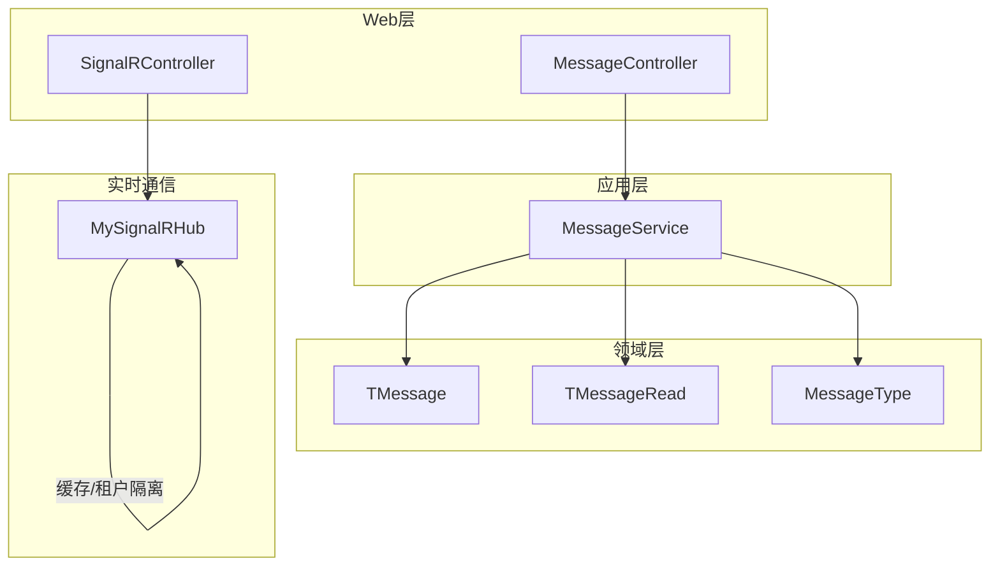
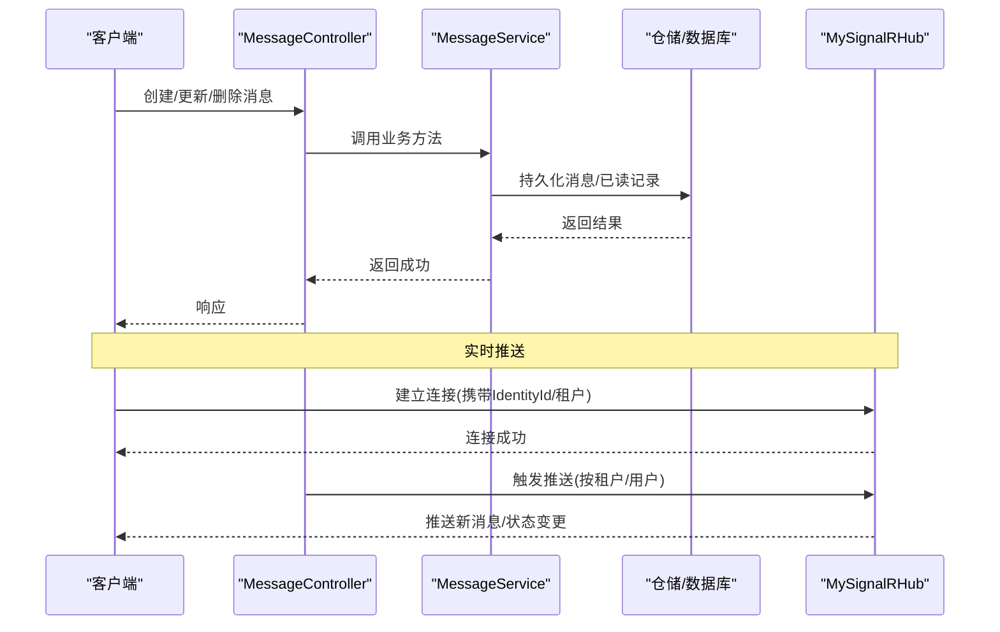
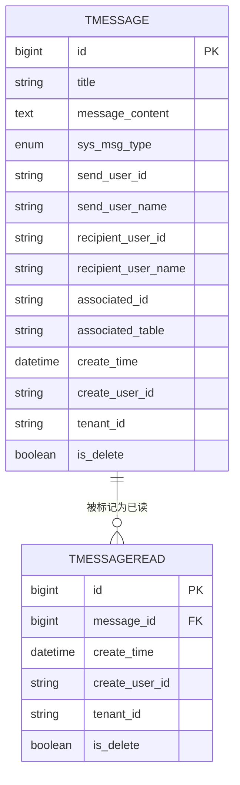
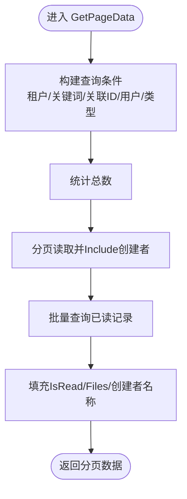
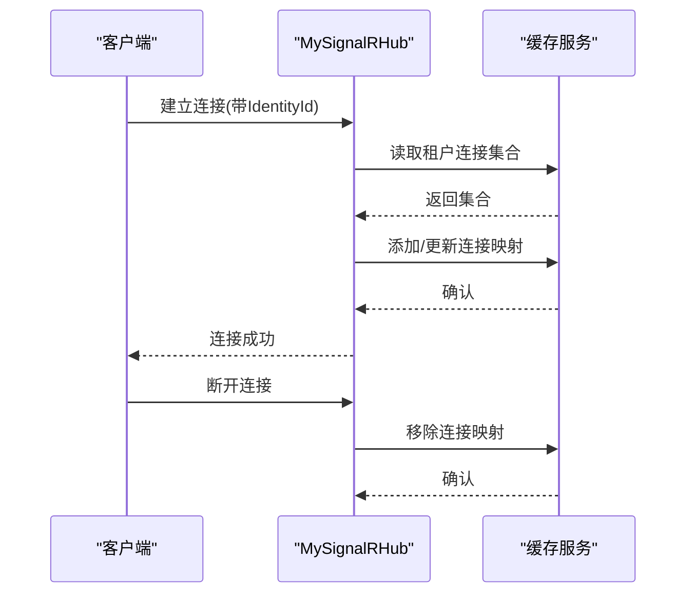
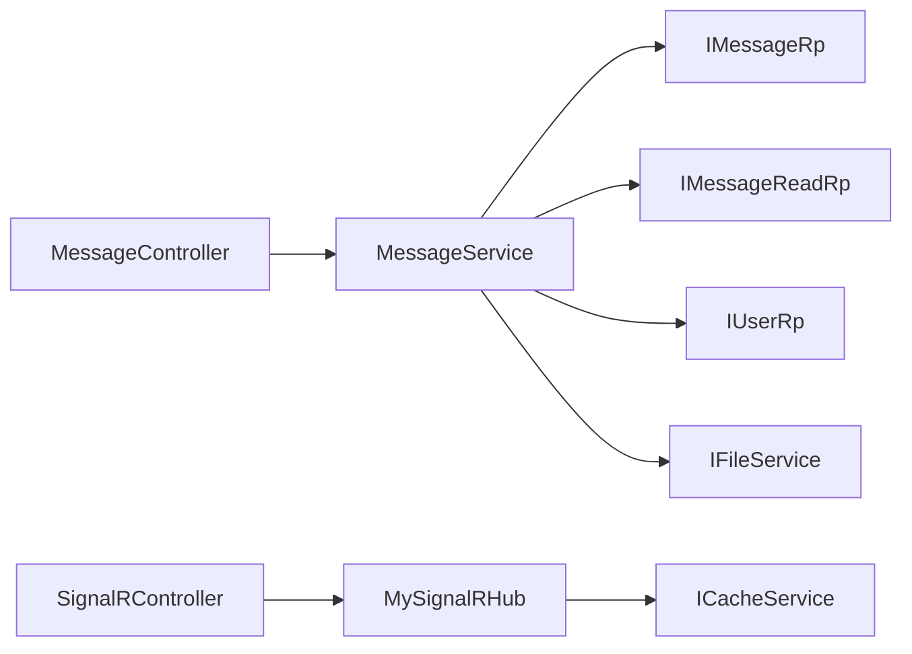

# 消息系统

<cite>
**本文引用的文件**
- [MessageService.cs](file://Kevin/Application/Services/MessageService.cs)
- [TMessage.cs](file://Kevin/Domain/Entities/TMessage.cs)
- [TMessageRead.cs](file://Kevin/Domain/Entities/TMessageRead.cs)
- [MySignalRHub.cs](file://Kevin/kevin.Module/Kevin.SignalR/MySignalRHub.cs)
- [MessageController.cs](file://Kevin/ Kevin.Web.Basics/Controllers/MessageController.cs)
- [SignalRController.cs](file://Kevin/ Kevin.Web.Basics/Controllers/SignalRController.cs)
- [MessageType.cs](file://Kevin/ kevin.Share/Enums/MessageType.cs)
</cite>

## 目录
1. [简介](#简介)
2. [项目结构](#项目结构)
3. [核心组件](#核心组件)
4. [架构总览](#架构总览)
5. [详细组件分析](#详细组件分析)
6. [依赖关系分析](#依赖关系分析)
7. [性能考虑](#性能考虑)
8. [故障排查指南](#故障排查指南)
9. [结论](#结论)
10. [附录](#附录)

## 简介
本文件面向消息系统的综合文档，覆盖私信管理、公告发布、系统通知、实时消息推送等核心能力。重点说明消息的发送与接收、已读未读状态、消息模板、定时发送等业务逻辑；解释 SignalR 实时通信的连接管理、消息路由、离线消息处理等技术要点；并给出权限控制、消息队列集成、消息审计等高级特性的扩展建议与配置示例。

## 项目结构
消息系统采用分层架构：领域实体定义在 Domain，应用服务封装业务逻辑在 Application，控制器暴露 HTTP API 在 Web 层，SignalR Hub 提供实时通道。数据持久化通过 EF Core 仓储完成，连接映射与缓存由 SignalR 模块与缓存服务协作实现。

图表来源
- [MessageController.cs](file://Kevin/ Kevin.Web.Basics/Controllers/MessageController.cs)
- [SignalRController.cs](file://Kevin/ Kevin.Web.Basics/Controllers/SignalRController.cs)
- [MessageService.cs](file://Kevin/Application/Services/MessageService.cs)
- [TMessage.cs](file://Kevin/Domain/Entities/TMessage.cs)
- [TMessageRead.cs](file://Kevin/Domain/Entities/TMessageRead.cs)
- [MySignalRHub.cs](file://Kevin/kevin.Module/Kevin.SignalR/MySignalRHub.cs)
- [MessageType.cs](file://Kevin/ kevin.Share/Enums/MessageType.cs)

章节来源
- [MessageService.cs:1-186](file://Kevin/Application/Services/MessageService.cs#L1-L186)
- [TMessage.cs:1-55](file://Kevin/Domain/Entities/TMessage.cs#L1-L55)
- [TMessageRead.cs:1-21](file://Kevin/Domain/Entities/TMessageRead.cs#L1-L21)
- [MySignalRHub.cs:1-176](file://Kevin/kevin.Module/Kevin.SignalR/MySignalRHub.cs#L1-L176)
- [MessageType.cs](file://Kevin/ kevin.Share/Enums/MessageType.cs)

## 核心组件
- 消息实体与已读记录：用于存储消息内容与已读标记，支撑私信、公告、系统通知的统一模型。
- 应用服务：提供分页查询、未读数统计、读写操作、AI 消息写入等能力。
- SignalR Hub：维护用户连接、按租户隔离、在线分发消息。
- 控制器：对外暴露消息管理与实时通信接口。

章节来源
- [TMessage.cs:1-55](file://Kevin/Domain/Entities/TMessage.cs#L1-L55)
- [TMessageRead.cs:1-21](file://Kevin/Domain/Entities/TMessageRead.cs#L1-L21)
- [MessageService.cs:1-186](file://Kevin/Application/Services/MessageService.cs#L1-L186)
- [MySignalRHub.cs:1-176](file://Kevin/kevin.Module/Kevin.SignalR/MySignalRHub.cs#L1-L176)

## 架构总览
消息系统以“HTTP + SignalR”双通道协同工作：HTTP 负责消息的增删改查与状态同步，SignalR 负责实时推送与连接管理。应用服务统一编排业务逻辑，领域实体承载数据模型，仓储负责持久化。

图表来源
- [MessageController.cs](file://Kevin/ Kevin.Web.Basics/Controllers/MessageController.cs)
- [MessageService.cs:1-186](file://Kevin/Application/Services/MessageService.cs#L1-L186)
- [MySignalRHub.cs:1-176](file://Kevin/kevin.Module/Kevin.SignalR/MySignalRHub.cs#L1-L176)

## 详细组件分析

### 数据模型与关系
- TMessage：消息主体，包含标题、内容、类型（私信/公告/系统）、发送者、接收者、关联业务标识等。
- TMessageRead：记录某用户对某条消息的已读状态。
- MessageType：枚举，区分消息类别，便于过滤与展示。

图表来源
- [TMessage.cs:1-55](file://Kevin/Domain/Entities/TMessage.cs#L1-L55)
- [TMessageRead.cs:1-21](file://Kevin/Domain/Entities/TMessageRead.cs#L1-L21)

章节来源
- [TMessage.cs:1-55](file://Kevin/Domain/Entities/TMessage.cs#L1-L55)
- [TMessageRead.cs:1-21](file://Kevin/Domain/Entities/TMessageRead.cs#L1-L21)

### 应用服务：消息业务编排
- 未读数统计：根据当前租户与用户，筛选本人发送或接收的消息以及系统/公告类消息，再排除已读记录得到未读数。
- 分页查询：支持关键词搜索、关联ID过滤、用户过滤、消息类型过滤，并回填是否已读与附件信息。
- 读写操作：新增/编辑消息、标记已读、删除消息（软删除）。
- AI 消息写入：将 AI 相关对话消息持久化到消息表。

图表来源
- [MessageService.cs:48-91](file://Kevin/Application/Services/MessageService.cs#L48-L91)

章节来源
- [MessageService.cs:22-46](file://Kevin/Application/Services/MessageService.cs#L22-L46)
- [MessageService.cs:48-91](file://Kevin/Application/Services/MessageService.cs#L48-L91)
- [MessageService.cs:93-104](file://Kevin/Application/Services/MessageService.cs#L93-L104)
- [MessageService.cs:106-153](file://Kevin/Application/Services/MessageService.cs#L106-L153)
- [MessageService.cs:155-166](file://Kevin/Application/Services/MessageService.cs#L155-L166)
- [MessageService.cs:168-183](file://Kevin/Application/Services/MessageService.cs#L168-L183)

### 实时通信：SignalR Hub 连接与路由
- 身份识别：从请求头或查询参数获取 IdentityId，否则回退到当前用户ID。
- 连接生命周期：OnConnectedAsync 中将连接加入缓存（按租户分组），OnDisconnectedAsync 中移除连接。
- 多实例共享：使用缓存键集中保存连接映射，便于横向扩展时的跨进程路由。

图表来源
- [MySignalRHub.cs:49-68](file://Kevin/kevin.Module/Kevin.SignalR/MySignalRHub.cs#L49-L68)
- [MySignalRHub.cs:74-129](file://Kevin/kevin.Module/Kevin.SignalR/MySignalRHub.cs#L74-L129)
- [MySignalRHub.cs:135-163](file://Kevin/kevin.Module/Kevin.SignalR/MySignalRHub.cs#L135-L163)

章节来源
- [MySignalRHub.cs:1-176](file://Kevin/kevin.Module/Kevin.SignalR/MySignalRHub.cs#L1-L176)

### 控制器：HTTP 与实时入口
- MessageController：对外提供消息的增删改查、已读标记等接口，内部委托给 MessageService。
- SignalRController：作为 SignalR 连接的辅助入口或转发器，配合 Hub 完成连接建立与消息广播。

章节来源
- [MessageController.cs](file://Kevin/ Kevin.Web.Basics/Controllers/MessageController.cs)
- [SignalRController.cs](file://Kevin/ Kevin.Web.Basics/Controllers/SignalRController.cs)

## 依赖关系分析
- MessageService 依赖仓储 IMessageRp、IMessageReadRp、IUserRp 与 IFileService，完成消息与已读记录的持久化与附件加载。
- MySignalRHub 依赖缓存服务与当前用户上下文，实现连接映射与租户隔离。
- 控制器依赖应用服务，保持表现层薄、业务逻辑内聚。

图表来源
- [MessageService.cs:1-21](file://Kevin/Application/Services/MessageService.cs#L1-L21)
- [MySignalRHub.cs:1-26](file://Kevin/kevin.Module/Kevin.SignalR/MySignalRHub.cs#L1-L26)

章节来源
- [MessageService.cs:1-21](file://Kevin/Application/Services/MessageService.cs#L1-L21)
- [MySignalRHub.cs:1-26](file://Kevin/kevin.Module/Kevin.SignalR/MySignalRHub.cs#L1-L26)

## 性能考虑
- 查询优化：分页查询时仅按需 Include 必要导航属性，避免 N+1 问题；对已读状态采用批量查询后内存匹配。
- 索引建议：为 TenantId、RecipientUserId、SendUserId、SysMsgType、CreateTime 建立合适索引以提升过滤与排序性能。
- 实时推送：连接映射集中存储在缓存中，减少 Hub 间状态同步开销；可按租户维度进行消息路由，降低广播范围。
- 附件加载：批量获取附件 DTO 后再合并到消息列表，减少多次 IO。

[本节为通用性能建议，不直接分析具体文件]

## 故障排查指南
- 未读数异常：检查当前租户与用户上下文是否正确；确认已读记录是否重复插入或缺失。
- 分页数据为空：核对查询条件（关键词、关联ID、用户、类型）是否与预期一致；确认软删除字段与租户过滤。
- 已读标记无效：确认调用 Read 时传入的消息 ID 存在且属于当前租户；检查仓储事务提交是否成功。
- SignalR 连接失败：检查 IdentityId 传递是否正确；确认缓存服务可用；验证 OnConnectedAsync 中连接映射写入是否成功。
- 消息无法推送：确认目标用户的连接存在于缓存映射中；检查租户隔离策略是否导致路由不到目标。

章节来源
- [MessageService.cs:22-46](file://Kevin/Application/Services/MessageService.cs#L22-L46)
- [MessageService.cs:93-104](file://Kevin/Application/Services/MessageService.cs#L93-L104)
- [MySignalRHub.cs:74-129](file://Kevin/kevin.Module/Kevin.SignalR/MySignalRHub.cs#L74-L129)
- [MySignalRHub.cs:135-163](file://Kevin/kevin.Module/Kevin.SignalR/MySignalRHub.cs#L135-L163)

## 结论
该消息系统以清晰的分层设计与统一的领域模型，实现了私信、公告与系统通知的完整闭环；结合 SignalR 的实时通道，提供了低延迟的用户体验。通过缓存驱动的连接映射与租户隔离，具备横向扩展能力。后续可在此基础上扩展消息模板、定时任务、权限控制、消息队列与审计等高级特性。

[本节为总结性内容，不直接分析具体文件]

## 附录

### 业务场景与流程

#### 私信与公告/系统通知
- 私信：指定 RecipientUserId，仅该用户可见；支持附件与关联业务项。
- 公告/系统通知：SysMsgType 为 Announcement/System，面向租户内所有用户或特定角色/部门（可扩展）。
- 已读未读：通过 TMessageRead 记录用户已读状态，未读数统计排除已读记录。

章节来源
- [TMessage.cs:1-55](file://Kevin/Domain/Entities/TMessage.cs#L1-L55)
- [TMessageRead.cs:1-21](file://Kevin/Domain/Entities/TMessageRead.cs#L1-L21)
- [MessageService.cs:22-46](file://Kevin/Application/Services/MessageService.cs#L22-L46)

#### 实时推送流程
- 客户端建立 SignalR 连接，携带 IdentityId 与租户信息。
- Hub 将连接加入缓存映射，按租户/用户维度组织。
- 业务侧通过 Hub 向目标用户或租户广播消息，实现即时到达。

章节来源
- [MySignalRHub.cs:49-68](file://Kevin/kevin.Module/Kevin.SignalR/MySignalRHub.cs#L49-L68)
- [MySignalRHub.cs:74-129](file://Kevin/kevin.Module/Kevin.SignalR/MySignalRHub.cs#L74-L129)

### 高级特性扩展建议

#### 权限控制
- 基于租户与用户上下文限制消息可见范围。
- 可扩展角色/部门维度，使公告/系统通知定向推送。
- 建议在控制器或服务层增加鉴权校验，确保仅授权用户可访问敏感消息。

[本节为概念性建议，不直接分析具体文件]

#### 消息模板
- 在 TMessage 中引入模板 ID 与占位符解析机制，支持动态内容生成。
- 可在 MessageService 中增加模板渲染步骤，结合字典或外部配置。

[本节为概念性建议，不直接分析具体文件]

#### 定时发送
- 结合任务调度框架（如 Hangfire）实现定时任务，周期性扫描待发消息并投递。
- 投递成功后更新消息状态，并触发实时推送。

[本节为概念性建议，不直接分析具体文件]

#### 消息队列集成
- 将消息发送与实时推送解耦，通过消息队列异步处理，提升吞吐与可靠性。
- 消费者订阅队列事件，调用 MessageService 与 SignalR 推送。

[本节为概念性建议，不直接分析具体文件]

#### 消息审计
- 利用现有基类中的审计字段（创建人、时间、租户、删除标记）记录消息生命周期。
- 可增加独立审计日志表，记录关键操作（创建、删除、已读）以便追溯。

章节来源
- [TMessage.cs:1-55](file://Kevin/Domain/Entities/TMessage.cs#L1-L55)
- [TMessageRead.cs:1-21](file://Kevin/Domain/Entities/TMessageRead.cs#L1-L21)

### 配置示例（参考）
- SignalR 缓存键：用于集中存储连接映射，需保证多实例共享。
- 租户隔离：确保每个租户的连接映射独立，避免消息串扰。
- 日志与监控：开启连接生命周期日志，便于定位断连与重连问题。

章节来源
- [MySignalRHub.cs:24-47](file://Kevin/kevin.Module/Kevin.SignalR/MySignalRHub.cs#L24-L47)
- [MySignalRHub.cs:74-129](file://Kevin/kevin.Module/Kevin.SignalR/MySignalRHub.cs#L74-L129)