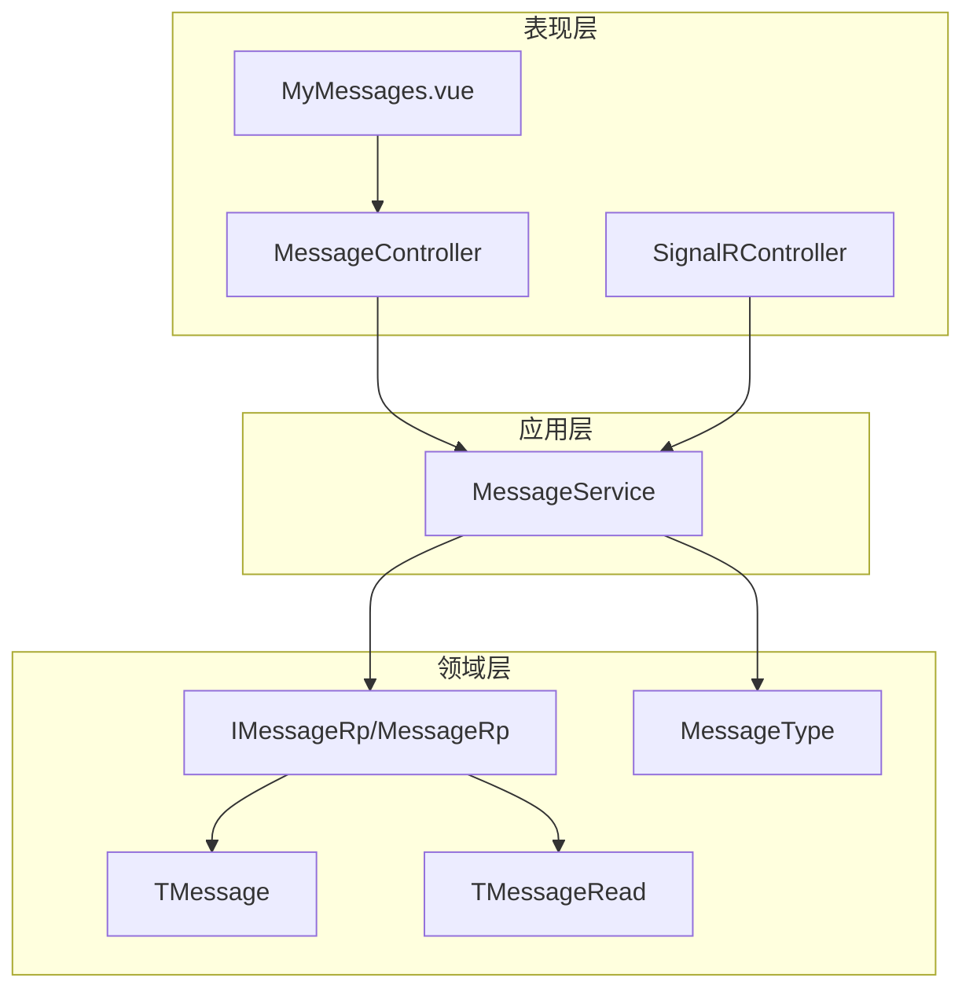
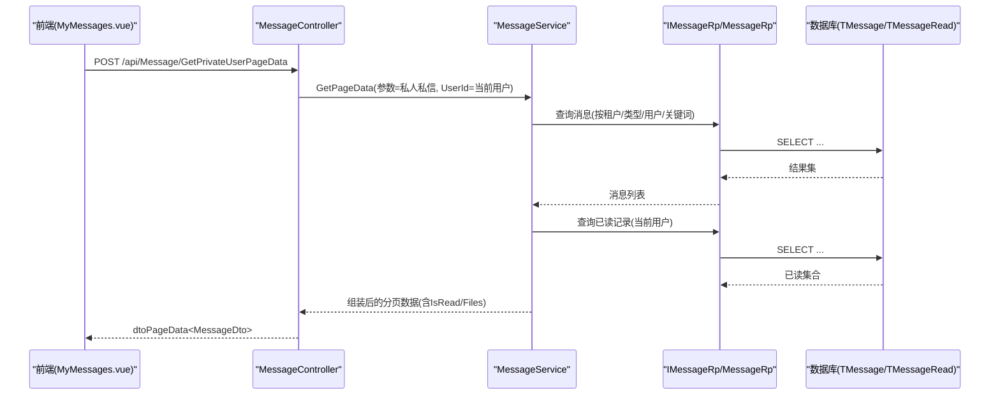
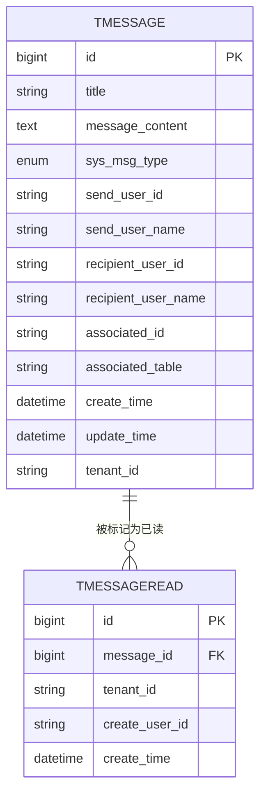
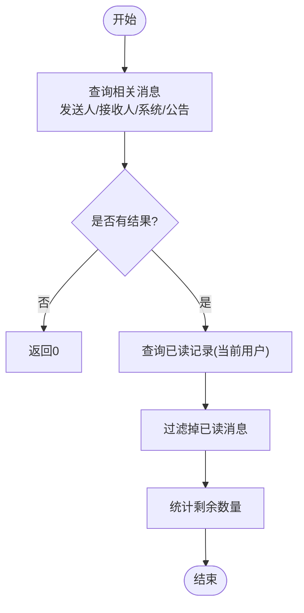
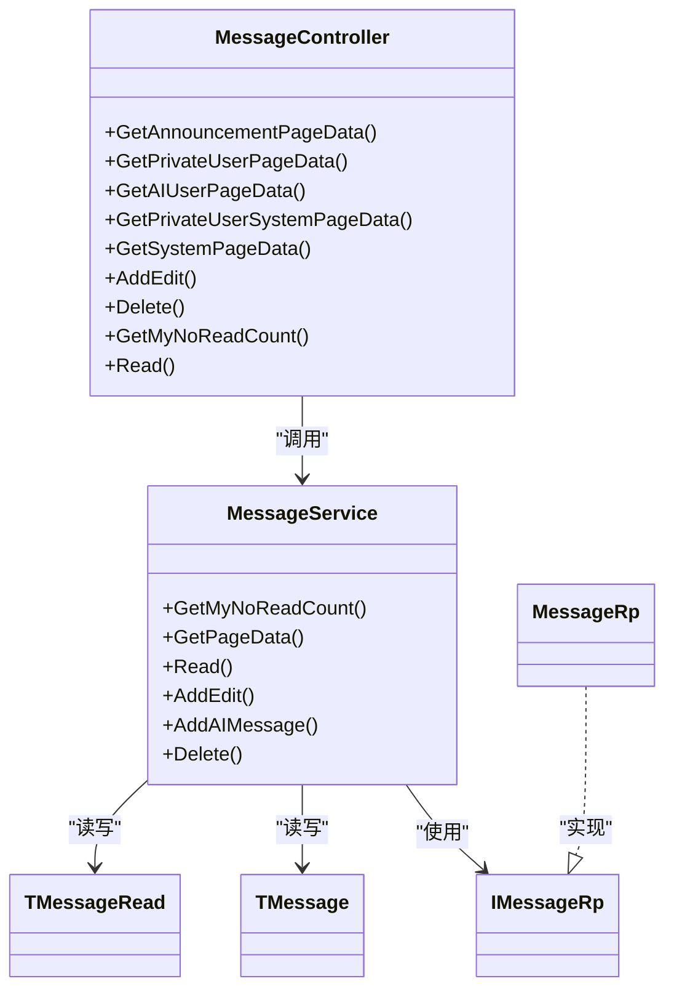

# 私信管理

<cite>
**本文引用的文件**
- [TMessage.cs](file://Kevin/Domain/Entities/TMessage.cs)
- [TMessageRead.cs](file://Kevin/Domain/Entities/TMessageRead.cs)
- [MessageType.cs](file://Kevin/kevin.Share/Enums/MessageType.cs)
- [MsgGetPageDataParDto.cs](file://Kevin/kevin.Share/Dtos/System/MsgGetPageDataParDto.cs)
- [MessageDto.cs](file://Kevin/kevin.Share/Dtos/Msg/MessageDto.cs)
- [IMessageRp.cs](file://Kevin/Domain/Interfaces/IRepositories/IMessageRp.cs)
- [MessageRp.cs](file://Kevin/RepositorieRps/Repositories/MessageRp.cs)
- [MessageService.cs](file://Kevin/Application/Services/MessageService.cs)
- [MessageController.cs](file://Kevin/Kevin.Web.Basics/Controllers/MessageController.cs)
- [SignalRController.cs](file://Kevin/Kevin.Web.Basics/Controllers/SignalRController.cs)
- [message.js](file://vue/kevin.web.vue/src/api/message.js)
- [MyMessages.vue](file://vue/kevin.web.vue/src/pages/MyMessages.vue)
</cite>

## 目录
1. [简介](#简介)
2. [项目结构](#项目结构)
3. [核心组件](#核心组件)
4. [架构总览](#架构总览)
5. [详细组件分析](#详细组件分析)
6. [依赖关系分析](#依赖关系分析)
7. [性能考虑](#性能考虑)
8. [故障排查指南](#故障排查指南)
9. [结论](#结论)
10. [附录：API与前端集成示例](#附录api与前端集成示例)

## 简介
本模块提供企业级“私信管理”能力，覆盖消息的发送、接收、会话视图、搜索、附件、已读未读同步、删除等核心功能。系统通过分层架构（控制器-服务-仓储-实体）实现数据持久化与业务编排，并通过 SignalR 接口为实时推送预留扩展点。当前实现支持多类型消息（公告、系统消息、私人私信、AI 消息），并提供分页查询、关键词检索、按用户维度过滤、未读数统计等常用能力。

## 项目结构
- 领域层
  - 实体：TMessage（消息主表）、TMessageRead（已读记录）
  - 枚举：MessageType（消息类型）
- 应用层
  - 服务：MessageService（消息业务编排：分页、计数、读写、删除、AI 消息写入）
  - 仓储接口与实现：IMessageRp / MessageRp
- 表现层
  - API：MessageController（HTTP 端点）、SignalRController（实时消息通道）
  - 前端：Vue 页面 MyMessages.vue + API 封装 message.js
- 共享 DTO
  - MsgGetPageDataParDto（筛选参数）
  - MessageDto（消息传输对象，含 IsRead、Files 等）

图表来源
- [MessageController.cs:1-140](file://Kevin/Kevin.Web.Basics/Controllers/MessageController.cs#L1-L140)
- [MessageService.cs:1-186](file://Kevin/Application/Services/MessageService.cs#L1-L186)
- [IMessageRp.cs:1-9](file://Kevin/Domain/Interfaces/IRepositories/IMessageRp.cs#L1-L9)
- [MessageRp.cs:1-10](file://Kevin/RepositorieRps/Repositories/MessageRp.cs#L1-L10)
- [TMessage.cs:1-55](file://Kevin/Domain/Entities/TMessage.cs#L1-L55)
- [TMessageRead.cs:1-21](file://Kevin/Domain/Entities/TMessageRead.cs#L1-L21)
- [MessageType.cs:1-22](file://Kevin/kevin.Share/Enums/MessageType.cs#L1-L22)

章节来源
- [MessageController.cs:1-140](file://Kevin/Kevin.Web.Basics/Controllers/MessageController.cs#L1-L140)
- [MessageService.cs:1-186](file://Kevin/Application/Services/MessageService.cs#L1-L186)
- [TMessage.cs:1-55](file://Kevin/Domain/Entities/TMessage.cs#L1-L55)
- [TMessageRead.cs:1-21](file://Kevin/Domain/Entities/TMessageRead.cs#L1-L21)
- [MessageType.cs:1-22](file://Kevin/kevin.Share/Enums/MessageType.cs#L1-L22)

## 核心组件
- 实体模型
  - TMessage：消息主体，包含标题、内容、类型、发送人/接收人信息、关联业务标识等
  - TMessageRead：记录某用户对某条消息的已读状态
- 枚举与 DTO
  - MessageType：公告、私人私信、公共系统消息、私人系统消息、所有、AI 消息
  - MsgGetPageDataParDto：分页查询的筛选条件（类型、用户、关联ID、是否已读）
  - MessageDto：对外返回的消息对象，包含 IsRead、Files 等
- 服务与控制器
  - MessageService：实现分页查询、未读计数、标记已读、新增/编辑、删除、AI 消息写入
  - MessageController：暴露 HTTP 接口，统一设置租户、用户上下文与消息类型
  - SignalRController：提供公告、私发、批量私发等实时消息通道（可扩展用于私信推送）
- 仓储
  - IMessageRp / MessageRp：对 TMessage 的增删改查访问

章节来源
- [TMessage.cs:1-55](file://Kevin/Domain/Entities/TMessage.cs#L1-L55)
- [TMessageRead.cs:1-21](file://Kevin/Domain/Entities/TMessageRead.cs#L1-L21)
- [MessageType.cs:1-22](file://Kevin/kevin.Share/Enums/MessageType.cs#L1-L22)
- [MsgGetPageDataParDto.cs:1-31](file://Kevin/kevin.Share/Dtos/System/MsgGetPageDataParDto.cs#L1-L31)
- [MessageDto.cs:46-76](file://Kevin/kevin.Share/Dtos/Msg/MessageDto.cs#L46-L76)
- [MessageService.cs:1-186](file://Kevin/Application/Services/MessageService.cs#L1-L186)
- [MessageController.cs:1-140](file://Kevin/Kevin.Web.Basics/Controllers/MessageController.cs#L1-L140)
- [SignalRController.cs:1-94](file://Kevin/Kevin.Web.Basics/Controllers/SignalRController.cs#L1-L94)
- [IMessageRp.cs:1-9](file://Kevin/Domain/Interfaces/IRepositories/IMessageRp.cs#L1-L9)
- [MessageRp.cs:1-10](file://Kevin/RepositorieRps/Repositories/MessageRp.cs#L1-L10)

## 架构总览
后端采用典型的三层架构：
- 控制器负责路由、鉴权、日志、缓存装饰器与参数校验
- 服务层聚合仓储调用，处理业务规则（如未读计数、分页过滤、附件聚合）
- 仓储层基于 EF Core 访问数据库
- 前端通过 Vue 页面调用 API，展示列表、详情、搜索与分页

图表来源
- [MessageController.cs:45-56](file://Kevin/Kevin.Web.Basics/Controllers/MessageController.cs#L45-L56)
- [MessageService.cs:48-91](file://Kevin/Application/Services/MessageService.cs#L48-L91)
- [IMessageRp.cs:1-9](file://Kevin/Domain/Interfaces/IRepositories/IMessageRp.cs#L1-L9)
- [MessageRp.cs:1-10](file://Kevin/RepositorieRps/Repositories/MessageRp.cs#L1-L10)
- [TMessage.cs:1-55](file://Kevin/Domain/Entities/TMessage.cs#L1-L55)
- [TMessageRead.cs:1-21](file://Kevin/Domain/Entities/TMessageRead.cs#L1-L21)

## 详细组件分析

### 数据模型与关系
- TMessage：消息主表，字段包括标题、内容、类型、发送人/接收人、关联业务ID/表名
- TMessageRead：记录某用户对某条消息的已读状态，外键指向 TMessage
- 关系：一对多（一条消息可被多个用户标记为已读）

图表来源
- [TMessage.cs:1-55](file://Kevin/Domain/Entities/TMessage.cs#L1-L55)
- [TMessageRead.cs:1-21](file://Kevin/Domain/Entities/TMessageRead.cs#L1-L21)

章节来源
- [TMessage.cs:1-55](file://Kevin/Domain/Entities/TMessage.cs#L1-L55)
- [TMessageRead.cs:1-21](file://Kevin/Domain/Entities/TMessageRead.cs#L1-L21)

### 消息类型与筛选
- 支持公告、私人私信、公共系统消息、私人系统消息、AI 消息以及 All（仅用于筛选）
- 分页查询支持：
  - 关键词搜索（标题或内容）
  - 按消息类型过滤
  - 按用户维度过滤（发送人或接收人）
  - 按关联业务 ID 过滤

章节来源
- [MessageType.cs:1-22](file://Kevin/kevin.Share/Enums/MessageType.cs#L1-L22)
- [MsgGetPageDataParDto.cs:1-31](file://Kevin/kevin.Share/Dtos/System/MsgGetPageDataParDto.cs#L1-L31)
- [MessageService.cs:48-91](file://Kevin/Application/Services/MessageService.cs#L48-L91)

### 未读计数与已读状态
- 未读计数：
  - 根据当前租户和用户，筛选涉及该用户的消息（发送人/接收人/系统/公告）
  - 排除已在 TMessageRead 中标记为已读的消息
- 标记已读：
  - 为当前用户在 TMessageRead 中插入记录，表示该消息已读

图表来源
- [MessageService.cs:26-46](file://Kevin/Application/Services/MessageService.cs#L26-L46)

章节来源
- [MessageService.cs:26-46](file://Kevin/Application/Services/MessageService.cs#L26-L46)
- [MessageService.cs:93-104](file://Kevin/Application/Services/MessageService.cs#L93-L104)

### 分页查询与附件聚合
- 分页查询：
  - 支持 searchKey（标题/内容模糊匹配）
  - 支持 SysMsgType、UserId、AssociatedId 等筛选
  - 按创建时间倒序
- 附件聚合：
  - 通过文件服务获取与消息关联的文件列表并注入到返回对象

章节来源
- [MessageService.cs:48-91](file://Kevin/Application/Services/MessageService.cs#L48-L91)
- [MessageDto.cs:46-76](file://Kevin/kevin.Share/Dtos/Msg/MessageDto.cs#L46-L76)

### 新增/编辑/删除
- 新增/编辑：
  - 若 Id 为空或不存在则新增；否则更新标题、内容、收发人、关联信息等
  - 自动填充租户、创建/更新时间、创建人
- 删除：
  - 软删除（标记 IsDelete），并记录删除时间

章节来源
- [MessageService.cs:106-153](file://Kevin/Application/Services/MessageService.cs#L106-L153)
- [MessageService.cs:168-183](file://Kevin/Application/Services/MessageService.cs#L168-L183)

### AI 消息写入
- 提供专门方法将 AI 对话消息写入消息表，自动从发送人解析租户并落库

章节来源
- [MessageService.cs:155-166](file://Kevin/Application/Services/MessageService.cs#L155-L166)

### 实时消息通道（SignalR）
- 提供公告广播、私发、按身份ID私发、批量私发等接口
- 可用于私信场景的实时推送扩展（例如新私信到达时通知前端）

章节来源
- [SignalRController.cs:27-88](file://Kevin/Kevin.Web.Basics/Controllers/SignalRController.cs#L27-L88)

## 依赖关系分析
- 控制器依赖服务，服务依赖仓储与文件服务
- 实体之间通过外键建立已读关系
- 前端通过 API 封装调用后端接口

图表来源
- [MessageController.cs:1-140](file://Kevin/Kevin.Web.Basics/Controllers/MessageController.cs#L1-L140)
- [MessageService.cs:1-186](file://Kevin/Application/Services/MessageService.cs#L1-L186)
- [IMessageRp.cs:1-9](file://Kevin/Domain/Interfaces/IRepositories/IMessageRp.cs#L1-L9)
- [MessageRp.cs:1-10](file://Kevin/RepositorieRps/Repositories/MessageRp.cs#L1-L10)
- [TMessage.cs:1-55](file://Kevin/Domain/Entities/TMessage.cs#L1-L55)
- [TMessageRead.cs:1-21](file://Kevin/Domain/Entities/TMessageRead.cs#L1-L21)

章节来源
- [MessageController.cs:1-140](file://Kevin/Kevin.Web.Basics/Controllers/MessageController.cs#L1-L140)
- [MessageService.cs:1-186](file://Kevin/Application/Services/MessageService.cs#L1-L186)

## 性能考虑
- 未读计数缓存：GetMyNoReadCount 使用缓存过滤器（10分钟 TTL），降低高频读取压力
- 分页与索引：建议对常用查询字段（TenantId、SysMsgType、SendUserId、RecipientUserId、CreateTime）建立索引以提升查询性能
- 附件加载：在分页结果中按需加载附件列表，避免一次性加载过多大对象
- 异步操作：服务层广泛使用异步 I/O，提升吞吐

[本节为通用性能建议，不直接分析具体代码]

## 故障排查指南
- 数据不存在或已删除：新增/编辑/删除时若找不到记录会抛出友好异常，检查传入 ID 是否正确
- 权限与租户隔离：所有查询均按当前租户过滤，确认登录上下文租户正确
- 未读计数不准确：检查 TMessageRead 是否存在重复或未清理的记录
- 附件为空：确认文件服务是否正常，且消息 ID 与文件表关联正确

章节来源
- [MessageService.cs:106-153](file://Kevin/Application/Services/MessageService.cs#L106-L153)
- [MessageService.cs:168-183](file://Kevin/Application/Services/MessageService.cs#L168-L183)

## 结论
本模块提供了完整的企业私信管理能力，涵盖多类型消息的分页查询、搜索、附件、已读未读同步与删除。通过清晰的层次划分与标准化 DTO，便于前后端协作与后续扩展。SignalR 接口为实时推送预留了良好基础，可按需接入私信实时提醒。

[本节为总结性内容，不直接分析具体代码]

## 附录：API与前端集成示例

### API 概览（消息管理）
- 获取公司公告数据
  - 方法：POST
  - 路径：/api/Message/GetAnnouncementPageData
  - 说明：设置消息类型为公告，返回分页数据
- 获取我的私人私信数据
  - 方法：POST
  - 路径：/api/Message/GetPrivateUserPageData
  - 说明：设置消息类型为私人私信，并按当前用户过滤
- 获取我的AI消息数据
  - 方法：POST
  - 路径：/api/Message/GetAIUserPageData
  - 说明：设置消息类型为AI，并按当前用户过滤
- 获取我的系统私信消息
  - 方法：POST
  - 路径：/api/Message/GetPrivateUserSystemPageData
  - 说明：设置消息类型为私人系统消息，并按当前用户过滤
- 获取系统消息
  - 方法：POST
  - 路径：/api/Message/GetSystemPageData
  - 说明：设置消息类型为系统消息
- 新增或编辑消息
  - 方法：POST
  - 路径：/api/Message/AddEdit
  - 说明：新增或更新消息
- 删除消息
  - 方法：DELETE
  - 路径：/api/Message/Delete?Id={id}
  - 说明：软删除消息
- 获取我的未读消息数量
  - 方法：GET
  - 路径：/api/Message/GetMyNoReadCount
  - 说明：带缓存，默认10分钟
- 已读消息
  - 方法：GET
  - 路径：/api/Message/Read?messageId={id}
  - 说明：标记指定消息为已读

章节来源
- [MessageController.cs:33-137](file://Kevin/Kevin.Web.Basics/Controllers/MessageController.cs#L33-L137)

### 前端集成要点
- API 封装：message.js 提供各接口的调用方法
- 页面：MyMessages.vue 提供多标签页（系统私信、私人私信、公司公告、系统消息、AI消息），支持搜索、分页、查看详情并调用 Read 接口标记已读

章节来源
- [message.js:1-37](file://vue/kevin.web.vue/src/api/message.js#L1-L37)
- [MyMessages.vue:1-606](file://vue/kevin.web.vue/src/pages/MyMessages.vue#L1-L606)

### 实时推送（可选扩展）
- 可通过 SignalRController 提供的私发/批量私发接口，在新私信到达时向前端推送，结合前端 SignalR 客户端实现即时提醒

章节来源
- [SignalRController.cs:27-88](file://Kevin/Kevin.Web.Basics/Controllers/SignalRController.cs#L27-L88)