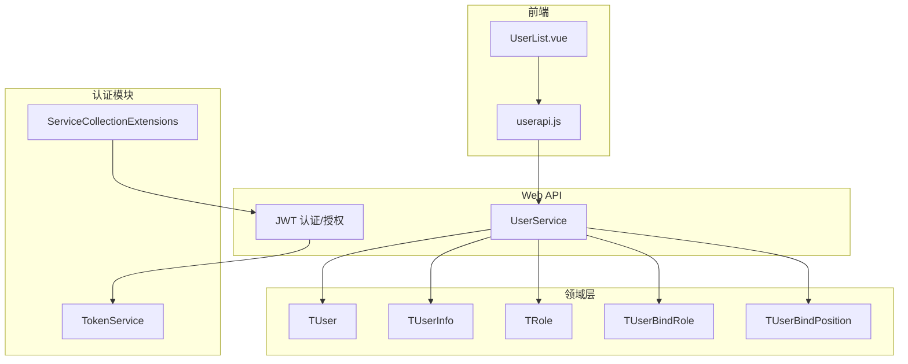
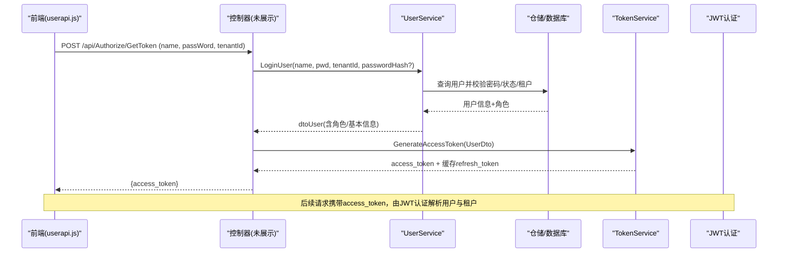
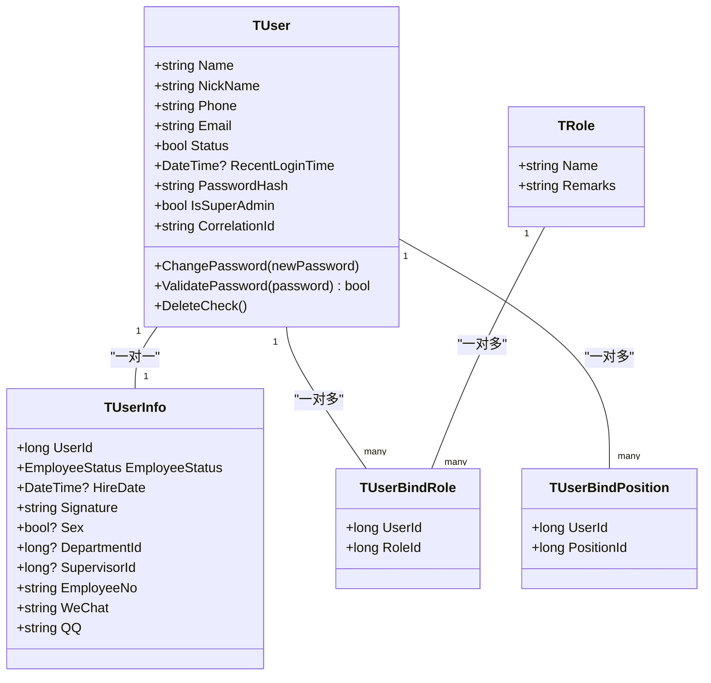
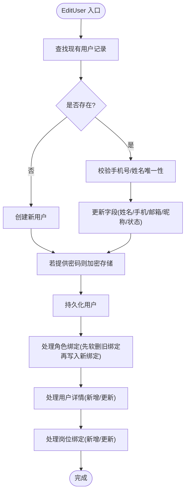
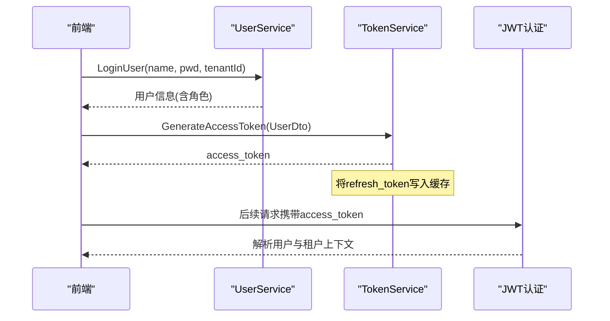
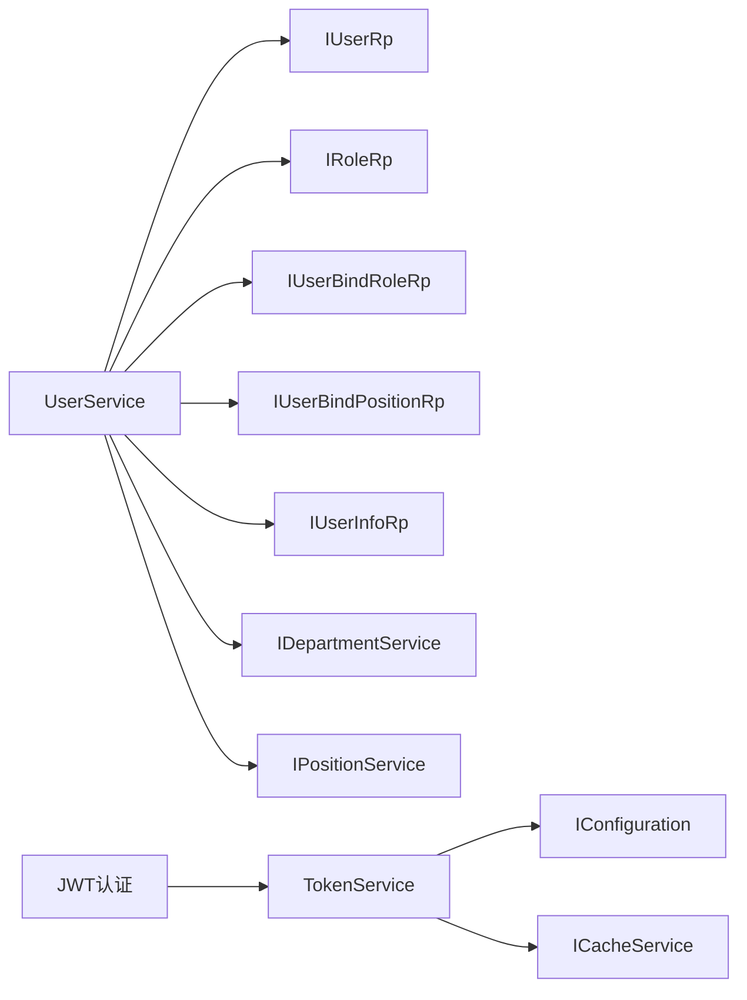

# 用户管理模块

<cite>
**本文引用的文件**
- [UserService.cs](file://Kevin/Application/Services/UserService.cs)
- [IUserService.cs](file://Kevin/Domain/Interfaces/IServices/IUserService.cs)
- [TUser.cs](file://Kevin/Domain/Entities/TUser.cs)
- [TUserInfo.cs](file://Kevin/Domain/Entities/TUserInfo.cs)
- [TRole.cs](file://Kevin/Domain/Entities/TRole.cs)
- [TUserBindRole.cs](file://Kevin/Domain/Entities/TUserBindRole.cs)
- [TUserBindPosition.cs](file://Kevin/Domain/Entities/TUserBindPosition.cs)
- [TokenService.cs](file://Kevin/kevin.Module/Kevin.Authentication.Jwt/Service/TokenService.cs)
- [ServiceCollectionExtensions.cs](file://Kevin/kevin.Module/Kevin.Authentication.Jwt/ServiceCollectionExtensions.cs)
- [JwtKeinClaimTypes.cs](file://Kevin/kevin.Module/Kevin.Authentication.Jwt/Dto/JwtKeinClaimTypes.cs)
- [userapi.js](file://vue/kevin.web.vue/src/api/userapi.js)
- [UserList.vue](file://vue/kevin.web.vue/src/pages/UserList.vue)
</cite>

## 目录
1. [简介](#简介)
2. [项目结构](#项目结构)
3. [核心组件](#核心组件)
4. [架构总览](#架构总览)
5. [详细组件分析](#详细组件分析)
6. [依赖关系分析](#依赖关系分析)
7. [性能考虑](#性能考虑)
8. [故障排查指南](#故障排查指南)
9. [结论](#结论)
10. [附录](#附录)

## 简介
本模块提供完整的用户管理能力，涵盖用户实体设计、服务层实现、认证授权与JWT令牌管理。支持用户CRUD、密码加密与校验、用户状态管理、登录登出流程、当前用户信息获取、权限检查与数据隔离（租户维度）。同时给出前端API调用示例与页面集成方式，并说明与角色、岗位、组织架构的关联关系。

## 项目结构
围绕用户管理的关键代码分布在以下层次：
- 领域层（Domain）：定义用户、用户详情、角色、用户-角色绑定、用户-岗位绑定等实体及基础数据。
- 应用层（Application）：UserService实现用户业务逻辑，包括登录、查询、编辑、删除、密码修改、列表分页、组织与岗位关联等。
- 认证模块（Authentication.Jwt）：TokenService负责生成与刷新JWT访问令牌，并通过缓存维护刷新令牌；服务注册扩展配置JWT验证参数。
- Web API与前端：前端通过userapi.js调用后端接口，UserList.vue作为用户管理页面入口。

图表来源
- [UserService.cs:1-800](file://Kevin/Application/Services/UserService.cs#L1-L800)
- [TokenService.cs:1-110](file://Kevin/kevin.Module/Kevin.Authentication.Jwt/Service/TokenService.cs#L1-L110)
- [ServiceCollectionExtensions.cs:1-42](file://Kevin/kevin.Module/Kevin.Authentication.Jwt/ServiceCollectionExtensions.cs#L1-L42)
- [TUser.cs:1-99](file://Kevin/Domain/Entities/TUser.cs#L1-L99)
- [TUserInfo.cs:1-77](file://Kevin/Domain/Entities/TUserInfo.cs#L1-L77)
- [TRole.cs:1-41](file://Kevin/Domain/Entities/TRole.cs#L1-L41)
- [TUserBindRole.cs:1-22](file://Kevin/Domain/Entities/TUserBindRole.cs#L1-L22)
- [TUserBindPosition.cs:1-26](file://Kevin/Domain/Entities/TUserBindPosition.cs#L1-L26)

章节来源
- [UserService.cs:1-800](file://Kevin/Application/Services/UserService.cs#L1-L800)
- [TokenService.cs:1-110](file://Kevin/kevin.Module/Kevin.Authentication.Jwt/Service/TokenService.cs#L1-L110)
- [ServiceCollectionExtensions.cs:1-42](file://Kevin/kevin.Module/Kevin.Authentication.Jwt/ServiceCollectionExtensions.cs#L1-L42)

## 核心组件
- 用户实体与扩展信息
  - TUser：用户名、昵称、手机、邮箱、状态、最近登录时间、密码哈希、是否超级管理员、第三方关联ID等，并提供密码变更与校验方法。
  - TUserInfo：员工状态、入职日期、签名、性别、部门、上级、工号、微信、QQ等详细信息。
- 角色与绑定
  - TRole：角色名称、备注。
  - TUserBindRole：用户与角色的多对多关系。
  - TUserBindPosition：用户与岗位的绑定关系。
- 服务接口与实现
  - IUserService：定义用户相关操作契约（登录、查询、编辑、删除、密码修改、列表、角色与岗位关联等）。
  - UserService：具体实现上述能力，包含登录校验、角色/岗位加载、分页查询、软删除、密码更新、最近登录时间更新等。
- 认证与令牌
  - TokenService：根据用户信息生成JWT访问令牌，并在缓存中登记刷新令牌；支持基于刷新令牌续期访问令牌。
  - ServiceCollectionExtensions：注册JWT认证方案与验证参数（Issuer/Audience/Key/过期策略等）。
  - JwtKeinClaimTypes：统一声明JWT Claim键名常量。

章节来源
- [TUser.cs:1-99](file://Kevin/Domain/Entities/TUser.cs#L1-L99)
- [TUserInfo.cs:1-77](file://Kevin/Domain/Entities/TUserInfo.cs#L1-L77)
- [TRole.cs:1-41](file://Kevin/Domain/Entities/TRole.cs#L1-L41)
- [TUserBindRole.cs:1-22](file://Kevin/Domain/Entities/TUserBindRole.cs#L1-L22)
- [TUserBindPosition.cs:1-26](file://Kevin/Domain/Entities/TUserBindPosition.cs#L1-L26)
- [IUserService.cs:1-175](file://Kevin/Domain/Interfaces/IServices/IUserService.cs#L1-L175)
- [UserService.cs:1-800](file://Kevin/Application/Services/UserService.cs#L1-L800)
- [TokenService.cs:1-110](file://Kevin/kevin.Module/Kevin.Authentication.Jwt/Service/TokenService.cs#L1-L110)
- [ServiceCollectionExtensions.cs:1-42](file://Kevin/kevin.Module/Kevin.Authentication.Jwt/ServiceCollectionExtensions.cs#L1-L42)
- [JwtKeinClaimTypes.cs:1-14](file://Kevin/kevin.Module/Kevin.Authentication.Jwt/Dto/JwtKeinClaimTypes.cs#L1-L14)

## 架构总览
用户管理采用分层架构：前端通过REST API调用应用层服务，服务层组合领域实体与仓储完成业务处理；认证模块在请求进入时解析JWT，提取用户身份与租户上下文，供后续服务使用。

图表来源
- [userapi.js:1-44](file://vue/kevin.web.vue/src/api/userapi.js#L1-L44)
- [UserService.cs:134-167](file://Kevin/Application/Services/UserService.cs#L134-L167)
- [TokenService.cs:29-60](file://Kevin/kevin.Module/Kevin.Authentication.Jwt/Service/TokenService.cs#L29-L60)
- [ServiceCollectionExtensions.cs:13-39](file://Kevin/kevin.Module/Kevin.Authentication.Jwt/ServiceCollectionExtensions.cs#L13-L39)

## 详细组件分析

### 用户实体设计与数据模型
- TUser
  - 关键字段：Name、NickName、Phone、Email、Status、RecentLoginTime、PasswordHash、IsSuperAdmin、CorrelationId。
  - 行为：ChangePassword（SHA256哈希）、ValidatePassword（校验）、DeleteCheck（禁止删除超级管理员）。
- TUserInfo
  - 关联TUser，记录员工状态、入职日期、签名、性别、部门、上级、工号、微信、QQ等。
- TRole
  - 角色名称与备注。
- TUserBindRole
  - 用户与角色的多对多关系。
- TUserBindPosition
  - 用户与岗位的多对多关系。

图表来源
- [TUser.cs:1-99](file://Kevin/Domain/Entities/TUser.cs#L1-L99)
- [TUserInfo.cs:1-77](file://Kevin/Domain/Entities/TUserInfo.cs#L1-L77)
- [TRole.cs:1-41](file://Kevin/Domain/Entities/TRole.cs#L1-L41)
- [TUserBindRole.cs:1-22](file://Kevin/Domain/Entities/TUserBindRole.cs#L1-L22)
- [TUserBindPosition.cs:1-26](file://Kevin/Domain/Entities/TUserBindPosition.cs#L1-L26)

章节来源
- [TUser.cs:1-99](file://Kevin/Domain/Entities/TUser.cs#L1-L99)
- [TUserInfo.cs:1-77](file://Kevin/Domain/Entities/TUserInfo.cs#L1-L77)
- [TRole.cs:1-41](file://Kevin/Domain/Entities/TRole.cs#L1-L41)
- [TUserBindRole.cs:1-22](file://Kevin/Domain/Entities/TUserBindRole.cs#L1-L22)
- [TUserBindPosition.cs:1-26](file://Kevin/Domain/Entities/TUserBindPosition.cs#L1-L26)

### 用户服务实现（CRUD、状态、密码、组织与岗位）
- 登录与认证
  - 支持用户名或手机号登录，按租户过滤，校验密码哈希与状态，返回用户基本信息与角色集合。
- 查询与分页
  - 小程序用户列表与系统用户列表，支持搜索关键词、岗位/部门筛选、头像聚合、角色与岗位信息回填。
- 新增/编辑/删除
  - 新增时强制设置密码并加密存储；编辑时支持可选密码更新；删除为软删除，且保护种子数据与自身不可删。
- 密码与安全
  - 提供旧密码校验后更新密码；支持短信验证码改密/改手机。
- 组织与岗位
  - 保存用户时同步更新角色绑定、用户详情、岗位绑定；支持按岗位/部门获取子级用户ID。
- 租户隔离
  - 多处查询与删除均按当前租户上下文过滤，确保多租户数据隔离。

图表来源
- [UserService.cs:403-476](file://Kevin/Application/Services/UserService.cs#L403-L476)
- [UserService.cs:477-552](file://Kevin/Application/Services/UserService.cs#L477-L552)

章节来源
- [UserService.cs:108-167](file://Kevin/Application/Services/UserService.cs#L108-L167)
- [UserService.cs:239-338](file://Kevin/Application/Services/UserService.cs#L239-L338)
- [UserService.cs:345-396](file://Kevin/Application/Services/UserService.cs#L345-L396)
- [UserService.cs:403-552](file://Kevin/Application/Services/UserService.cs#L403-L552)
- [UserService.cs:558-590](file://Kevin/Application/Services/UserService.cs#L558-L590)
- [UserService.cs:743-776](file://Kevin/Application/Services/UserService.cs#L743-L776)

### 认证授权机制与JWT令牌管理
- 登录流程
  - 前端调用登录接口，服务端验证用户与租户，返回用户信息；随后生成JWT访问令牌，并将刷新令牌存入缓存。
- 令牌生成与续期
  - TokenService根据配置签发JWT，包含用户ID、是否超级管理员、姓名、创建时间、租户ID等Claim；支持用刷新令牌换取新的访问令牌。
- 认证配置
  - 通过扩展方法注册JWT Bearer认证，配置Issuer、Audience、密钥与严格过期策略。

图表来源
- [UserService.cs:134-167](file://Kevin/Application/Services/UserService.cs#L134-L167)
- [TokenService.cs:29-107](file://Kevin/kevin.Module/Kevin.Authentication.Jwt/Service/TokenService.cs#L29-L107)
- [ServiceCollectionExtensions.cs:13-39](file://Kevin/kevin.Module/Kevin.Authentication.Jwt/ServiceCollectionExtensions.cs#L13-L39)
- [JwtKeinClaimTypes.cs:1-14](file://Kevin/kevin.Module/Kevin.Authentication.Jwt/Dto/JwtKeinClaimTypes.cs#L1-L14)

章节来源
- [TokenService.cs:29-107](file://Kevin/kevin.Module/Kevin.Authentication.Jwt/Service/TokenService.cs#L29-L107)
- [ServiceCollectionExtensions.cs:13-39](file://Kevin/kevin.Module/Kevin.Authentication.Jwt/ServiceCollectionExtensions.cs#L13-L39)
- [JwtKeinClaimTypes.cs:1-14](file://Kevin/kevin.Module/Kevin.Authentication.Jwt/Dto/JwtKeinClaimTypes.cs#L1-L14)

### 用户信息获取、权限检查与会话管理
- 用户信息获取
  - 支持按ID、用户名、当前登录用户三种方式获取用户信息，并附带角色、岗位与用户详情。
- 权限检查
  - 登录成功后，JWT中包含用户标识与租户信息；结合权限模块可在后续请求中进行细粒度鉴权（此处以JWT承载身份为主）。
- 会话管理
  - 无服务器端会话，采用无状态JWT；刷新令牌通过缓存管理，支持续期访问令牌。

章节来源
- [UserService.cs:108-167](file://Kevin/Application/Services/UserService.cs#L108-L167)
- [UserService.cs:345-396](file://Kevin/Application/Services/UserService.cs#L345-L396)
- [TokenService.cs:29-107](file://Kevin/kevin.Module/Kevin.Authentication.Jwt/Service/TokenService.cs#L29-L107)

### 与权限系统、组织架构的集成
- 角色与权限
  - 用户与角色通过TUserBindRole关联，服务在保存用户时同步更新角色绑定。
- 组织架构
  - 用户详情包含部门与上级关系；服务支持按岗位/部门筛选用户，以及获取本部门及下级用户ID，便于数据权限控制。

章节来源
- [UserService.cs:278-338](file://Kevin/Application/Services/UserService.cs#L278-L338)
- [UserService.cs:477-552](file://Kevin/Application/Services/UserService.cs#L477-L552)
- [TUserBindRole.cs:1-22](file://Kevin/Domain/Entities/TUserBindRole.cs#L1-L22)
- [TUserBindPosition.cs:1-26](file://Kevin/Domain/Entities/TUserBindPosition.cs#L1-L26)

### 多租户环境下的用户数据隔离策略
- 登录与查询均按租户ID过滤，确保不同租户用户数据互不可见。
- 删除与编辑等操作也基于当前租户上下文进行限制，避免跨租户误操作。

章节来源
- [UserService.cs:134-167](file://Kevin/Application/Services/UserService.cs#L134-L167)
- [UserService.cs:558-590](file://Kevin/Application/Services/UserService.cs#L558-L590)

### API接口示例与前端使用方法
- 登录
  - 前端调用：POST /api/Authorize/GetToken，参数包含用户名、密码、租户ID。
- 获取当前用户
  - GET /api/User/GetUser
- 用户管理
  - 新增/编辑：POST /api/User/EditUser
  - 列表：POST /api/User/GetSysUserList
  - 删除：DELETE /api/User/DeleteUser?id={id}
  - 修改密码：POST /api/User/ChangePasswordTokenUser
  - 统计：GET /api/User/GetAllUserCount
- 前端集成
  - 通过userapi.js封装接口调用；UserList.vue作为用户管理页面入口，引用UserManagement组件。

章节来源
- [userapi.js:1-44](file://vue/kevin.web.vue/src/api/userapi.js#L1-L44)
- [UserList.vue:1-17](file://vue/kevin.web.vue/src/pages/UserList.vue#L1-L17)

## 依赖关系分析
- UserService依赖仓储与外部服务（角色、岗位、部门、文件、微信密钥等），完成用户全生命周期管理与组织关联。
- TokenService依赖配置与缓存服务，负责JWT签发与刷新令牌管理。
- 认证扩展将JWT验证注入到ASP.NET Core管道，使后续请求可解析用户与租户上下文。

图表来源
- [UserService.cs:1-46](file://Kevin/Application/Services/UserService.cs#L1-L46)
- [TokenService.cs:1-23](file://Kevin/kevin.Module/Kevin.Authentication.Jwt/Service/TokenService.cs#L1-L23)
- [ServiceCollectionExtensions.cs:13-39](file://Kevin/kevin.Module/Kevin.Authentication.Jwt/ServiceCollectionExtensions.cs#L13-L39)

章节来源
- [UserService.cs:1-46](file://Kevin/Application/Services/UserService.cs#L1-L46)
- [TokenService.cs:1-23](file://Kevin/kevin.Module/Kevin.Authentication.Jwt/Service/TokenService.cs#L1-L23)
- [ServiceCollectionExtensions.cs:13-39](file://Kevin/kevin.Module/Kevin.Authentication.Jwt/ServiceCollectionExtensions.cs#L13-L39)

## 性能考虑
- 查询优化
  - 列表查询使用分页与条件过滤，减少数据传输量；头像与角色/岗位信息批量加载，避免N+1问题。
- 密码安全
  - 使用SHA256哈希存储密码，避免明文存储；登录时仅比较哈希值。
- 令牌管理
  - 刷新令牌缓存过期时间与访问令牌过期时间分离，降低频繁重放攻击风险；严格过期策略减少时钟偏差影响。
- 并发与事务
  - 用户编辑涉及多表更新（用户、角色绑定、用户详情、岗位绑定），建议在同一事务中提交，保证一致性。

[本节为通用指导，不直接分析具体文件]

## 故障排查指南
- 登录失败
  - 检查用户名/手机号、密码是否正确；确认租户ID匹配；查看用户状态是否为启用。
- 密码修改失败
  - 确认旧密码正确；新密码非空；短信验证码有效（如使用短信改密）。
- 删除用户失败
  - 不能删除自己；不能删除种子数据；目标用户不存在或已软删除。
- JWT相关问题
  - 检查Issuer/Audience/Key配置；确认客户端传递的access_token未过期；刷新令牌是否在缓存中有效。

章节来源
- [UserService.cs:134-167](file://Kevin/Application/Services/UserService.cs#L134-L167)
- [UserService.cs:558-590](file://Kevin/Application/Services/UserService.cs#L558-L590)
- [UserService.cs:743-776](file://Kevin/Application/Services/UserService.cs#L743-L776)
- [TokenService.cs:29-107](file://Kevin/kevin.Module/Kevin.Authentication.Jwt/Service/TokenService.cs#L29-L107)
- [ServiceCollectionExtensions.cs:13-39](file://Kevin/kevin.Module/Kevin.Authentication.Jwt/ServiceCollectionExtensions.cs#L13-L39)

## 结论
本用户管理模块以清晰的领域模型与服务实现为核心，结合JWT无状态认证与租户隔离，提供了完整、可扩展的用户管理能力。通过角色与岗位绑定以及与组织架构的集成，满足企业级权限与数据范围控制需求。前端通过简洁的API封装即可快速集成用户管理功能。

## 附录
- 关键实体路径
  - 用户实体：[TUser.cs](file://Kevin/Domain/Entities/TUser.cs)
  - 用户详情：[TUserInfo.cs](file://Kevin/Domain/Entities/TUserInfo.cs)
  - 角色与绑定：[TRole.cs](file://Kevin/Domain/Entities/TRole.cs)、[TUserBindRole.cs](file://Kevin/Domain/Entities/TUserBindRole.cs)
  - 岗位绑定：[TUserBindPosition.cs](file://Kevin/Domain/Entities/TUserBindPosition.cs)
- 服务接口与实现
  - 接口：[IUserService.cs](file://Kevin/Domain/Interfaces/IServices/IUserService.cs)
  - 实现：[UserService.cs](file://Kevin/Application/Services/UserService.cs)
- 认证与令牌
  - 令牌服务：[TokenService.cs](file://Kevin/kevin.Module/Kevin.Authentication.Jwt/Service/TokenService.cs)
  - 认证配置：[ServiceCollectionExtensions.cs](file://Kevin/kevin.Module/Kevin.Authentication.Jwt/ServiceCollectionExtensions.cs)
  - Claim常量：[JwtKeinClaimTypes.cs](file://Kevin/kevin.Module/Kevin.Authentication.Jwt/Dto/JwtKeinClaimTypes.cs)
- 前端集成
  - API封装：[userapi.js](file://vue/kevin.web.vue/src/api/userapi.js)
  - 页面入口：[UserList.vue](file://vue/kevin.web.vue/src/pages/UserList.vue)