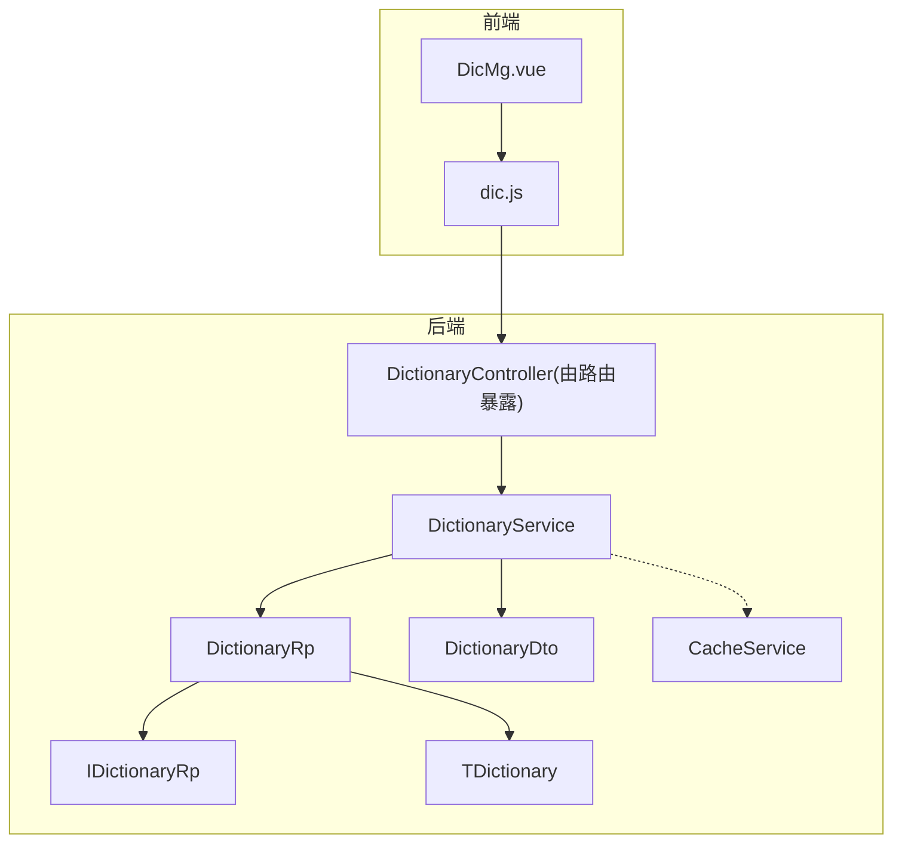
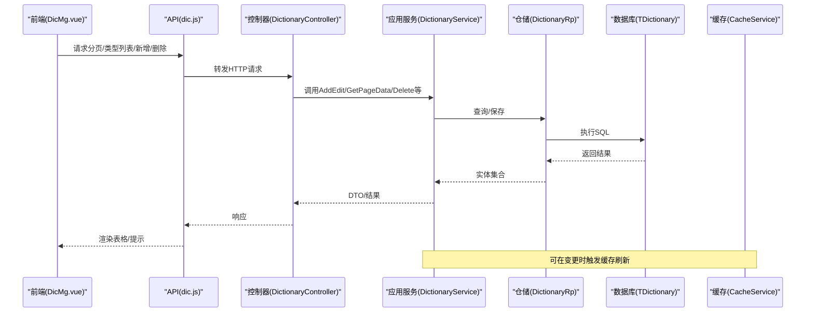
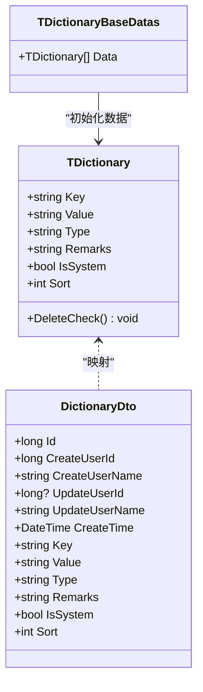
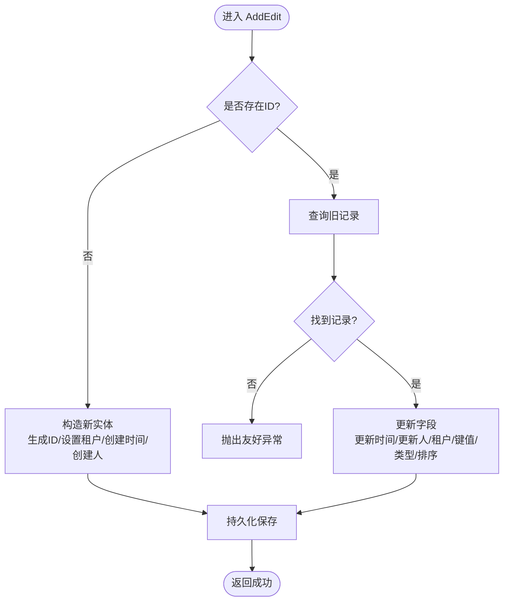
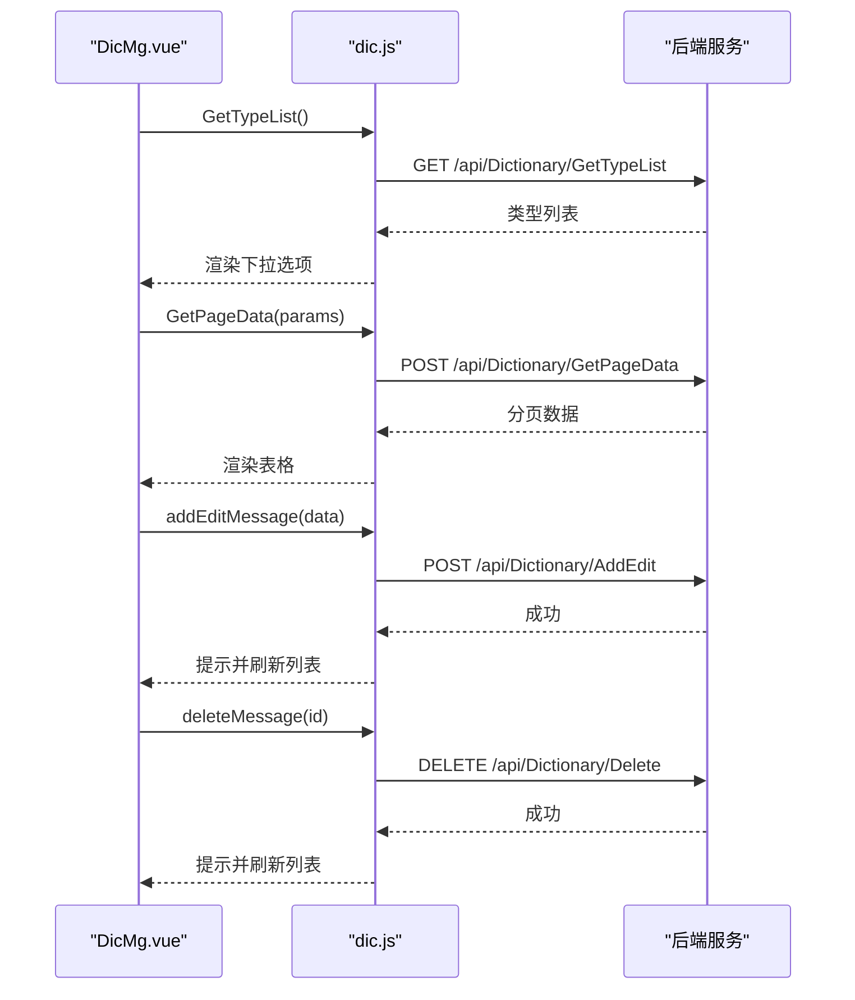
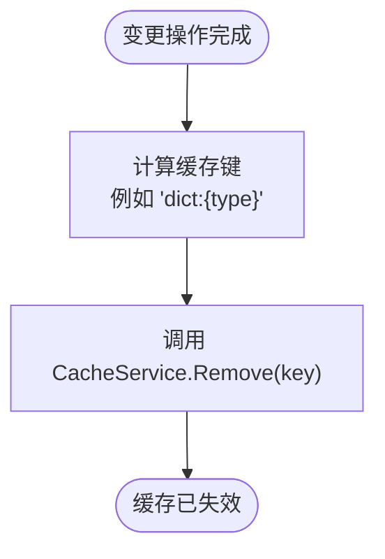
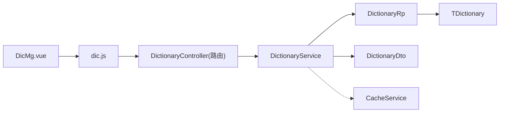

# 字典管理

<cite>
**本文引用的文件**
- [DictionaryService.cs](file://Kevin/Application/Services/DictionaryService.cs)
- [TDictionary.cs](file://Kevin/Domain/Entities/TDictionary.cs)
- [TDictionaryBaseDatas.cs](file://Kevin/Domain/BaseDatas/TDictionaryBaseDatas.cs)
- [IDictionaryRp.cs](file://Kevin/Domain/Interfaces/IRepositories/IDictionaryRp.cs)
- [DictionaryRp.cs](file://Kevin/RepositorieRps/Repositories/DictionaryRp.cs)
- [IDictionaryService.cs](file://Kevin/Domain/Interfaces/IServices/IDictionaryService.cs)
- [DictionaryDto.cs](file://Kevin/kevin.Share/Dtos/System/DictionaryDto.cs)
- [CacheService.cs](file://Kevin/kevin.Module/kevin.Cache/Service/CacheService.cs)
- [dic.js](file://vue/kevin.web.vue/src/api/dic.js)
- [DicMg.vue](file://vue/kevin.web.vue/src/pages/DicMg.vue)
</cite>

## 目录
1. [简介](#简介)
2. [项目结构](#项目结构)
3. [核心组件](#核心组件)
4. [架构总览](#架构总览)
5. [详细组件分析](#详细组件分析)
6. [依赖关系分析](#依赖关系分析)
7. [性能考虑](#性能考虑)
8. [故障排查指南](#故障排查指南)
9. [结论](#结论)
10. [附录](#附录)

## 简介
本章节系统性说明“字典管理”功能，覆盖字典项的增删改查、分类（类型）管理、排序维护、缓存刷新等能力；解释字典数据的层次结构、国际化支持现状与扩展点、动态加载机制；并给出前端组件使用方式、缓存策略、配置最佳实践与性能优化建议。

## 项目结构
后端采用分层架构：领域实体、仓储接口与实现、应用服务、控制器与前端页面通过 API 交互。字典相关的关键位置如下：
- 领域层：实体 TDictionary、基础数据 TDictionaryBaseDatas
- 接口层：IDictionaryService、IDictionaryRp
- 应用层：DictionaryService
- 仓储层：DictionaryRp
- 共享 DTO：DictionaryDto
- 缓存层：CacheService（分布式缓存封装）
- 前端：Vue 页面 DicMg.vue 与 API 封装 dic.js

图表来源
- [DictionaryService.cs:1-141](file://Kevin/Application/Services/DictionaryService.cs#L1-L141)
- [DictionaryRp.cs:1-10](file://Kevin/RepositorieRps/Repositories/DictionaryRp.cs#L1-L10)
- [TDictionary.cs:1-58](file://Kevin/Domain/Entities/TDictionary.cs#L1-L58)
- [DictionaryDto.cs:1-73](file://Kevin/kevin.Share/Dtos/System/DictionaryDto.cs#L1-L73)
- [CacheService.cs:1-196](file://Kevin/kevin.Module/kevin.Cache/Service/CacheService.cs#L1-L196)
- [dic.js:1-18](file://vue/kevin.web.vue/src/api/dic.js#L1-L18)
- [DicMg.vue:1-456](file://vue/kevin.web.vue/src/pages/DicMg.vue#L1-L456)

章节来源
- [DictionaryService.cs:1-141](file://Kevin/Application/Services/DictionaryService.cs#L1-L141)
- [TDictionary.cs:1-58](file://Kevin/Domain/Entities/TDictionary.cs#L1-L58)
- [DictionaryRp.cs:1-10](file://Kevin/RepositorieRps/Repositories/DictionaryRp.cs#L1-L10)
- [DictionaryDto.cs:1-73](file://Kevin/kevin.Share/Dtos/System/DictionaryDto.cs#L1-L73)
- [CacheService.cs:1-196](file://Kevin/kevin.Module/kevin.Cache/Service/CacheService.cs#L1-L196)
- [dic.js:1-18](file://vue/kevin.web.vue/src/api/dic.js#L1-L18)
- [DicMg.vue:1-456](file://vue/kevin.web.vue/src/pages/DicMg.vue#L1-L456)

## 核心组件
- 领域实体 TDictionary：定义键、值、类型、备注、是否系统内置、排序等字段，并提供删除保护逻辑（系统内置不可删除）。
- 应用服务 DictionaryService：提供获取类型列表、按类型获取字典项、分页查询、新增/编辑、删除等能力。
- 仓储接口与实现 IDictionaryRp / DictionaryRp：基于通用仓储对 TDictionary 进行 CRUD 操作。
- DTO DictionaryDto：对外传输的字典数据结构，包含创建/更新人信息、时间戳、键值、类型、排序等。
- 缓存服务 CacheService：提供字符串/对象缓存读写与过期控制，用于字典缓存的存取与失效。

章节来源
- [TDictionary.cs:1-58](file://Kevin/Domain/Entities/TDictionary.cs#L1-L58)
- [DictionaryService.cs:1-141](file://Kevin/Application/Services/DictionaryService.cs#L1-L141)
- [IDictionaryRp.cs:1-8](file://Kevin/Domain/Interfaces/IRepositories/IDictionaryRp.cs#L1-L8)
- [DictionaryRp.cs:1-10](file://Kevin/RepositorieRps/Repositories/DictionaryRp.cs#L1-L10)
- [DictionaryDto.cs:1-73](file://Kevin/kevin.Share/Dtos/System/DictionaryDto.cs#L1-L73)
- [CacheService.cs:1-196](file://Kevin/kevin.Module/kevin.Cache/Service/CacheService.cs#L1-L196)

## 架构总览
字典管理遵循典型分层架构：前端通过 HTTP 调用后端控制器，控制器委托应用服务处理业务，应用服务通过仓储访问数据库实体，必要时与缓存服务交互以维持数据一致性。

图表来源
- [DictionaryService.cs:1-141](file://Kevin/Application/Services/DictionaryService.cs#L1-L141)
- [dic.js:1-18](file://vue/kevin.web.vue/src/api/dic.js#L1-L18)
- [DicMg.vue:1-456](file://vue/kevin.web.vue/src/pages/DicMg.vue#L1-L456)
- [CacheService.cs:1-196](file://Kevin/kevin.Module/kevin.Cache/Service/CacheService.cs#L1-L196)

## 详细组件分析

### 领域模型与数据层次
- 实体 TDictionary 包含 Key、Value、Type、Remarks、IsSystem、Sort 等字段，继承基础审计字段（创建/更新时间、用户等），并通过 DeleteCheck 防止误删系统内置项。
- 基础数据 TDictionaryBaseDatas 提供系统预置字典样例，便于初始化或演示。

图表来源
- [TDictionary.cs:1-58](file://Kevin/Domain/Entities/TDictionary.cs#L1-L58)
- [DictionaryDto.cs:1-73](file://Kevin/kevin.Share/Dtos/System/DictionaryDto.cs#L1-L73)
- [TDictionaryBaseDatas.cs:1-19](file://Kevin/Domain/BaseDatas/TDictionaryBaseDatas.cs#L1-L19)

章节来源
- [TDictionary.cs:1-58](file://Kevin/Domain/Entities/TDictionary.cs#L1-L58)
- [TDictionaryBaseDatas.cs:1-19](file://Kevin/Domain/BaseDatas/TDictionaryBaseDatas.cs#L1-L19)
- [DictionaryDto.cs:1-73](file://Kevin/kevin.Share/Dtos/System/DictionaryDto.cs#L1-L73)

### 应用服务与业务流程
- 获取类型列表：去重返回所有非软删的类型。
- 按类型获取字典项：过滤指定类型并按排序倒序返回。
- 分页查询：支持关键字搜索（Key/Value/Remarks）、类型筛选、分页、关联创建/更新人员名称回填。
- 新增/编辑：根据 ID 判断新增或更新，设置租户、创建/更新时间、系统标记等。
- 删除：软删除，系统内置项禁止删除。

图表来源
- [DictionaryService.cs:62-113](file://Kevin/Application/Services/DictionaryService.cs#L62-L113)

章节来源
- [DictionaryService.cs:11-27](file://Kevin/Application/Services/DictionaryService.cs#L11-L27)
- [DictionaryService.cs:29-60](file://Kevin/Application/Services/DictionaryService.cs#L29-L60)
- [DictionaryService.cs:62-113](file://Kevin/Application/Services/DictionaryService.cs#L62-L113)
- [DictionaryService.cs:115-137](file://Kevin/Application/Services/DictionaryService.cs#L115-L137)

### 仓储与数据访问
- IDictionaryRp 定义字典仓储接口，继承通用仓储能力。
- DictionaryRp 实现具体仓储，复用基类 Query/Add/SaveChanges 等方法。

章节来源
- [IDictionaryRp.cs:1-8](file://Kevin/Domain/Interfaces/IRepositories/IDictionaryRp.cs#L1-L8)
- [DictionaryRp.cs:1-10](file://Kevin/RepositorieRps/Repositories/DictionaryRp.cs#L1-L10)

### 前端组件与交互
- 页面 DicMg.vue：提供类型筛选、关键词搜索、分页、添加/编辑/删除对话框与表单校验。
- API 封装 dic.js：统一调用 GetPageData、GetTypeList、AddEdit、GetTypeWhereList、Delete 等接口。
- 交互流程：页面初始化加载类型与数据；用户操作触发对应 API；成功后刷新列表。

图表来源
- [DicMg.vue:1-456](file://vue/kevin.web.vue/src/pages/DicMg.vue#L1-L456)
- [dic.js:1-18](file://vue/kevin.web.vue/src/api/dic.js#L1-L18)
- [DictionaryService.cs:1-141](file://Kevin/Application/Services/DictionaryService.cs#L1-L141)

章节来源
- [DicMg.vue:1-456](file://vue/kevin.web.vue/src/pages/DicMg.vue#L1-L456)
- [dic.js:1-18](file://vue/kevin.web.vue/src/api/dic.js#L1-L18)

### 缓存与刷新策略
- 缓存服务 CacheService 提供 SetString/SetObject/GetString/GetObject 等能力，支持带过期时间的包装格式存储，读取时自动校验过期并清理。
- 建议在字典数据变更后（新增/编辑/删除）主动刷新相关缓存键，以保证后续读取命中最新数据。可结合业务约定缓存键命名规则（如 dict:{type}）。

图表来源
- [CacheService.cs:1-196](file://Kevin/kevin.Module/kevin.Cache/Service/CacheService.cs#L1-L196)

章节来源
- [CacheService.cs:1-196](file://Kevin/kevin.Module/kevin.Cache/Service/CacheService.cs#L1-L196)

## 依赖关系分析
- 应用服务依赖仓储接口，降低耦合度，便于替换或测试。
- 实体与 DTO 分离，便于前后端契约稳定。
- 前端通过 API 模块解耦页面与网络层。

图表来源
- [DicMg.vue:1-456](file://vue/kevin.web.vue/src/pages/DicMg.vue#L1-L456)
- [dic.js:1-18](file://vue/kevin.web.vue/src/api/dic.js#L1-L18)
- [DictionaryService.cs:1-141](file://Kevin/Application/Services/DictionaryService.cs#L1-L141)
- [DictionaryRp.cs:1-10](file://Kevin/RepositorieRps/Repositories/DictionaryRp.cs#L1-L10)
- [TDictionary.cs:1-58](file://Kevin/Domain/Entities/TDictionary.cs#L1-L58)
- [DictionaryDto.cs:1-73](file://Kevin/kevin.Share/Dtos/System/DictionaryDto.cs#L1-L73)
- [CacheService.cs:1-196](file://Kevin/kevin.Module/kevin.Cache/Service/CacheService.cs#L1-L196)

章节来源
- [DictionaryService.cs:1-141](file://Kevin/Application/Services/DictionaryService.cs#L1-L141)
- [DictionaryRp.cs:1-10](file://Kevin/RepositorieRps/Repositories/DictionaryRp.cs#L1-L10)
- [TDictionary.cs:1-58](file://Kevin/Domain/Entities/TDictionary.cs#L1-L58)
- [DictionaryDto.cs:1-73](file://Kevin/kevin.Share/Dtos/System/DictionaryDto.cs#L1-L73)
- [CacheService.cs:1-196](file://Kevin/kevin.Module/kevin.Cache/Service/CacheService.cs#L1-L196)
- [DicMg.vue:1-456](file://vue/kevin.web.vue/src/pages/DicMg.vue#L1-L456)
- [dic.js:1-18](file://vue/kevin.web.vue/src/api/dic.js#L1-L18)

## 性能考虑
- 查询优化
  - 分页与条件过滤在服务端完成，避免全量拉取。
  - 列表查询按 Sort 降序，减少前端排序开销。
  - 仅选择必要字段，减少数据传输体积。
- 缓存策略
  - 对热点字典类型（如枚举型）建议按类型维度缓存，设置合理过期时间。
  - 写操作后主动失效对应缓存键，保证读一致性与时效性。
- 并发与幂等
  - 新增时使用雪花ID避免冲突。
  - 删除前检查系统内置标志，防止误删。
- 前端体验
  - 列表分页、搜索防抖、操作后局部刷新，降低带宽与渲染压力。

[本节为通用性能建议，不直接分析具体文件]

## 故障排查指南
- 无法删除系统内置字典
  - 现象：删除失败或提示不允许删除。
  - 原因：实体 DeleteCheck 阻止删除 IsSystem=true 的记录。
  - 处理：确认是否为系统内置项；如需调整，请修改系统内置标识或通过更高权限流程处理。
- 编辑受限
  - 现象：系统内置项编辑按钮禁用或提示不能编辑。
  - 原因：前端与后端双重保护。
  - 处理：同删除场景，需走系统配置流程。
- 缓存未生效或读到过期数据
  - 现象：变更后前端仍显示旧值。
  - 原因：缓存键未失效或客户端未刷新。
  - 处理：在写操作后调用缓存删除；前端在成功后重新拉取数据。
- 分页或搜索无结果
  - 现象：列表为空。
  - 原因：参数传递错误或条件过严。
  - 处理：检查前端传入的 pageNum/pageSize/searchKey/Parameter 是否与后端期望一致。

章节来源
- [TDictionary.cs:49-55](file://Kevin/Domain/Entities/TDictionary.cs#L49-L55)
- [DictionaryService.cs:115-137](file://Kevin/Application/Services/DictionaryService.cs#L115-L137)
- [CacheService.cs:125-163](file://Kevin/kevin.Module/kevin.Cache/Service/CacheService.cs#L125-L163)
- [DicMg.vue:356-374](file://vue/kevin.web.vue/src/pages/DicMg.vue#L356-L374)

## 结论
该字典管理功能具备完整的增删改查、类型管理与排序维护能力，并通过仓储与服务分层保障可维护性。结合缓存服务可实现高性能读取与可控的失效策略。前端提供了友好的管理界面与清晰的交互流程。建议在生产环境中完善缓存键规范、监控关键指标（命中率、延迟），并结合业务需求扩展国际化与多租户隔离策略。

[本节为总结性内容，不直接分析具体文件]

## 附录

### 字典项增删改查与分类管理要点
- 分类（类型）管理：通过类型字段组织字典项，支持按类型筛选与展示。
- 排序维护：Sort 字段控制展示顺序，服务端按降序返回，便于前端直出。
- 软删除：删除操作标记 IsDelete=true，保留历史数据与审计信息。
- 系统内置保护：IsSystem=true 的项禁止删除与编辑，确保系统稳定性。

章节来源
- [DictionaryService.cs:11-27](file://Kevin/Application/Services/DictionaryService.cs#L11-L27)
- [DictionaryService.cs:29-60](file://Kevin/Application/Services/DictionaryService.cs#L29-L60)
- [DictionaryService.cs:62-113](file://Kevin/Application/Services/DictionaryService.cs#L62-L113)
- [DictionaryService.cs:115-137](file://Kevin/Application/Services/DictionaryService.cs#L115-L137)
- [TDictionary.cs:38-55](file://Kevin/Domain/Entities/TDictionary.cs#L38-L55)

### 国际化支持与扩展点
- 当前实现中，字典项本身不包含语言维度，适合存放与语言无关的静态配置或作为翻译键。
- 可扩展方向：在实体或 DTO 中增加 Language/Culture 字段，配合类型与键构成复合主键，实现多语言字典；或在读取时按当前文化上下文过滤。

[本节为概念性扩展建议，不直接分析具体文件]

### 动态加载与前端使用
- 页面启动时先加载类型列表，再按需加载对应类型的字典数据。
- 支持关键词搜索与类型筛选，提升大数据量下的可用性。
- 新增/编辑/删除后即时刷新列表，保证所见即所得。

章节来源
- [DicMg.vue:262-315](file://vue/kevin.web.vue/src/pages/DicMg.vue#L262-L315)
- [dic.js:1-18](file://vue/kevin.web.vue/src/api/dic.js#L1-L18)

### 缓存策略与最佳实践
- 读多写少场景：按类型维度缓存字典项，设置合理过期时间。
- 写后即失效：在新增/编辑/删除后，删除对应类型缓存键，避免脏读。
- 兼容旧格式：缓存读取兼容原始字符串与包装格式，平滑升级。

章节来源
- [CacheService.cs:1-196](file://Kevin/kevin.Module/kevin.Cache/Service/CacheService.cs#L1-L196)

### 配置与初始化
- 系统内置字典可通过基础数据 TDictionaryBaseDatas 初始化，便于环境部署与演示。
- 建议将系统内置与业务自定义字典区分管理，避免误改。

章节来源
- [TDictionaryBaseDatas.cs:1-19](file://Kevin/Domain/BaseDatas/TDictionaryBaseDatas.cs#L1-L19)