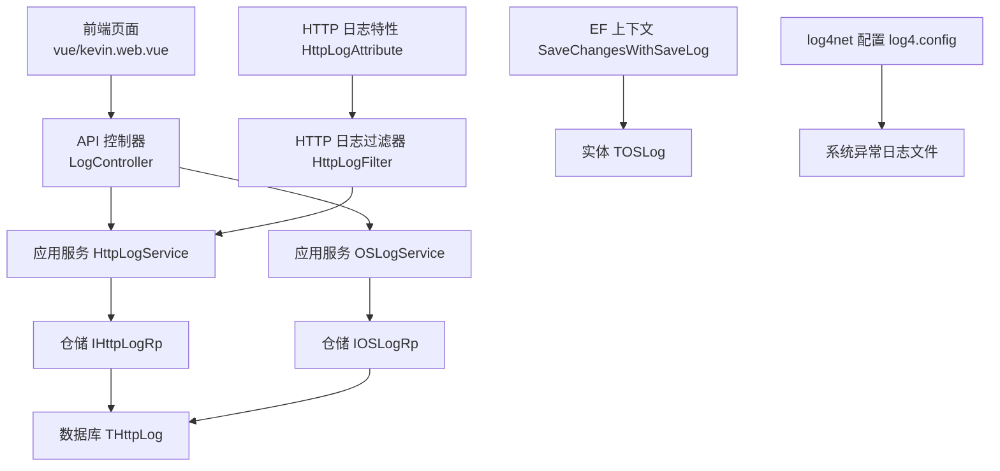
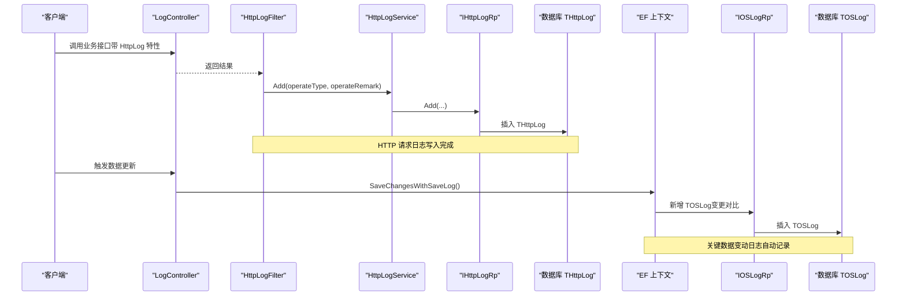
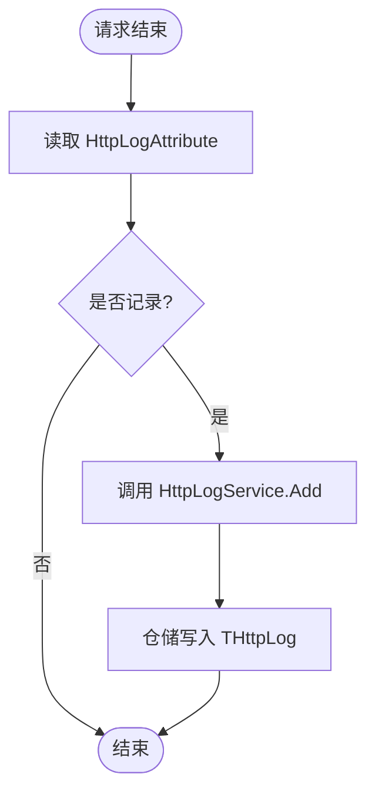
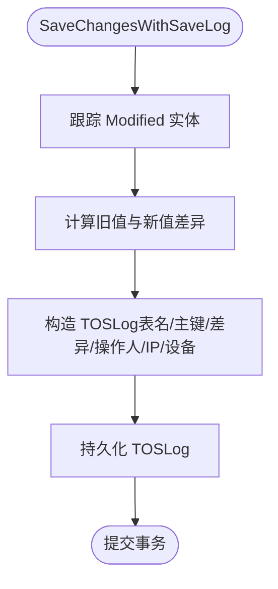
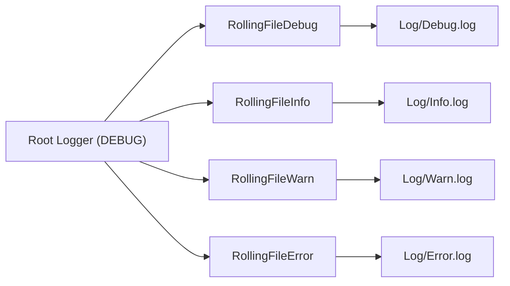
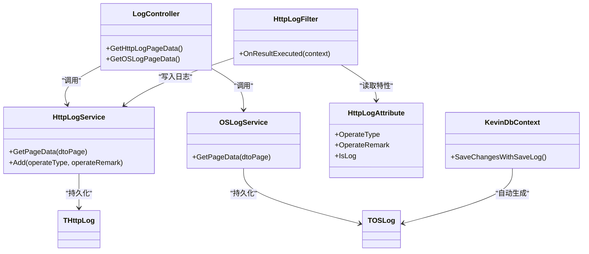

# 日志管理

<cite>
**本文引用的文件**
- [LogController.cs](file://Kevin/ Kevin.Web.Basics/Controllers/LogController.cs)
- [HttpLogService.cs](file://Kevin/Application/Services/HttpLogService.cs)
- [OSLogService.cs](file://Kevin/Application/Services/OSLogService.cs)
- [THttpLog.cs](file://Kevin/Domain/Entities/THttpLog.cs)
- [TOSLog.cs](file://Kevin/Domain/Entities/TOSLog.cs)
- [TLog.cs](file://Kevin/Domain/Entities/TLog.cs)
- [TLogCreatedEvent.cs](file://Kevin/Domain/Events/TLogCreatedEvent.cs)
- [TLogCreatedEventHandlers.cs](file://Kevin/Domain/EventHandlers/TLogCreatedEventHandlers.cs)
- [HttpLogFilter.cs](file://Kevin/ Kevin.Web.Basics/Filters/HttpLogFilter.cs)
- [HttpLogAttribute.cs](file://Kevin/ kevin.Share/Attributes/HttpLogAttribute.cs)
- [log4.config](file://App/WebApi/LogConfigs/log4.config)
- [KevinDbContext.cs](file://Kevin/ Kevin.EntityFrameworkCore/Database/KevinDbContext.cs)
- [log.js](file://vue/kevin.web.vue/src/api/log.js)
</cite>

## 目录
1. [简介](#简介)
2. [项目结构](#项目结构)
3. [核心组件](#核心组件)
4. [架构总览](#架构总览)
5. [详细组件分析](#详细组件分析)
6. [依赖关系分析](#依赖关系分析)
7. [性能考虑](#性能考虑)
8. [故障排查指南](#故障排查指南)
9. [结论](#结论)
10. [附录](#附录)

## 简介
本章节系统性说明项目的日志管理能力，涵盖三类日志：操作日志（HTTP 请求日志）、系统异常日志（框架级日志）与关键数据变动日志（操作标记日志）。重点解释分层记录、异步写入策略、性能影响控制、筛选搜索、统计分析以及自动清理等能力，并给出配置最佳实践与优化建议。

## 项目结构
日志相关代码按领域分层组织：
- Web 层：控制器暴露查询接口；过滤器在结果执行阶段触发 HTTP 日志记录；特性用于声明式开启日志。
- 应用层：服务实现分页查询与新增逻辑，封装仓储调用。
- 领域层：实体定义日志表结构；领域事件用于扩展日志处理（如控制台输出）。
- 基础设施层：EF Core 上下文在保存变更时自动记录关键数据变动日志；log4net 配置文件负责系统异常日志落盘。
- 前端：提供日志查询 API 调用。

图表来源
- [LogController.cs:11-49](file://Kevin/ Kevin.Web.Basics/Controllers/LogController.cs#L11-L49)
- [HttpLogService.cs:1-37](file://Kevin/Application/Services/HttpLogService.cs#L1-L37)
- [OSLogService.cs:1-38](file://Kevin/Application/Services/OSLogService.cs#L1-L38)
- [THttpLog.cs:1-78](file://Kevin/Domain/Entities/THttpLog.cs#L1-L78)
- [TOSLog.cs:1-77](file://Kevin/Domain/Entities/TOSLog.cs#L1-L77)
- [KevinDbContext.cs:525-583](file://Kevin/ Kevin.EntityFrameworkCore/Database/KevinDbContext.cs#L525-L583)
- [log4.config:1-137](file://App/WebApi/LogConfigs/log4.config#L1-L137)

章节来源
- [LogController.cs:11-49](file://Kevin/ Kevin.Web.Basics/Controllers/LogController.cs#L11-L49)
- [log.js:1-9](file://vue/kevin.web.vue/src/api/log.js#L1-L9)

## 核心组件
- HTTP 请求日志
  - 特性：通过方法级特性声明是否记录及操作类型、备注。
  - 过滤器：在结果执行后读取特性并调用服务写入日志。
  - 服务：提供分页查询与新增接口。
  - 实体：存储请求元数据（URL、方法、IP、设备、用户、操作类型/备注等）。
- 关键数据变动日志（操作标记）
  - 在 EF 上下文保存修改时自动生成变更记录（表名、主键、差异内容、操作人、IP、设备等）。
  - 服务提供分页查询与多字段模糊搜索。
- 系统异常日志
  - 使用 log4net 按级别分文件滚动记录（Debug/Info/Warn/Error），支持大小与日期切分。
- 领域事件扩展
  - 创建 TLog 时发布领域事件，可被处理器消费（示例中输出到控制台）。

章节来源
- [HttpLogAttribute.cs:1-26](file://Kevin/ kevin.Share/Attributes/HttpLogAttribute.cs#L1-L26)
- [HttpLogFilter.cs:1-44](file://Kevin/ Kevin.Web.Basics/Filters/HttpLogFilter.cs#L1-L44)
- [HttpLogService.cs:1-37](file://Kevin/Application/Services/HttpLogService.cs#L1-L37)
- [THttpLog.cs:1-78](file://Kevin/Domain/Entities/THttpLog.cs#L1-L78)
- [OSLogService.cs:1-38](file://Kevin/Application/Services/OSLogService.cs#L1-L38)
- [TOSLog.cs:1-77](file://Kevin/Domain/Entities/TOSLog.cs#L1-L77)
- [KevinDbContext.cs:525-583](file://Kevin/ Kevin.EntityFrameworkCore/Database/KevinDbContext.cs#L525-L583)
- [TLog.cs:1-45](file://Kevin/Domain/Entities/TLog.cs#L1-L45)
- [TLogCreatedEvent.cs:1-7](file://Kevin/Domain/Events/TLogCreatedEvent.cs#L1-L7)
- [TLogCreatedEventHandlers.cs:1-15](file://Kevin/Domain/EventHandlers/TLogCreatedEventHandlers.cs#L1-L15)
- [log4.config:1-137](file://App/WebApi/LogConfigs/log4.config#L1-L137)

## 架构总览
下图展示从请求进入、日志记录到持久化的完整链路，包括 HTTP 日志与关键数据变动日志两条路径。

图表来源
- [HttpLogFilter.cs:12-35](file://Kevin/ Kevin.Web.Basics/Filters/HttpLogFilter.cs#L12-L35)
- [HttpLogService.cs:31-34](file://Kevin/Application/Services/HttpLogService.cs#L31-L34)
- [KevinDbContext.cs:525-583](file://Kevin/ Kevin.EntityFrameworkCore/Database/KevinDbContext.cs#L525-L583)

## 详细组件分析

### HTTP 请求日志（操作日志）
- 记录时机：结果执行后（IResultFilter.OnResultExecuted），读取方法上的 HttpLogAttribute，决定是否记录。
- 记录内容：操作类型、操作备注、当前用户、租户、IP、设备、URL、方法、请求体等由实体字段承载。
- 查询能力：支持分页、关键字模糊匹配（操作类型/备注/用户名）。
- 性能要点：过滤器在结果执行阶段调用服务，避免阻塞业务逻辑；如需更高吞吐，可将 Add 改为异步队列写入。

图表来源
- [HttpLogFilter.cs:12-35](file://Kevin/ Kevin.Web.Basics/Filters/HttpLogFilter.cs#L12-L35)
- [HttpLogService.cs:31-34](file://Kevin/Application/Services/HttpLogService.cs#L31-L34)
- [THttpLog.cs:1-78](file://Kevin/Domain/Entities/THttpLog.cs#L1-L78)

章节来源
- [HttpLogAttribute.cs:1-26](file://Kevin/ kevin.Share/Attributes/HttpLogAttribute.cs#L1-L26)
- [HttpLogFilter.cs:1-44](file://Kevin/ Kevin.Web.Basics/Filters/HttpLogFilter.cs#L1-L44)
- [HttpLogService.cs:1-37](file://Kevin/Application/Services/HttpLogService.cs#L1-L37)
- [THttpLog.cs:1-78](file://Kevin/Domain/Entities/THttpLog.cs#L1-L78)

### 关键数据变动日志（操作标记）
- 触发点：EF 上下文 SaveChangesWithSaveLog 拦截修改实体，生成 TOSLog 记录变更摘要、操作人、IP、设备等。
- 查询能力：支持分页与多字段模糊搜索（内容、标记、表名、表ID）。
- 性能要点：变更对比在保存前计算，避免额外事务开销；注意大对象差异可能带来序列化成本。

图表来源
- [KevinDbContext.cs:525-583](file://Kevin/ Kevin.EntityFrameworkCore/Database/KevinDbContext.cs#L525-L583)
- [TOSLog.cs:1-77](file://Kevin/Domain/Entities/TOSLog.cs#L1-L77)

章节来源
- [OSLogService.cs:1-38](file://Kevin/Application/Services/OSLogService.cs#L1-L38)
- [TOSLog.cs:1-77](file://Kevin/Domain/Entities/TOSLog.cs#L1-L77)
- [KevinDbContext.cs:525-583](file://Kevin/ Kevin.EntityFrameworkCore/Database/KevinDbContext.cs#L525-L583)

### 系统异常日志（框架级日志）
- 机制：log4net 按级别分别输出到不同文件，支持按日期与大小滚动，最小锁定模式提升并发写入性能。
- 配置项：根级别、各 Appender 的过滤级别、文件大小与备份数、布局格式等。
- 扩展：预留 ElasticSearch Appender 注释段，便于后续接入集中式日志平台。

图表来源
- [log4.config:1-137](file://App/WebApi/LogConfigs/log4.config#L1-L137)

章节来源
- [log4.config:1-137](file://App/WebApi/LogConfigs/log4.config#L1-L137)

### 领域事件扩展（可选）
- 当创建 TLog 时发布领域事件，处理器可自定义行为（示例为控制台输出）。
- 适用于解耦日志审计、告警、指标上报等场景。

章节来源
- [TLog.cs:1-45](file://Kevin/Domain/Entities/TLog.cs#L1-L45)
- [TLogCreatedEvent.cs:1-7](file://Kevin/Domain/Events/TLogCreatedEvent.cs#L1-L7)
- [TLogCreatedEventHandlers.cs:1-15](file://Kevin/Domain/EventHandlers/TLogCreatedEventHandlers.cs#L1-L15)

## 依赖关系分析
- 控制器依赖应用服务，服务依赖仓储，仓储映射到数据库实体。
- 过滤器依赖服务以写入 HTTP 日志；特性为声明式开关。
- EF 上下文在保存时依赖领域模型与当前上下文信息（用户、租户、IP、设备）。
- 系统日志依赖 log4net 配置。

图表来源
- [LogController.cs:11-49](file://Kevin/ Kevin.Web.Basics/Controllers/LogController.cs#L11-L49)
- [HttpLogService.cs:1-37](file://Kevin/Application/Services/HttpLogService.cs#L1-L37)
- [OSLogService.cs:1-38](file://Kevin/Application/Services/OSLogService.cs#L1-L38)
- [HttpLogFilter.cs:1-44](file://Kevin/ Kevin.Web.Basics/Filters/HttpLogFilter.cs#L1-L44)
- [HttpLogAttribute.cs:1-26](file://Kevin/ kevin.Share/Attributes/HttpLogAttribute.cs#L1-L26)
- [THttpLog.cs:1-78](file://Kevin/Domain/Entities/THttpLog.cs#L1-L78)
- [TOSLog.cs:1-77](file://Kevin/Domain/Entities/TOSLog.cs#L1-L77)
- [KevinDbContext.cs:525-583](file://Kevin/ Kevin.EntityFrameworkCore/Database/KevinDbContext.cs#L525-L583)

## 性能考虑
- 异步写入
  - 当前 HTTP 日志在过滤器中同步调用服务写入。在高并发场景下，建议将 Add 改为异步队列（如内存队列或消息中间件）批量落库，降低请求延迟。
- 日志级别与滚动
  - 生产环境建议将根级别调整为 INFO 或 WARN，减少 Debug/Info 写入压力；合理设置最大文件大小与备份数量，避免磁盘爆满。
- 查询性能
  - 分页查询已使用 Skip/Take；建议在常用查询字段建立索引（如 CreateTime、OperateType、UserName、Content、Table、TableId）。
- 变更对比成本
  - 关键数据变动日志在保存时计算差异，若实体字段较多或包含大文本，可能增加 CPU 与内存开销。可对敏感或大字段进行裁剪或采样记录。
- 多租户隔离
  - HTTP 日志按租户过滤，确保数据隔离；查询时需带上租户条件，避免全表扫描。

[本节为通用性能指导，不直接分析具体文件]

## 故障排查指南
- 未记录 HTTP 日志
  - 检查目标方法是否添加 HttpLogAttribute 且 IsLog 为 true。
  - 确认 HttpLogFilter 已注册并在管道中生效。
  - 查看 log4net 根级别与 Appender 过滤是否屏蔽了相应级别。
- 日志未落盘或文件过大
  - 检查 Log 目录权限与磁盘空间。
  - 调整 maximumFileSize 与 max 备份数，必要时启用外部日志收集。
- 关键数据变动缺失
  - 确认通过 SaveChangesWithSaveLog 提交；普通 SaveChanges 不会触发 TOSLog 生成。
  - 检查实体是否被正确跟踪为 Modified。
- 查询缓慢
  - 为高频查询字段添加索引；避免过大的 searchKey 导致全表扫描。
  - 限制返回字段与分页大小。

章节来源
- [HttpLogFilter.cs:12-35](file://Kevin/ Kevin.Web.Basics/Filters/HttpLogFilter.cs#L12-L35)
- [log4.config:122-131](file://App/WebApi/LogConfigs/log4.config#L122-L131)
- [KevinDbContext.cs:525-583](file://Kevin/ Kevin.EntityFrameworkCore/Database/KevinDbContext.cs#L525-L583)

## 结论
本项目实现了覆盖 HTTP 请求、关键数据变动与系统异常的三层日志体系。通过特性+过滤器实现非侵入式 HTTP 日志记录，通过 EF 上下文拦截实现无感知的数据变更审计，配合 log4net 完成系统级日志落盘。当前实现满足常规运维与审计需求，在高并发与大数据量场景下可通过异步写入、索引优化与日志级别调优进一步提升性能与稳定性。

## 附录
- 前端日志查询入口
  - 提供获取 HTTP 日志与系统操作日志的分页接口调用。

章节来源
- [log.js:1-9](file://vue/kevin.web.vue/src/api/log.js#L1-L9)