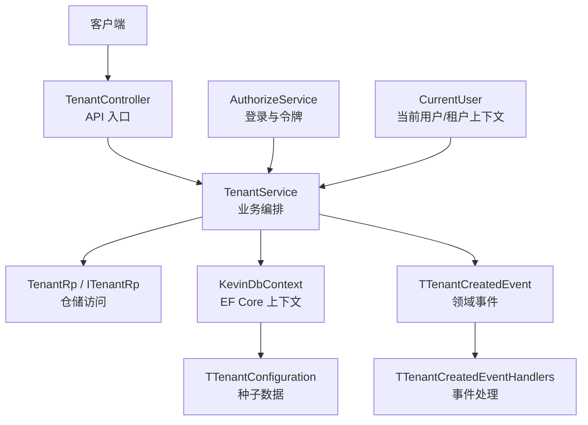
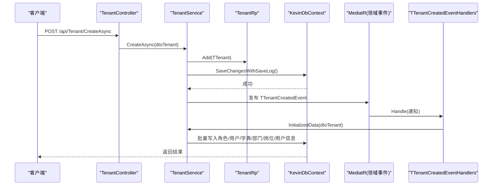
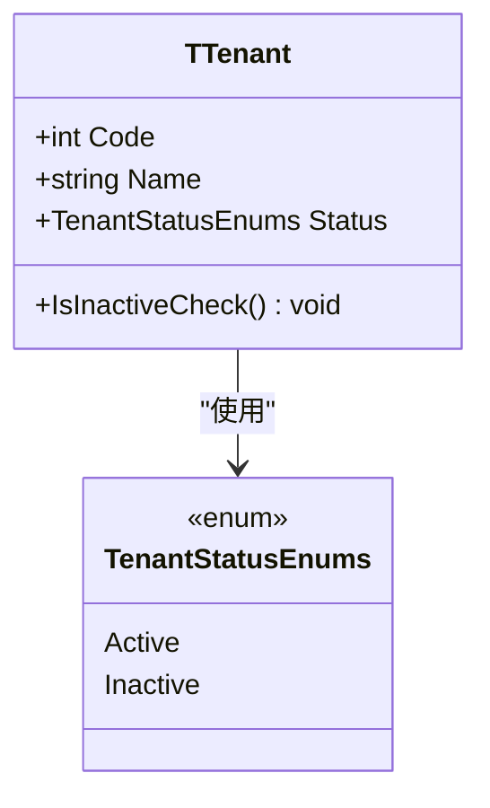
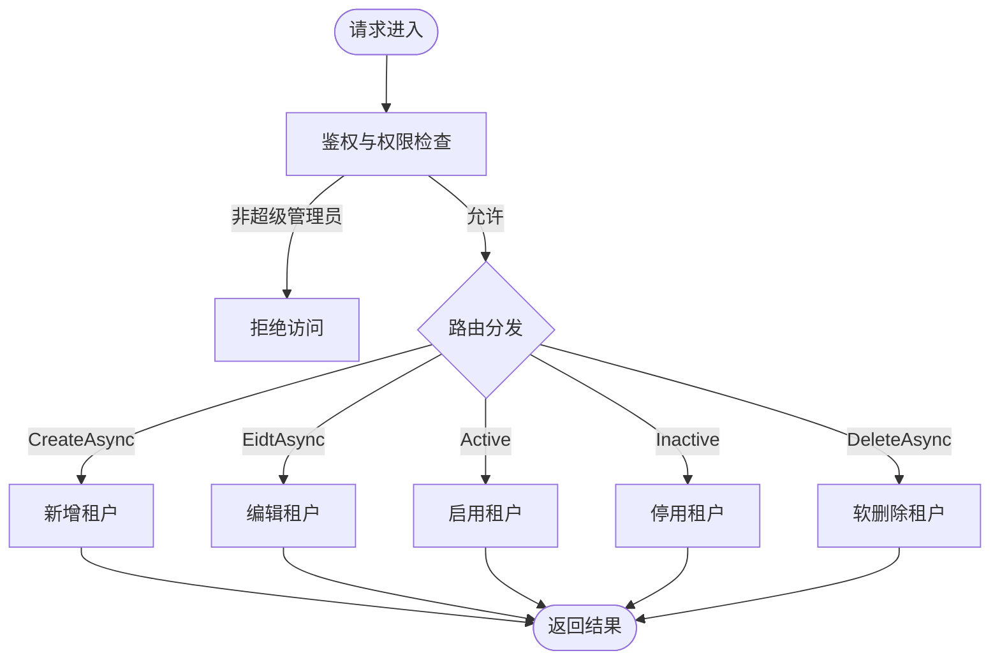
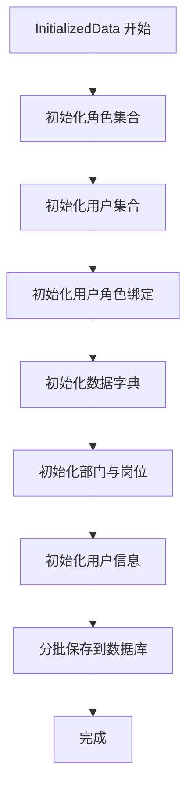
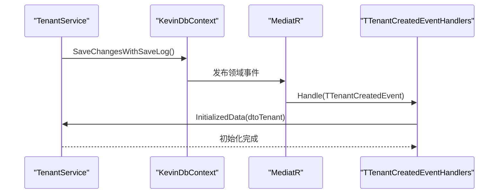
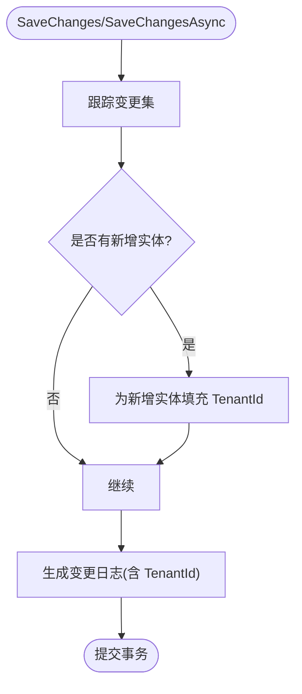
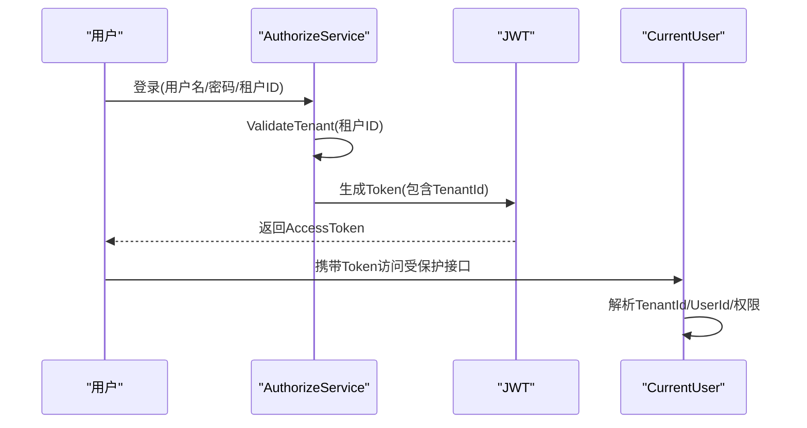
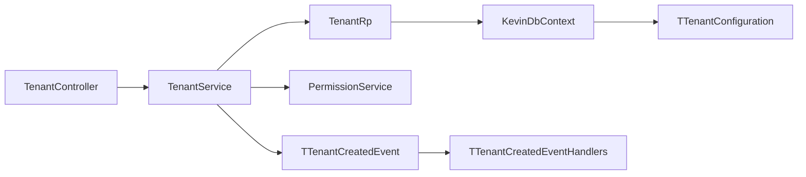

# 租户管理

<cite>
**本文引用的文件**
- [TenantController.cs](file://Kevin/Kevin.Web.Basics/Controllers/TenantController.cs)
- [ITenantService.cs](file://Kevin/Domain/Interfaces/IServices/ITenantService.cs)
- [TenantService.cs](file://Kevin/Application/Services/TenantService.cs)
- [TTenant.cs](file://Kevin/Domain/Entities/TTenant.cs)
- [TTenantBaseData.cs](file://Kevin/Domain/BaseDatas/TTenantBaseData.cs)
- [TTenantConfiguration.cs](file://Kevin/ Kevin.EntityFrameworkCore/Configuration/TTenantConfiguration.cs)
- [TenantRp.cs](file://Kevin/RepositorieRps/Repositories/TenantRp.cs)
- [ITenantRp.cs](file://Kevin/Domain/Interfaces/IRepositories/ITenantRp.cs)
- [dtoTenant.cs](file://Kevin/kevin.Share/Dtos/System/dtoTenant.cs)
- [TenantStatusEnums.cs](file://Kevin/kevin.Share/Enums/TenantStatusEnums.cs)
- [TTenantCreatedEvent.cs](file://Kevin/Domain/Events/TTenantCreatedEvent.cs)
- [TTenantCreatedEventHandlers.cs](file://Kevin/Domain/EventHandlers/TTenantCreatedEventHandlers.cs)
- [KevinDbContext.cs](file://Kevin/ Kevin.EntityFrameworkCore/Database/KevinDbContext.cs)
- [CurrentUser.cs](file://Kevin/Application/Services/CurrentUser.cs)
- [AuthorizeService.cs](file://Kevin/Application/Services/AuthorizeService.cs)
- [TenantHelper.cs](file://Kevin/kevin.Module/Kevin.Common/App/TenantHelper.cs)
</cite>

## 目录
1. [简介](#简介)
2. [项目结构](#项目结构)
3. [核心组件](#核心组件)
4. [架构总览](#架构总览)
5. [详细组件分析](#详细组件分析)
6. [依赖关系分析](#依赖关系分析)
7. [性能考虑](#性能考虑)
8. [故障排查指南](#故障排查指南)
9. [结论](#结论)
10. [附录](#附录)

## 简介
本章节围绕多租户能力，系统梳理租户的创建与配置、数据源连接、域名绑定、资源配额等管理操作；解释多租户数据隔离的实现机制、租户切换的上下文管理、跨租户访问控制策略；并说明订阅管理、计费统计、监控告警等企业级特性的落地思路。同时提供租户初始化脚本和多环境部署的配置示例要点，帮助快速搭建与运维。

## 项目结构
本项目采用分层架构：Web API 层暴露控制器接口，应用服务层实现业务编排，领域层定义实体、事件与基础数据，基础设施层负责数据库配置与持久化。租户相关代码主要分布在以下位置：
- Web API 控制器：TenantController
- 应用服务：TenantService、CurrentUser
- 领域实体与基础数据：TTenant、TTenantBaseData、TenantStatusEnums
- 仓储与接口：TenantRp、ITenantRp
- 数据库配置与种子数据：TTenantConfiguration、KevinDbContext
- 领域事件与处理器：TTenantCreatedEvent、TTenantCreatedEventHandlers
- 认证与租户校验：AuthorizeService、TenantHelper

图表来源
- [TenantController.cs:1-96](file://Kevin/Kevin.Web.Basics/Controllers/TenantController.cs#L1-L96)
- [TenantService.cs:1-282](file://Kevin/Application/Services/TenantService.cs#L1-L282)
- [TenantRp.cs:1-9](file://Kevin/RepositorieRps/Repositories/TenantRp.cs#L1-L9)
- [ITenantRp.cs:1-7](file://Kevin/Domain/Interfaces/IRepositories/ITenantRp.cs#L1-L7)
- [KevinDbContext.cs:1-588](file://Kevin/ Kevin.EntityFrameworkCore/Database/KevinDbContext.cs#L1-L588)
- [TTenantConfiguration.cs:1-17](file://Kevin/ Kevin.EntityFrameworkCore/Configuration/TTenantConfiguration.cs#L1-L17)
- [TTenantCreatedEvent.cs:1-8](file://Kevin/Domain/Events/TTenantCreatedEvent.cs#L1-L8)
- [TTenantCreatedEventHandlers.cs:1-28](file://Kevin/Domain/EventHandlers/TTenantCreatedEventHandlers.cs#L1-L28)
- [AuthorizeService.cs:61-98](file://Kevin/Application/Services/AuthorizeService.cs#L61-L98)
- [CurrentUser.cs:1-71](file://Kevin/Application/Services/CurrentUser.cs#L1-L71)

章节来源
- [TenantController.cs:1-96](file://Kevin/Kevin.Web.Basics/Controllers/TenantController.cs#L1-L96)
- [TenantService.cs:1-282](file://Kevin/Application/Services/TenantService.cs#L1-L282)
- [KevinDbContext.cs:1-588](file://Kevin/ Kevin.EntityFrameworkCore/Database/KevinDbContext.cs#L1-L588)

## 核心组件
- 控制器层：提供租户列表、启用/停用、新增、编辑、删除等 REST 接口。
- 服务层：实现权限校验、业务规则、数据初始化与事件发布。
- 领域层：定义租户实体、状态枚举、基础种子数据与领域事件。
- 仓储层：封装对租户实体的查询与保存。
- 数据层：EF Core 上下文负责连接串、模型映射、种子数据注入、自动填充 TenantId、变更日志记录与领域事件分发。
- 上下文与认证：从 JWT 中解析当前租户 ID 与用户信息，并在登录时校验租户有效性。

章节来源
- [ITenantService.cs:1-53](file://Kevin/Domain/Interfaces/IServices/ITenantService.cs#L1-L53)
- [TenantService.cs:1-282](file://Kevin/Application/Services/TenantService.cs#L1-L282)
- [TTenant.cs:1-56](file://Kevin/Domain/Entities/TTenant.cs#L1-L56)
- [TenantStatusEnums.cs:1-8](file://Kevin/kevin.Share/Enums/TenantStatusEnums.cs#L1-L8)
- [TTenantBaseData.cs:1-13](file://Kevin/Domain/BaseDatas/TTenantBaseData.cs#L1-L13)
- [TenantRp.cs:1-9](file://Kevin/RepositorieRps/Repositories/TenantRp.cs#L1-L9)
- [ITenantRp.cs:1-7](file://Kevin/Domain/Interfaces/IRepositories/ITenantRp.cs#L1-L7)
- [dtoTenant.cs:1-28](file://Kevin/kevin.Share/Dtos/System/dtoTenant.cs#L1-L28)
- [KevinDbContext.cs:1-588](file://Kevin/ Kevin.EntityFrameworkCore/Database/KevinDbContext.cs#L1-L588)
- [CurrentUser.cs:1-71](file://Kevin/Application/Services/CurrentUser.cs#L1-L71)
- [AuthorizeService.cs:61-98](file://Kevin/Application/Services/AuthorizeService.cs#L61-L98)

## 架构总览
下图展示了租户管理的端到端调用链：从 API 请求到服务层、仓储、数据库以及领域事件的完整流程。

图表来源
- [TenantController.cs:59-69](file://Kevin/Kevin.Web.Basics/Controllers/TenantController.cs#L59-L69)
- [TenantService.cs:111-127](file://Kevin/Application/Services/TenantService.cs#L111-L127)
- [KevinDbContext.cs:525-583](file://Kevin/ Kevin.EntityFrameworkCore/Database/KevinDbContext.cs#L525-L583)
- [TTenantCreatedEvent.cs:1-8](file://Kevin/Domain/Events/TTenantCreatedEvent.cs#L1-L8)
- [TTenantCreatedEventHandlers.cs:14-25](file://Kevin/Domain/EventHandlers/TTenantCreatedEventHandlers.cs#L14-L25)

## 详细组件分析

### 租户实体与状态
- 实体字段包含租户编码、名称、状态、时间戳等，并提供可用性校验方法，用于在删除或失效状态下阻止访问。
- 状态枚举支持有效/无效两种状态，便于运营管控。

图表来源
- [TTenant.cs:1-56](file://Kevin/Domain/Entities/TTenant.cs#L1-L56)
- [TenantStatusEnums.cs:1-8](file://Kevin/kevin.Share/Enums/TenantStatusEnums.cs#L1-L8)

章节来源
- [TTenant.cs:1-56](file://Kevin/Domain/Entities/TTenant.cs#L1-L56)
- [TenantStatusEnums.cs:1-8](file://Kevin/kevin.Share/Enums/TenantStatusEnums.cs#L1-L8)

### 控制器与 API 设计
- 提供获取租户分页列表、设置有效/无效、新增、编辑、删除等接口。
- 所有写操作均通过服务层进行权限校验（仅超级管理员可操作）。

图表来源
- [TenantController.cs:26-93](file://Kevin/Kevin.Web.Basics/Controllers/TenantController.cs#L26-L93)
- [TenantService.cs:28-151](file://Kevin/Application/Services/TenantService.cs#L28-L151)

章节来源
- [TenantController.cs:1-96](file://Kevin/Kevin.Web.Basics/Controllers/TenantController.cs#L1-L96)
- [TenantService.cs:28-151](file://Kevin/Application/Services/TenantService.cs#L28-L151)

### 服务层与业务规则
- 列表查询：支持关键字搜索与分页，仅超级管理员可访问。
- 启用/停用：更新租户状态并记录更新时间。
- 新增：校验租户编码唯一性，创建实体并发布领域事件。
- 编辑：校验编码唯一性（排除自身），更新名称与编码。
- 删除：软删除，禁止删除种子数据。
- 初始化数据：为新建租户批量初始化角色、用户、用户角色绑定、数据字典、部门、岗位、用户信息等。

图表来源
- [TenantService.cs:159-279](file://Kevin/Application/Services/TenantService.cs#L159-L279)

章节来源
- [TenantService.cs:111-279](file://Kevin/Application/Services/TenantService.cs#L111-L279)

### 领域事件与自动初始化
- 新增租户后，服务层将领域事件添加到实体并通过 EF 上下文保存时触发。
- 事件处理器接收事件并调用服务层的初始化方法，完成租户初始数据的批量写入。

图表来源
- [TenantService.cs:111-127](file://Kevin/Application/Services/TenantService.cs#L111-L127)
- [KevinDbContext.cs:405-442](file://Kevin/ Kevin.EntityFrameworkCore/Database/KevinDbContext.cs#L405-L442)
- [TTenantCreatedEvent.cs:1-8](file://Kevin/Domain/Events/TTenantCreatedEvent.cs#L1-L8)
- [TTenantCreatedEventHandlers.cs:14-25](file://Kevin/Domain/EventHandlers/TTenantCreatedEventHandlers.cs#L14-L25)

章节来源
- [TTenantCreatedEvent.cs:1-8](file://Kevin/Domain/Events/TTenantCreatedEvent.cs#L1-L8)
- [TTenantCreatedEventHandlers.cs:1-28](file://Kevin/Domain/EventHandlers/TTenantCreatedEventHandlers.cs#L1-L28)
- [TenantService.cs:111-127](file://Kevin/Application/Services/TenantService.cs#L111-L127)

### 多租户数据隔离机制
- 上下文注入：DbContext 构造时从 CurrentUser 注入 TenantId，作为当前会话的租户标识。
- 自动填充：在保存新增实体时，若存在 TenantId 则自动写入该字段，确保数据归属。
- 全局过滤：模型构建阶段预留了按 TenantId 的全局查询过滤器（可按需启用），以实现跨表查询时的自动租户隔离。
- 变更日志：保存修改时会对比差异并记录审计日志，同时附带租户 ID，便于追踪。

图表来源
- [KevinDbContext.cs:405-483](file://Kevin/ Kevin.EntityFrameworkCore/Database/KevinDbContext.cs#L405-L483)
- [KevinDbContext.cs:525-583](file://Kevin/ Kevin.EntityFrameworkCore/Database/KevinDbContext.cs#L525-L583)

章节来源
- [KevinDbContext.cs:1-588](file://Kevin/ Kevin.EntityFrameworkCore/Database/KevinDbContext.cs#L1-L588)

### 租户切换与上下文管理
- 登录流程：授权服务在登录时校验租户有效性，并将租户 ID 写入 JWT。
- 上下文读取：CurrentUser 从 JWT 中解析 UserId、UserName、TenantId、是否超级管理员等信息，供后续服务使用。
- 权限控制：服务层基于 CurrentUser.IsSuperAdmin 限制敏感操作，避免越权。

图表来源
- [AuthorizeService.cs:70-98](file://Kevin/Application/Services/AuthorizeService.cs#L70-L98)
- [CurrentUser.cs:22-28](file://Kevin/Application/Services/CurrentUser.cs#L22-L28)

章节来源
- [AuthorizeService.cs:61-98](file://Kevin/Application/Services/AuthorizeService.cs#L61-L98)
- [CurrentUser.cs:1-71](file://Kevin/Application/Services/CurrentUser.cs#L1-L71)

### 跨租户数据访问控制策略
- 默认隔离：通过 DbContext 自动填充 TenantId 与可选的全局查询过滤器，保证同一连接内所有读写均限定在当前租户。
- 权限边界：非超级管理员无法执行租户级管理操作；超级管理员可管理租户但业务数据仍受当前上下文约束。
- 审计追踪：所有修改均记录审计日志并包含租户 ID，便于问题定位与合规审计。

章节来源
- [TenantService.cs:28-151](file://Kevin/Application/Services/TenantService.cs#L28-L151)
- [KevinDbContext.cs:206-219](file://Kevin/ Kevin.EntityFrameworkCore/Database/KevinDbContext.cs#L206-L219)
- [KevinDbContext.cs:525-583](file://Kevin/ Kevin.EntityFrameworkCore/Database/KevinDbContext.cs#L525-L583)

### 订阅管理与计费统计（扩展建议）
- 订阅模型：可在领域层引入订阅实体（如套餐、有效期、用量上限），在服务层增加订阅生命周期管理（开通、续费、降级、终止）。
- 计费统计：结合 AI 用量、消息条数、存储占用等指标，建立计量采集与聚合任务，输出账单与报表。
- 支付集成：对接第三方支付网关，完成订单与支付回调处理，更新订阅状态。
- 限流与熔断：根据订阅等级实施 API 限流、并发限制与功能开关，保障资源公平使用。

[本节为概念性扩展建议，不直接对应具体源码]

### 监控告警（扩展建议）
- 指标采集：采集租户维度关键指标（登录失败率、错误率、响应时间、资源使用率）。
- 告警规则：设定阈值与规则（如连续失败、超时、磁盘使用率），通过邮件/短信/IM 推送告警。
- 可视化看板：提供租户维度的仪表盘，展示健康度与趋势。

[本节为概念性扩展建议，不直接对应具体源码]

## 依赖关系分析
- 控制器依赖服务接口，服务依赖仓储与权限服务，仓储依赖 EF Core 上下文。
- 领域事件通过 MediatR 解耦初始化逻辑，降低耦合度。
- 种子数据通过 EF Core 配置注入，确保系统启动即具备基础租户。

图表来源
- [TenantController.cs:1-96](file://Kevin/Kevin.Web.Basics/Controllers/TenantController.cs#L1-L96)
- [TenantService.cs:1-282](file://Kevin/Application/Services/TenantService.cs#L1-L282)
- [TenantRp.cs:1-9](file://Kevin/RepositorieRps/Repositories/TenantRp.cs#L1-L9)
- [KevinDbContext.cs:1-588](file://Kevin/ Kevin.EntityFrameworkCore/Database/KevinDbContext.cs#L1-L588)
- [TTenantConfiguration.cs:1-17](file://Kevin/ Kevin.EntityFrameworkCore/Configuration/TTenantConfiguration.cs#L1-L17)
- [TTenantCreatedEvent.cs:1-8](file://Kevin/Domain/Events/TTenantCreatedEvent.cs#L1-L8)
- [TTenantCreatedEventHandlers.cs:1-28](file://Kevin/Domain/EventHandlers/TTenantCreatedEventHandlers.cs#L1-L28)

章节来源
- [TenantController.cs:1-96](file://Kevin/Kevin.Web.Basics/Controllers/TenantController.cs#L1-L96)
- [TenantService.cs:1-282](file://Kevin/Application/Services/TenantService.cs#L1-L282)
- [KevinDbContext.cs:1-588](file://Kevin/ Kevin.EntityFrameworkCore/Database/KevinDbContext.cs#L1-L588)

## 性能考虑
- 批量初始化：租户初始化采用批量添加与分步保存，减少往返次数，提升吞吐。
- 分页查询：列表接口使用 Skip/Take 分页，避免全量加载。
- 索引优化：可通过配置默认索引字段提升常用查询性能。
- 懒加载与投影：按需启用懒加载或使用投影减少数据传输。
- 连接池：合理配置数据库连接池大小，避免高并发下连接耗尽。

[本节为通用性能建议，不直接对应具体源码]

## 故障排查指南
- 权限不足：非超级管理员尝试管理租户会抛出友好异常，确认调用者身份与权限。
- 租户不存在：操作前需校验租户是否存在，避免空引用与异常。
- 编码重复：新增或编辑时需校验租户编码唯一性，防止冲突。
- 种子数据保护：禁止删除种子租户，避免系统不可用。
- 初始化失败：检查数据库连接、权限与表结构，确认批量写入的事务完整性。
- 审计日志缺失：确认 SaveChangesWithSaveLog 被调用且上下文已注入 CurrentUser 与 SnowflakeIdService。

章节来源
- [TenantService.cs:28-151](file://Kevin/Application/Services/TenantService.cs#L28-L151)
- [KevinDbContext.cs:525-583](file://Kevin/ Kevin.EntityFrameworkCore/Database/KevinDbContext.cs#L525-L583)

## 结论
本项目在多租户方面实现了清晰的职责分离与可扩展的架构：通过 JWT 上下文传递租户标识，EF Core 自动填充与可选全局过滤确保数据隔离；领域事件驱动租户初始化，简化了复杂流程；控制器与服务层配合权限校验，保障了安全性与可维护性。在此基础上，可进一步扩展订阅、计费与监控告警等企业级特性，以满足更丰富的业务场景。

## 附录

### 租户初始化脚本要点
- 触发时机：新增租户后通过领域事件自动执行初始化。
- 初始化内容：角色、用户、用户角色绑定、数据字典、部门、岗位、用户信息。
- 事务与幂等：建议在初始化逻辑中加入幂等判断，避免重复初始化导致的数据不一致。

章节来源
- [TenantService.cs:159-279](file://Kevin/Application/Services/TenantService.cs#L159-L279)
- [TTenantCreatedEventHandlers.cs:14-25](file://Kevin/Domain/EventHandlers/TTenantCreatedEventHandlers.cs#L14-L25)

### 多环境部署配置示例
- 数据库连接串：在配置文件中设置 dbConnection，支持 MySQL/SQL Server/SQLite/PostgreSQL。
- 迁移程序集：配置 MigrationsAssembly，确保迁移正确执行。
- 默认索引字段：配置 DBDefaultHasIndexFields，指定需要建索引的字段。
- 种子租户 ID：通过环境变量或配置文件设置 TenantId，用于种子数据注入。

章节来源
- [KevinDbContext.cs:83-133](file://Kevin/ Kevin.EntityFrameworkCore/Database/KevinDbContext.cs#L83-L133)
- [TenantHelper.cs:12-22](file://Kevin/kevin.Module/Kevin.Common/App/TenantHelper.cs#L12-L22)
- [TTenantBaseData.cs:7-10](file://Kevin/Domain/BaseDatas/TTenantBaseData.cs#L7-L10)
- [TTenantConfiguration.cs:10-15](file://Kevin/ Kevin.EntityFrameworkCore/Configuration/TTenantConfiguration.cs#L10-L15)