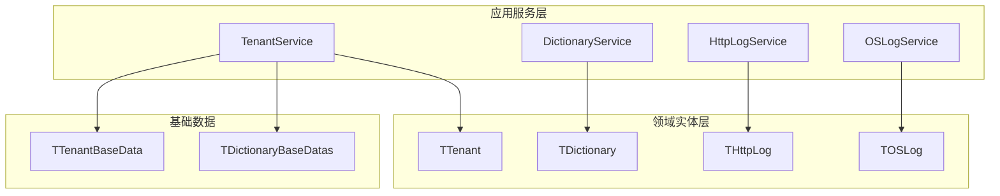
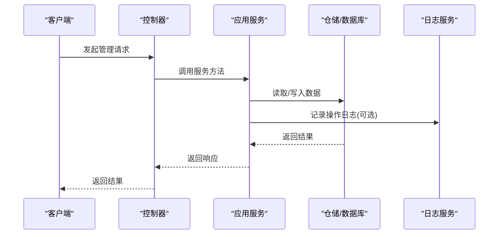
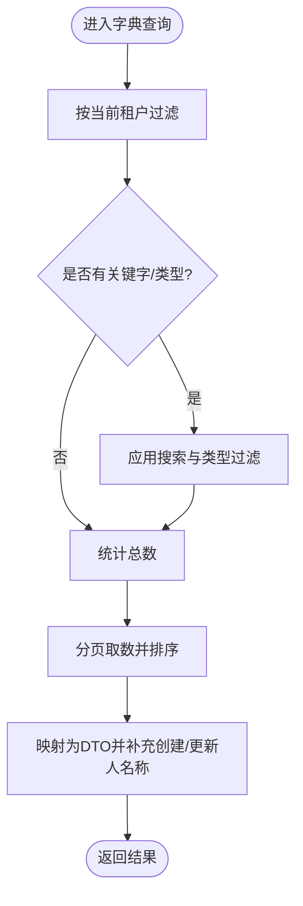
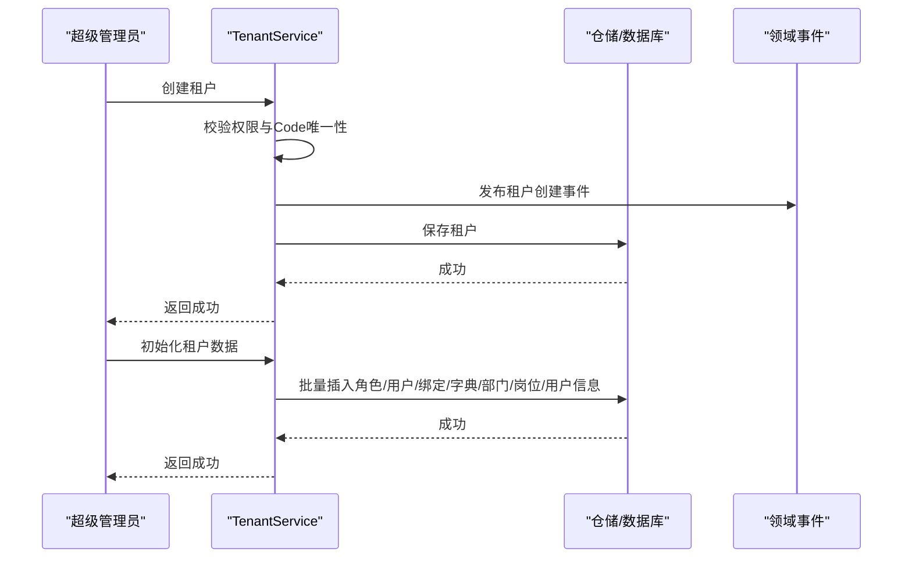
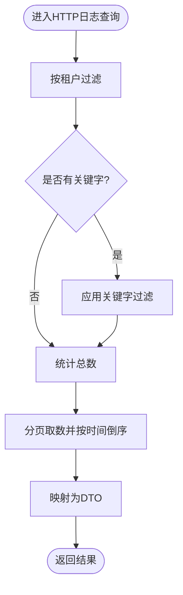
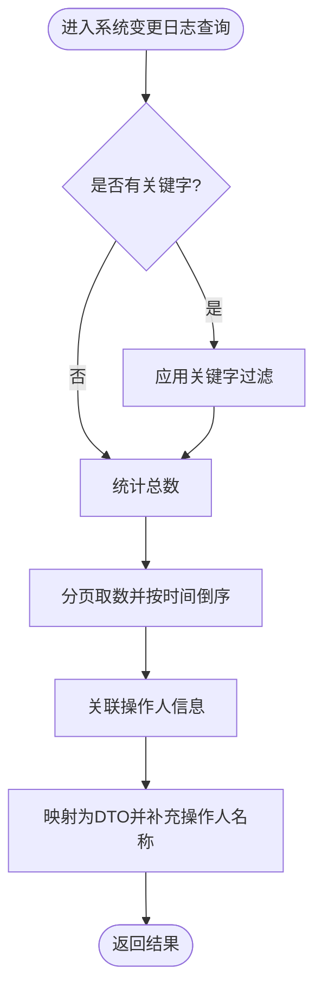
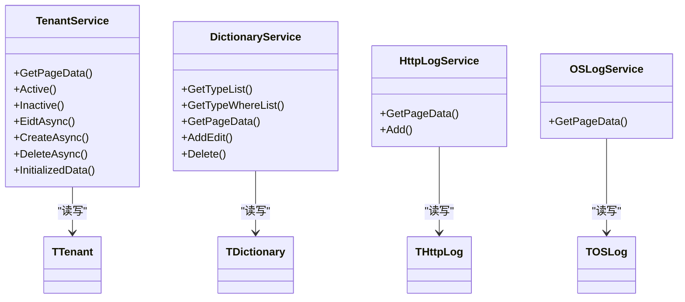

# 系统管理

<cite>
**本文引用的文件**
- [TenantService.cs](file://Kevin/Application/Services/TenantService.cs)
- [DictionaryService.cs](file://Kevin/Application/Services/DictionaryService.cs)
- [HttpLogService.cs](file://Kevin/Application/Services/HttpLogService.cs)
- [OSLogService.cs](file://Kevin/Application/Services/OSLogService.cs)
- [TTenant.cs](file://Kevin/Domain/Entities/TTenant.cs)
- [TDictionary.cs](file://Kevin/Domain/Entities/TDictionary.cs)
- [THttpLog.cs](file://Kevin/Domain/Entities/THttpLog.cs)
- [TOSLog.cs](file://Kevin/Domain/Entities/TOSLog.cs)
- [TTenantBaseData.cs](file://Kevin/Domain/BaseDatas/TTenantBaseData.cs)
- [TDictionaryBaseDatas.cs](file://Kevin/Domain/BaseDatas/TDictionaryBaseDatas.cs)
</cite>

## 目录
1. [简介](#简介)
2. [项目结构](#项目结构)
3. [核心组件](#核心组件)
4. [架构总览](#架构总览)
5. [详细组件分析](#详细组件分析)
6. [依赖关系分析](#依赖关系分析)
7. [性能考虑](#性能考虑)
8. [故障排查指南](#故障排查指南)
9. [结论](#结论)
10. [附录](#附录)

## 简介
本模块提供系统管理的核心能力，包括字典管理、租户管理、日志管理等。重点覆盖：
- 字典数据的分类维护与多租户隔离
- 租户的创建、启用/停用、数据初始化与删除
- HTTP 操作日志与系统变更日志的记录与查询
- 多租户架构的数据隔离与权限控制要点
- 运维视角的系统监控、性能分析与故障排查建议

## 项目结构
系统管理相关代码采用分层组织：
- Domain 层：实体定义（如 TTenant、TDictionary、THttpLog、TOSLog）与种子数据（基础租户、系统字典等）
- Application 层：服务实现（如 TenantService、DictionaryService、HttpLogService、OSLogService），封装业务逻辑与数据访问编排
- Web 层：控制器对外暴露 API（与本模块相关的控制器位于 Kevin.Web.Basics/Controllers）

图表来源
- [TenantService.cs:11-27](file://Kevin/Application/Services/TenantService.cs#L11-L27)
- [DictionaryService.cs:3-9](file://Kevin/Application/Services/DictionaryService.cs#L3-L9)
- [HttpLogService.cs:3-9](file://Kevin/Application/Services/HttpLogService.cs#L3-L9)
- [OSLogService.cs:3-9](file://Kevin/Application/Services/OSLogService.cs#L3-L9)
- [TTenant.cs:9-19](file://Kevin/Domain/Entities/TTenant.cs#L9-L19)
- [TDictionary.cs:7-10](file://Kevin/Domain/Entities/TDictionary.cs#L7-L10)
- [THttpLog.cs:6-8](file://Kevin/Domain/Entities/THttpLog.cs#L6-L8)
- [TOSLog.cs:6-8](file://Kevin/Domain/Entities/TOSLog.cs#L6-L8)
- [TTenantBaseData.cs:5-11](file://Kevin/Domain/BaseDatas/TTenantBaseData.cs#L5-L11)
- [TDictionaryBaseDatas.cs:6-17](file://Kevin/Domain/BaseDatas/TDictionaryBaseDatas.cs#L6-L17)

章节来源
- [TenantService.cs:11-27](file://Kevin/Application/Services/TenantService.cs#L11-L27)
- [DictionaryService.cs:3-9](file://Kevin/Application/Services/DictionaryService.cs#L3-L9)
- [HttpLogService.cs:3-9](file://Kevin/Application/Services/HttpLogService.cs#L3-L9)
- [OSLogService.cs:3-9](file://Kevin/Application/Services/OSLogService.cs#L3-L9)
- [TTenant.cs:9-19](file://Kevin/Domain/Entities/TTenant.cs#L9-L19)
- [TDictionary.cs:7-10](file://Kevin/Domain/Entities/TDictionary.cs#L7-L10)
- [THttpLog.cs:6-8](file://Kevin/Domain/Entities/THttpLog.cs#L6-L8)
- [TOSLog.cs:6-8](file://Kevin/Domain/Entities/TOSLog.cs#L6-L8)
- [TTenantBaseData.cs:5-11](file://Kevin/Domain/BaseDatas/TTenantBaseData.cs#L5-L11)
- [TDictionaryBaseDatas.cs:6-17](file://Kevin/Domain/BaseDatas/TDictionaryBaseDatas.cs#L6-L17)

## 核心组件
- 字典管理：提供类型列表、按类型获取字典项、分页查询、新增/编辑、删除；支持按租户隔离与排序展示。
- 租户管理：提供分页查询、启用/停用、编辑、创建、删除、以及新租户数据初始化（角色、用户、角色绑定、字典、部门、岗位、用户信息）。
- HTTP 操作日志：记录请求上下文与操作备注，支持分页查询与关键字检索。
- 系统变更日志：记录表级变更标记与内容，支持分页查询与关键字检索，并关联操作人。

章节来源
- [DictionaryService.cs:15-137](file://Kevin/Application/Services/DictionaryService.cs#L15-L137)
- [TenantService.cs:28-279](file://Kevin/Application/Services/TenantService.cs#L28-L279)
- [HttpLogService.cs:17-34](file://Kevin/Application/Services/HttpLogService.cs#L17-L34)
- [OSLogService.cs:15-35](file://Kevin/Application/Services/OSLogService.cs#L15-L35)

## 架构总览
系统管理以“控制器 -> 应用服务 -> 仓储/数据库”的分层模式组织。服务层负责校验、权限检查、事务与审计日志写入；领域实体承载数据模型与基本约束；基础数据用于系统初始化和种子数据注入。

图表来源
- [TenantService.cs:28-151](file://Kevin/Application/Services/TenantService.cs#L28-L151)
- [DictionaryService.cs:34-137](file://Kevin/Application/Services/DictionaryService.cs#L34-L137)
- [HttpLogService.cs:17-34](file://Kevin/Application/Services/HttpLogService.cs#L17-L34)
- [OSLogService.cs:15-35](file://Kevin/Application/Services/OSLogService.cs#L15-L35)

## 详细组件分析

### 字典管理
- 功能要点
  - 获取字典类型列表与指定类型的字典项
  - 分页查询字典数据，支持关键字搜索与类型过滤
  - 新增或编辑字典项，自动填充创建/更新时间与当前租户
  - 删除时校验是否系统内置字典，防止误删
- 数据隔离
  - 查询默认按当前租户过滤，确保多租户数据隔离
- 复杂度与性能
  - 分页查询使用 Skip/Take，避免全量加载
  - 排序按 Sort 字段降序，便于前端稳定展示

图表来源
- [DictionaryService.cs:34-59](file://Kevin/Application/Services/DictionaryService.cs#L34-L59)
- [DictionaryService.cs:68-113](file://Kevin/Application/Services/DictionaryService.cs#L68-L113)
- [DictionaryService.cs:121-137](file://Kevin/Application/Services/DictionaryService.cs#L121-L137)
- [TDictionary.cs:49-55](file://Kevin/Domain/Entities/TDictionary.cs#L49-L55)

章节来源
- [DictionaryService.cs:15-137](file://Kevin/Application/Services/DictionaryService.cs#L15-L137)
- [TDictionary.cs:7-55](file://Kevin/Domain/Entities/TDictionary.cs#L7-L55)

### 租户管理
- 功能要点
  - 分页查询租户列表，支持关键字搜索
  - 启用/停用租户，状态变更并记录时间
  - 编辑租户基本信息，校验 Code 唯一性
  - 创建租户，触发领域事件并持久化
  - 删除租户（软删除），禁止删除种子数据
  - 初始化新租户数据：角色、用户、用户-角色绑定、字典、部门、岗位、用户信息
- 权限控制
  - 仅超级管理员可执行租户管理操作
- 数据隔离
  - 所有写操作均设置租户标识，保证数据归属

图表来源
- [TenantService.cs:111-127](file://Kevin/Application/Services/TenantService.cs#L111-L127)
- [TenantService.cs:159-279](file://Kevin/Application/Services/TenantService.cs#L159-L279)
- [TTenantBaseData.cs:5-11](file://Kevin/Domain/BaseDatas/TTenantBaseData.cs#L5-L11)

章节来源
- [TenantService.cs:28-279](file://Kevin/Application/Services/TenantService.cs#L28-L279)
- [TTenant.cs:9-53](file://Kevin/Domain/Entities/TTenant.cs#L9-L53)
- [TTenantBaseData.cs:5-11](file://Kevin/Domain/BaseDatas/TTenantBaseData.cs#L5-L11)

### HTTP 操作日志
- 功能要点
  - 分页查询 HTTP 操作日志，支持关键字搜索（操作备注、操作类型、用户名）
  - 新增日志条目，记录操作类型与备注
- 数据隔离
  - 查询默认按当前租户过滤，保障多租户隔离

图表来源
- [HttpLogService.cs:17-34](file://Kevin/Application/Services/HttpLogService.cs#L17-L34)
- [THttpLog.cs:6-75](file://Kevin/Domain/Entities/THttpLog.cs#L6-L75)

章节来源
- [HttpLogService.cs:17-34](file://Kevin/Application/Services/HttpLogService.cs#L17-L34)
- [THttpLog.cs:6-75](file://Kevin/Domain/Entities/THttpLog.cs#L6-L75)

### 系统变更日志
- 功能要点
  - 分页查询系统变更日志，支持关键字搜索（内容、标记、表名、表ID）
  - 关联操作人信息，便于追溯
- 数据隔离
  - 查询不强制按租户过滤（根据实现），适用于全局审计场景

图表来源
- [OSLogService.cs:15-35](file://Kevin/Application/Services/OSLogService.cs#L15-L35)
- [TOSLog.cs:6-75](file://Kevin/Domain/Entities/TOSLog.cs#L6-L75)

章节来源
- [OSLogService.cs:15-35](file://Kevin/Application/Services/OSLogService.cs#L15-L35)
- [TOSLog.cs:6-75](file://Kevin/Domain/Entities/TOSLog.cs#L6-L75)

### 多租户架构与数据权限控制要点
- 数据隔离
  - 字典与 HTTP 日志查询默认按当前租户过滤，确保数据隔离
- 权限控制
  - 租户管理操作限制为超级管理员，防止越权
- 租户切换机制
  - 通过当前上下文中的租户标识进行数据过滤与写入，具体切换策略由上层认证与上下文装配决定
- 数据权限控制
  - 结合仓储层的 isDataPer 参数与当前租户上下文，实现细粒度数据权限控制

章节来源
- [DictionaryService.cs:34-48](file://Kevin/Application/Services/DictionaryService.cs#L34-L48)
- [HttpLogService.cs:17-26](file://Kevin/Application/Services/HttpLogService.cs#L17-L26)
- [TenantService.cs:28-151](file://Kevin/Application/Services/TenantService.cs#L28-L151)

## 依赖关系分析
- 服务对实体的依赖
  - TenantService 依赖 TTenant 及基础租户数据
  - DictionaryService 依赖 TDictionary
  - HttpLogService 依赖 THttpLog
  - OSLogService 依赖 TOSLog
- 服务间的耦合
  - 各服务相对独立，职责清晰，通过仓储接口与数据库交互
- 外部依赖
  - 仓储与数据库访问通过统一仓储抽象，降低耦合度
  - 日志与审计通过仓储的 SaveChangesWithSaveLog 等方法完成

图表来源
- [TenantService.cs:11-279](file://Kevin/Application/Services/TenantService.cs#L11-L279)
- [DictionaryService.cs:3-137](file://Kevin/Application/Services/DictionaryService.cs#L3-L137)
- [HttpLogService.cs:3-34](file://Kevin/Application/Services/HttpLogService.cs#L3-L34)
- [OSLogService.cs:3-35](file://Kevin/Application/Services/OSLogService.cs#L3-L35)
- [TTenant.cs:9-53](file://Kevin/Domain/Entities/TTenant.cs#L9-L53)
- [TDictionary.cs:7-55](file://Kevin/Domain/Entities/TDictionary.cs#L7-L55)
- [THttpLog.cs:6-75](file://Kevin/Domain/Entities/THttpLog.cs#L6-L75)
- [TOSLog.cs:6-75](file://Kevin/Domain/Entities/TOSLog.cs#L6-L75)

章节来源
- [TenantService.cs:11-279](file://Kevin/Application/Services/TenantService.cs#L11-L279)
- [DictionaryService.cs:3-137](file://Kevin/Application/Services/DictionaryService.cs#L3-L137)
- [HttpLogService.cs:3-34](file://Kevin/Application/Services/HttpLogService.cs#L3-L34)
- [OSLogService.cs:3-35](file://Kevin/Application/Services/OSLogService.cs#L3-L35)

## 性能考虑
- 分页与索引
  - 分页查询使用 Skip/Take，建议在常用过滤字段（如 Type、Key、Value、OperateType、Content、Table）建立索引以提升查询性能
- 连接与包含
  - 字典与日志查询中包含用户信息，注意 N+1 问题；当前实现通过 Include 一次性加载，需评估数据量与网络开销
- 并发与锁
  - 租户初始化涉及多表批量写入，建议在高并发场景下考虑分布式锁或队列化任务，避免重复初始化
- 缓存
  - 字典数据适合缓存（按租户维度），减少频繁数据库访问
- 日志归档
  - HTTP 与系统变更日志增长较快，建议定期归档与清理策略

[本节为通用性能建议，不直接分析具体文件]

## 故障排查指南
- 常见错误与处理
  - 非超级管理员操作租户：抛出友好异常，需检查当前用户角色
  - 租户不存在：在启用/停用、编辑、删除时校验租户存在性
  - 租户 Code 已存在：创建或编辑时进行唯一性校验
  - 系统内置字典删除：删除前校验 IsSystem，防止误删
  - 租户已删除/已失效：实体层提供校验方法，调用前检查状态
- 日志定位
  - 通过 HTTP 操作日志与系统变更日志追踪关键操作的上下文与变更内容
  - 关键字搜索可按操作备注、操作类型、用户名、内容、标记、表名、表ID等快速定位

章节来源
- [TenantService.cs:28-151](file://Kevin/Application/Services/TenantService.cs#L28-L151)
- [DictionaryService.cs:68-137](file://Kevin/Application/Services/DictionaryService.cs#L68-L137)
- [TTenant.cs:43-53](file://Kevin/Domain/Entities/TTenant.cs#L43-L53)
- [TDictionary.cs:49-55](file://Kevin/Domain/Entities/TDictionary.cs#L49-L55)
- [HttpLogService.cs:17-34](file://Kevin/Application/Services/HttpLogService.cs#L17-L34)
- [OSLogService.cs:15-35](file://Kevin/Application/Services/OSLogService.cs#L15-L35)

## 结论
本系统管理模块围绕字典、租户与日志三大核心能力，提供了完善的多租户数据隔离、权限控制与审计追踪。通过清晰的分层设计与合理的分页、过滤与包含策略，保证了功能的可用性与可扩展性。在生产环境中，建议结合缓存、索引、日志归档与并发控制等手段进一步提升性能与稳定性。

[本节为总结性内容，不直接分析具体文件]

## 附录
- 字典数据分类维护
  - 通过 Type 字段进行分类，支持按类型获取与筛选
  - 排序字段 Sort 用于控制展示顺序
- 租户数据隔离
  - 所有写操作设置租户标识，查询默认按租户过滤
- 系统参数动态配置
  - 可通过字典表存储系统参数键值对，配合缓存提升读取性能
- 操作日志记录查询
  - HTTP 操作日志记录请求上下文与操作备注
  - 系统变更日志记录表级变更内容与操作人

[本节为概念性说明，不直接分析具体文件]