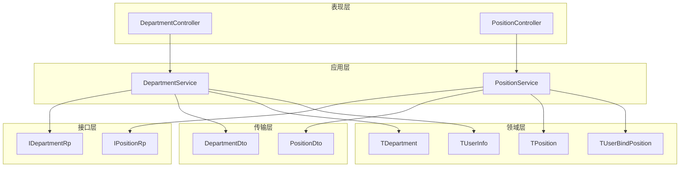
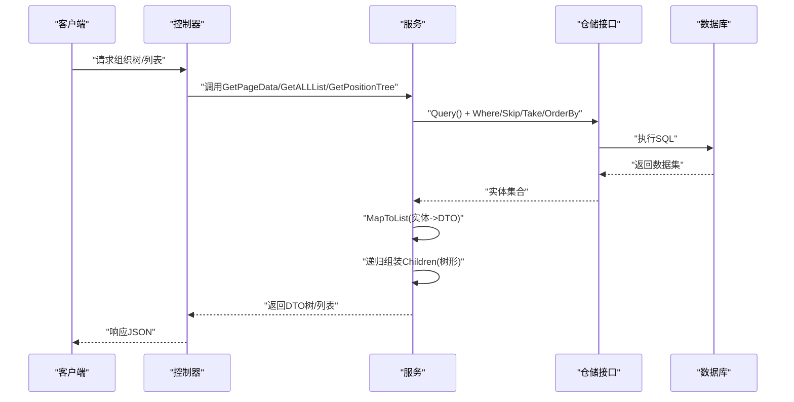
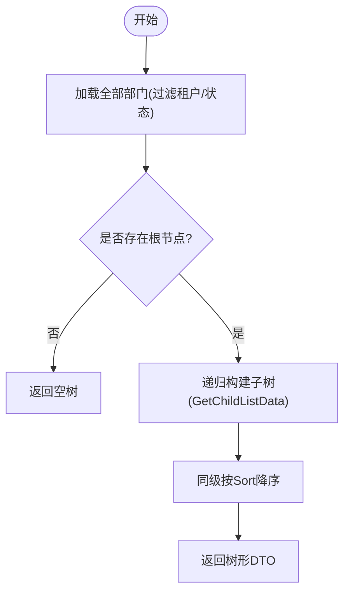
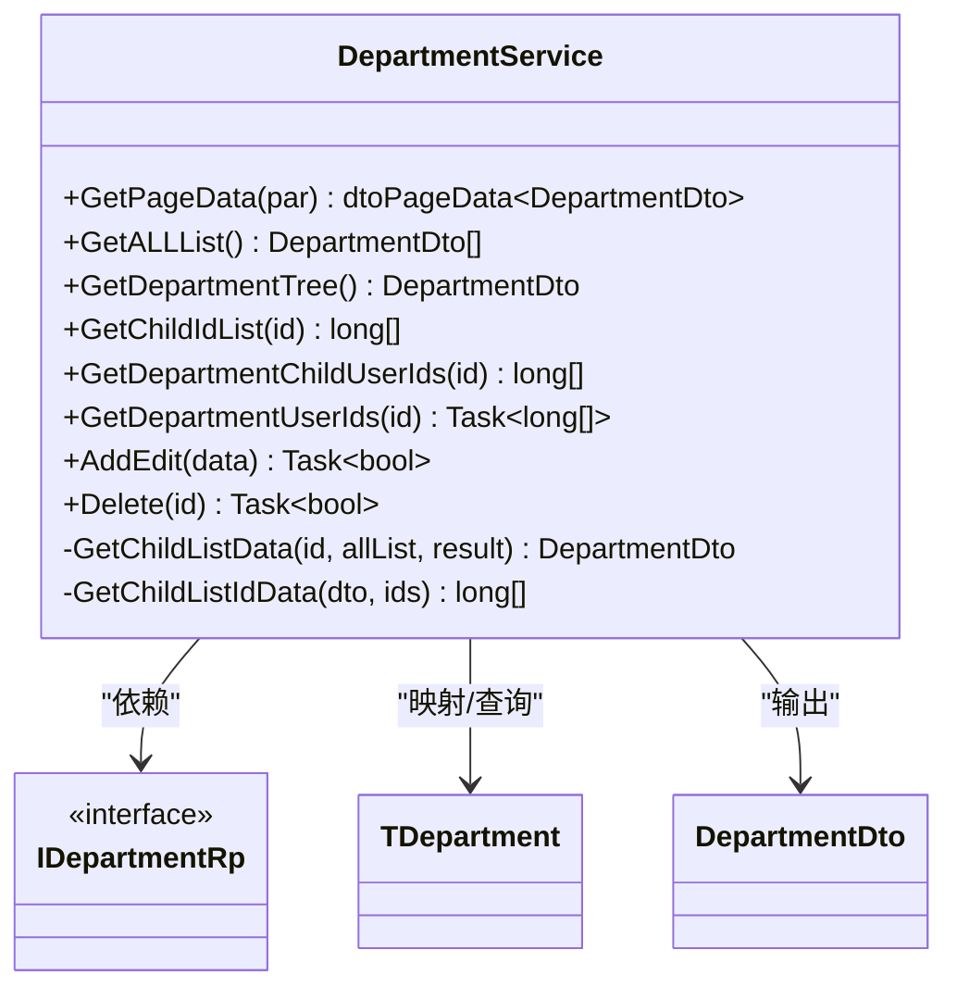
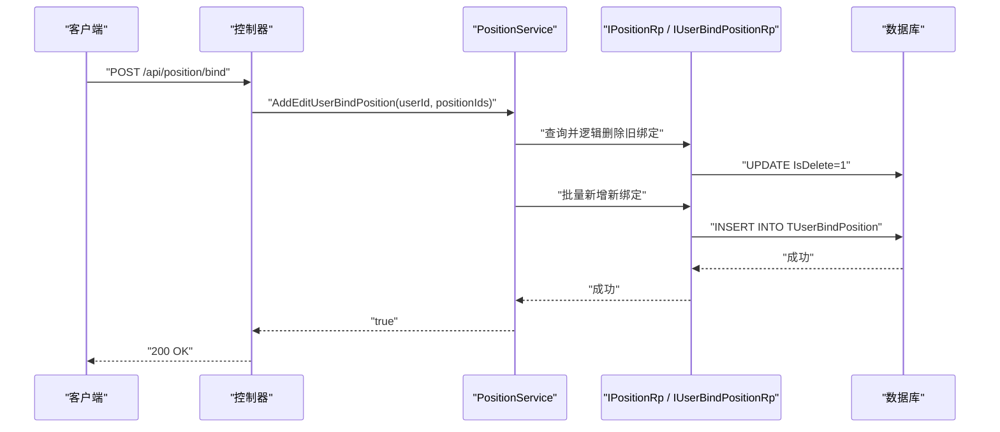
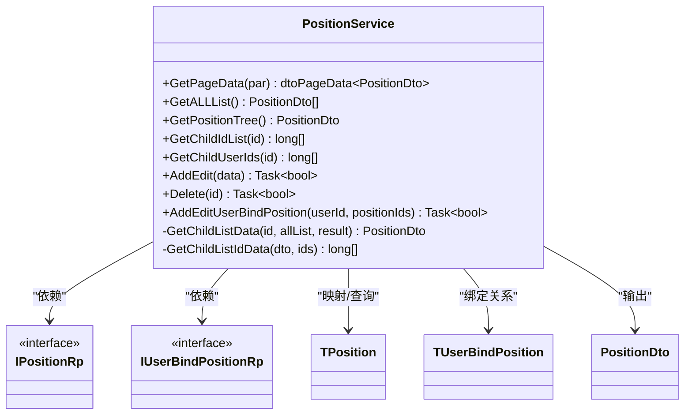
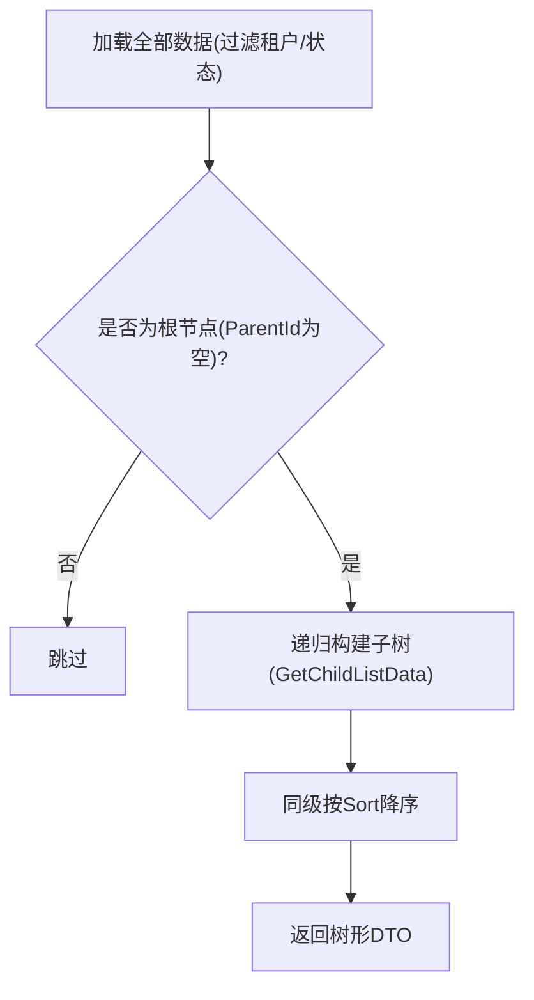
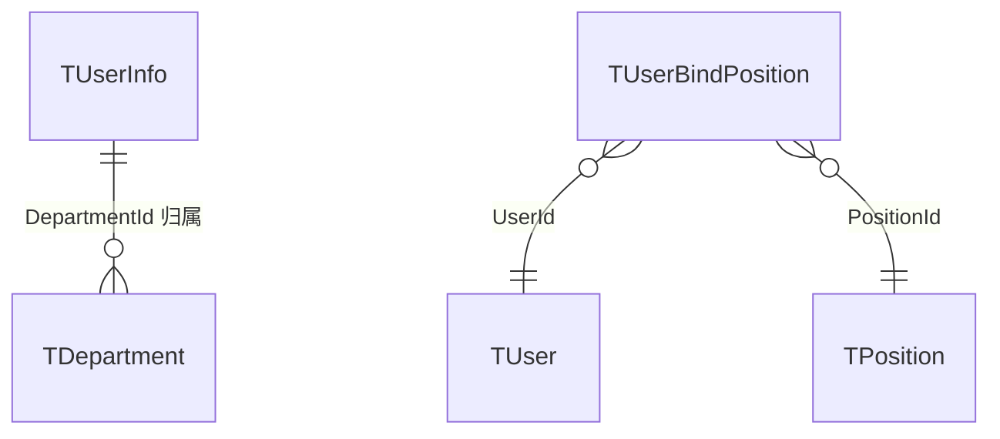
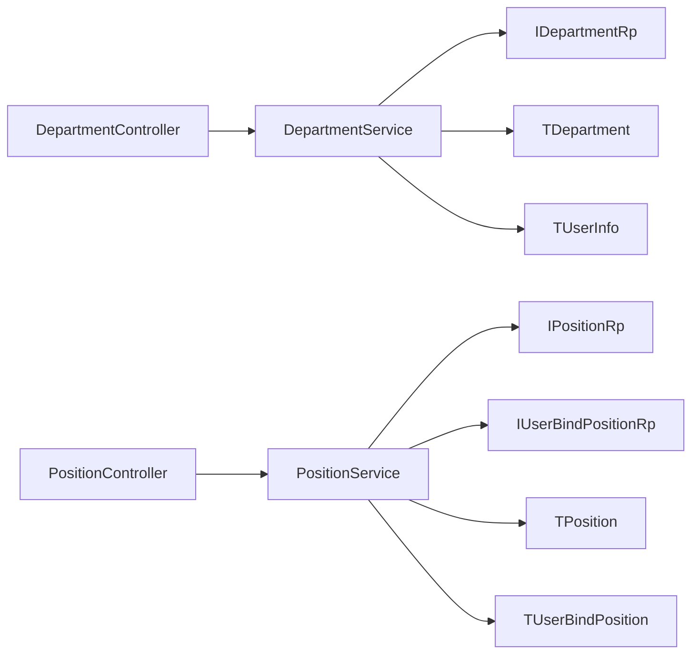

# 组织架构管理

<cite>
**本文引用的文件**
- [TDepartment.cs](file://Kevin/Domain/Entities/Organizational/TDepartment.cs)
- [TPosition.cs](file://Kevin/Domain/Entities/Organizational/TPosition.cs)
- [TUserBindPosition.cs](file://Kevin/Domain/Entities/TUserBindPosition.cs)
- [TUserInfo.cs](file://Kevin/Domain/Entities/TUserInfo.cs)
- [DepartmentService.cs](file://Kevin/Application/Services/Organizational/DepartmentService.cs)
- [PositionService.cs](file://Kevin/Application/Services/Organizational/PositionService.cs)
- [IDepartmentRp.cs](file://Kevin/Domain/Interfaces/IRepositories/Organizational/IDepartmentRp.cs)
- [IPositionRp.cs](file://Kevin/Domain/Interfaces/IRepositories/Organizational/IPositionRp.cs)
- [DepartmentDto.cs](file://Kevin/kevin.Share/Dtos/Organizational/DepartmentDto.cs)
- [PositionDto.cs](file://Kevin/kevin.Share/Dtos/Organizational/PositionDto.cs)
- [DepartmentController.cs](file://Kevin/ Kevin.Web.Basics/Controllers/Organizational/DepartmentController.cs)
- [PositionController.cs](file://Kevin/ Kevin.Web.Basics/Controllers/Organizational/PositionController.cs)
</cite>

## 目录
1. [简介](#简介)
2. [项目结构](#项目结构)
3. [核心组件](#核心组件)
4. [架构总览](#架构总览)
5. [详细组件分析](#详细组件分析)
6. [依赖关系分析](#依赖关系分析)
7. [性能考量](#性能考量)
8. [故障排查指南](#故障排查指南)
9. [结论](#结论)
10. [附录：API与使用示例](#附录api与使用示例)

## 简介
本模块提供企业级“组织架构”管理能力，涵盖部门与岗位两大核心实体、组织树形结构的构建与查询、人员与部门/岗位的关联关系维护，以及删除保护、状态控制等基础能力。通过服务层封装通用CRUD、树形聚合、子集ID收集、用户集合计算等逻辑，对外暴露统一的接口能力，便于上层应用（Web API、前端页面）进行组织管理操作。

## 项目结构
围绕“组织架构”的领域模型、服务、DTO、仓储接口及控制器分布在以下层次：
- 领域实体：部门、岗位、用户-岗位绑定、用户信息
- 应用服务：部门服务、岗位服务
- DTO：部门DTO、岗位DTO
- 仓储接口：部门仓储接口、岗位仓储接口
- Web控制器：部门控制器、岗位控制器

图表来源
- [TDepartment.cs:1-58](file://Kevin/Domain/Entities/Organizational/TDepartment.cs#L1-L58)
- [TPosition.cs:1-51](file://Kevin/Domain/Entities/Organizational/TPosition.cs#L1-L51)
- [TUserBindPosition.cs:1-26](file://Kevin/Domain/Entities/TUserBindPosition.cs#L1-L26)
- [TUserInfo.cs:1-77](file://Kevin/Domain/Entities/TUserInfo.cs#L1-L77)
- [DepartmentService.cs:1-207](file://Kevin/Application/Services/Organizational/DepartmentService.cs#L1-L207)
- [PositionService.cs:1-219](file://Kevin/Application/Services/Organizational/PositionService.cs#L1-L219)
- [IDepartmentRp.cs:1-10](file://Kevin/Domain/Interfaces/IRepositories/Organizational/IDepartmentRp.cs#L1-L10)
- [IPositionRp.cs:1-10](file://Kevin/Domain/Interfaces/IRepositories/Organizational/IPositionRp.cs#L1-L10)
- [DepartmentDto.cs:1-55](file://Kevin/kevin.Share/Dtos/Organizational/DepartmentDto.cs#L1-L55)
- [PositionDto.cs:1-42](file://Kevin/kevin.Share/Dtos/Organizational/PositionDto.cs#L1-L42)
- [DepartmentController.cs](file://Kevin/ Kevin.Web.Basics/Controllers/Organizational/DepartmentController.cs)
- [PositionController.cs](file://Kevin/ Kevin.Web.Basics/Controllers/Organizational/PositionController.cs)

章节来源
- [TDepartment.cs:1-58](file://Kevin/Domain/Entities/Organizational/TDepartment.cs#L1-L58)
- [TPosition.cs:1-51](file://Kevin/Domain/Entities/Organizational/TPosition.cs#L1-L51)
- [DepartmentService.cs:1-207](file://Kevin/Application/Services/Organizational/DepartmentService.cs#L1-L207)
- [PositionService.cs:1-219](file://Kevin/Application/Services/Organizational/PositionService.cs#L1-L219)

## 核心组件
- 部门实体（TDepartment）：支持层级ParentId自引用、负责人ManagerUserId、排序Sort、状态Status等字段，体现部门层级与基本属性。
- 岗位实体（TPosition）：支持层级ParentId自引用、排序Sort、状态Status等字段，体现岗位层级与基本属性。
- 用户-岗位绑定（TUserBindPosition）：多对多关系的中间表，记录用户与岗位的绑定。
- 用户信息（TUserInfo）：包含DepartmentId，用于将用户归属到具体部门。
- 部门服务（DepartmentService）：提供分页、全量列表、树形结构、子集ID、子部门用户ID、新增/编辑、删除等能力。
- 岗位服务（PositionService）：提供分页、全量列表、树形结构、子集ID、子岗位用户ID、新增/编辑、删除、用户岗位批量绑定等能力。
- DTO（DepartmentDto/PositionDto）：面向传输的树形结构数据载体，包含Children集合以表达层级。
- 仓储接口（IDepartmentRp/IPositionRp）：基于泛型IRepository<T, long>扩展，提供统一的数据访问契约。

章节来源
- [TDepartment.cs:1-58](file://Kevin/Domain/Entities/Organizational/TDepartment.cs#L1-L58)
- [TPosition.cs:1-51](file://Kevin/Domain/Entities/Organizational/TPosition.cs#L1-L51)
- [TUserBindPosition.cs:1-26](file://Kevin/Domain/Entities/TUserBindPosition.cs#L1-L26)
- [TUserInfo.cs:1-77](file://Kevin/Domain/Entities/TUserInfo.cs#L1-L77)
- [DepartmentService.cs:1-207](file://Kevin/Application/Services/Organizational/DepartmentService.cs#L1-L207)
- [PositionService.cs:1-219](file://Kevin/Application/Services/Organizational/PositionService.cs#L1-L219)
- [DepartmentDto.cs:1-55](file://Kevin/kevin.Share/Dtos/Organizational/DepartmentDto.cs#L1-L55)
- [PositionDto.cs:1-42](file://Kevin/kevin.Share/Dtos/Organizational/PositionDto.cs#L1-L42)
- [IDepartmentRp.cs:1-10](file://Kevin/Domain/Interfaces/IRepositories/Organizational/IDepartmentRp.cs#L1-L10)
- [IPositionRp.cs:1-10](file://Kevin/Domain/Interfaces/IRepositories/Organizational/IPositionRp.cs#L1-L10)

## 架构总览
系统采用分层架构：表现层（控制器）调用应用层（服务），服务通过仓储接口访问领域实体，并使用DTO进行数据传输。组织树在内存中递归组装，避免N+1查询问题。

图表来源
- [DepartmentService.cs:20-63](file://Kevin/Application/Services/Organizational/DepartmentService.cs#L20-L63)
- [PositionService.cs:20-57](file://Kevin/Application/Services/Organizational/PositionService.cs#L20-L57)
- [IDepartmentRp.cs:1-10](file://Kevin/Domain/Interfaces/IRepositories/Organizational/IDepartmentRp.cs#L1-L10)
- [IPositionRp.cs:1-10](file://Kevin/Domain/Interfaces/IRepositories/Organizational/IPositionRp.cs#L1-L10)

## 详细组件分析

### 部门管理（Department）
- 实体设计
  - 自引用ParentId实现层级；ManagerUserId指向部门负责人；Sort用于同级排序；Status表示启用/禁用。
- 树形结构
  - 获取根节点（ParentId为空），递归查找子节点并填充Children，按Sort降序排列。
- 子集ID与用户集合
  - GetChildIdList：递归收集某部门及其所有下级部门的ID集合。
  - GetDepartmentChildUserIds：基于子部门ID集合，查询这些部门下的用户ID集合。
  - GetDepartmentUserIds：查询指定部门下的用户ID集合。
- CRUD
  - AddEdit：新增或更新部门信息；新增时生成雪花ID，设置租户、创建人等；更新时仅修改业务字段。
  - Delete：软删除前校验是否仍有用户在部门下，若有则阻止删除并提示。

图表来源
- [DepartmentService.cs:53-121](file://Kevin/Application/Services/Organizational/DepartmentService.cs#L53-L121)

图表来源
- [DepartmentService.cs:1-207](file://Kevin/Application/Services/Organizational/DepartmentService.cs#L1-L207)
- [IDepartmentRp.cs:1-10](file://Kevin/Domain/Interfaces/IRepositories/Organizational/IDepartmentRp.cs#L1-L10)
- [TDepartment.cs:1-58](file://Kevin/Domain/Entities/Organizational/TDepartment.cs#L1-L58)
- [DepartmentDto.cs:1-55](file://Kevin/kevin.Share/Dtos/Organizational/DepartmentDto.cs#L1-L55)

章节来源
- [DepartmentService.cs:20-207](file://Kevin/Application/Services/Organizational/DepartmentService.cs#L20-L207)
- [TDepartment.cs:1-58](file://Kevin/Domain/Entities/Organizational/TDepartment.cs#L1-L58)
- [DepartmentDto.cs:1-55](file://Kevin/kevin.Share/Dtos/Organizational/DepartmentDto.cs#L1-L55)

### 岗位管理（Position）
- 实体设计
  - 自引用ParentId实现层级；Sort用于同级排序；Status表示启用/禁用。
- 树形结构
  - 获取根节点（ParentId为空），递归查找子节点并填充Children，按Sort降序排列。
- 子集ID与用户集合
  - GetChildIdList：递归收集某岗位及其所有下级岗位的ID集合。
  - GetChildUserIds：基于子岗位ID集合，查询这些岗位下的用户ID集合（通过TUserBindPosition）。
- CRUD与用户绑定
  - AddEdit：新增或更新岗位信息；新增时生成雪花ID，设置租户、创建人等；更新时仅修改业务字段。
  - Delete：软删除前校验是否仍有用户绑定该岗位，若有则阻止删除并提示。
  - AddEditUserBindPosition：先逻辑删除用户原有岗位绑定，再批量新增新的岗位绑定。

图表来源
- [PositionService.cs:190-216](file://Kevin/Application/Services/Organizational/PositionService.cs#L190-L216)
- [TUserBindPosition.cs:1-26](file://Kevin/Domain/Entities/TUserBindPosition.cs#L1-L26)

图表来源
- [PositionService.cs:1-219](file://Kevin/Application/Services/Organizational/PositionService.cs#L1-L219)
- [IPositionRp.cs:1-10](file://Kevin/Domain/Interfaces/IRepositories/Organizational/IPositionRp.cs#L1-L10)
- [TPosition.cs:1-51](file://Kevin/Domain/Entities/Organizational/TPosition.cs#L1-L51)
- [TUserBindPosition.cs:1-26](file://Kevin/Domain/Entities/TUserBindPosition.cs#L1-L26)
- [PositionDto.cs:1-42](file://Kevin/kevin.Share/Dtos/Organizational/PositionDto.cs#L1-L42)

章节来源
- [PositionService.cs:20-219](file://Kevin/Application/Services/Organizational/PositionService.cs#L20-L219)
- [TPosition.cs:1-51](file://Kevin/Domain/Entities/Organizational/TPosition.cs#L1-L51)
- [PositionDto.cs:1-42](file://Kevin/kevin.Share/Dtos/Organizational/PositionDto.cs#L1-L42)

### 组织树形结构与递归查询
- 树构建策略
  - 一次性加载全部有效数据（过滤租户、状态），在内存中根据ParentId建立父子关系，递归填充Children，并按Sort降序保证展示顺序。
- 复杂度分析
  - 时间复杂度O(N)，空间复杂度O(N)，其中N为部门/岗位总数。避免了多次往返数据库造成的N+1问题。
- 典型方法
  - 部门：GetDepartmentTree、GetChildListData、GetChildListIdData
  - 岗位：GetPositionTree、GetChildListData、GetChildListIdData

图表来源
- [DepartmentService.cs:53-121](file://Kevin/Application/Services/Organizational/DepartmentService.cs#L53-L121)
- [PositionService.cs:47-118](file://Kevin/Application/Services/Organizational/PositionService.cs#L47-L118)

章节来源
- [DepartmentService.cs:53-121](file://Kevin/Application/Services/Organizational/DepartmentService.cs#L53-L121)
- [PositionService.cs:47-118](file://Kevin/Application/Services/Organizational/PositionService.cs#L47-L118)

### 人员与部门和岗位的关联关系
- 用户与部门
  - 通过TUserInfo.DepartmentId将用户归属到某个部门。
  - 服务层提供GetDepartmentUserIds（单部门）和GetDepartmentChildUserIds（含子部门）两种查询方式。
- 用户与岗位
  - 通过TUserBindPosition建立用户与岗位的多对多关系。
  - 服务层提供AddEditUserBindPosition进行批量绑定，内部先逻辑删除旧绑定，再插入新绑定。

图表来源
- [TUserInfo.cs:46-50](file://Kevin/Domain/Entities/TUserInfo.cs#L46-L50)
- [TUserBindPosition.cs:12-23](file://Kevin/Domain/Entities/TUserBindPosition.cs#L12-L23)
- [TDepartment.cs:34-45](file://Kevin/Domain/Entities/Organizational/TDepartment.cs#L34-L45)
- [TPosition.cs:33-42](file://Kevin/Domain/Entities/Organizational/TPosition.cs#L33-L42)

章节来源
- [TUserInfo.cs:46-50](file://Kevin/Domain/Entities/TUserInfo.cs#L46-L50)
- [TUserBindPosition.cs:12-23](file://Kevin/Domain/Entities/TUserBindPosition.cs#L12-L23)
- [DepartmentService.cs:87-101](file://Kevin/Application/Services/Organizational/DepartmentService.cs#L87-L101)
- [PositionService.cs:190-216](file://Kevin/Application/Services/Organizational/PositionService.cs#L190-L216)

### 业务场景技术实现
- 部门迁移（调整ParentId）
  - 通过AddEdit更新ParentId即可实现部门迁移；由于树在内存中构建，无需级联移动子树。
  - 注意：若存在子部门，需确保无用户绑定在该部门或其子部门下才能删除原父部门（见删除校验）。
- 岗位调整（调整ParentId）
  - 通过AddEdit更新ParentId实现岗位层级调整；同样在内存中重组树。
- 权限继承（概念性说明）
  - 当前代码未直接实现权限继承逻辑。可基于GetChildIdList/GetChildUserIds等方法，结合权限服务，在授权时按组织范围聚合权限。

章节来源
- [DepartmentService.cs:135-181](file://Kevin/Application/Services/Organizational/DepartmentService.cs#L135-L181)
- [PositionService.cs:120-164](file://Kevin/Application/Services/Organizational/PositionService.cs#L120-L164)
- [DepartmentService.cs:69-91](file://Kevin/Application/Services/Organizational/DepartmentService.cs#L69-L91)
- [PositionService.cs:64-85](file://Kevin/Application/Services/Organizational/PositionService.cs#L64-L85)

### 导入导出与批量操作
- 导入导出
  - 当前服务层未提供专门的导入导出方法。可在控制器或服务层扩展，复用现有分页/列表/树接口进行数据读取，并结合Excel工具进行导入导出。
- 批量操作
  - 岗位用户绑定已支持批量：AddEditUserBindPosition可一次性解绑旧岗位并绑定新岗位集合。
  - 部门/岗位新增/更新均为单条操作；如需批量，可在服务层扩展事务包裹的循环写入。

章节来源
- [PositionService.cs:190-216](file://Kevin/Application/Services/Organizational/PositionService.cs#L190-L216)

## 依赖关系分析
- 低耦合高内聚
  - 服务层仅依赖仓储接口，不感知具体实现；实体与DTO分离，便于传输与展示。
- 关键依赖链
  - 控制器 -> 服务 -> 仓储接口 -> 数据库
  - 服务 -> 实体/DTO映射 -> 树构建 -> 结果返回

图表来源
- [DepartmentController.cs](file://Kevin/ Kevin.Web.Basics/Controllers/Organizational/DepartmentController.cs)
- [PositionController.cs](file://Kevin/ Kevin.Web.Basics/Controllers/Organizational/PositionController.cs)
- [DepartmentService.cs:1-207](file://Kevin/Application/Services/Organizational/DepartmentService.cs#L1-L207)
- [PositionService.cs:1-219](file://Kevin/Application/Services/Organizational/PositionService.cs#L1-L219)
- [IDepartmentRp.cs:1-10](file://Kevin/Domain/Interfaces/IRepositories/Organizational/IDepartmentRp.cs#L1-L10)
- [IPositionRp.cs:1-10](file://Kevin/Domain/Interfaces/IRepositories/Organizational/IPositionRp.cs#L1-L10)

章节来源
- [DepartmentService.cs:1-207](file://Kevin/Application/Services/Organizational/DepartmentService.cs#L1-L207)
- [PositionService.cs:1-219](file://Kevin/Application/Services/Organizational/PositionService.cs#L1-L219)

## 性能考量
- 树构建在内存中进行，避免N+1查询，整体时间复杂度O(N)。
- 分页查询使用Skip/Take，减少单次返回数据量。
- 建议优化点
  - 大数据量时，可对GetALLList增加缓存（如Redis），降低重复查询开销。
  - 对频繁查询的子部门用户集合，可增加缓存键（如deptId:users）。
  - 批量绑定岗位时，尽量合并事务提交，减少IO次数。

[本节为通用性能建议，不直接分析具体文件]

## 故障排查指南
- 删除失败（有用户仍在部门/岗位下）
  - 现象：抛出友好异常，提示存在用户需先解绑。
  - 处理：先调用用户解绑接口，再删除部门/岗位。
- 树为空
  - 检查是否存在根节点（ParentId为空且状态启用、属于当前租户）。
- 用户不在预期部门
  - 确认TUserInfo.DepartmentId是否正确设置；或通过GetDepartmentChildUserIds验证包含关系。
- 岗位绑定未生效
  - 检查AddEditUserBindPosition是否成功；确认旧绑定已被逻辑删除，新绑定已写入。

章节来源
- [DepartmentService.cs:183-204](file://Kevin/Application/Services/Organizational/DepartmentService.cs#L183-L204)
- [PositionService.cs:166-187](file://Kevin/Application/Services/Organizational/PositionService.cs#L166-L187)
- [PositionService.cs:190-216](file://Kevin/Application/Services/Organizational/PositionService.cs#L190-L216)

## 结论
本模块以清晰的领域模型与服务层设计实现了部门与岗位的组织架构管理，支持树形结构、子集ID与用户集合计算、删除保护与状态控制。通过内存中递归构建树的方式，兼顾了性能与易用性。后续可扩展导入导出、批量操作与权限继承等能力，以满足更复杂的企业管理需求。

[本节为总结性内容，不直接分析具体文件]

## 附录：API与使用示例
- 部门相关
  - 获取分页：GET /api/departments?page=...&pageSize=...&searchKey=...
  - 获取全部：GET /api/departments/all
  - 获取树：GET /api/departments/tree
  - 新增/编辑：POST /api/departments/addedit
  - 删除：DELETE /api/departments/{id}
- 岗位相关
  - 获取分页：GET /api/positions?page=...&pageSize=...&searchKey=...
  - 获取全部：GET /api/positions/all
  - 获取树：GET /api/positions/tree
  - 新增/编辑：POST /api/positions/addedit
  - 删除：DELETE /api/positions/{id}
  - 用户岗位绑定：POST /api/positions/bind?userId={id}&positionIds=[...]

说明
- 以上路径为常见命名约定示例，实际路由以控制器定义为准。
- 请求体与响应体遵循对应DTO结构（DepartmentDto/PositionDto）。

章节来源
- [DepartmentController.cs](file://Kevin/ Kevin.Web.Basics/Controllers/Organizational/DepartmentController.cs)
- [PositionController.cs](file://Kevin/ Kevin.Web.Basics/Controllers/Organizational/PositionController.cs)
- [DepartmentService.cs:20-207](file://Kevin/Application/Services/Organizational/DepartmentService.cs#L20-L207)
- [PositionService.cs:20-219](file://Kevin/Application/Services/Organizational/PositionService.cs#L20-L219)