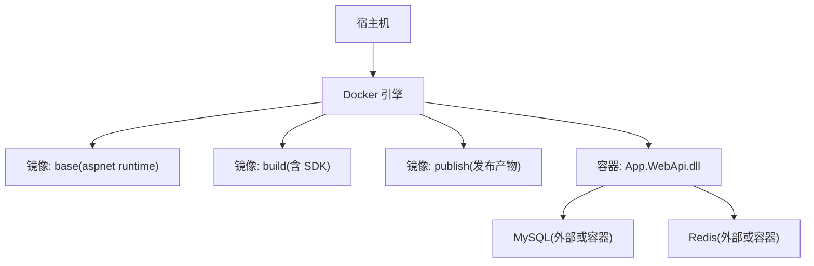
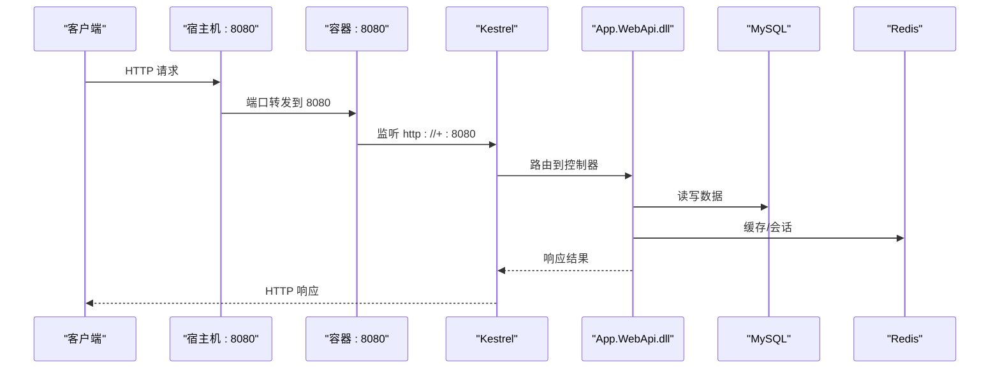
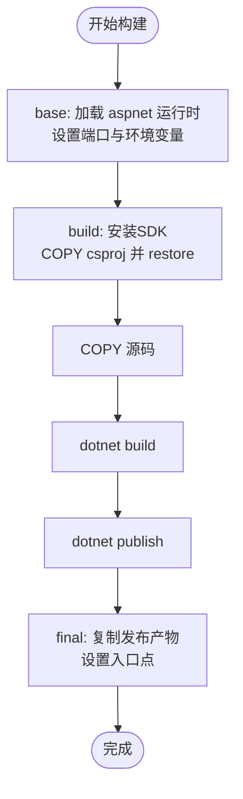
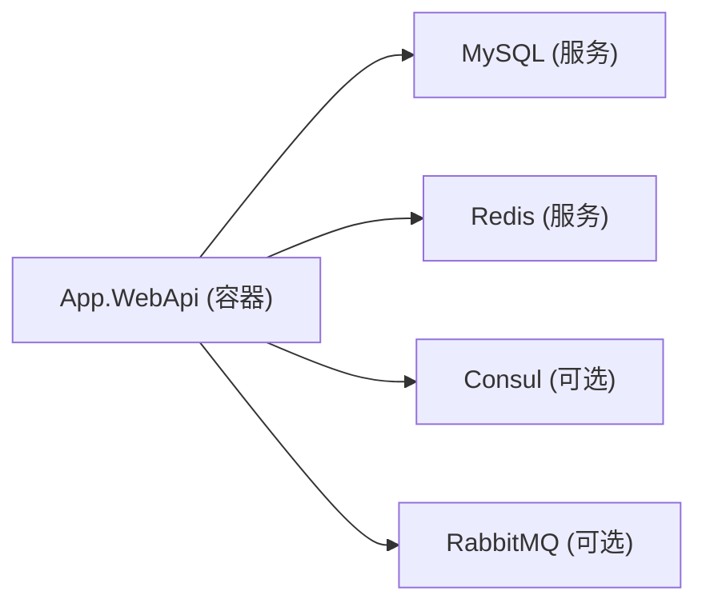

# Docker容器化部署

<cite>
**本文引用的文件**
- [App/WebApi/Dockerfile](file://App/WebApi/Dockerfile)
- [App/WebApi/Dockerfile.original](file://App/WebApi/Dockerfile.original)
- [.dockerignore](file://.dockerignore)
- [App/WebApi/appsettings.json](file://App/WebApi/appsettings.json)
- [App/WebApi/Program.cs](file://App/WebApi/Program.cs)
- [Doc/项目相关/docker说明.txt](file://Doc/项目相关/docker说明.txt)
- [Doc/项目相关/环境变量设置.txt](file://Doc/项目相关/环境变量设置.txt)
- [SYSTEM_DOCUMENTATION.md](file://SYSTEM_DOCUMENTATION.md)
</cite>

## 目录
1. [简介](#简介)
2. [项目结构](#项目结构)
3. [核心组件](#核心组件)
4. [架构总览](#架构总览)
5. [详细组件分析](#详细组件分析)
6. [依赖关系分析](#依赖关系分析)
7. [性能与资源优化](#性能与资源优化)
8. [故障排查指南](#故障排查指南)
9. [结论](#结论)
10. [附录：构建与运行命令、编排示例](#附录构建与运行命令编排示例)

## 简介
本文件面向 NetCoreKevin 框架的容器化部署，重点说明多阶段 Dockerfile 构建流程、基础镜像选择、依赖安装、应用编译与发布优化；解释容器环境变量（如 ASPNETCORE_URLS 端口、ASPNETCORE_ENVIRONMENT）与运行时用户权限管理；描述 .dockerignore 的作用与优化策略；提供完整的镜像构建命令、容器运行参数、网络配置；给出基于 Docker Compose 的数据库、Redis、应用服务编排示例；并总结生产环境最佳实践（镜像安全扫描、资源限制与健康检查）。

## 项目结构
- Web API 入口位于 App/WebApi，包含 Dockerfile、配置文件与启动逻辑。
- 解决方案包含多个模块（Domain/Application/Infrastructure/Module 等），Dockerfile 通过精确 COPY 仅引入必要的 csproj 以利用缓存加速 restore/build。
- 根目录提供 .dockerignore，用于排除不必要的构建上下文内容，减小镜像体积。
- 文档中提供了 Docker 基础命令与网络通信说明，以及环境变量设置参考。

图表来源
- [App/WebApi/Dockerfile:3-73](file://App/WebApi/Dockerfile#L3-L73)

章节来源
- [App/WebApi/Dockerfile:1-74](file://App/WebApi/Dockerfile#L1-L74)
- [.dockerignore:1-25](file://.dockerignore#L1-L25)

## 核心组件
- 多阶段构建
  - base：使用 aspnet 运行时镜像，暴露 8080 端口，设置监听地址与环境变量，非 root 用户运行。
  - build：使用 SDK 镜像，关闭遥测与全球化不变量，COPY 必要 csproj 后执行 dotnet restore，再复制源码并构建。
  - publish：在 build 基础上发布为自包含/可移植输出（UseAppHost=false）。
  - final：从 base 阶段复制发布产物，设置工作目录与入口点。
- 环境变量
  - ASPNETCORE_URLS：强制 Kestrel 监听 http://+:8080。
  - ASPNETCORE_ENVIRONMENT：控制开发/测试/生产行为（由 Program 与环境读取）。
- 运行时用户
  - 使用 $APP_UID 切换至非 root 用户，提升安全性。
- 忽略规则
  - .dockerignore 排除 .git、bin/obj、IDE 配置、node_modules、其他 Dockerfile/compose 等，减少上下文大小与误拷贝风险。

章节来源
- [App/WebApi/Dockerfile:3-73](file://App/WebApi/Dockerfile#L3-L73)
- [App/WebApi/Program.cs:23-85](file://App/WebApi/Program.cs#L23-L85)
- [.dockerignore:1-25](file://.dockerignore#L1-L25)

## 架构总览
下图展示了容器内外的关键交互：Web API 通过环境变量与 appsettings 连接 MySQL 与 Redis，Kestrel 监听 8080 端口，外部通过端口映射访问服务。

图表来源
- [App/WebApi/Dockerfile:7-9](file://App/WebApi/Dockerfile#L7-L9)
- [App/WebApi/appsettings.json:12-19](file://App/WebApi/appsettings.json#L12-L19)

## 详细组件分析

### 多阶段 Dockerfile 构建流程
- 基础镜像选择
  - base 阶段采用 aspnet 运行时镜像，最小化运行依赖。
  - build 阶段采用 SDK 镜像，启用 DOTNET_CLI_TELEMETRY_OPTOUT 与 DOTNET_SYSTEM_GLOBALIZATION_INVARIANT 以提升构建速度与稳定性。
- 依赖安装与缓存优化
  - 先 COPY 所有 csproj 文件，再执行 dotnet restore，充分利用 Docker 层缓存，避免每次构建都重新下载依赖。
- 应用编译与发布优化
  - 构建阶段输出到 /app/build，发布阶段输出到 /app/publish，最终只将发布产物复制到 final 镜像，显著减小镜像体积。
  - 使用 UseAppHost=false 避免生成宿主包装器，进一步精简。
- 运行时用户与端口
  - USER $APP_UID 确保以非 root 用户运行。
  - EXPOSE 8080 与 ENV ASPNETCORE_URLS=http://+:8080 保证容器内外端口一致且监听所有接口。

图表来源
- [App/WebApi/Dockerfile:13-66](file://App/WebApi/Dockerfile#L13-L66)
- [App/WebApi/Dockerfile:68-74](file://App/WebApi/Dockerfile#L68-L74)

章节来源
- [App/WebApi/Dockerfile:1-74](file://App/WebApi/Dockerfile#L1-L74)

### 环境变量与运行时配置
- ASPNETCORE_URLS
  - 在 Dockerfile 的 base、build、final 三处设置，确保 Kestrel 始终监听 http://+:8080。
- ASPNETCORE_ENVIRONMENT
  - 通过环境变量切换 Development/Production，影响异常处理、日志级别等。
  - Program 中调用环境配置工具进行初始化。
- 连接字符串与外部服务
  - appsettings.json 定义了 dbConnection 与 redisConnection，可在容器中以环境变量覆盖（例如 ConnectionStrings__dbConnection）。
  - ConsulSetting、RabbitMQ、Hangfire 等配置项可根据部署环境调整。

章节来源
- [App/WebApi/Dockerfile:7-9](file://App/WebApi/Dockerfile#L7-L9)
- [App/WebApi/Dockerfile:58-59](file://App/WebApi/Dockerfile#L58-L59)
- [App/WebApi/Dockerfile:71-72](file://App/WebApi/Dockerfile#L71-L72)
- [App/WebApi/appsettings.json:12-19](file://App/WebApi/appsettings.json#L12-L19)
- [App/WebApi/Program.cs:23-29](file://App/WebApi/Program.cs#L23-L29)
- [Doc/项目相关/环境变量设置.txt:1-16](file://Doc/项目相关/环境变量设置.txt#L1-L16)

### 运行时用户权限管理
- 使用 $APP_UID 切换到非 root 用户，降低容器被攻破后的影响面。
- 建议结合只读文件系统、最小权限原则挂载卷，避免写入敏感路径。

章节来源
- [App/WebApi/Dockerfile:5](file://App/WebApi/Dockerfile#L5)

### .dockerignore 的作用与优化策略
- 排除 IDE 与版本控制相关文件（.vs、.git、*.user 等），避免污染构建上下文。
- 排除 bin/obj、node_modules、npm-debug.log 等中间产物，减少镜像体积与构建时间。
- 排除 docker-compose* 与 Dockerfile*，防止误将编排文件打包进镜像。
- 建议：
  - 保持 .dockerignore 与项目结构同步更新。
  - 对大型前端资源（如 vue/dist）也应纳入忽略列表，若不需要进入镜像。

章节来源
- [.dockerignore:1-25](file://.dockerignore#L1-L25)

### 健康检查与就绪探针
- 建议在容器层面增加健康检查，指向应用的健康端点（例如 /api/Test/HealthCheckGet 或自定义 /health）。
- 在 Kubernetes 或编排平台中，可通过 liveness/readiness 探针实现自动重启与服务摘流。

章节来源
- [App/WebApi/appsettings.json:51-57](file://App/WebApi/appsettings.json#L51-L57)

## 依赖关系分析
- 应用对外部服务的依赖
  - MySQL：通过 ConnectionStrings.dbConnection 配置。
  - Redis：通过 ConnectionStrings.redisConnection 及 Hangfire/SignalR 相关配置。
  - 可选：Consul、RabbitMQ、邮件、云存储等按配置启用。
- 容器网络
  - 容器间通信建议使用自定义网络，通过服务名解析（Compose 场景）。
  - 宿主机端口映射：将容器的 8080 映射到宿主机指定端口。

图表来源
- [App/WebApi/appsettings.json:12-19](file://App/WebApi/appsettings.json#L12-L19)
- [App/WebApi/appsettings.json:92-98](file://App/WebApi/appsettings.json#L92-L98)
- [Doc/项目相关/docker说明.txt:5-16](file://Doc/项目相关/docker说明.txt#L5-L16)

章节来源
- [App/WebApi/appsettings.json:12-19](file://App/WebApi/appsettings.json#L12-L19)
- [Doc/项目相关/docker说明.txt:5-16](file://Doc/项目相关/docker说明.txt#L5-L16)

## 性能与资源优化
- 构建优化
  - 使用多阶段构建，仅将运行时所需文件放入 final 镜像。
  - 先恢复依赖再复制源码，最大化利用缓存。
  - 禁用遥测与设置不变文化，提升构建速度。
- 运行时优化
  - 固定监听端口 8080，便于反向代理统一入口。
  - 使用非 root 用户运行，提高安全性。
  - 合理设置 GCHeapHardLimit（已在 Program 中设置堆硬限制）。
- 资源限制
  - 在生产环境中为容器设置 CPU 与内存限制，避免单实例占用过多资源。
- 镜像安全
  - 定期扫描镜像漏洞，及时更新基础镜像。
  - 最小化基础镜像，移除不必要工具与调试信息。

章节来源
- [App/WebApi/Dockerfile:13-66](file://App/WebApi/Dockerfile#L13-L66)
- [App/WebApi/Program.cs:79-80](file://App/WebApi/Program.cs#L79-L80)

## 故障排查指南
- 无法访问服务
  - 检查容器端口映射是否正确（宿主机端口 -> 容器 8080）。
  - 确认 ASPNETCORE_URLS 是否设置为 http://+:8080。
- 数据库/Redis 连接失败
  - 核对连接字符串中的主机名、端口、密码。
  - 在 Compose 环境下，使用服务名作为主机名（如 mysql、redis）。
- 权限问题
  - 确认以非 root 用户运行，必要时调整卷挂载权限。
- 日志定位
  - 查看容器日志：docker logs <容器名>。
  - 应用日志路径与级别由 log4net 与 appsettings 控制。

章节来源
- [App/WebApi/Dockerfile:7-9](file://App/WebApi/Dockerfile#L7-L9)
- [App/WebApi/appsettings.json:12-19](file://App/WebApi/appsettings.json#L12-L19)
- [Doc/项目相关/docker说明.txt:20-39](file://Doc/项目相关/docker说明.txt#L20-L39)

## 结论
NetCoreKevin 的容器化方案采用标准的多阶段构建，结合 .dockerignore 优化上下文，确保镜像体积小、构建快、运行安全。通过环境变量与配置分离，支持多环境部署。配合 Docker Compose 可快速拉起数据库、缓存与应用服务，满足开发与测试需求；在生产环境建议加入镜像扫描、资源限制与健康检查，进一步提升可靠性与安全性。

## 附录：构建与运行命令、编排示例

- 构建镜像
  - 在项目根目录执行：
    - docker build -t netcorekevin-webapi:latest -f App/WebApi/Dockerfile .
  - 如需指定构建配置：
    - docker build --build-arg BUILD_CONFIGURATION=Release -t netcorekevin-webapi:release -f App/WebApi/Dockerfile .

- 运行容器
  - 基本运行：
    - docker run -d --name webapi -p 8080:8080 netcorekevin-webapi:latest
  - 注入环境变量（覆盖连接字符串等）：
    - docker run -d --name webapi -p 8080:8080 -e ASPNETCORE_ENVIRONMENT=Production -e ConnectionStrings__dbConnection="server=mysql;port=3306;database=kevin_app;user id=root;password=admin123;..." netcorekevin-webapi:latest

- 网络与端口
  - 容器内部监听 8080，宿主机映射到任意可用端口（如 8080）。
  - 容器间通信建议使用自定义网络，通过服务名解析。

- Docker Compose 编排示例（数据库、Redis、应用）
  - services:
    - webapi：构建镜像，映射端口 8080，注入环境变量，依赖 mysql、redis。
    - mysql：使用官方镜像，设置 root 密码与数据库名。
    - redis：使用官方镜像，暴露 6379。
  - 注意：
    - 连接字符串中的主机名应使用 Compose 服务名（mysql、redis）。
    - 可通过环境变量覆盖 appsettings.json 中的连接串与配置项。

- 生产最佳实践
  - 镜像安全扫描：使用 Trivy、Docker Scout 等工具定期扫描。
  - 资源限制：为容器设置 CPU/内存上限，避免资源争用。
  - 健康检查：为容器添加健康检查端点，编排平台据此判断存活与就绪。
  - 日志与监控：集中收集日志，接入监控系统（Prometheus/Grafana）。

章节来源
- [App/WebApi/Dockerfile:1-74](file://App/WebApi/Dockerfile#L1-L74)
- [App/WebApi/appsettings.json:12-19](file://App/WebApi/appsettings.json#L12-L19)
- [SYSTEM_DOCUMENTATION.md:474-501](file://SYSTEM_DOCUMENTATION.md#L474-L501)
- [Doc/项目相关/docker说明.txt:2-16](file://Doc/项目相关/docker说明.txt#L2-L16)