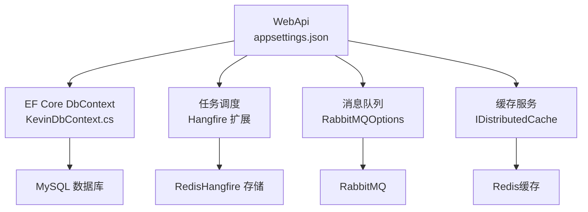
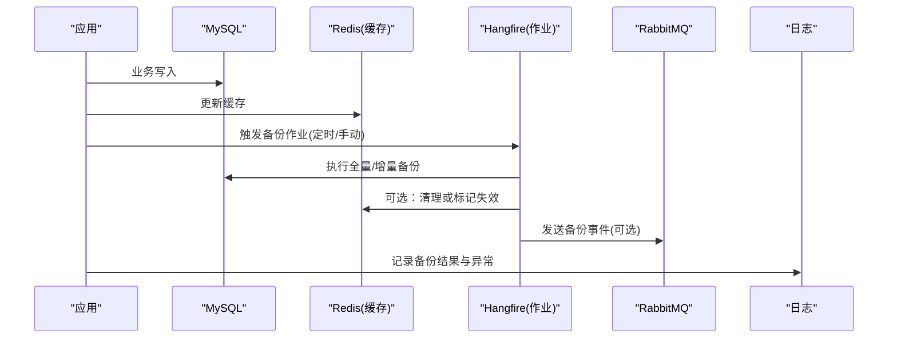
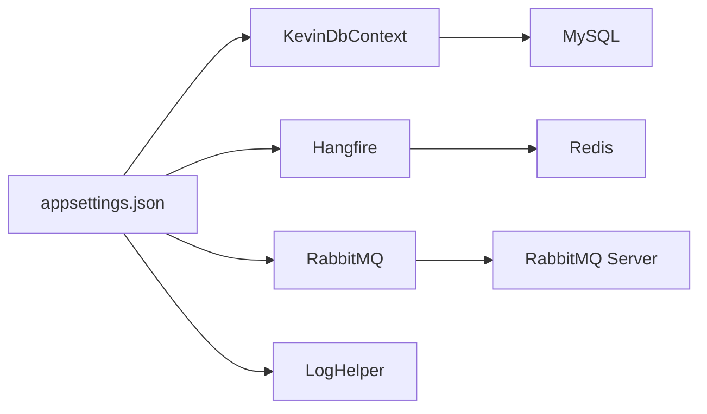

# 备份恢复

<cite>
**本文引用的文件**
- [appsettings.json](file://App/WebApi/appsettings.json)
- [KevinDbContext.cs](file://Kevin/ Kevin.EntityFrameworkCore/Database/KevinDbContext.cs)
- [ServiceCollectionExtensions.cs（Hangfire）](file://Kevin/kevin.Module/Kevin.Hangfire/ServiceCollectionExtensions.cs)
- [ApplicationBuilderExtensions.cs（Hangfire）](file://Kevin/kevin.Module/Kevin.Hangfire/ApplicationBuilderExtensions.cs)
- [RabbitMQOptions.cs](file://Kevin/kevin.Module/kevin.RabbitMQ/RabbitMQOptions.cs)
- [说明.txt（Hangfire/CAP/缓存依赖）](file://Kevin/Kevin.Web.Basics/txt/说明.txt)
- [LogHelper.cs](file://Kevin/kevin.Module/Kevin.log4Net/LogHelper.cs)
- [SYSTEM_DOCUMENTATION.md](file://SYSTEM_DOCUMENTATION.md)
- [说明.txt（InitData）](file://InitData/说明.txt)
</cite>

## 目录
1. [简介](#简介)
2. [项目结构](#项目结构)
3. [核心组件](#核心组件)
4. [架构总览](#架构总览)
5. [详细组件分析](#详细组件分析)
6. [依赖关系分析](#依赖关系分析)
7. [性能考虑](#性能考虑)
8. [故障排查指南](#故障排查指南)
9. [结论](#结论)
10. [附录](#附录)

## 简介
本方案面向 NetCoreKevin 框架，提供覆盖数据库、Redis 缓存、第三方存储与消息队列的完整备份与恢复策略；定义全量与增量备份计划、数据迁移与版本管理、持久化配置、灾难恢复流程与 RTO/RPO 目标，并给出基于 Hangfire 的自动化任务与监控告警机制。

## 项目结构
- 应用层：WebApi 入口与配置集中位于 App/WebApi，连接串、Redis、RabbitMQ、云存储等关键配置在 appsettings.json。
- 数据访问层：EF Core 上下文 KevinDbContext 负责数据库连接、迁移程序集、表映射与种子数据配置。
- 任务调度：Hangfire 通过 ServiceCollectionExtensions 和 ApplicationBuilderExtensions 注册 Redis 存储与仪表盘。
- 消息与缓存：RabbitMQ 选项类 RabbitMQOptions；缓存服务使用 IDistributedCache（StackExchange.Redis）。
- 日志：log4net 按日滚动输出到 Log 目录，便于审计与排障。
- 初始化数据：InitData 目录包含行政区划等基础数据的来源说明与脚本片段。

图表来源
- [appsettings.json:12-20](file://App/WebApi/appsettings.json#L12-L20)
- [KevinDbContext.cs:83-112](file://Kevin/ Kevin.EntityFrameworkCore/Database/KevinDbContext.cs#L83-L112)
- [ServiceCollectionExtensions.cs（Hangfire）:21-52](file://Kevin/kevin.Module/Kevin.Hangfire/ServiceCollectionExtensions.cs#L21-L52)
- [RabbitMQOptions.cs:1-27](file://Kevin/kevin.Module/kevin.RabbitMQ/RabbitMQOptions.cs#L1-L27)

章节来源
- [appsettings.json:12-20](file://App/WebApi/appsettings.json#L12-L20)
- [KevinDbContext.cs:83-112](file://Kevin/ Kevin.EntityFrameworkCore/Database/KevinDbContext.cs#L83-L112)

## 核心组件
- 数据库连接与迁移：通过 EF Core 配置 MySQL 连接与迁移程序集，支持多环境覆盖 MigrationsAssembly。
- 任务调度与持久化：Hangfire 使用 Redis 作为作业存储，启用 Dashboard 用于可视化监控。
- 消息队列：RabbitMQ 通过配置项注入，支持虚拟主机、认证与路由。
- 缓存：分布式缓存基于 StackExchange.Redis，提供统一 Set/Remove 等接口。
- 日志：log4net 按日滚动记录，便于备份与审计。

章节来源
- [KevinDbContext.cs:83-112](file://Kevin/ Kevin.EntityFrameworkCore/Database/KevinDbContext.cs#L83-L112)
- [ServiceCollectionExtensions.cs（Hangfire）:21-52](file://Kevin/kevin.Module/Kevin.Hangfire/ServiceCollectionExtensions.cs#L21-L52)
- [RabbitMQOptions.cs:1-27](file://Kevin/kevin.Module/kevin.RabbitMQ/RabbitMQOptions.cs#L1-L27)
- [说明.txt（Hangfire/CAP/缓存依赖）:1-28](file://Kevin/Kevin.Web.Basics/txt/说明.txt#L1-L28)
- [LogHelper.cs:19-56](file://Kevin/kevin.Module/Kevin.log4Net/LogHelper.cs#L19-L56)

## 架构总览
下图展示备份恢复涉及的系统边界与数据流向：业务写入数据库与缓存，任务调度驱动备份作业，日志与监控支撑可观测性。

图表来源
- [appsettings.json:12-20](file://App/WebApi/appsettings.json#L12-L20)
- [ServiceCollectionExtensions.cs（Hangfire）:21-52](file://Kevin/kevin.Module/Kevin.Hangfire/ServiceCollectionExtensions.cs#L21-L52)
- [RabbitMQOptions.cs:1-27](file://Kevin/kevin.Module/kevin.RabbitMQ/RabbitMQOptions.cs#L1-L27)
- [LogHelper.cs:19-56](file://Kevin/kevin.Module/Kevin.log4Net/LogHelper.cs#L19-L56)

## 详细组件分析

### 数据库备份策略（全量与增量）
- 全量备份
  - 频率：每日低峰期执行一次。
  - 方式：使用数据库原生工具（如 mysqldump）导出逻辑备份，或采用物理备份（如 Percona XtraBackup）以缩短 RPO。
  - 存储：本地磁盘 + 对象存储（阿里云 OSS/腾讯云 COS），建议开启压缩与加密。
  - 校验：备份后对备份文件进行完整性校验（如 md5/sha256），并记录元数据（时间、大小、版本）。
- 增量备份
  - 频率：每 15~30 分钟一次（根据 RPO 调整）。
  - 方式：基于 binlog 增量归档（MySQL 需开启 binlog），或使用支持增量能力的备份引擎。
  - 存储：与全量相同策略，按日期/租户分桶组织。
- 保留策略
  - 全量：保留最近 7~14 份。
  - 增量：保留至下一个全量点，或按天数滚动清理。
- 恢复演练
  - 定期在隔离环境执行恢复演练，验证 RTO/RPO 达标。

章节来源
- [appsettings.json:12-14](file://App/WebApi/appsettings.json#L12-L14)
- [KevinDbContext.cs:83-112](file://Kevin/ Kevin.EntityFrameworkCore/Database/KevinDbContext.cs#L83-L112)

### InitData 初始化数据的版本管理与迁移脚本
- 数据来源与说明
  - InitData/说明.txt 记录了行政区划数据来源与查询片段，用于初始数据准备与核对。
- 版本管理
  - 将初始化 SQL 纳入版本控制，命名规范：V{序号}_{描述}.sql。
  - 每次变更需附带回滚脚本与影响评估。
- 迁移脚本
  - 结合 EF Core 迁移（MigrationsAssembly）与独立初始化脚本双轨管理：
    - 结构变更走 EF 迁移。
    - 种子数据与字典数据通过脚本在启动或维护窗口执行。
- 执行时机
  - 首次部署或升级时执行；生产环境建议在停机窗口或灰度期间执行，并记录执行日志。

章节来源
- [说明.txt（InitData）:1-16](file://InitData/说明.txt#L1-L16)
- [KevinDbContext.cs:83-112](file://Kevin/ Kevin.EntityFrameworkCore/Database/KevinDbContext.cs#L83-L112)

### Redis 缓存数据的持久化配置与恢复方法
- 持久化配置
  - 使用 Redis 持久化（RDB/AOF），建议开启 AOF 且每秒同步，兼顾性能与数据安全。
  - 为不同用途划分 DB 编号与 Key 前缀，避免冲突（例如 Hangfire、SignalR、缓存各自独立）。
- 备份与恢复
  - 定期拷贝 RDB 快照与 AOF 文件至对象存储。
  - 恢复时先停止写入，替换数据目录后重启 Redis，再逐步恢复应用流量。
- 一致性保障
  - 缓存失效策略：在数据变更后主动删除或设置短 TTL，避免脏读。
  - 重要键加版本号或时间戳后缀，便于定位与清理。

章节来源
- [appsettings.json:12-20](file://App/WebApi/appsettings.json#L12-L20)
- [说明.txt（Hangfire/CAP/缓存依赖）:21-28](file://Kevin/Kevin.Web.Basics/txt/说明.txt#L21-L28)

### 第三方服务数据的同步与备份
- 文件存储（云对象存储）
  - 配置：appsettings.json 中 AliCloud/Tencent/Qiniu 相关字段。
  - 备份：利用云厂商提供的跨地域复制、版本控制与生命周期策略。
  - 恢复：从备份桶或跨区域副本下载，校验后回灌。
- 消息队列（RabbitMQ）
  - 配置：HostName、Port、UserName、Password、VirtualHost。
  - 备份：队列与消息可通过镜像集群与持久化策略保护；必要时导出消费端落库。
  - 恢复：重建队列与交换机，重放或从下游补偿消费。
- 其他服务
  - 向量检索（Qdrant）、短信/邮件等外部服务按各自文档实施备份与容灾。

章节来源
- [appsettings.json:67-98](file://App/WebApi/appsettings.json#L67-L98)
- [RabbitMQOptions.cs:1-27](file://Kevin/kevin.Module/kevin.RabbitMQ/RabbitMQOptions.cs#L1-L27)

### 灾难恢复流程与 RTO/RPO 目标
- 目标设定
  - RPO：数据库 ≤ 5 分钟（增量 binlog），缓存 ≤ 1 次写周期，文件存储按版本控制。
  - RTO：核心服务 ≤ 30 分钟（含恢复与验证）。
- 流程
  - 检测与分级：依据监控告警自动分级响应。
  - 切换与恢复：优先恢复数据库（全量+增量回放），再恢复缓存与文件，最后恢复消息队列状态。
  - 验证与回滚：功能与健康检查通过后切流；失败则回滚至上一可用版本。
- 演练
  - 每季度至少一次端到端演练，记录偏差并优化。

[本节为概念性内容，不直接引用具体代码文件]

### 自动化备份任务的配置与监控告警
- 任务注册
  - 使用 Hangfire 的 Redis 存储注册定时任务，支持重复执行与失败重试。
  - 通过 ApplicationBuilderExtensions 启用 Dashboard，便于可视化查看任务状态。
- 监控与告警
  - 监控：Dashboard 查看成功/失败率、耗时、重试次数。
  - 告警：结合日志与外部监控系统（如 Prometheus/企业微信/钉钉）对失败与超时进行告警。
- 安全
  - Dashboard 启用 BasicAuth，限制访问来源与 SSL 强制。

章节来源
- [ServiceCollectionExtensions.cs（Hangfire）:21-52](file://Kevin/kevin.Module/Kevin.Hangfire/ServiceCollectionExtensions.cs#L21-L52)
- [ApplicationBuilderExtensions.cs（Hangfire）:14-54](file://Kevin/kevin.Module/Kevin.Hangfire/ApplicationBuilderExtensions.cs#L14-L54)
- [LogHelper.cs:19-56](file://Kevin/kevin.Module/Kevin.log4Net/LogHelper.cs#L19-L56)

## 依赖关系分析
- 配置依赖
  - 数据库连接串、迁移程序集由 appsettings.json 注入 DbContext。
  - Hangfire 与 SignalR 均依赖 Redis 连接串与 DB 编号。
  - RabbitMQ 通过配置项注入，供消息发布/订阅使用。
- 运行时依赖
  - 备份任务依赖数据库客户端、对象存储 SDK、消息队列客户端。
  - 日志模块为所有组件提供可观测性支撑。

图表来源
- [appsettings.json:12-20](file://App/WebApi/appsettings.json#L12-L20)
- [KevinDbContext.cs:83-112](file://Kevin/ Kevin.EntityFrameworkCore/Database/KevinDbContext.cs#L83-L112)
- [ServiceCollectionExtensions.cs（Hangfire）:21-52](file://Kevin/kevin.Module/Kevin.Hangfire/ServiceCollectionExtensions.cs#L21-L52)
- [RabbitMQOptions.cs:1-27](file://Kevin/kevin.Module/kevin.RabbitMQ/RabbitMQOptions.cs#L1-L27)

章节来源
- [appsettings.json:12-20](file://App/WebApi/appsettings.json#L12-L20)
- [KevinDbContext.cs:83-112](file://Kevin/ Kevin.EntityFrameworkCore/Database/KevinDbContext.cs#L83-L112)

## 性能考虑
- 备份窗口：选择业务低峰期执行全量；增量尽量高频但控制 IO。
- 并发控制：备份任务串行化，避免与业务高峰争抢资源。
- 网络与存储：就近备份与跨域复制分离，降低带宽压力。
- 缓存与队列：备份期间保持缓存 TTL 合理，避免雪崩；队列消费端具备幂等与重试能力。

[本节为通用指导，不直接引用具体代码文件]

## 故障排查指南
- 常见问题
  - 数据库连接失败：检查 MySQL 服务与连接串。
  - Redis 连接失败：检查 Redis 服务与密码、端口、DB 编号。
  - Hangfire 任务不执行：检查 Redis 连接与任务注册。
- 排查步骤
  - 查看日志：LogHelper 按日滚动输出，定位错误堆栈。
  - 健康检查：使用 Dashboard 查看任务状态与历史。
  - 连通性测试：命令行测试数据库/Redis/MQ 连通性。

章节来源
- [SYSTEM_DOCUMENTATION.md:551-560](file://SYSTEM_DOCUMENTATION.md#L551-L560)
- [LogHelper.cs:19-56](file://Kevin/kevin.Module/Kevin.log4Net/LogHelper.cs#L19-L56)

## 结论
通过“数据库全量+增量”、“Redis 持久化”、“云存储版本控制”、“消息队列高可用”的组合策略，配合 Hangfire 自动化任务与完善的监控告警，可实现可控的 RTO/RPO 与可复现的恢复流程。建议持续演练与优化，确保在真实灾难场景下快速恢复业务。

[本节为总结性内容，不直接引用具体代码文件]

## 附录
- 关键配置位置
  - 数据库连接串与迁移程序集：appsettings.json
  - Hangfire 存储与仪表盘：ServiceCollectionExtensions.cs、ApplicationBuilderExtensions.cs
  - RabbitMQ 连接参数：appsettings.json、RabbitMQOptions.cs
  - 日志输出路径与轮转：LogHelper.cs
  - 初始化数据说明：InitData/说明.txt

章节来源
- [appsettings.json:12-20](file://App/WebApi/appsettings.json#L12-L20)
- [ServiceCollectionExtensions.cs（Hangfire）:21-52](file://Kevin/kevin.Module/Kevin.Hangfire/ServiceCollectionExtensions.cs#L21-L52)
- [ApplicationBuilderExtensions.cs（Hangfire）:14-54](file://Kevin/kevin.Module/Kevin.Hangfire/ApplicationBuilderExtensions.cs#L14-L54)
- [RabbitMQOptions.cs:1-27](file://Kevin/kevin.Module/kevin.RabbitMQ/RabbitMQOptions.cs#L1-L27)
- [LogHelper.cs:19-56](file://Kevin/kevin.Module/Kevin.log4Net/LogHelper.cs#L19-L56)
- [说明.txt（InitData）:1-16](file://InitData/说明.txt#L1-L16)