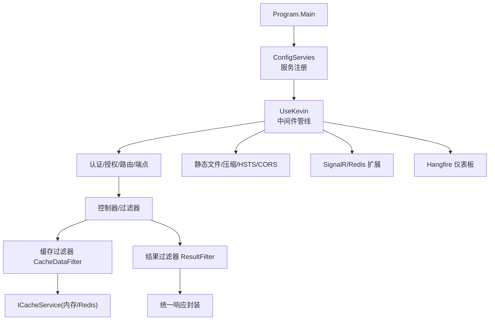
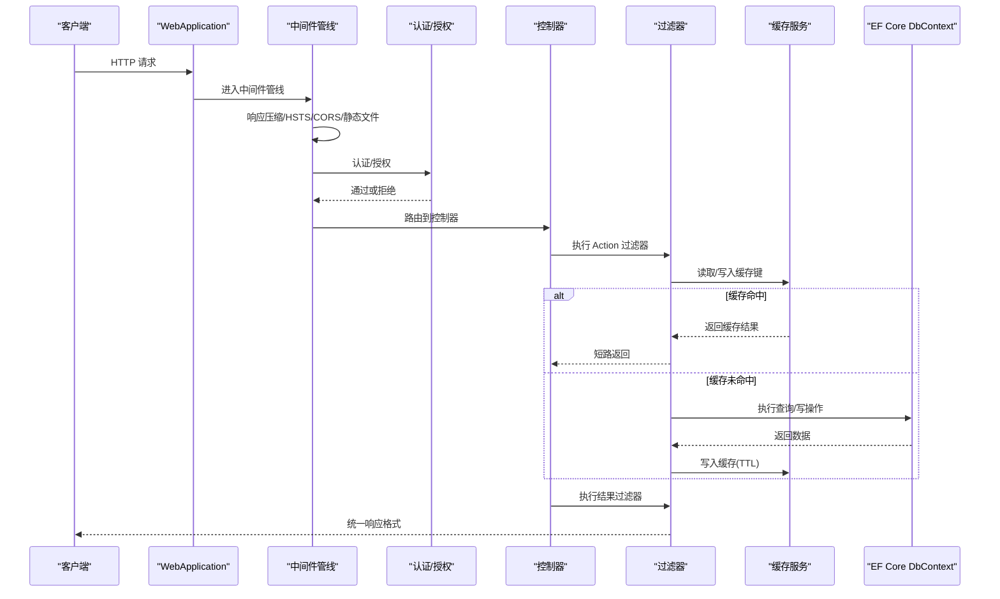
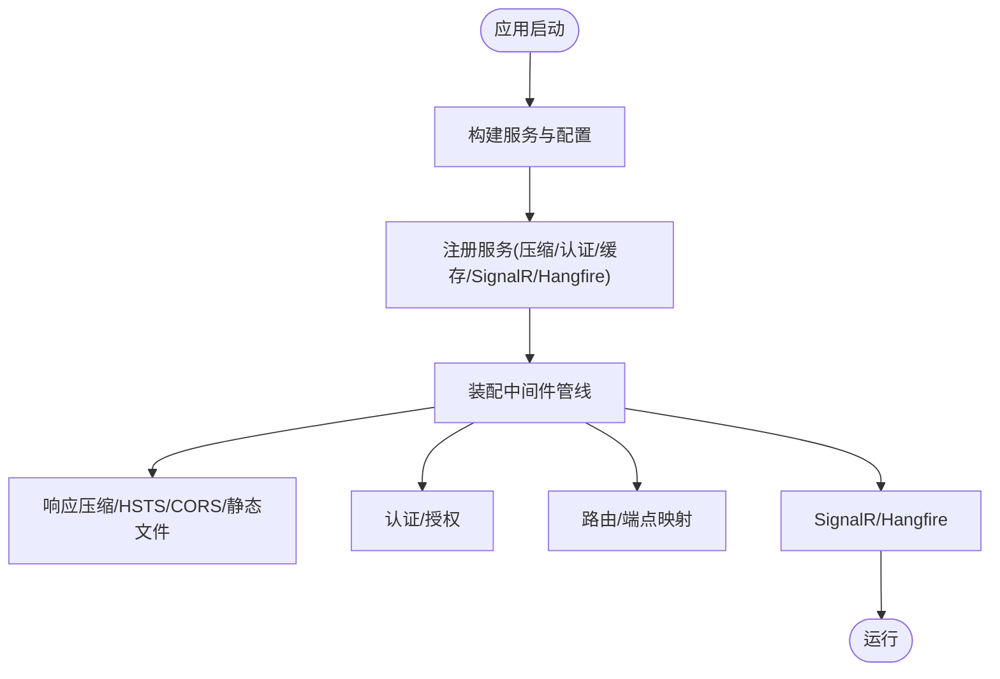
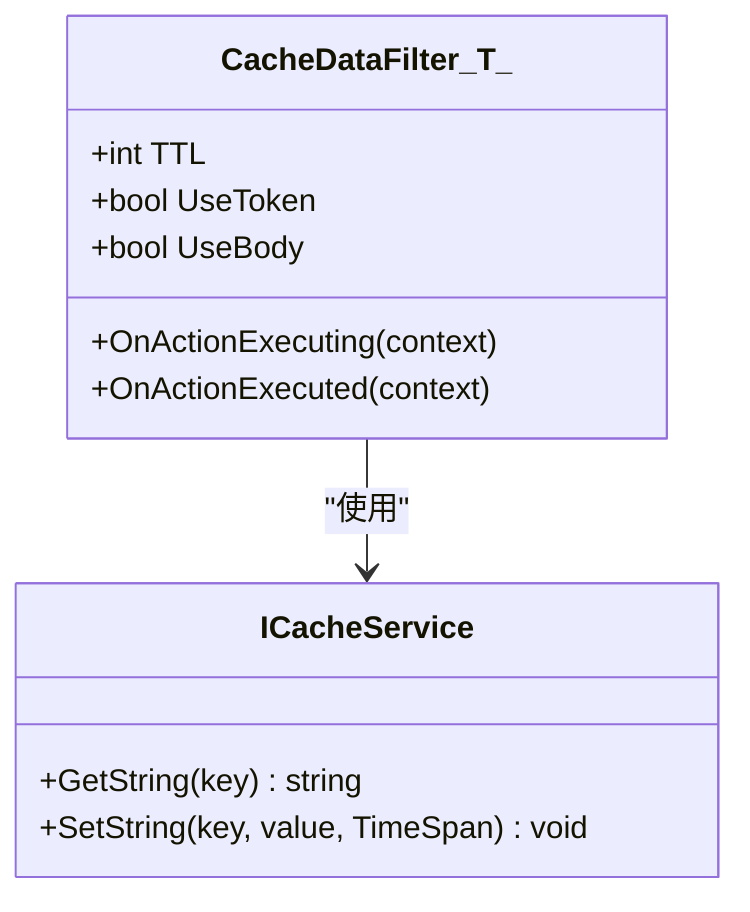
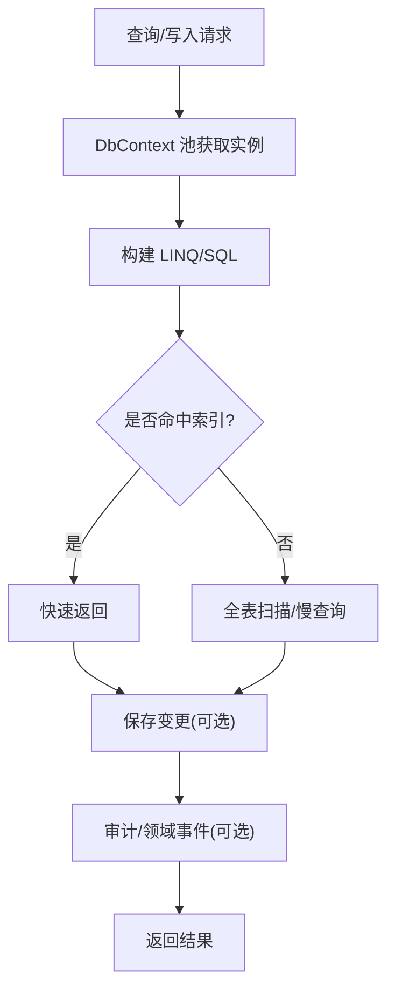
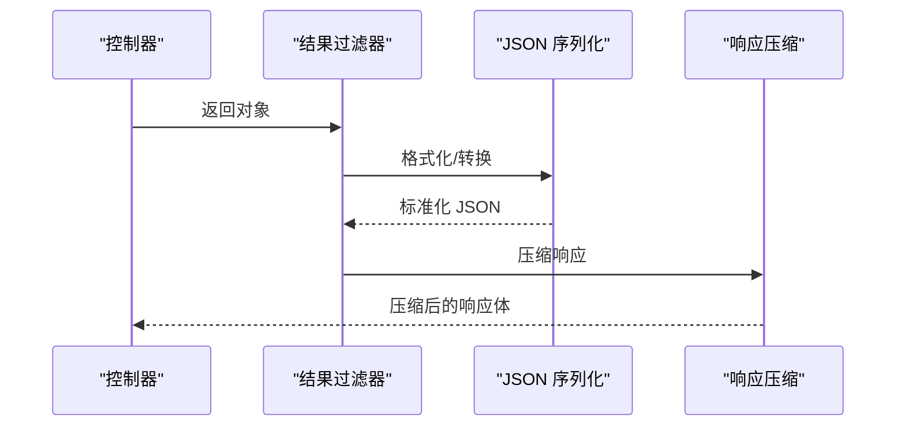
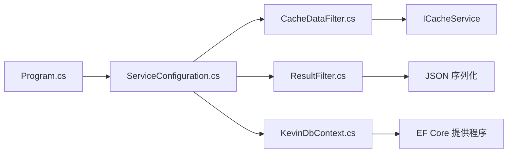

# 性能优化

<cite>
**本文引用的文件**
- [Program.cs](file://App/WebApi/Program.cs)
- [ServiceConfiguration.cs](file://Kevin/Kevin.Web.Basics/Extensions/ServiceConfiguration.cs)
- [KevinDbContext.cs](file://Kevin/Kevin.EntityFrameworkCore/Database/KevinDbContext.cs)
- [CacheDataFilter.cs](file://Kevin/Kevin.Web.Basics/Filters/CacheDataFilter.cs)
- [ResultFilter.cs](file://Kevin/Kevin.Web.Basics/Filters/ResultFilter.cs)
- [appsettings.json](file://App/WebApi/appsettings.json)
- [ServiceCollectionExtensions.cs（SignalR）](file://Kevin/kevin.Module/Kevin.SignalR/ServiceCollectionExtensions.cs)
- [ServiceCollectionExtensions.cs（分布式锁）](file://Kevin/kevin.Module/kevin.DistributedLock/ServiceCollectionExtensions.cs)
</cite>

## 目录
1. [简介](#简介)
2. [项目结构](#项目结构)
3. [核心组件](#核心组件)
4. [架构总览](#架构总览)
5. [详细组件分析](#详细组件分析)
6. [依赖关系分析](#依赖关系分析)
7. [性能注意事项](#性能注意事项)
8. [故障排查指南](#故障排查指南)
9. [结论](#结论)
10. [附录](#附录)

## 简介
本指南面向 NetCoreKevin 框架的性能优化，覆盖应用启动优化、中间件注册顺序、缓存策略（内存与 Redis）、数据库连接池与 EF Core 查询优化、API 响应优化（序列化、压缩、分页）、异步编程模式与并发提升，以及性能监控与瓶颈分析方法。内容基于仓库中的实际实现进行说明，并提供可操作的配置建议与流程图示。

## 项目结构
- Web 入口：Program.cs 负责环境初始化、日志、服务构建、异常处理、堆限制设置与中间件管线装配。
- 服务与中间件注册：ServiceConfiguration.cs 集中完成 JSON 压缩、Kestrel/IISServer 选项、CORS、认证授权、控制器、缓存、分布式锁、SignalR、Hangfire、消息队列等服务的注入与 Use 管线配置。
- 数据访问：KevinDbContext.cs 提供 EF Core 上下文、模型配置、拦截器、默认索引字段、多租户与乐观并发处理。
- API 过滤器：CacheDataFilter.cs 提供接口级缓存；ResultFilter.cs 统一返回格式与错误码包装。
- 配置：appsettings.json 包含数据库连接串、Redis、SignalR、CORS、Hangfire、JWT、默认索引字段等关键配置项。

图表来源
- [Program.cs:23-85](file://App/WebApi/Program.cs#L23-L85)
- [ServiceConfiguration.cs:48-347](file://Kevin/Kevin.Web.Basics/Extensions/ServiceConfiguration.cs#L48-L347)

章节来源
- [Program.cs:23-85](file://App/WebApi/Program.cs#L23-L85)
- [ServiceConfiguration.cs:48-347](file://Kevin/Kevin.Web.Basics/Extensions/ServiceConfiguration.cs#L48-L347)

## 核心组件
- 应用启动与中间件管线
  - Program.cs 中启用日志、构建服务、设置 GC 堆硬限制、调用 UseKevin 装配中间件。
  - ServiceConfiguration.cs 中集中注册响应压缩、Kestrel/IISServer 同步 IO 允许、请求体大小限制、HSTS、CORS、认证授权、控制器、JSON 序列化选项、缓存、分布式锁、SignalR、Hangfire、消息队列等。
- 缓存
  - 内存缓存通过 AddKevinMemoryCache 注入；分布式锁通过 Redis 注入；SignalR 使用 Redis 作为后端。
  - CacheDataFilter 提供接口级缓存，支持 TTL、是否使用 Token、是否读取 Body 参与键生成。
- 数据库与 EF Core
  - KevinDbContext 配置 MySQL 提供程序、迁移程序集、调试拦截器、默认索引字段、自动表名/列名规则、外键级联禁用、种子数据、领域事件发布、乐观并发 RowVersion、多租户 TenantId 注入。
  - 连接池通过 AddDbContextPool 配置池大小。
- API 响应
  - ResultFilter 统一返回结构，处理 null 值、错误码包装、流式文件排除。
  - JSON 序列化自定义转换器与编码器，控制深度与缩进。

章节来源
- [Program.cs:23-85](file://App/WebApi/Program.cs#L23-L85)
- [ServiceConfiguration.cs:48-347](file://Kevin/Kevin.Web.Basics/Extensions/ServiceConfiguration.cs#L48-L347)
- [CacheDataFilter.cs:17-125](file://Kevin/Kevin.Web.Basics/Filters/CacheDataFilter.cs#L17-L125)
- [KevinDbContext.cs:83-133](file://Kevin/Kevin.EntityFrameworkCore/Database/KevinDbContext.cs#L83-L133)
- [KevinDbContext.cs:165-305](file://Kevin/Kevin.EntityFrameworkCore/Database/KevinDbContext.cs#L165-L305)
- [KevinDbContext.cs:405-484](file://Kevin/Kevin.EntityFrameworkCore/Database/KevinDbContext.cs#L405-L484)
- [ResultFilter.cs:13-153](file://Kevin/Kevin.Web.Basics/Filters/ResultFilter.cs#L13-L153)
- [appsettings.json:12-15](file://App/WebApi/appsettings.json#L12-L15)
- [appsettings.json:99-99](file://App/WebApi/appsettings.json#L99-L99)

## 架构总览
下图展示从请求进入至响应返回的关键路径，包括中间件顺序、过滤器、缓存与数据库交互。

图表来源
- [ServiceConfiguration.cs:296-347](file://Kevin/Kevin.Web.Basics/Extensions/ServiceConfiguration.cs#L296-L347)
- [CacheDataFilter.cs:31-125](file://Kevin/Kevin.Web.Basics/Filters/CacheDataFilter.cs#L31-L125)
- [ResultFilter.cs:111-153](file://Kevin/Kevin.Web.Basics/Filters/ResultFilter.cs#L111-L153)

## 详细组件分析

### 应用启动与中间件顺序优化
- 启动阶段
  - Program.cs 设置环境变量、日志、构建服务、GC 堆硬限制、调用 UseKevin。
- 服务注册阶段（ServiceConfiguration.ConfigServies）
  - 响应压缩、表单长度限制、Kestrel/IISServer 同步 IO 允许、最大请求体大小、HSTS、CORS、认证授权、控制器、JSON 序列化选项、内存缓存、分布式锁、SignalR、Hangfire、消息队列等。
- 中间件管线阶段（ServiceConfiguration.UseKevin）
  - 响应压缩、HSTS、CORS、HTTPS 重定向、静态文件、Swagger、路由、认证、授权、端点映射、SignalR Redis 扩展、Hangfire 仪表板。
- 优化要点
  - 将压缩、HSTS、CORS、静态文件放在认证之前以减少重复处理。
  - 认证/授权必须在路由之后、端点映射之前。
  - SignalR 与 Hangfire 在管线末尾启用，避免影响常规 API。

图表来源
- [Program.cs:23-85](file://App/WebApi/Program.cs#L23-L85)
- [ServiceConfiguration.cs:48-347](file://Kevin/Kevin.Web.Basics/Extensions/ServiceConfiguration.cs#L48-L347)

章节来源
- [Program.cs:23-85](file://App/WebApi/Program.cs#L23-L85)
- [ServiceConfiguration.cs:48-347](file://Kevin/Kevin.Web.Basics/Extensions/ServiceConfiguration.cs#L48-L347)

### 缓存策略配置（内存与 Redis）
- 内存缓存
  - 通过 AddKevinMemoryCache 注入，适用于轻量级、进程内缓存场景。
- Redis 缓存
  - 分布式锁通过 Redis 注入；SignalR 使用 Redis 作为后端；CacheDataFilter 通过 ICacheService 读写字符串缓存。
- 接口级缓存过滤器
  - CacheDataFilter<T> 支持 TTL、是否使用 Token、是否读取 Body 参与键生成；命中时直接返回 ObjectResult，未命中则执行后写入缓存。
- 配置参数
  - appsettings.json 中 Redis 连接串、SignalR Redis 配置（端口、密码、默认库、配置通道）。

图表来源
- [CacheDataFilter.cs:17-125](file://Kevin/Kevin.Web.Basics/Filters/CacheDataFilter.cs#L17-L125)
- [appsettings.json:12-15](file://App/WebApi/appsettings.json#L12-L15)
- [appsettings.json:37-45](file://App/WebApi/appsettings.json#L37-L45)

章节来源
- [CacheDataFilter.cs:17-125](file://Kevin/Kevin.Web.Basics/Filters/CacheDataFilter.cs#L17-L125)
- [appsettings.json:12-15](file://App/WebApi/appsettings.json#L12-L15)
- [appsettings.json:37-45](file://App/WebApi/appsettings.json#L37-L45)

### 数据库连接池与 EF Core 查询优化
- 连接池
  - 使用 AddDbContextPool 配置 DbContext 池大小，减少频繁创建销毁开销。
- 默认索引字段
  - 通过 DBDefaultHasIndexFields 配置常用字段自动添加索引，提升查询性能。
- 模型与查询优化
  - 关闭外键级联删除，避免意外级联更新带来的性能损耗。
  - 使用调试拦截器记录 SQL，便于定位慢查询。
  - 按需开启懒加载代理（当前注释），避免 N+1 问题。
- 批量与事务
  - SaveChangesWithSaveLog 用于审计日志；业务层可使用批量插入/更新（如 EF Core 扩展）减少往返次数。
- 多租户与乐观并发
  - 新增时注入 TenantId；修改时更新 RowVersion 以支持乐观并发。

图表来源
- [ServiceConfiguration.cs:355-374](file://Kevin/Kevin.Web.Basics/Extensions/ServiceConfiguration.cs#L355-L374)
- [KevinDbContext.cs:83-133](file://Kevin/Kevin.EntityFrameworkCore/Database/KevinDbContext.cs#L83-L133)
- [KevinDbContext.cs:165-305](file://Kevin/Kevin.EntityFrameworkCore/Database/KevinDbContext.cs#L165-L305)
- [KevinDbContext.cs:405-484](file://Kevin/Kevin.EntityFrameworkCore/Database/KevinDbContext.cs#L405-L484)
- [appsettings.json:99-99](file://App/WebApi/appsettings.json#L99-L99)

章节来源
- [ServiceConfiguration.cs:355-374](file://Kevin/Kevin.Web.Basics/Extensions/ServiceConfiguration.cs#L355-L374)
- [KevinDbContext.cs:83-133](file://Kevin/Kevin.EntityFrameworkCore/Database/KevinDbContext.cs#L83-L133)
- [KevinDbContext.cs:165-305](file://Kevin/Kevin.EntityFrameworkCore/Database/KevinDbContext.cs#L165-L305)
- [KevinDbContext.cs:405-484](file://Kevin/Kevin.EntityFrameworkCore/Database/KevinDbContext.cs#L405-L484)
- [appsettings.json:99-99](file://App/WebApi/appsettings.json#L99-L99)

### API 响应优化（序列化、压缩、分页）
- 序列化
  - 自定义 DateTime/Long 转换器，设置 JSON 编码器与最大深度，控制输出格式与安全性。
- 压缩传输
  - 启用响应压缩，减少网络传输体积。
- 分页查询
  - 建议在应用层使用 Skip/Take 实现分页，避免全表扫描；结合默认索引字段提升分页性能。
- 统一响应
  - ResultFilter 统一返回结构，处理 null 值与错误码，便于前端解析与错误提示。

图表来源
- [ServiceConfiguration.cs:108-116](file://Kevin/Kevin.Web.Basics/Extensions/ServiceConfiguration.cs#L108-L116)
- [ServiceConfiguration.cs:296-300](file://Kevin/Kevin.Web.Basics/Extensions/ServiceConfiguration.cs#L296-L300)
- [ResultFilter.cs:111-153](file://Kevin/Kevin.Web.Basics/Filters/ResultFilter.cs#L111-L153)

章节来源
- [ServiceConfiguration.cs:108-116](file://Kevin/Kevin.Web.Basics/Extensions/ServiceConfiguration.cs#L108-L116)
- [ServiceConfiguration.cs:296-300](file://Kevin/Kevin.Web.Basics/Extensions/ServiceConfiguration.cs#L296-L300)
- [ResultFilter.cs:111-153](file://Kevin/Kevin.Web.Basics/Filters/ResultFilter.cs#L111-L153)

### 异步编程与并发能力提升
- 异步模式
  - 控制器与服务层应使用 async/await，避免阻塞线程；在外部调用中合理使用 ConfigureAwait(false) 减少上下文切换开销。
- 连接与资源管理
  - 合理配置 Kestrel/IISServer 的同步 IO 与请求体大小，避免大请求导致的线程阻塞。
- 信号保持
  - SignalR 配置客户端超时与服务端保活间隔，确保长连接稳定性。

章节来源
- [ServiceConfiguration.cs:62-71](file://Kevin/Kevin.Web.Basics/Extensions/ServiceConfiguration.cs#L62-L71)
- [ServiceCollectionExtensions.cs（SignalR）:16-25](file://Kevin/kevin.Module/Kevin.SignalR/ServiceCollectionExtensions.cs#L16-L25)

### 性能监控与瓶颈分析
- 监控工具
  - Hangfire Dashboard：查看任务执行情况与队列状态。
  - Redis 监控：使用 Redis Insight 或类似工具观察缓存命中率与连接数。
  - MySQL 监控：结合 Prometheus + Grafana 观察慢查询与连接池使用情况。
- 分析方法
  - 通过 EF Core 调试拦截器捕获 SQL，识别慢查询与缺失索引。
  - 使用缓存过滤器统计命中率，评估缓存有效性。
  - 关注 GC 堆硬限制与内存使用，避免频繁分配导致抖动。

章节来源
- [ServiceConfiguration.cs:338-344](file://Kevin/Kevin.Web.Basics/Extensions/ServiceConfiguration.cs#L338-L344)
- [KevinDbContext.cs:117-123](file://Kevin/Kevin.EntityFrameworkCore/Database/KevinDbContext.cs#L117-L123)
- [appsettings.json:16-20](file://App/WebApi/appsettings.json#L16-L20)

## 依赖关系分析
- 服务注册与中间件依赖
  - Program.cs 依赖 ServiceConfiguration 完成服务与中间件装配。
  - ServiceConfiguration 依赖缓存、分布式锁、SignalR、Hangfire、消息队列等模块。
- 过滤器与缓存依赖
  - CacheDataFilter 依赖 ICacheService；ResultFilter 依赖 JSON 序列化与统一响应结构。
- 数据库依赖
  - KevinDbContext 依赖 EF Core 提供程序、拦截器、配置与默认索引字段。

图表来源
- [Program.cs:23-85](file://App/WebApi/Program.cs#L23-L85)
- [ServiceConfiguration.cs:48-347](file://Kevin/Kevin.Web.Basics/Extensions/ServiceConfiguration.cs#L48-L347)
- [CacheDataFilter.cs:17-125](file://Kevin/Kevin.Web.Basics/Filters/CacheDataFilter.cs#L17-L125)
- [ResultFilter.cs:13-153](file://Kevin/Kevin.Web.Basics/Filters/ResultFilter.cs#L13-L153)
- [KevinDbContext.cs:83-133](file://Kevin/Kevin.EntityFrameworkCore/Database/KevinDbContext.cs#L83-L133)

章节来源
- [Program.cs:23-85](file://App/WebApi/Program.cs#L23-L85)
- [ServiceConfiguration.cs:48-347](file://Kevin/Kevin.Web.Basics/Extensions/ServiceConfiguration.cs#L48-L347)
- [CacheDataFilter.cs:17-125](file://Kevin/Kevin.Web.Basics/Filters/CacheDataFilter.cs#L17-L125)
- [ResultFilter.cs:13-153](file://Kevin/Kevin.Web.Basics/Filters/ResultFilter.cs#L13-L153)
- [KevinDbContext.cs:83-133](file://Kevin/Kevin.EntityFrameworkCore/Database/KevinDbContext.cs#L83-L133)

## 性能注意事项
- 启动优化
  - 最小化启动时反射与初始化逻辑；按需启用模块（如 MCP、AI 相关服务）。
  - 合理设置 GC 堆硬限制，避免 OOM。
- 中间件顺序
  - 压缩、HSTS、CORS、静态文件应在认证之前；认证/授权在路由之后。
- 缓存策略
  - 热点数据优先使用内存缓存；跨进程共享使用 Redis；注意 TTL 与键设计。
- 数据库优化
  - 为高频查询字段添加索引；使用分页与投影减少数据传输；避免 N+1 查询。
- API 响应
  - 启用响应压缩；控制 JSON 深度与缩进；统一响应结构便于前端处理。
- 异步与并发
  - 全面使用异步；避免同步阻塞；合理配置连接超时与保活间隔。

[本节为通用指导，不直接分析具体文件]

## 故障排查指南
- 缓存异常
  - 检查 ICacheService 注入是否正确；确认 Redis 连接串与权限；查看 CacheDataFilter 的 TTL 与键生成逻辑。
- 数据库连接失败
  - 检查 appsettings.json 中 dbConnection 与 DBDefaultHasIndexFields；确认 MySQL 服务状态与权限。
- SignalR 连接问题
  - 检查 SignalrRdisSetting 配置；确认 Redis 端口、密码、默认库与配置通道。
- Hangfire 任务失败
  - 检查 HangfireRedisSetting 与用户凭据；查看仪表板任务日志。

章节来源
- [CacheDataFilter.cs:72-76](file://Kevin/Kevin.Web.Basics/Filters/CacheDataFilter.cs#L72-L76)
- [appsettings.json:12-15](file://App/WebApi/appsettings.json#L12-L15)
- [appsettings.json:37-45](file://App/WebApi/appsettings.json#L37-L45)
- [appsettings.json:16-20](file://App/WebApi/appsettings.json#L16-L20)

## 结论
NetCoreKevin 框架在启动、中间件、缓存、数据库、API 响应与异步方面提供了完善的性能优化基础。通过合理配置服务与中间件、启用缓存与压缩、优化 EF Core 查询与索引、统一响应格式与异步编程，可以显著提升系统吞吐与响应速度。结合监控工具与瓶颈分析方法，持续优化关键路径，确保生产环境的稳定与高效。

[本节为总结性内容，不直接分析具体文件]

## 附录
- 关键配置项
  - 数据库连接串：dbConnection
  - Redis 连接串：redisConnection
  - 默认索引字段：DBDefaultHasIndexFields
  - SignalR Redis 配置：SignalrRdisSetting
  - Hangfire 配置：HangfireSetting、HangfireRedisSetting
  - CORS 配置：CorsSetting
  - JWT 配置：Jwt

章节来源
- [appsettings.json:12-15](file://App/WebApi/appsettings.json#L12-L15)
- [appsettings.json:16-20](file://App/WebApi/appsettings.json#L16-L20)
- [appsettings.json:29-35](file://App/WebApi/appsettings.json#L29-L35)
- [appsettings.json:37-45](file://App/WebApi/appsettings.json#L37-L45)
- [appsettings.json:46-50](file://App/WebApi/appsettings.json#L46-L50)
- [appsettings.json:99-99](file://App/WebApi/appsettings.json#L99-L99)