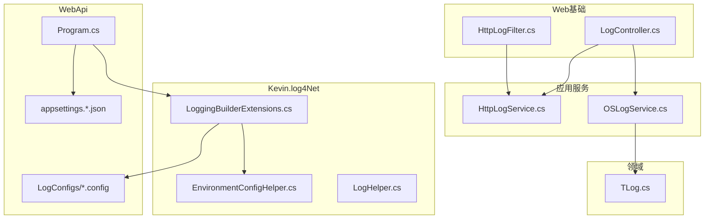
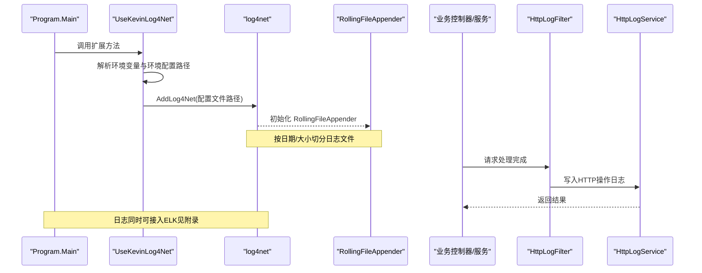
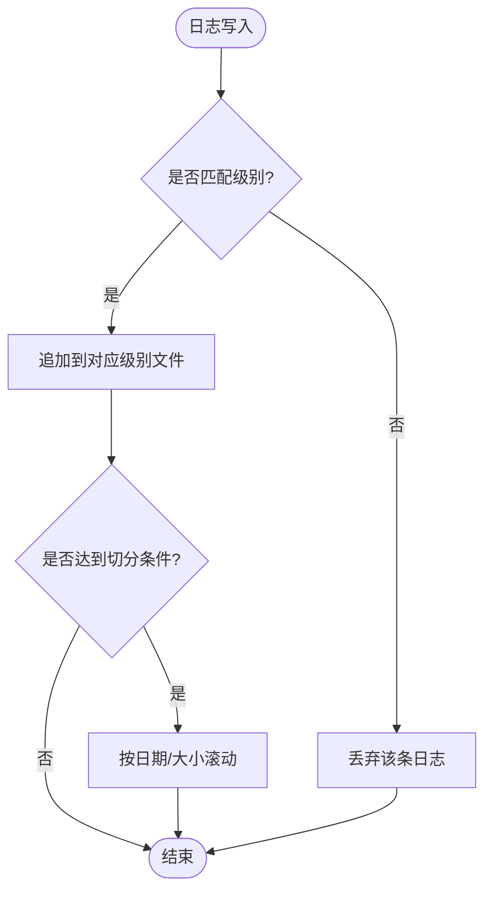
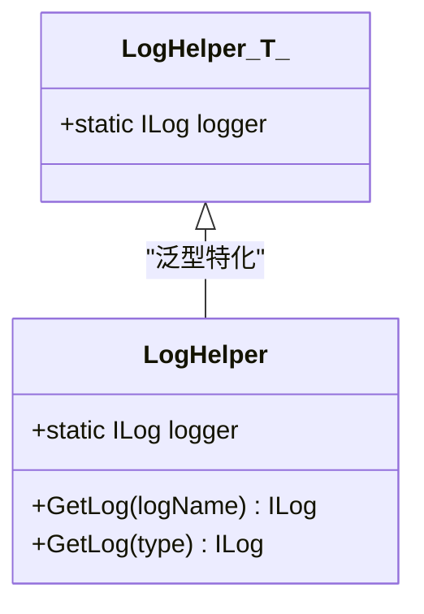
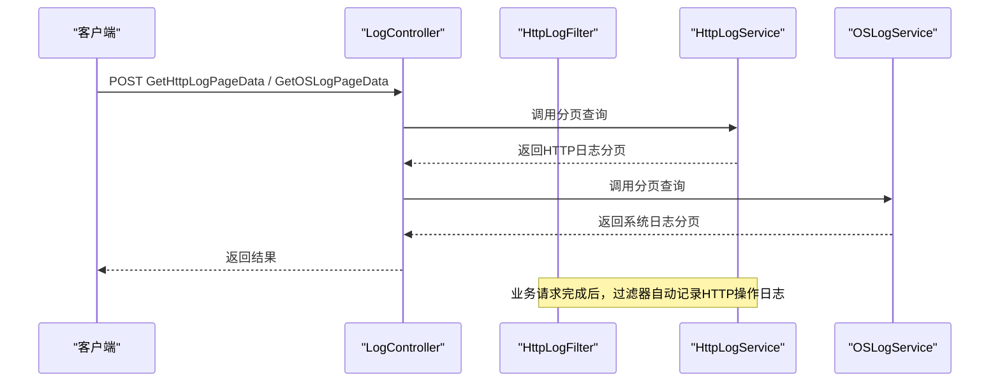
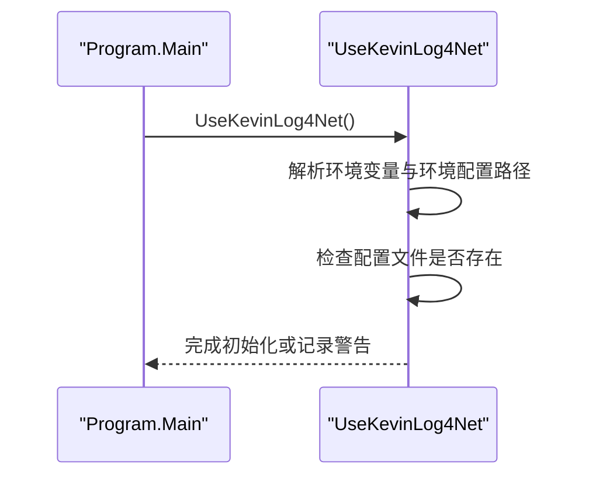
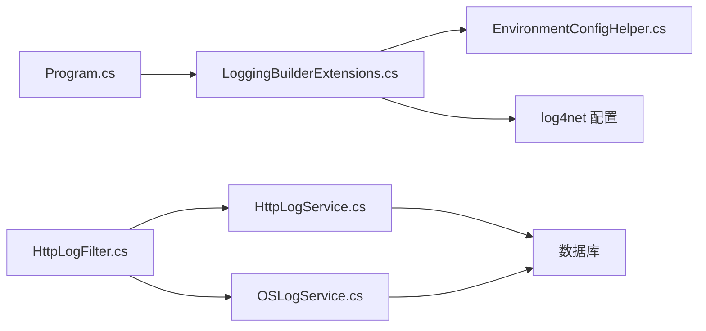

# 日志监控

<cite>
**本文引用的文件**
- [LogHelper.cs](file://Kevin/kevin.Module/Kevin.log4Net/LogHelper.cs)
- [LoggingBuilderExtensions.cs](file://Kevin/kevin.Module/Kevin.log4Net/LoggingBuilderExtensions.cs)
- [EnvironmentConfigHelper.cs](file://Kevin/kevin.Module/Kevin.log4Net/EnvironmentConfigHelper.cs)
- [Program.cs](file://App/WebApi/Program.cs)
- [log4.config](file://App/WebApi/LogConfigs/log4.config)
- [log4.Development.config](file://App/WebApi/LogConfigs/log4.Development.config)
- [log4.Test.config](file://App/WebApi/LogConfigs/log4.Test.config)
- [appsettings.json](file://App/WebApi/appsettings.json)
- [appsettings.Development.json](file://App/WebApi/appsettings.Development.json)
- [appsettings.Test.json](file://App/WebApi/appsettings.Test.json)
- [HttpLogFilter.cs](file://Kevin/Kevin.Web.Basics/Filters/HttpLogFilter.cs)
- [HttpLogService.cs](file://Kevin/Application/Services/HttpLogService.cs)
- [OSLogService.cs](file://Kevin/Application/Services/OSLogService.cs)
- [LogController.cs](file://Kevin/Kevin.Web.Basics/Controllers/LogController.cs)
- [TLog.cs](file://Kevin/Domain/Entities/TLog.cs)
</cite>

## 目录
1. [简介](#简介)
2. [项目结构](#项目结构)
3. [核心组件](#核心组件)
4. [架构总览](#架构总览)
5. [详细组件分析](#详细组件分析)
6. [依赖关系分析](#依赖关系分析)
7. [性能考虑](#性能考虑)
8. [故障排查指南](#故障排查指南)
9. [结论](#结论)
10. [附录](#附录)

## 简介
本文件面向 NetCoreKevin 框架的日志与监控能力，覆盖以下主题：
- log4net 配置文件结构与多环境日志级别、输出格式、存储位置
- LogHelper 工具类的信息、警告、错误日志记录方式
- 日志轮转策略（按时间与大小）与管理方案
- 集成 ELK（Elasticsearch、Logstash、Kibana）或同类日志平台的路径建议
- 日志查询语法、监控指标定义与告警规则配置建议
- 分布式追踪与链路跟踪的实现思路

## 项目结构
日志相关代码主要分布在以下模块：
- Kevin.log4Net：提供日志扩展、环境选择、动态日志器创建与滚动文件输出
- App.WebApi：包含各环境的 log4net 配置文件与程序启动入口
- Web 基础层：HTTP 操作日志过滤器与服务
- 应用服务层：系统操作日志服务
- 领域实体：通用日志实体

**图表来源**
- [Program.cs:23-31](file://App/WebApi/Program.cs#L23-L31)
- [LoggingBuilderExtensions.cs:9-37](file://Kevin/kevin.Module/Kevin.log4Net/LoggingBuilderExtensions.cs#L9-L37)
- [EnvironmentConfigHelper.cs:10-17](file://Kevin/kevin.Module/Kevin.log4Net/EnvironmentConfigHelper.cs#L10-L17)
- [log4.config:1-137](file://App/WebApi/LogConfigs/log4.config#L1-L137)
- [HttpLogFilter.cs:12-35](file://Kevin/Kevin.Web.Basics/Filters/HttpLogFilter.cs#L12-L35)
- [HttpLogService.cs:17-33](file://Kevin/Application/Services/HttpLogService.cs#L17-L33)
- [OSLogService.cs:15-34](file://Kevin/Application/Services/OSLogService.cs#L15-L34)
- [TLog.cs:13-42](file://Kevin/Domain/Entities/TLog.cs#L13-L42)

**章节来源**
- [Program.cs:23-31](file://App/WebApi/Program.cs#L23-L31)
- [LoggingBuilderExtensions.cs:9-37](file://Kevin/kevin.Module/Kevin.log4Net/LoggingBuilderExtensions.cs#L9-L37)
- [EnvironmentConfigHelper.cs:10-17](file://Kevin/kevin.Module/Kevin.log4Net/EnvironmentConfigHelper.cs#L10-L17)
- [log4.config:1-137](file://App/WebApi/LogConfigs/log4.config#L1-L137)

## 核心组件
- 日志扩展与配置加载
  - 通过扩展方法在应用启动时加载 log4net 配置文件，自动根据环境变量选择对应配置文件路径。
  - 若配置文件不存在，会记录警告并跳过初始化，避免启动失败。
- 动态日志器与滚动文件
  - 提供按名称与类型获取 ILog 的方式；支持为每个日志名按天生成独立仓库与滚动文件，便于隔离与归档。
- HTTP 操作日志
  - 通过结果过滤器拦截控制器执行结果，结合特性标记写入 HTTP 操作日志。
- 系统操作日志
  - 提供分页查询与过滤能力，用于查看关键数据变更等系统级日志。
- 通用日志实体
  - 统一的日志表模型，支持标记、类型、内容等字段，并可触发领域事件。

**章节来源**
- [LoggingBuilderExtensions.cs:9-37](file://Kevin/kevin.Module/Kevin.log4Net/LoggingBuilderExtensions.cs#L9-L37)
- [LogHelper.cs:19-61](file://Kevin/kevin.Module/Kevin.log4Net/LogHelper.cs#L19-L61)
- [HttpLogFilter.cs:12-35](file://Kevin/Kevin.Web.Basics/Filters/HttpLogFilter.cs#L12-L35)
- [HttpLogService.cs:17-33](file://Kevin/Application/Services/HttpLogService.cs#L17-L33)
- [OSLogService.cs:15-34](file://Kevin/Application/Services/OSLogService.cs#L15-L34)
- [TLog.cs:13-42](file://Kevin/Domain/Entities/TLog.cs#L13-L42)

## 架构总览
下图展示了从应用启动到日志落盘与业务日志记录的完整流程。

**图表来源**
- [Program.cs:23-31](file://App/WebApi/Program.cs#L23-L31)
- [LoggingBuilderExtensions.cs:9-37](file://Kevin/kevin.Module/Kevin.log4Net/LoggingBuilderExtensions.cs#L9-L37)
- [log4.config:1-137](file://App/WebApi/LogConfigs/log4.config#L1-L137)
- [HttpLogFilter.cs:12-35](file://Kevin/Kevin.Web.Basics/Filters/HttpLogFilter.cs#L12-L35)
- [HttpLogService.cs:17-33](file://Kevin/Application/Services/HttpLogService.cs#L17-L33)

## 详细组件分析

### log4net 配置文件结构与环境差异
- 文件组织
  - 默认与多环境配置文件位于 App/WebApi/LogConfigs 下，分别对应开发、测试与通用场景。
- 输出目标与格式
  - 使用 RollingFileAppender 将日志按级别拆分输出到不同文件，文件名按日期模式生成。
  - 使用 PatternLayout 定义输出格式，包含时间、线程ID、级别、对象、消息等。
- 存储位置
  - 日志根目录为相对路径 Log/，实际落盘由运行目录决定。
- 轮转策略
  - 同时配置了 Size 与 Date 两种滚动风格，并以最小锁定模式允许多进程并发写入。
  - 最大保留备份数与单文件大小限制已配置，可按需调整。
- 级别控制
  - root 节点设置全局最低级别；各 appender 通过 LevelRangeFilter 精确过滤各自级别。
  - 针对第三方库（如 NHibernate）单独设置更严格的级别以减少噪音。

**图表来源**
- [log4.config:4-132](file://App/WebApi/LogConfigs/log4.config#L4-L132)
- [log4.Development.config:4-132](file://App/WebApi/LogConfigs/log4.Development.config#L4-L132)
- [log4.Test.config:4-132](file://App/WebApi/LogConfigs/log4.Test.config#L4-L132)

**章节来源**
- [log4.config:4-132](file://App/WebApi/LogConfigs/log4.config#L4-L132)
- [log4.Development.config:4-132](file://App/WebApi/LogConfigs/log4.Development.config#L4-L132)
- [log4.Test.config:4-132](file://App/WebApi/LogConfigs/log4.Test.config#L4-L132)

### LogHelper 工具类使用方法
- 获取日志器
  - 按名称获取：会为每个“名称+日期”组合创建独立的 Repository 与 RollingFileAppender，实现按日隔离与滚动。
  - 按类型获取：直接基于类型创建标准 ILog。
- 日志级别
  - 通过 ILog 提供的 Debug/Info/Warn/Error 等方法记录不同级别日志。
- 输出格式
  - 动态创建的日志器使用自定义 PatternLayout，包含时间、线程、级别、位置、消息等。
- 并发安全
  - 使用字典缓存与锁保证多线程环境下日志器实例的唯一性与线程安全。

**图表来源**
- [LogHelper.cs:8-74](file://Kevin/kevin.Module/Kevin.log4Net/LogHelper.cs#L8-L74)

**章节来源**
- [LogHelper.cs:19-61](file://Kevin/kevin.Module/Kevin.log4Net/LogHelper.cs#L19-L61)

### HTTP 操作日志与系统日志
- HTTP 操作日志
  - 通过结果过滤器在控制器执行完成后，读取方法上的特性参数，调用 HttpLogService 写入操作日志。
  - 支持分页查询与关键字过滤，便于运维与审计。
- 系统操作日志
  - OSLogService 提供分页查询能力，支持对内容、标记、表名、主键等多维度检索。
- 控制器暴露
  - LogController 暴露两个接口，分别用于获取 HTTP 日志与系统日志的分页数据。

**图表来源**
- [LogController.cs:31-47](file://Kevin/Kevin.Web.Basics/Controllers/LogController.cs#L31-L47)
- [HttpLogFilter.cs:12-35](file://Kevin/Kevin.Web.Basics/Filters/HttpLogFilter.cs#L12-L35)
- [HttpLogService.cs:17-33](file://Kevin/Application/Services/HttpLogService.cs#L17-L33)
- [OSLogService.cs:15-34](file://Kevin/Application/Services/OSLogService.cs#L15-L34)

**章节来源**
- [LogController.cs:31-47](file://Kevin/Kevin.Web.Basics/Controllers/LogController.cs#L31-L47)
- [HttpLogFilter.cs:12-35](file://Kevin/Kevin.Web.Basics/Filters/HttpLogFilter.cs#L12-L35)
- [HttpLogService.cs:17-33](file://Kevin/Application/Services/HttpLogService.cs#L17-L33)
- [OSLogService.cs:15-34](file://Kevin/Application/Services/OSLogService.cs#L15-L34)

### 应用启动与日志集成
- Program 中调用扩展方法启用日志，确保应用启动阶段即可记录异常与关键信息。
- 扩展方法会根据环境变量选择对应的 log4net 配置文件路径，若未找到则记录警告并跳过。

**图表来源**
- [Program.cs:23-31](file://App/WebApi/Program.cs#L23-L31)
- [LoggingBuilderExtensions.cs:9-37](file://Kevin/kevin.Module/Kevin.log4Net/LoggingBuilderExtensions.cs#L9-L37)
- [EnvironmentConfigHelper.cs:10-17](file://Kevin/kevin.Module/Kevin.log4Net/EnvironmentConfigHelper.cs#L10-L17)

**章节来源**
- [Program.cs:23-31](file://App/WebApi/Program.cs#L23-L31)
- [LoggingBuilderExtensions.cs:9-37](file://Kevin/kevin.Module/Kevin.log4Net/LoggingBuilderExtensions.cs#L9-L37)
- [EnvironmentConfigHelper.cs:10-17](file://Kevin/kevin.Module/Kevin.log4Net/EnvironmentConfigHelper.cs#L10-L17)

## 依赖关系分析
- 启动依赖
  - Program 依赖 LoggingBuilderExtensions 以加载 log4net 配置。
  - LoggingBuilderExtensions 依赖 EnvironmentConfigHelper 获取当前环境。
- 运行时依赖
  - 业务控制器通过 HttpLogFilter 自动记录 HTTP 操作日志。
  - 日志查询通过 HttpLogService 与 OSLogService 访问仓储与数据库。
- 配置依赖
  - appsettings.*.json 中的 Logging 节点影响 Microsoft 日志框架级别，与 log4net 级别相互独立但可协同。

**图表来源**
- [Program.cs:23-31](file://App/WebApi/Program.cs#L23-L31)
- [LoggingBuilderExtensions.cs:9-37](file://Kevin/kevin.Module/Kevin.log4Net/LoggingBuilderExtensions.cs#L9-L37)
- [EnvironmentConfigHelper.cs:10-17](file://Kevin/kevin.Module/Kevin.log4Net/EnvironmentConfigHelper.cs#L10-L17)
- [HttpLogFilter.cs:12-35](file://Kevin/Kevin.Web.Basics/Filters/HttpLogFilter.cs#L12-L35)
- [HttpLogService.cs:17-33](file://Kevin/Application/Services/HttpLogService.cs#L17-L33)
- [OSLogService.cs:15-34](file://Kevin/Application/Services/OSLogService.cs#L15-L34)

**章节来源**
- [Program.cs:23-31](file://App/WebApi/Program.cs#L23-L31)
- [LoggingBuilderExtensions.cs:9-37](file://Kevin/kevin.Module/Kevin.log4Net/LoggingBuilderExtensions.cs#L9-L37)
- [HttpLogFilter.cs:12-35](file://Kevin/Kevin.Web.Basics/Filters/HttpLogFilter.cs#L12-L35)
- [HttpLogService.cs:17-33](file://Kevin/Application/Services/HttpLogService.cs#L17-L33)
- [OSLogService.cs:15-34](file://Kevin/Application/Services/OSLogService.cs#L15-L34)

## 性能考虑
- 滚动策略
  - 同时启用 Size 与 Date 滚动，需注意两者叠加可能带来的频繁切换开销；建议根据业务量选择其一为主。
- 文件大小与保留
  - 单文件大小与最大备份数应结合磁盘容量与合规要求设定，避免磁盘写满。
- 并发写入
  - 使用最小锁定模式提升多进程并发写入能力，减少锁竞争。
- 日志级别
  - 生产环境建议提高默认级别，降低 INFO/DEBUG 日志量，仅保留必要级别。
- 异步与缓冲
  - 若后续接入 ELK，建议使用缓冲与批量发送以降低 IO 压力。

[本节为通用指导，不直接分析具体文件]

## 故障排查指南
- 配置文件未找到
  - 现象：启动时记录警告并跳过日志初始化。
  - 排查：确认环境变量是否正确设置，配置文件路径是否可被解析到运行目录。
- 日志未落盘
  - 现象：Log/ 目录下无文件或未按预期滚动。
  - 排查：检查 RollingFileAppender 的 file、datePattern、rollingStyle、maximumFileSize 等配置项；确认目录权限。
- 日志级别不符合预期
  - 现象：某些级别日志未输出。
  - 排查：核对 root 级别与各 appender 的 LevelRangeFilter；确认 log4net 与 Microsoft 日志框架级别互不影响。
- HTTP 操作日志未记录
  - 现象：调用接口后未产生操作日志。
  - 排查：确认过滤器是否注册生效，方法上是否有正确的特性标记，以及 HttpLogService.Add 是否成功。

**章节来源**
- [LoggingBuilderExtensions.cs:27-37](file://Kevin/kevin.Module/Kevin.log4Net/LoggingBuilderExtensions.cs#L27-L37)
- [log4.config:4-132](file://App/WebApi/LogConfigs/log4.config#L4-L132)
- [HttpLogFilter.cs:12-35](file://Kevin/Kevin.Web.Basics/Filters/HttpLogFilter.cs#L12-L35)
- [HttpLogService.cs:31-33](file://Kevin/Application/Services/HttpLogService.cs#L31-L33)

## 结论
- 本项目通过 Kevin.log4Net 提供了灵活的日志初始化与动态日志器管理，结合多环境配置文件实现了细粒度的日志级别与输出控制。
- HTTP 与系统操作日志形成了完整的可观测性闭环，便于问题定位与审计。
- 日志轮转策略兼顾时间与大小，满足日常运维需求；如需集中化分析，可平滑接入 ELK。
- 建议在生产环境收紧日志级别、优化滚动策略，并结合监控与告警体系提升可观测性。

[本节为总结，不直接分析具体文件]

## 附录

### ELK 集成建议
- 现状
  - 配置文件中预留了 ElasticSearchAppender 的注释片段，表明具备接入 Elasticsearch 的基础。
- 推荐路径
  - 方案A：启用 log4net 的 ElasticSearchAppender，直接推送日志至 Elasticsearch。
  - 方案B：保持文件落地，使用 Filebeat/Fluent Bit 采集日志文件并转发至 Logstash，再写入 Elasticsearch。
- 注意事项
  - 合理设置缓冲区大小与索引命名策略，避免高频写入造成性能抖动。
  - 在 Kibana 中建立索引模式与可视化面板，便于快速检索与分析。

[本节为概念性说明，不直接分析具体文件]

### 日志查询语法（Kibana 示例）
- 按级别筛选
  - level: "ERROR"
- 按时间范围
  - @timestamp:[now-1h TO now]
- 关键字搜索
  - message:*异常*
- 组合查询
  - level: "WARN" AND message:*连接超时*

[本节为概念性说明，不直接分析具体文件]

### 监控指标定义（建议）
- 日志总量：单位时间内写入的日志条目数
- 错误率：ERROR/FATAL 级别日志占比
- 慢请求：伴随慢请求的 ERROR 日志数量
- 资源占用：日志文件大小增长速率、磁盘使用率
- 可用性：日志服务健康状态（如 ES 集群健康）

[本节为概念性说明，不直接分析具体文件]

### 告警规则配置（建议）
- 错误率突增：当 ERROR 级别日志占比超过阈值（如 5%）时触发告警
- 慢请求增多：单位时间内慢请求相关 ERROR 日志超过阈值
- 磁盘空间不足：日志目录所在磁盘使用率超过阈值（如 85%）
- 服务不可用：ES 集群健康状态变为 yellow/red

[本节为概念性说明，不直接分析具体文件]

### 分布式追踪与链路跟踪（建议）
- 统一 TraceId
  - 在请求入口处生成唯一 TraceId，贯穿所有子系统与下游调用。
- 日志关联
  - 将 TraceId 注入到每条日志中，便于跨服务串联查询。
- 工具链
  - 可使用 OpenTelemetry 或 SkyWalking 等开源方案进行埋点与采集。
- 可视化
  - 在 Kibana 或 APM 系统中按 TraceId 聚合展示调用链路与耗时。

[本节为概念性说明，不直接分析具体文件]