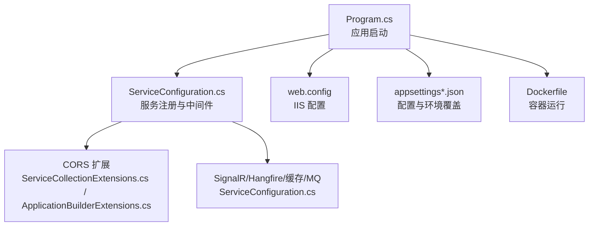
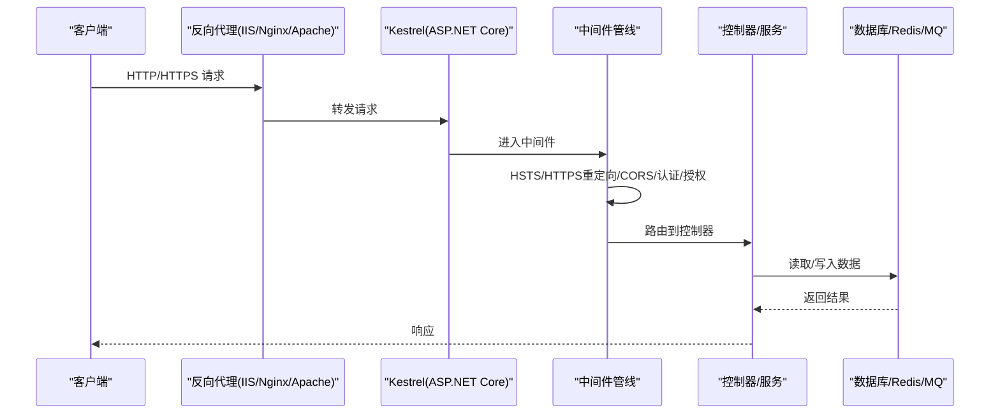
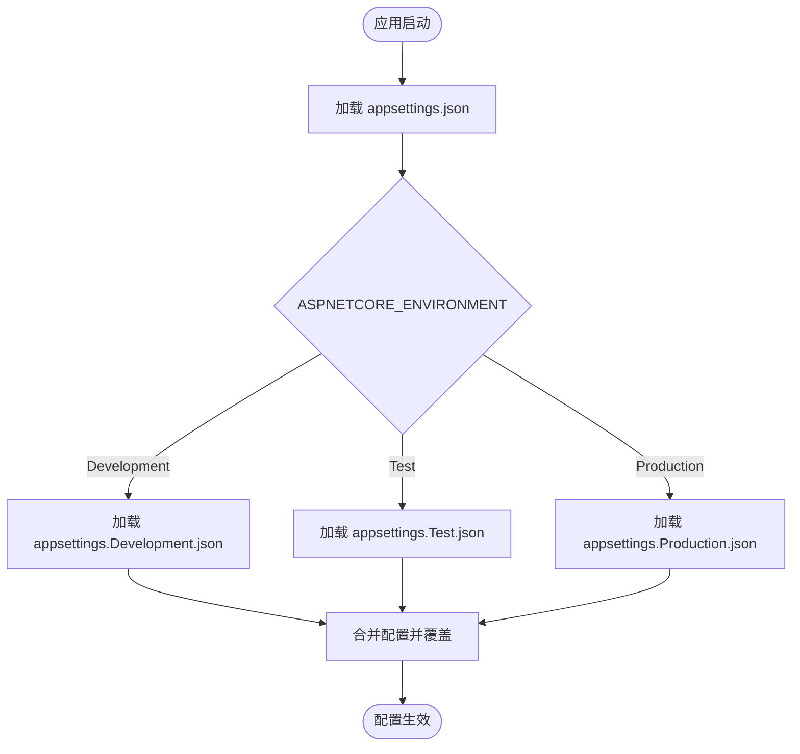
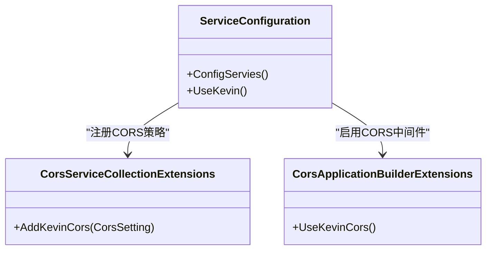
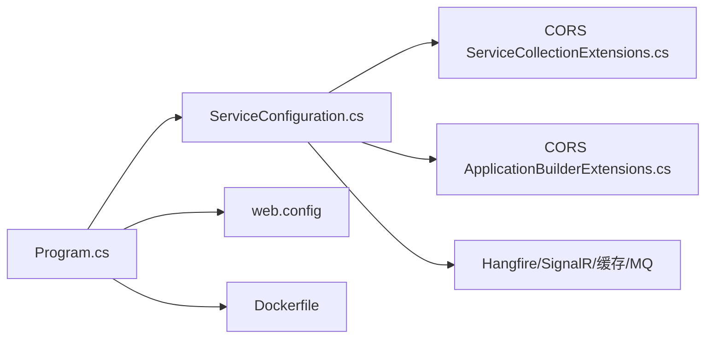

# 生产环境部署

<cite>
**本文引用的文件**
- [Program.cs](file://App/WebApi/Program.cs)
- [appsettings.json](file://App/WebApi/appsettings.json)
- [appsettings.Development.json](file://App/WebApi/appsettings.Development.json)
- [appsettings.Test.json](file://App/WebApi/appsettings.Test.json)
- [web.config](file://App/WebApi/web.config)
- [ServiceConfiguration.cs](file://Kevin/Kevin.Web.Basics/Extensions/ServiceConfiguration.cs)
- [ServiceCollectionExtensions.cs（CORS）](file://Kevin/Kevin.Module/Kevin.Cors/ServiceCollectionExtensions.cs)
- [ApplicationBuilderExtensions.cs（CORS）](file://Kevin/Kevin.Module/Kevin.Cors/ApplicationBuilderExtensions.cs)
- [Dockerfile](file://App/WebApi/Dockerfile)
- [环境变量设置.txt](file://Doc/项目相关/环境变量设置.txt)
</cite>

## 目录
1. [简介](#简介)
2. [项目结构](#项目结构)
3. [核心组件](#核心组件)
4. [架构总览](#架构总览)
5. [详细组件分析](#详细组件分析)
6. [依赖关系分析](#依赖关系分析)
7. [性能调优与参数](#性能调优与参数)
8. [反向代理与HTTPS配置](#反向代理与https配置)
9. [负载均衡、会话保持与高可用](#负载均衡会话保持与高可用)
10. [故障排查指南](#故障排查指南)
11. [结论](#结论)

## 简介
本指南面向 NetCoreKevin 框架的生产环境部署，覆盖多环境配置管理策略、IIS/Nginx/Apache 反向代理、HTTPS 证书、CORS 跨域与安全头、性能调优参数、以及负载均衡与会话保持的高可用方案。文档基于仓库中的实际代码与配置文件进行说明，确保可落地执行。

## 项目结构
- Web 入口：App/WebApi/Program.cs 负责应用启动、中间件管线、异常处理、GC 限制、日志与模块初始化。
- 配置中心：App/WebApi/appsettings.json 为默认配置；Development/Test 环境通过同名 appsettings.{Environment}.json 覆盖；环境变量 ASPNETCORE_ENVIRONMENT 控制加载哪个环境配置。
- IIS 支持：App/WebApi/web.config 用于 IIS 请求大小限制与移除 WebDAVModule。
- 服务注册与中间件：Kevin/Kevin.Web.Basics/Extensions/ServiceConfiguration.cs 集中注册服务、Kestrel/IIS 选项、HSTS、CORS、SignalR、Hangfire、缓存、消息队列等。
- CORS 扩展：Kevin/Kevin.Module/Kevin.Cors 提供跨域策略注入与启用。
- 容器化：App/WebApi/Dockerfile 定义镜像构建与运行端口。

**图表来源**
- [Program.cs:23-85](file://App/WebApi/Program.cs#L23-L85)
- [ServiceConfiguration.cs:48-347](file://Kevin/Kevin.Web.Basics/Extensions/ServiceConfiguration.cs#L48-L347)
- [ServiceCollectionExtensions.cs（CORS）:9-30](file://Kevin/Kevin.Module/Kevin.Cors/ServiceCollectionExtensions.cs#L9-L30)
- [ApplicationBuilderExtensions.cs（CORS）:7-11](file://Kevin/Kevin.Module/Kevin.Cors/ApplicationBuilderExtensions.cs#L7-L11)
- [web.config:1-16](file://App/WebApi/web.config#L1-L16)
- [Dockerfile:1-74](file://App/WebApi/Dockerfile#L1-L74)

**章节来源**
- [Program.cs:23-85](file://App/WebApi/Program.cs#L23-L85)
- [ServiceConfiguration.cs:48-347](file://Kevin/Kevin.Web.Basics/Extensions/ServiceConfiguration.cs#L48-L347)
- [web.config:1-16](file://App/WebApi/web.config#L1-L16)
- [Dockerfile:1-74](file://App/WebApi/Dockerfile#L1-L74)

## 核心组件
- 应用启动与中间件管线：在 Program.Main 中完成环境设置、日志、异常处理、堆内存硬限制、全局服务注入与 UseKevin 初始化。
- 服务注册：ServiceConfiguration.ConfigServies 统一注册 JSON 压缩、表单大小、Kestrel/IIS 同步 IO、HSTS、JWT、权限、过滤器、JSON 序列化、API 版本、缓存、分布式锁、SignalR、短信、文件存储、MQ、邮件、AI/RAG、代码生成器、Hangfire、IOC 替换等。
- CORS：通过 CorsSetting 注入策略，并在管道中启用。
- 静态文件：UseStaticFiles 挂载自定义路径 KevinFlies。
- 安全与 HTTPS：UseHttpsRedirection 强制重定向到 HTTPS，HSTS 启用。

**章节来源**
- [Program.cs:23-85](file://App/WebApi/Program.cs#L23-L85)
- [ServiceConfiguration.cs:48-347](file://Kevin/Kevin.Web.Basics/Extensions/ServiceConfiguration.cs#L48-L347)

## 架构总览
下图展示从客户端到应用的请求流程，包括反向代理、Kestrel、中间件与业务服务。

**图表来源**
- [Program.cs:59-85](file://App/WebApi/Program.cs#L59-L85)
- [ServiceConfiguration.cs:296-347](file://Kevin/Kevin.Web.Basics/Extensions/ServiceConfiguration.cs#L296-L347)

## 详细组件分析

### 配置管理与环境覆盖
- 默认配置：appsettings.json 包含连接串、JWT、CORS、Consul、第三方云服务、RabbitMQ、邮件、雪花ID、AI/RAG 等配置。
- 环境覆盖：appsettings.Development.json 与 appsettings.Test.json 分别覆盖开发/测试环境的配置项（如日志级别、连接串、外部服务地址）。
- 环境变量：通过 ASPNETCORE_ENVIRONMENT 指定当前环境，从而加载对应 appsettings.{Environment}.json。
- 建议：生产环境使用独立 appsettings.Production.json 或环境变量覆盖敏感配置（连接串、密钥），避免将密钥写入配置文件。

**图表来源**
- [appsettings.json:1-166](file://App/WebApi/appsettings.json#L1-L166)
- [appsettings.Development.json:1-167](file://App/WebApi/appsettings.Development.json#L1-L167)
- [appsettings.Test.json:1-167](file://App/WebApi/appsettings.Test.json#L1-L167)
- [环境变量设置.txt:1-15](file://Doc/项目相关/环境变量设置.txt#L1-L15)

**章节来源**
- [appsettings.json:1-166](file://App/WebApi/appsettings.json#L1-L166)
- [appsettings.Development.json:1-167](file://App/WebApi/appsettings.Development.json#L1-L167)
- [appsettings.Test.json:1-167](file://App/WebApi/appsettings.Test.json#L1-L167)
- [环境变量设置.txt:1-15](file://Doc/项目相关/环境变量设置.txt#L1-L15)

### web.config 在生产环境的作用
- 请求体大小限制：requestLimits 的 maxAllowedContentLength 调整上传大小上限。
- 移除 WebDAVModule：避免与 ASP.NET Core 管道冲突。
- 适用场景：当以 IIS 作为反向代理或宿主时生效。

**章节来源**
- [web.config:1-16](file://App/WebApi/web.config#L1-L16)

### CORS 跨域与安全头
- 跨域策略：通过 CorsSetting 注入允许的来源列表，若未配置则回退到本机 IP。
- 中间件启用：UseKevinCors 调用 UseCors 启用跨域。
- 安全头：UseHsts 启用 HSTS，UseHttpsRedirection 强制 HTTPS 重定向。

**图表来源**
- [ServiceConfiguration.cs:121-134](file://Kevin/Kevin.Web.Basics/Extensions/ServiceConfiguration.cs#L121-L134)
- [ServiceConfiguration.cs:296-305](file://Kevin/Kevin.Web.Basics/Extensions/ServiceConfiguration.cs#L296-L305)
- [ServiceCollectionExtensions.cs（CORS）:9-30](file://Kevin/Kevin.Module/Kevin.Cors/ServiceCollectionExtensions.cs#L9-L30)
- [ApplicationBuilderExtensions.cs（CORS）:7-11](file://Kevin/Kevin.Module/Kevin.Cors/ApplicationBuilderExtensions.cs#L7-L11)

**章节来源**
- [ServiceConfiguration.cs:121-134](file://Kevin/Kevin.Web.Basics/Extensions/ServiceConfiguration.cs#L121-L134)
- [ServiceConfiguration.cs:296-305](file://Kevin/Kevin.Web.Basics/Extensions/ServiceConfiguration.cs#L296-L305)
- [ServiceCollectionExtensions.cs（CORS）:9-30](file://Kevin/Kevin.Module/Kevin.Cors/ServiceCollectionExtensions.cs#L9-L30)
- [ApplicationBuilderExtensions.cs（CORS）:7-11](file://Kevin/Kevin.Module/Kevin.Cors/ApplicationBuilderExtensions.cs#L7-L11)

### HTTPS 证书与 Kestrel
- 代码中提供了注释示例，可在 Kestrel 中绑定证书并监听 https。
- 生产建议：通常由反向代理（IIS/Nginx/Apache）终止 TLS，应用仅处理 HTTP；如需 Kestrel 直接 HTTPS，请取消注释并配置证书路径与密码。

**章节来源**
- [Program.cs:31-41](file://App/WebApi/Program.cs#L31-L41)

### 反向代理配置（IIS、Nginx、Apache）
- IIS：
  - 使用 web.config 调整请求大小与移除 WebDAVModule。
  - 通过 IIS 反向代理将公网域名映射到本地端口（如 8080）。
  - 在 IIS 上配置 HTTPS 证书与 HSTS。
- Nginx：
  - 将 / 反向代理到 http://localhost:8080。
  - 开启 gzip/br 压缩，设置超时与缓冲。
  - 配置 HTTPS 证书与 HSTS。
- Apache：
  - 使用 mod_proxy_http2 将 / 反向代理到 http://localhost:8080。
  - 开启压缩与安全头。
  - 配置 HTTPS 证书与 HSTS。

[本节为通用实践说明，不直接引用具体代码文件]

### 性能调优参数
- Kestrel：
  - AllowSynchronousIO = true（兼容部分库）。
  - MaxRequestBodySize = int.MaxValue（大文件上传）。
- IIS：
  - AllowSynchronousIO = true。
- 响应压缩：已启用 AddResponseCompression/UseResponseCompression。
- JSON 序列化：
  - 自定义转换器、UnsafeRelaxedJsonEscaping、WriteIndented、MaxDepth=128。
- 堆内存硬限制：
  - GCHeapHardLimit 设置为 1GB（可根据服务器内存调整）。
- 连接池：
  - EF Core DbContextPool 已配置（连接池大小 100）。
- 静态文件：
  - UseStaticFiles 挂载 KevinFlies 目录。

**章节来源**
- [ServiceConfiguration.cs:54-77](file://Kevin/Kevin.Web.Basics/Extensions/ServiceConfiguration.cs#L54-L77)
- [ServiceConfiguration.cs:108-116](file://Kevin/Kevin.Web.Basics/Extensions/ServiceConfiguration.cs#L108-L116)
- [ServiceConfiguration.cs:306-312](file://Kevin/Kevin.Web.Basics/Extensions/ServiceConfiguration.cs#L306-L312)
- [Program.cs:79-81](file://App/WebApi/Program.cs#L79-L81)
- [ServiceConfiguration.cs:370-373](file://Kevin/Kevin.Web.Basics/Extensions/ServiceConfiguration.cs#L370-L373)

### 负载均衡、会话保持与高可用
- 无状态设计：
  - 应用本身无进程内会话，适合水平扩展。
  - 使用 Redis 作为 SignalR 后端与分布式锁/缓存，保证多实例一致性。
- 负载均衡：
  - 在反向代理层（Nginx/IIS ARR/Apache）配置多个后端实例轮询。
- 会话保持：
  - 若前端需要粘性会话，可在反向代理层配置基于 Cookie/IP 的亲和性。
- 高可用：
  - 多实例部署 + 健康检查（ConsulSetting 中定义了健康检查端点）。
  - 关键依赖（数据库、Redis、MQ）集群化部署。

**章节来源**
- [ServiceConfiguration.cs:135-147](file://Kevin/Kevin.Web.Basics/Extensions/ServiceConfiguration.cs#L135-L147)
- [ServiceConfiguration.cs:126-128](file://Kevin/Kevin.Web.Basics/Extensions/ServiceConfiguration.cs#L126-L128)
- [appsettings.json:51-57](file://App/WebApi/appsettings.json#L51-L57)

## 依赖关系分析
- Program 依赖 ServiceConfiguration 完成服务注册与中间件管线。
- ServiceConfiguration 依赖 CORS、SignalR、Hangfire、缓存、MQ、AI/RAG 等模块。
- CORS 模块通过 ServiceCollectionExtensions 注入策略，通过 ApplicationBuilderExtensions 启用中间件。
- web.config 影响 IIS 行为。
- Dockerfile 定义容器运行环境与端口。

**图表来源**
- [Program.cs:23-85](file://App/WebApi/Program.cs#L23-L85)
- [ServiceConfiguration.cs:48-347](file://Kevin/Kevin.Web.Basics/Extensions/ServiceConfiguration.cs#L48-L347)
- [ServiceCollectionExtensions.cs（CORS）:9-30](file://Kevin/Kevin.Module/Kevin.Cors/ServiceCollectionExtensions.cs#L9-L30)
- [ApplicationBuilderExtensions.cs（CORS）:7-11](file://Kevin/Kevin.Module/Kevin.Cors/ApplicationBuilderExtensions.cs#L7-L11)
- [web.config:1-16](file://App/WebApi/web.config#L1-L16)
- [Dockerfile:1-74](file://App/WebApi/Dockerfile#L1-L74)

**章节来源**
- [Program.cs:23-85](file://App/WebApi/Program.cs#L23-L85)
- [ServiceConfiguration.cs:48-347](file://Kevin/Kevin.Web.Basics/Extensions/ServiceConfiguration.cs#L48-L347)

## 性能调优与参数
- 请求与响应：
  - 启用响应压缩（AddResponseCompression/UseResponseCompression）。
  - 调整表单最大长度（MultipartBodyLengthLimit 设为 long.MaxValue）。
  - 调整请求体大小（MaxRequestBodySize 设为 int.MaxValue）。
- 线程与 IO：
  - Kestrel/IIS 允许同步 IO（AllowSynchronousIO = true）。
- 序列化：
  - 自定义日期/长整型转换器，放宽 JSON 转义，设置最大深度。
- 内存：
  - 设置 GCHeapHardLimit 为 1GB（可按需调整）。
- 数据库连接池：
  - DbContextPool 大小为 100。
- 静态文件：
  - 使用 UseStaticFiles 提供静态资源访问。

**章节来源**
- [ServiceConfiguration.cs:54-77](file://Kevin/Kevin.Web.Basics/Extensions/ServiceConfiguration.cs#L54-L77)
- [ServiceConfiguration.cs:108-116](file://Kevin/Kevin.Web.Basics/Extensions/ServiceConfiguration.cs#L108-L116)
- [ServiceConfiguration.cs:306-312](file://Kevin/Kevin.Web.Basics/Extensions/ServiceConfiguration.cs#L306-L312)
- [Program.cs:79-81](file://App/WebApi/Program.cs#L79-L81)
- [ServiceConfiguration.cs:370-373](file://Kevin/Kevin.Web.Basics/Extensions/ServiceConfiguration.cs#L370-L373)

## 反向代理与HTTPS配置
- IIS：
  - 使用 web.config 调整请求大小与移除 WebDAVModule。
  - 在 IIS 管理器中添加站点，绑定域名与 HTTPS 证书。
  - 配置反向代理将域名映射到本地端口（如 8080）。
- Nginx：
  - server 块中 listen 443 ssl，配置证书与私钥。
  - location / 反向代理到 http://localhost:8080。
  - 启用 gzip/br，设置超时与缓冲。
  - 添加安全头（如 X-Frame-Options、X-Content-Type-Options 等）。
- Apache：
  - 启用 mod_ssl 与 mod_proxy_http2。
  - 配置 VirtualHost 监听 443，设置证书。
  - ProxyPass/ProxyPassReverse 指向 http://localhost:8080。
  - 启用压缩与安全头。

[本节为通用实践说明，不直接引用具体代码文件]

## 负载均衡、会话保持与高可用
- 多实例部署：
  - 同一域名下部署多个应用实例，反向代理轮询分发。
- 会话保持：
  - 若前端需要粘性会话，反向代理层配置基于 Cookie 或源 IP 的亲和性。
- 健康检查：
  - ConsulSetting 中定义了健康检查端点，可用于负载均衡器健康探测。
- 依赖高可用：
  - 数据库、Redis、MQ 采用集群模式，避免单点故障。

**章节来源**
- [appsettings.json:51-57](file://App/WebApi/appsettings.json#L51-L57)

## 故障排查指南
- 启动失败：
  - 检查 Program.Main 中的异常捕获与日志输出。
  - 确认环境变量 ASPNETCORE_ENVIRONMENT 是否正确设置。
- 配置未生效：
  - 核对 appsettings.{Environment}.json 是否被正确加载。
  - 检查环境变量覆盖优先级。
- 跨域问题：
  - 确认 CorsSetting 中的 IPs 列表包含前端域名。
  - 确认 UseKevinCors 已在中间管线上启用。
- 大文件上传失败：
  - 检查 web.config 的 requestLimits 与 Kestrel 的 MaxRequestBodySize。
- 容器运行异常：
  - 检查 Dockerfile 暴露端口与 ASPNETCORE_URLS 环境变量。

**章节来源**
- [Program.cs:23-92](file://App/WebApi/Program.cs#L23-L92)
- [环境变量设置.txt:1-15](file://Doc/项目相关/环境变量设置.txt#L1-L15)
- [ServiceConfiguration.cs:296-347](file://Kevin/Kevin.Web.Basics/Extensions/ServiceConfiguration.cs#L296-L347)
- [web.config:1-16](file://App/WebApi/web.config#L1-L16)
- [Dockerfile:1-74](file://App/WebApi/Dockerfile#L1-L74)

## 结论
NetCoreKevin 框架在生产环境部署中，通过多环境配置覆盖、反向代理与 HTTPS、CORS 与安全头、性能参数调优、以及基于 Redis 的分布式能力，实现了可扩展、高可用的部署方案。建议在生产环境中：
- 使用独立生产配置或环境变量覆盖敏感信息。
- 在反向代理层终止 TLS 并启用 HSTS。
- 合理设置请求大小、压缩与序列化参数。
- 多实例部署并结合负载均衡与健康检查。
- 对关键依赖（数据库、Redis、MQ）进行集群化与监控。