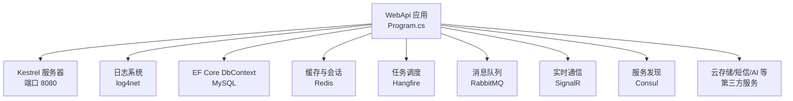
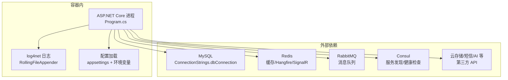
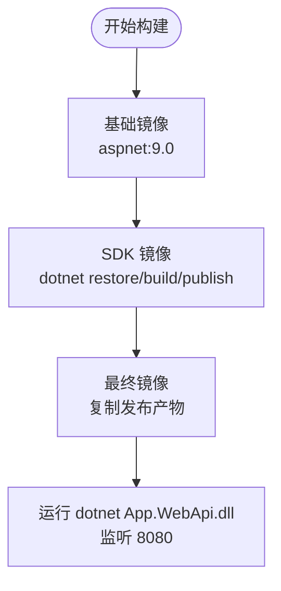
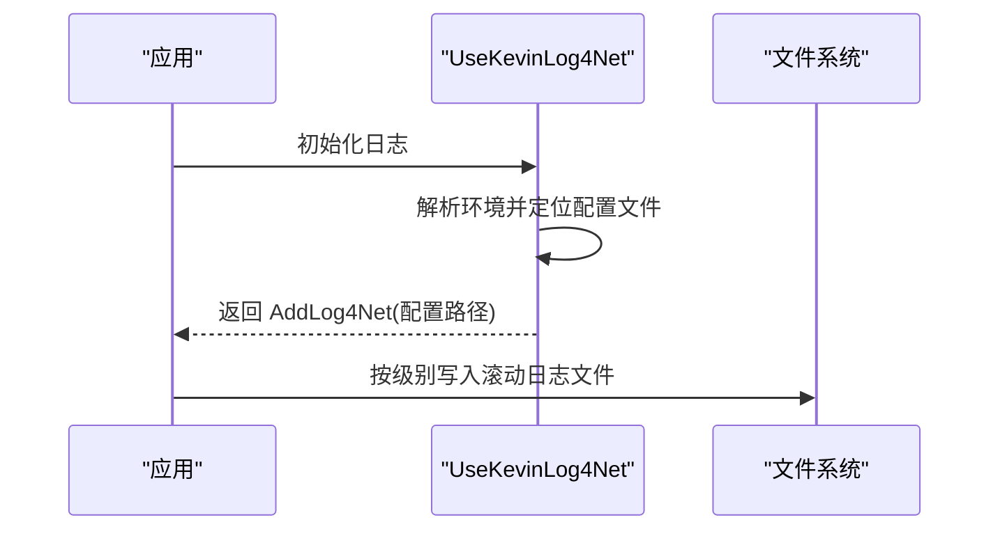
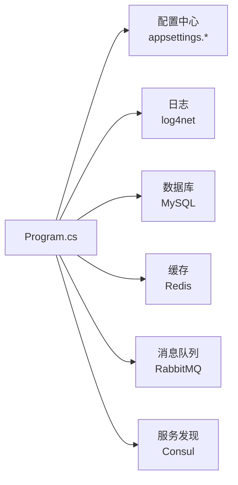

# 部署运维

<cite>
**本文引用的文件**
- [Dockerfile](file://App/WebApi/Dockerfile)
- [Program.cs](file://App/WebApi/Program.cs)
- [appsettings.json](file://App/WebApi/appsettings.json)
- [appsettings.Development.json](file://App/WebApi/appsettings.Development.json)
- [log4.config](file://App/WebApi/LogConfigs/log4.config)
- [LoggingBuilderExtensions.cs](file://Kevin/kevin.Module/Kevin.log4Net/LoggingBuilderExtensions.cs)
- [KevinDbContext.cs](file://Kevin/Kevin.EntityFrameworkCore/Database/KevinDbContext.cs)
- [web.config](file://App/WebApi/web.config)
- [docker说明.txt](file://Doc/项目相关/docker说明.txt)
- [环境变量设置.txt](file://Doc/项目相关/环境变量设置.txt)
- [SYSTEM_DOCUMENTATION.md](file://SYSTEM_DOCUMENTATION.md)
</cite>

## 目录
1. [简介](#简介)
2. [项目结构](#项目结构)
3. [核心组件](#核心组件)
4. [架构总览](#架构总览)
5. [详细组件分析](#详细组件分析)
6. [依赖关系分析](#依赖关系分析)
7. [性能考虑](#性能考虑)
8. [故障排查指南](#故障排查指南)
9. [结论](#结论)
10. [附录](#附录)

## 简介
本运维文档面向 NetCoreKevin 框架的生产部署与日常运维，覆盖容器化（Docker）构建与编排、生产环境配置与安全、日志体系（log4net）、监控指标收集与性能分析、数据库与缓存管理、第三方服务集成以及常见问题排查。目标是帮助运维人员快速、安全、稳定地交付系统并持续保障运行质量。

## 项目结构
- Web 应用入口位于 App/WebApi，包含 Dockerfile、配置文件与启动程序。
- 日志系统基于 log4net，配置文件位于 LogConfigs，运行时按环境选择对应配置。
- 数据访问层使用 EF Core，数据库连接与迁移程序集在 DbContext 中集中配置。
- 外部依赖包括 MySQL、Redis、RabbitMQ、Hangfire、SignalR、Consul、云存储与短信等，均在配置文件中声明。

图表来源
- [Program.cs:23-85](file://App/WebApi/Program.cs#L23-L85)
- [Dockerfile:3-9](file://App/WebApi/Dockerfile#L3-L9)
- [KevinDbContext.cs:83-133](file://Kevin/Kevin.EntityFrameworkCore/Database/KevinDbContext.cs#L83-L133)

章节来源
- [Dockerfile:1-74](file://App/WebApi/Dockerfile#L1-L74)
- [Program.cs:23-85](file://App/WebApi/Program.cs#L23-L85)

## 核心组件
- 应用启动与中间件：Program.cs 负责初始化日志、服务注册、异常处理、GC 限制与模块初始化。
- 配置与环境：appsettings.* 提供数据库、Redis、JWT、CORS、Consul、第三方服务等配置；环境变量用于切换环境。
- 日志系统：log4net 按级别输出到滚动文件，支持按日期与大小轮转。
- 数据访问：EF Core 通过 KevinDbContext 配置 MySQL、迁移程序集、默认索引字段与种子数据。
- 外部依赖：Redis（缓存、Hangfire、SignalR）、RabbitMQ（消息队列）、Consul（服务发现与健康检查）。

章节来源
- [Program.cs:23-85](file://App/WebApi/Program.cs#L23-L85)
- [appsettings.json:12-165](file://App/WebApi/appsettings.json#L12-L165)
- [appsettings.Development.json:12-165](file://App/WebApi/appsettings.Development.json#L12-L165)
- [log4.config:1-137](file://App/WebApi/LogConfigs/log4.config#L1-L137)
- [KevinDbContext.cs:83-133](file://Kevin/Kevin.EntityFrameworkCore/Database/KevinDbContext.cs#L83-L133)

## 架构总览
下图展示容器内 WebApi 进程与关键外部依赖的交互关系，以及日志落盘路径。

图表来源
- [Program.cs:23-85](file://App/WebApi/Program.cs#L23-L85)
- [appsettings.json:12-165](file://App/WebApi/appsettings.json#L12-L165)
- [log4.config:1-137](file://App/WebApi/LogConfigs/log4.config#L1-L137)
- [KevinDbContext.cs:83-133](file://Kevin/Kevin.EntityFrameworkCore/Database/KevinDbContext.cs#L83-L133)

## 详细组件分析

### 容器化与镜像构建
- 多阶段构建：基础镜像为 ASP.NET Runtime，构建阶段使用 SDK 恢复依赖并编译发布，最终镜像仅包含发布产物，减小体积。
- 端口与监听：容器暴露 8080 端口，并通过环境变量强制 Kestrel 监听 http://+:8080。
- 用户与安全：以非 root 用户运行，降低权限风险。
- 构建优化：关闭遥测与全球化不变量设置，提升构建稳定性与速度。

图表来源
- [Dockerfile:3-74](file://App/WebApi/Dockerfile#L3-L74)

章节来源
- [Dockerfile:1-74](file://App/WebApi/Dockerfile#L1-L74)

### 生产环境部署流程与最佳实践
- 环境配置
  - 通过环境变量 ASPNETCORE_ENVIRONMENT 切换 Development/Test/Production。
  - 将敏感配置（数据库、Redis、JWT Key、第三方密钥）放入环境变量或受管密钥库，避免硬编码。
- 安全设置
  - 启用 HTTPS（可结合反向代理或 Kestrel 证书绑定），最小化暴露面。
  - 配置 CORS 白名单，仅允许可信域名。
  - 使用强密码与最小权限原则管理 Redis、MySQL、RabbitMQ。
- 性能调优
  - 合理设置 GCHeapHardLimit 与线程池参数。
  - 调整日志级别（生产建议 Info/Warn），减少磁盘 IO。
  - 对常用查询字段建立索引，开启分页与批量操作。

章节来源
- [环境变量设置.txt:1-16](file://Doc/项目相关/环境变量设置.txt#L1-L16)
- [Program.cs:79-85](file://App/WebApi/Program.cs#L79-L85)
- [appsettings.json:29-57](file://App/WebApi/appsettings.json#L29-L57)
- [SYSTEM_DOCUMENTATION.md:657-690](file://SYSTEM_DOCUMENTATION.md#L657-L690)

### 日志管理系统（log4net）
- 配置加载：根据环境变量动态选择 LogConfigs 下的 log4.{Environment}.config，若未找到则跳过并记录警告。
- 日志轮转：按级别分别输出 Debug/Info/Warn/Error 文件，支持按日期与大小回滚，最大保留数量与单文件大小可配置。
- 多进程写入：采用 MinimalLock 模式，支持多进程并发写入同一目录。
- 生产建议：
  - 生产环境关闭 Debug 级别日志。
  - 将日志目录挂载到持久卷，便于采集与归档。
  - 结合日志聚合平台（如 ELK）进行集中分析与告警。

图表来源
- [LoggingBuilderExtensions.cs:9-37](file://Kevin/kevin.Module/Kevin.log4Net/LoggingBuilderExtensions.cs#L9-L37)
- [log4.config:1-137](file://App/WebApi/LogConfigs/log4.config#L1-L137)

章节来源
- [LoggingBuilderExtensions.cs:1-41](file://Kevin/kevin.Module/Kevin.log4Net/LoggingBuilderExtensions.cs#L1-L41)
- [log4.config:1-137](file://App/WebApi/LogConfigs/log4.config#L1-L137)

### 监控指标收集、性能分析与故障诊断
- 内置能力
  - Hangfire Dashboard：可视化任务执行状态与失败重试。
  - Redis 监控：通过 Redis Insight 或命令行工具查看键空间与慢查询。
  - MySQL 监控：结合 Prometheus + Grafana 采集慢查询与连接数。
- 指标采集建议
  - 启用 .NET 运行时指标（CPU、内存、GC、线程池）并接入时序数据库。
  - 对关键接口添加请求耗时与错误率埋点。
- 故障诊断
  - 启动失败：检查端口占用、数据库/Redis 连通性、证书与网络策略。
  - AI 工具调用失败：检查工具注册与 InitData 参数、日志与下游 API 可用性。
  - 知识库检索失败：检查 Qdrant 健康端点与向量模型配置。

章节来源
- [SYSTEM_DOCUMENTATION.md:533-610](file://SYSTEM_DOCUMENTATION.md#L533-L610)

### 数据库备份恢复
- 连接与迁移
  - 连接字符串通过 ConnectionStrings.dbConnection 注入，迁移程序集由 MigrationsAssembly 指定。
  - 默认使用 MySQL 8.0，自动创建迁移历史表。
- 备份策略
  - 定期逻辑备份（mysqldump）与物理备份（XtraBackup），异地容灾。
  - 备份前暂停写放大任务或切换到只读副本。
- 恢复流程
  - 校验备份完整性后导入，验证关键表与索引。
  - 应用最新迁移并校验种子数据。

章节来源
- [KevinDbContext.cs:83-133](file://Kevin/Kevin.EntityFrameworkCore/Database/KevinDbContext.cs#L83-L133)
- [appsettings.json:12-15](file://App/WebApi/appsettings.json#L12-L15)

### Redis 缓存管理
- 用途
  - 分布式缓存、会话共享、Hangfire 任务存储、SignalR 广播通道。
- 配置要点
  - 连接串包含主机、端口、密码与数据库编号。
  - Hangfire 前缀隔离命名空间，避免键冲突。
- 运维建议
  - 设置内存上限与淘汰策略（volatile-lru/allkeys-lru）。
  - 定期清理过期键与热点大键，监控命中率与延迟。
  - 多实例时注意分片与主从同步。

章节来源
- [appsettings.json:16-20](file://App/WebApi/appsettings.json#L16-L20)
- [appsettings.json:37-45](file://App/WebApi/appsettings.json#L37-L45)

### 第三方服务集成运维
- RabbitMQ
  - 配置主机、端口、虚拟主机与凭据；确保网络可达与防火墙放行。
  - 监控队列长度、消费者数量与消息堆积。
- Consul
  - 服务名、健康检查端点、地址与端口需与部署环境一致。
  - 容器内访问宿主机建议使用 host.docker.internal 或集群 DNS。
- 云存储与短信
  - 使用环境变量注入 AccessKey/SecretKey/BucketName 等敏感信息。
  - 配置超时与重试策略，记录失败原因以便告警。

章节来源
- [appsettings.json:51-57](file://App/WebApi/appsettings.json#L51-L57)
- [appsettings.json:58-87](file://App/WebApi/appsettings.json#L58-L87)
- [appsettings.json:92-98](file://App/WebApi/appsettings.json#L92-L98)

### 容器编排与网络
- 自定义网络
  - 使用 docker network 创建隔离网络，容器间通过名称解析通信。
- 端口映射与卷挂载
  - 将 8080 映射至宿主端口；日志与数据目录挂载到持久卷。
- 常见命令
  - 构建镜像、运行容器、查看日志、进入容器执行命令等参考文档。

章节来源
- [docker说明.txt:1-44](file://Doc/项目相关/docker说明.txt#L1-L44)

## 依赖关系分析
- 应用启动依赖
  - Program.cs 加载配置、注册服务、启用日志与异常处理。
- 数据层依赖
  - KevinDbContext 读取连接字符串与迁移程序集，配置 MySQL 与拦截器。
- 外部服务依赖
  - Redis、RabbitMQ、Consul、云服务等通过 appsettings.* 注入。

图表来源
- [Program.cs:23-85](file://App/WebApi/Program.cs#L23-L85)
- [KevinDbContext.cs:83-133](file://Kevin/Kevin.EntityFrameworkCore/Database/KevinDbContext.cs#L83-L133)
- [appsettings.json:12-165](file://App/WebApi/appsettings.json#L12-L165)

章节来源
- [Program.cs:23-85](file://App/WebApi/Program.cs#L23-L85)
- [KevinDbContext.cs:83-133](file://Kevin/Kevin.EntityFrameworkCore/Database/KevinDbContext.cs#L83-L133)
- [appsettings.json:12-165](file://App/WebApi/appsettings.json#L12-L165)

## 性能考虑
- 运行时
  - 设置 GCHeapHardLimit 防止内存无限增长。
  - 生产环境关闭调试中间件与详细日志。
- 数据库
  - 为高频查询字段建立索引；使用分页与投影减少数据传输。
  - 控制连接池大小与命令超时。
- 缓存
  - 合理设置缓存过期时间与容量；避免缓存穿透与雪崩。
- 日志
  - 生产环境降低日志级别；异步写入与轮转控制磁盘占用。

章节来源
- [Program.cs:79-85](file://App/WebApi/Program.cs#L79-L85)
- [KevinDbContext.cs:240-247](file://Kevin/Kevin.EntityFrameworkCore/Database/KevinDbContext.cs#L240-L247)
- [SYSTEM_DOCUMENTATION.md:657-690](file://SYSTEM_DOCUMENTATION.md#L657-L690)

## 故障排查指南
- 启动失败
  - 检查端口占用、环境变量、证书与网络策略。
  - 验证数据库与 Redis 连通性。
- 日志问题
  - 确认 log4net 配置文件路径与权限；查看是否成功加载。
  - 检查日志目录是否存在并可写。
- 数据库问题
  - 核对连接字符串、迁移程序集与版本兼容性。
  - 检查索引与锁等待。
- 缓存与消息
  - 检查 Redis 与 RabbitMQ 的连接与配额；观察队列堆积。
- 第三方服务
  - 校验密钥、域名与网络可达；查看超时与重试日志。

章节来源
- [SYSTEM_DOCUMENTATION.md:551-610](file://SYSTEM_DOCUMENTATION.md#L551-L610)
- [LoggingBuilderExtensions.cs:27-37](file://Kevin/kevin.Module/Kevin.log4Net/LoggingBuilderExtensions.cs#L27-L37)

## 结论
通过容器化构建与标准化配置，结合完善的日志、监控与备份策略，NetCoreKevin 可在生产环境中实现高可用与易运维。建议在生产落地时严格遵循安全基线、性能调优与故障演练，持续提升系统稳定性与可观测性。

## 附录
- IIS 上传限制与模块移除：web.config 中设置请求体大小上限并移除 WebDAVModule。
- 环境变量示例：Windows/Linux 下设置 ASPNETCORE_ENVIRONMENT。
- Docker 基础命令：构建、运行、网络、日志等参考文档。

章节来源
- [web.config:1-16](file://App/WebApi/web.config#L1-L16)
- [环境变量设置.txt:1-16](file://Doc/项目相关/环境变量设置.txt#L1-L16)
- [docker说明.txt:1-44](file://Doc/项目相关/docker说明.txt#L1-L44)