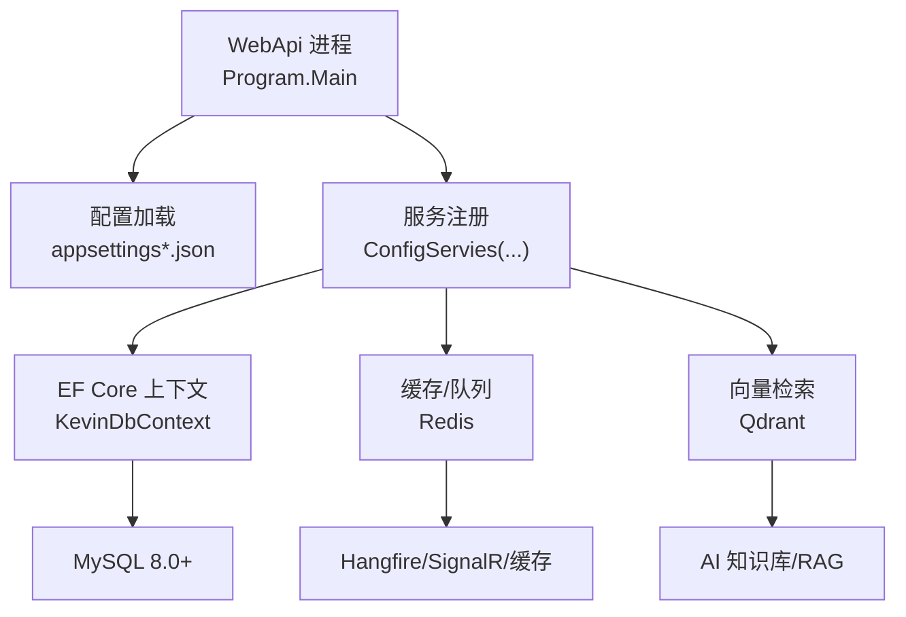
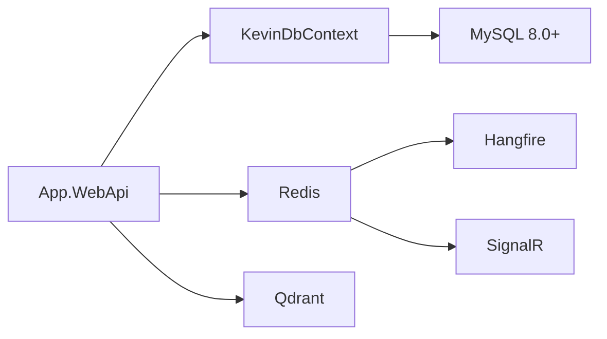

# 快速开始

<cite>
**本文引用的文件**
- [Program.cs](file://App/WebApi/Program.cs)
- [appsettings.json](file://App/WebApi/appsettings.json)
- [appsettings.Development.json](file://App/WebApi/appsettings.Development.json)
- [launchSettings.json](file://App/WebApi/Properties/launchSettings.json)
- [KevinDbContext.cs](file://Kevin/Kevin.EntityFrameworkCore/Database/KevinDbContext.cs)
- [TUserConfiguration.cs](file://Kevin/Kevin.EntityFrameworkCore/Configuration/TUserConfiguration.cs)
- [TUserBaseData.cs](file://Kevin/Domain/BaseDatas/TUserBaseData.cs)
- [SYSTEM_DOCUMENTATION.md](file://SYSTEM_DOCUMENTATION.md)
- [环境变量设置.txt](file://Doc/项目相关/环境变量设置.txt)
</cite>

## 目录
1. [简介](#简介)
2. [环境准备](#环境准备)
3. [数据库初始化](#数据库初始化)
4. [启动运行](#启动运行)
5. [默认账户与访问地址](#默认账户与访问地址)
6. [常见问题排查](#常见问题排查)
7. [架构概览](#架构概览)
8. [详细组件分析](#详细组件分析)
9. [依赖关系分析](#依赖关系分析)
10. [性能注意事项](#性能注意事项)
11. [结论](#结论)

## 简介
本指南面向首次接触 NetCoreKevin 的开发者，目标是帮助你在最短时间内完成环境搭建、数据库初始化、服务启动与登录体验。项目基于 .NET 9 构建，使用 MySQL 作为主数据库，Redis 用于缓存与任务调度，Qdrant 用于向量检索（AI 知识库）。

## 环境准备
- 安装并配置以下依赖：
  - .NET SDK 9.0+
  - MySQL 8.0+
  - Redis 7.0+
  - Qdrant 1.7+（如需要 AI 功能）
- 创建数据库 kevin_app（或使用你自定义的库名），确保可被本地或容器内访问。
- 在 appsettings.json 或 appsettings.Development.json 中配置连接字符串：
  - dbConnection：MySQL 连接串
  - redisConnection：Redis 连接串
- 如需启用 CORS，可在 CorsSetting 中配置允许的域名（例如前端开发端口）。
- 设置环境变量 ASPNETCORE_ENVIRONMENT=Development（Windows/Linux/macOS 均可参考文档中的命令）。

章节来源
- [SYSTEM_DOCUMENTATION.md:94-114](file://SYSTEM_DOCUMENTATION.md#L94-L114)
- [环境变量设置.txt:1-16](file://Doc/项目相关/环境变量设置.txt#L1-L16)
- [appsettings.json:12-15](file://App/WebApi/appsettings.json#L12-L15)
- [appsettings.Development.json:12-15](file://App/WebApi/appsettings.Development.json#L12-L15)

## 数据库初始化
- 选择默认项目为 Kevin.EntityFrameworkCore。
- 执行迁移命令：
  - Add-Migration "初始化数据库"
  - Update-Database
- 说明：
  - DbContext 已配置使用 MySQL 8.0+，并指定迁移程序集。
  - OnModelCreating 中应用了种子数据配置（角色、用户、租户、字典等）。
  - 默认管理员账号由种子数据提供。

章节来源
- [KevinDbContext.cs:83-133](file://Kevin/Kevin.EntityFrameworkCore/Database/KevinDbContext.cs#L83-L133)
- [KevinDbContext.cs:290-303](file://Kevin/Kevin.EntityFrameworkCore/Database/KevinDbContext.cs#L290-L303)
- [TUserConfiguration.cs:10-16](file://Kevin/Kevin.EntityFrameworkCore/Configuration/TUserConfiguration.cs#L10-L16)
- [TUserBaseData.cs:10-16](file://Kevin/Domain/BaseDatas/TUserBaseData.cs#L10-L16)
- [SYSTEM_DOCUMENTATION.md:118-142](file://SYSTEM_DOCUMENTATION.md#L118-L142)

## 启动运行
- Visual Studio 调试启动：
  - 打开解决方案，将 App.WebApi 设为启动项目，按 F5 启动。
- 命令行启动：
  - 进入 App/WebApi 目录，执行 dotnet run --environment Development。
- 监听地址：
  - 默认 http://localhost:9901（可通过 launchSettings.json 调整）。
- Swagger 文档：
  - 启动后访问 /swagger/index.html 查看接口。

章节来源
- [launchSettings.json:1-36](file://App/WebApi/Properties/launchSettings.json#L1-L36)
- [SYSTEM_DOCUMENTATION.md:158-180](file://SYSTEM_DOCUMENTATION.md#L158-L180)

## 默认账户与访问地址
- 默认管理员账户：
  - 用户名：admin
  - 密码：123456
  - 租户：1000
- 系统访问地址：
  - API：http://localhost:9901
  - Swagger：http://localhost:9901/swagger
  - Hangfire 面板：http://localhost:9901/pchangfire

章节来源
- [TUserBaseData.cs:10-16](file://Kevin/Domain/BaseDatas/TUserBaseData.cs#L10-L16)
- [SYSTEM_DOCUMENTATION.md:173-186](file://SYSTEM_DOCUMENTATION.md#L173-L186)

## 常见问题排查
- 启动失败
  - 检查端口占用（9901）
  - 检查 MySQL 是否可连接
  - 检查 Redis 是否可连接
- 数据库连接失败
  - 核对 ConnectionStrings.dbConnection
  - 确认数据库存在且权限正确
- Redis 连接失败
  - 核对 ConnectionStrings.redisConnection
  - 确认 Redis 服务与密码配置一致
- Qdrant 连接失败
  - 核对 Qdrant 服务状态与 URL 配置
- Hangfire 任务不执行
  - 检查 Redis 连接与服务是否启动

章节来源
- [SYSTEM_DOCUMENTATION.md:551-610](file://SYSTEM_DOCUMENTATION.md#L551-L610)

## 架构概览
下图展示了 WebApi 启动流程与关键依赖（MySQL、Redis、Qdrant）的关系。

图表来源
- [Program.cs:23-85](file://App/WebApi/Program.cs#L23-L85)
- [KevinDbContext.cs:83-133](file://Kevin/Kevin.EntityFrameworkCore/Database/KevinDbContext.cs#L83-L133)
- [appsettings.json:12-15](file://App/WebApi/appsettings.json#L12-L15)

## 详细组件分析
### 启动与中间件管线
- Program.Main 负责：
  - 设置环境变量与环境切换
  - 配置日志（log4net）
  - 注册服务与控制器
  - 启用开发错误页或全局异常处理
  - 调用 kevin 初始化中间件
- 注意：
  - 堆限制设置为 1GB（GCHeapHardLimit）
  - 请求体缓冲以支持多次读取

章节来源
- [Program.cs:23-85](file://App/WebApi/Program.cs#L23-L85)

### 数据库上下文与种子数据
- KevinDbContext：
  - 使用 MySQL 8.0+，指定迁移程序集
  - 自动扫描实体并映射表名、字段名、注释
  - 应用种子数据配置（角色、用户、租户、字典等）
- 种子数据：
  - 默认管理员用户由 TUserBaseData 提供
  - 通过 TUserConfiguration 注入到模型

章节来源
- [KevinDbContext.cs:83-133](file://Kevin/Kevin.EntityFrameworkCore/Database/KevinDbContext.cs#L83-L133)
- [KevinDbContext.cs:290-303](file://Kevin/Kevin.EntityFrameworkCore/Database/KevinDbContext.cs#L290-L303)
- [TUserConfiguration.cs:10-16](file://Kevin/Kevin.EntityFrameworkCore/Configuration/TUserConfiguration.cs#L10-L16)
- [TUserBaseData.cs:10-16](file://Kevin/Domain/BaseDatas/TUserBaseData.cs#L10-L16)

### 环境变量与配置文件
- ASPNETCORE_ENVIRONMENT：
  - 控制开发/生产行为（如错误页、日志级别）
- 连接字符串：
  - dbConnection：MySQL
  - redisConnection：Redis
- CORS、Consul、Hangfire、JWT 等配置项位于 appsettings*.json

章节来源
- [appsettings.json:1-166](file://App/WebApi/appsettings.json#L1-L166)
- [appsettings.Development.json:1-167](file://App/WebApi/appsettings.Development.json#L1-L167)
- [环境变量设置.txt:1-16](file://Doc/项目相关/环境变量设置.txt#L1-L16)

## 依赖关系分析
- WebApi 依赖：
  - EF Core 上下文（MySQL）
  - Redis（缓存、Hangfire、SignalR）
  - Qdrant（AI 知识库）
- 启动时通过服务注册装配这些依赖，并在运行时按需连接。

图表来源
- [Program.cs:23-85](file://App/WebApi/Program.cs#L23-L85)
- [KevinDbContext.cs:83-133](file://Kevin/Kevin.EntityFrameworkCore/Database/KevinDbContext.cs#L83-L133)
- [appsettings.json:12-15](file://App/WebApi/appsettings.json#L12-L15)

## 性能注意事项
- 合理设置 GCHeapHardLimit（已在 Program 中配置）
- 使用分页查询避免全表扫描
- 对常用查询字段建立索引（DBDefaultHasIndexFields 已定义默认索引字段）
- 生产环境关闭 Debug 级别日志，减少 IO 开销

章节来源
- [Program.cs:79-85](file://App/WebApi/Program.cs#L79-L85)
- [SYSTEM_DOCUMENTATION.md:657-690](file://SYSTEM_DOCUMENTATION.md#L657-L690)

## 结论
按照本指南完成环境准备、数据库迁移与启动后，即可使用默认管理员账户登录系统，并通过 Swagger 探索 API。如遇问题，可参考常见问题排查部分定位并解决。建议在正式部署前完善安全配置（HTTPS、CORS、密钥管理等）与监控方案。