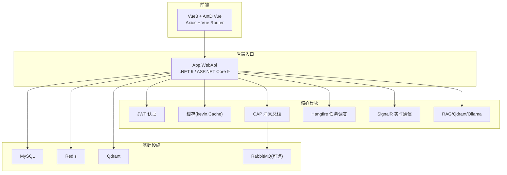
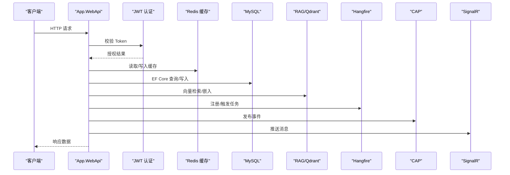
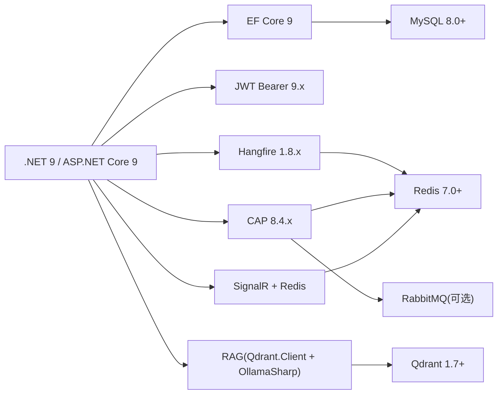

# 技术栈概览

<cite>
**本文引用的文件**
- [NetCoreKevin.sln](file://NetCoreKevin.sln)
- [App.WebApi.csproj](file://App/WebApi/App.WebApi.csproj)
- [appsettings.json](file://App/WebApi/appsettings.json)
- [kevin.Cap.csproj](file://Kevin/kevin.Module/kevin.Cap/kevin.Cap.csproj)
- [Kevin.Hangfire.csproj](file://Kevin/kevin.Module/Kevin.Hangfire/Kevin.Hangfire.csproj)
- [Kevin.RAG.csproj](file://Kevin/kevin.Module/kevin.RAG/Kevin.RAG.csproj)
- [Kevin.SignalR.csproj](file://Kevin/kevin.Module/Kevin.SignalR/Kevin.SignalR.csproj)
- [Kevin.Authentication.Jwt.csproj](file://Kevin/kevin.Module/Kevin.Authentication.Jwt/Kevin.Authentication.Jwt.csproj)
- [package.json](file://vue/kevin.web.vue/package.json)
- [SYSTEM_DOCUMENTATION.md](file://SYSTEM_DOCUMENTATION.md)
</cite>

## 目录
1. [简介](#简介)
2. [项目结构](#项目结构)
3. [核心组件](#核心组件)
4. [架构总览](#架构总览)
5. [详细组件分析](#详细组件分析)
6. [依赖关系与版本兼容性](#依赖关系与版本兼容性)
7. [性能考量](#性能考量)
8. [故障排查指南](#故障排查指南)
9. [结论](#结论)
10. [附录](#附录)

## 简介
本技术栈概览面向 NetCoreKevin 企业级 AI 中台智能体 SaaS 项目，系统采用前后端分离架构：后端基于 .NET 9 / ASP.NET Core 9，使用 Entity Framework Core 进行数据访问，MySQL 作为主数据库；Redis 用于缓存、任务调度持久化与 SignalR 集群；Qdrant 提供向量检索能力以支撑 RAG 知识库；Hangfire 负责定时任务；CAP 实现分布式事件总线；SignalR 提供实时通信；前端基于 Vue 3 + Ant Design Vue + Axios + Vue Router。文档聚焦各技术的版本信息、用途、选型原因与协同方式，并给出依赖关系图与兼容性说明。

## 项目结构
解决方案包含应用层（App）与核心模块（Kevin），以及测试与前端工程。关键入口为 App.WebApi，承载 API 网关与对外接口；Kevin 下按领域与横切关注点拆分为多个可复用模块（认证、缓存、消息、信号、RAG、Hangfire、CAP 等）。

图表来源
- [NetCoreKevin.sln:14-89](file://NetCoreKevin.sln#L14-L89)
- [appsettings.json:12-45](file://App/WebApi/appsettings.json#L12-L45)

章节来源
- [NetCoreKevin.sln:14-89](file://NetCoreKevin.sln#L14-L89)
- [App.WebApi.csproj:1-40](file://App/WebApi/App.WebApi.csproj#L1-L40)

## 核心组件
- 后端框架与运行时
  - .NET 9 / ASP.NET Core 9：高性能跨平台 Web 框架，提供现代化中间件生态与云原生支持。
  - Entity Framework Core 9：对象关系映射，简化 MySQL 数据访问与迁移管理。
- 数据存储
  - MySQL 8.0+：主业务数据库，承载结构化数据。
  - Redis 7.0+：分布式缓存、会话、Hangfire 持久化、SignalR 广播通道。
  - Qdrant 1.7+：向量数据库，支撑 RAG 检索增强与语义相似度检索。
- 异步与消息
  - Hangfire：可视化任务调度与重试机制，结合 Redis 实现可靠执行。
  - CAP：分布式事件发布/订阅，支持 MySQL/RabbitMQ/Redis Streams 等多种存储与传输。
- 安全与鉴权
  - JWT Bearer：无状态令牌认证，配合缓存实现刷新与黑名单控制。
- 实时通信
  - SignalR：服务端推送与双向通信，结合 Redis 实现多实例横向扩展。
- AI 与 RAG
  - OllamaSharp + Qdrant：本地或云端模型嵌入与向量检索，构建知识库问答与智能体工具链。

章节来源
- [App.WebApi.csproj:1-40](file://App/WebApi/App.WebApi.csproj#L1-L40)
- [kevin.Cap.csproj:1-22](file://Kevin/kevin.Module/kevin.Cap/kevin.Cap.csproj#L1-L22)
- [Kevin.Hangfire.csproj:1-19](file://Kevin/kevin.Module/Kevin.Hangfire/Kevin.Hangfire.csproj#L1-L19)
- [Kevin.RAG.csproj:1-75](file://Kevin/kevin.Module/kevin.RAG/Kevin.RAG.csproj#L1-L75)
- [Kevin.SignalR.csproj:1-21](file://Kevin/kevin.Module/Kevin.SignalR/Kevin.SignalR.csproj#L1-L21)
- [Kevin.Authentication.Jwt.csproj:1-20](file://Kevin/kevin.Module/Kevin.Authentication.Jwt/Kevin.Authentication.Jwt.csproj#L1-L20)
- [appsettings.json:12-165](file://App/WebApi/appsettings.json#L12-L165)
- [SYSTEM_DOCUMENTATION.md:25-43](file://SYSTEM_DOCUMENTATION.md#L25-L43)

## 架构总览
系统遵循分层与模块化设计：API 网关层统一暴露 REST/SSE/SignalR 接口；应用服务层编排业务流程；领域层定义实体与规则；仓储层封装数据访问；横切能力（认证、缓存、消息、任务、日志、权限）通过独立模块注入。AI 能力通过 RAG 模块与 Qdrant/Ollama 集成，形成“检索增强生成”的知识库问答链路。

图表来源
- [Kevin.Authentication.Jwt.csproj:1-20](file://Kevin/kevin.Module/Kevin.Authentication.Jwt/Kevin.Authentication.Jwt.csproj#L1-L20)
- [Kevin.RAG.csproj:1-75](file://Kevin/kevin.Module/kevin.RAG/Kevin.RAG.csproj#L1-L75)
- [Kevin.Hangfire.csproj:1-19](file://Kevin/kevin.Module/Kevin.Hangfire/Kevin.Hangfire.csproj#L1-L19)
- [kevin.Cap.csproj:1-22](file://Kevin/kevin.Module/kevin.Cap/kevin.Cap.csproj#L1-L22)
- [Kevin.SignalR.csproj:1-21](file://Kevin/kevin.Module/Kevin.SignalR/Kevin.SignalR.csproj#L1-L21)
- [appsettings.json:12-45](file://App/WebApi/appsettings.json#L12-L45)

## 详细组件分析

### 后端基础与数据访问
- .NET 9 / ASP.NET Core 9：目标框架明确，启用容器化与调试符号控制，便于开发与生产部署。
- EF Core 9：通过 MigrationsAssembly 指定迁移程序集，配合 MySQL 连接字符串完成数据建模与迁移。
- MySQL：主数据库，配置了命令超时与字符集等参数，保障高并发场景稳定性。

章节来源
- [App.WebApi.csproj:1-40](file://App/WebApi/App.WebApi.csproj#L1-L40)
- [appsettings.json:9-15](file://App/WebApi/appsettings.json#L9-L15)

### 缓存与会话
- Redis：用于通用缓存、Hangfire 持久化、SignalR 广播通道。连接串与默认库位清晰配置，支持密码与超时设置。
- 缓存策略：通过过滤器或中间件对热点数据进行短时效缓存，降低数据库压力。

章节来源
- [appsettings.json:12-20](file://App/WebApi/appsettings.json#L12-L20)
- [Kevin.SignalR.csproj:1-21](file://Kevin/kevin.Module/Kevin.SignalR/Kevin.SignalR.csproj#L1-L21)

### 任务调度（Hangfire）
- 使用 Hangfire.AspNetCore 与 Redis 存储，提供可视化 Dashboard 与基本认证。
- 支持内存存储用于开发环境，生产建议切换至 Redis 以保证任务持久化与恢复。

章节来源
- [Kevin.Hangfire.csproj:1-19](file://Kevin/kevin.Module/Kevin.Hangfire/Kevin.Hangfire.csproj#L1-L19)
- [appsettings.json:16-28](file://App/WebApi/appsettings.json#L16-L28)

### 消息总线（CAP）
- 基于 DotNetCore.CAP，支持 MySQL 持久化、RabbitMQ 传输、Redis Streams 与 InMemory 存储。
- 适用于解耦服务间通信、最终一致性与事件溯源场景。

章节来源
- [kevin.Cap.csproj:1-22](file://Kevin/kevin.Module/kevin.Cap/kevin.Cap.csproj#L1-L22)
- [appsettings.json:92-98](file://App/WebApi/appsettings.json#L92-L98)

### 认证与授权（JWT）
- 使用 Microsoft.AspNetCore.Authentication.JwtBearer 与 System.IdentityModel.Tokens.Jwt 实现无状态鉴权。
- 结合 Redis 缓存实现刷新令牌、黑名单与限流等扩展能力。

章节来源
- [Kevin.Authentication.Jwt.csproj:1-20](file://Kevin/kevin.Module/Kevin.Authentication.Jwt/Kevin.Authentication.Jwt.csproj#L1-L20)
- [appsettings.json:29-35](file://App/WebApi/appsettings.json#L29-L35)

### 实时通信（SignalR）
- 使用 StackExchange.Redis 作为回退与广播通道，支持多实例横向扩展。
- 前端通过 @microsoft/signalr 建立连接，实现消息推送与交互。

章节来源
- [Kevin.SignalR.csproj:1-21](file://Kevin/kevin.Module/Kevin.SignalR/Kevin.SignalR.csproj#L1-L21)
- [package.json:24-35](file://vue/kevin.web.vue/package.json#L24-L35)
- [appsettings.json:37-45](file://App/WebApi/appsettings.json#L37-L45)

### AI 与 RAG（Qdrant + Ollama）
- 使用 Qdrant.Client 与 OllamaSharp 对接向量数据库与本地/云端模型，实现文本嵌入、相似检索与知识问答。
- 配置项包含 URL、默认模型与 API Key，支持多种模型提供商。

章节来源
- [Kevin.RAG.csproj:1-75](file://Kevin/kevin.Module/kevin.RAG/Kevin.RAG.csproj#L1-L75)
- [appsettings.json:133-141](file://App/WebApi/appsettings.json#L133-L141)
- [SYSTEM_DOCUMENTATION.md:189-232](file://SYSTEM_DOCUMENTATION.md#L189-L232)

### 前端技术栈
- Vue 3 + Vue Router：组合式 API 与路由管理，提升开发体验与可维护性。
- Ant Design Vue：企业级 UI 组件库，快速构建管理后台。
- Axios：HTTP 客户端，统一拦截器处理认证与错误。
- @microsoft/signalr：与后端 SignalR 集成，实现实时通知与聊天。

章节来源
- [package.json:16-35](file://vue/kevin.web.vue/package.json#L16-L35)

## 依赖关系与版本兼容性
- 后端运行时
  - 目标框架：net9.0（所有核心项目均指向该框架）
- 数据库与缓存
  - MySQL 8.0+：EF Core 关系提供程序与连接字符串
  - Redis 7.0+：Hangfire、CAP、SignalR 共享
- 向量数据库
  - Qdrant 1.7+：RAG 模块依赖 Qdrant.Client
- 任务调度
  - Hangfire 1.8.x：与 Redis 集成
- 消息总线
  - CAP 8.4.x：支持 MySQL/RabbitMQ/Redis Streams
- 认证
  - JWT Bearer 9.x：与 ASP.NET Core 9 兼容
- 前端
  - Vue 3、Ant Design Vue、Axios、@microsoft/signalr

图表来源
- [App.WebApi.csproj:1-40](file://App/WebApi/App.WebApi.csproj#L1-L40)
- [kevin.Cap.csproj:1-22](file://Kevin/kevin.Module/kevin.Cap/kevin.Cap.csproj#L1-L22)
- [Kevin.Hangfire.csproj:1-19](file://Kevin/kevin.Module/Kevin.Hangfire/Kevin.Hangfire.csproj#L1-L19)
- [Kevin.RAG.csproj:1-75](file://Kevin/kevin.Module/kevin.RAG/Kevin.RAG.csproj#L1-L75)
- [Kevin.SignalR.csproj:1-21](file://Kevin/kevin.Module/Kevin.SignalR/Kevin.SignalR.csproj#L1-L21)
- [Kevin.Authentication.Jwt.csproj:1-20](file://Kevin/kevin.Module/Kevin.Authentication.Jwt/Kevin.Authentication.Jwt.csproj#L1-L20)
- [appsettings.json:12-165](file://App/WebApi/appsettings.json#L12-L165)

章节来源
- [NetCoreKevin.sln:14-89](file://NetCoreKevin.sln#L14-L89)
- [SYSTEM_DOCUMENTATION.md:25-43](file://SYSTEM_DOCUMENTATION.md#L25-L43)

## 性能考量
- 数据库
  - 合理使用索引与分页，避免全表扫描；批量操作减少往返次数。
- 缓存
  - 热点数据短期缓存，合理设置过期时间；注意缓存穿透与雪崩防护。
- 任务与消息
  - Hangfire 使用 Redis 持久化保证可靠性；CAP 根据场景选择合适存储与传输。
- 实时通信
  - SignalR 使用 Redis 广播，支持水平扩展；前端按需订阅频道，降低带宽消耗。
- AI/RAG
  - 向量检索前进行文本预处理与分块；选择合适的嵌入模型与维度；必要时引入重排序提升相关性。

[本节为通用指导，不直接分析具体文件]

## 故障排查指南
- 启动失败
  - 检查端口占用与防火墙；确认 MySQL/Redis/Qdrant 服务可用。
- 数据库连接失败
  - 核对连接字符串、账号权限与网络连通性。
- Redis 连接失败
  - 检查地址、端口、密码与默认库位；验证 Hangfire/SignalR/CAP 的 Redis 配置一致性。
- Hangfire 任务不执行
  - 确认 Redis 可用且 Dashboard 登录凭据正确；查看任务队列与重试日志。
- CAP 事件未消费
  - 检查 RabbitMQ/Redis Streams 连接与消费者订阅；查看 CAP 控制台。
- SignalR 无法连接
  - 确认 CORS 与反向代理配置；检查 Redis 广播通道与 Hub 路由。
- RAG 检索异常
  - 检查 Qdrant 健康端点、集合与向量维度；验证模型 API Key 与 URL。

章节来源
- [SYSTEM_DOCUMENTATION.md:551-610](file://SYSTEM_DOCUMENTATION.md#L551-L610)
- [appsettings.json:12-165](file://App/WebApi/appsettings.json#L12-L165)

## 结论
NetCoreKevin 以 .NET 9 / ASP.NET Core 9 为核心，结合 EF Core、MySQL、Redis、Qdrant、Hangfire、CAP、SignalR 与 JWT，构建了可扩展、高内聚的企业级 AI 中台。前后端通过 REST/SignalR 解耦协作，AI 能力通过 RAG 与向量检索增强，形成从数据到智能体的完整闭环。各组件版本相互兼容，具备良好演进空间与运维可观测性。

[本节为总结性内容，不直接分析具体文件]

## 附录
- 常用服务地址
  - API：http://localhost:9901
  - Swagger：http://localhost:9901/swagger
  - Hangfire Dashboard：http://localhost:9901/pchangfire
- 默认账户
  - admin / 123456（租户 1000）

章节来源
- [SYSTEM_DOCUMENTATION.md:173-185](file://SYSTEM_DOCUMENTATION.md#L173-L185)