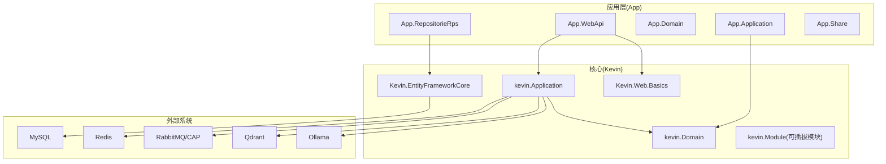
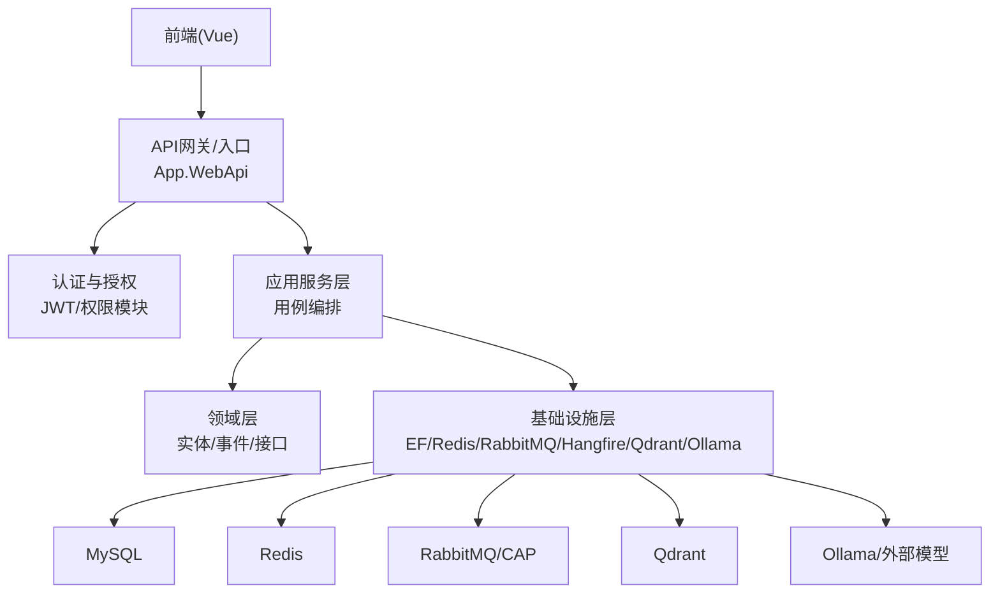
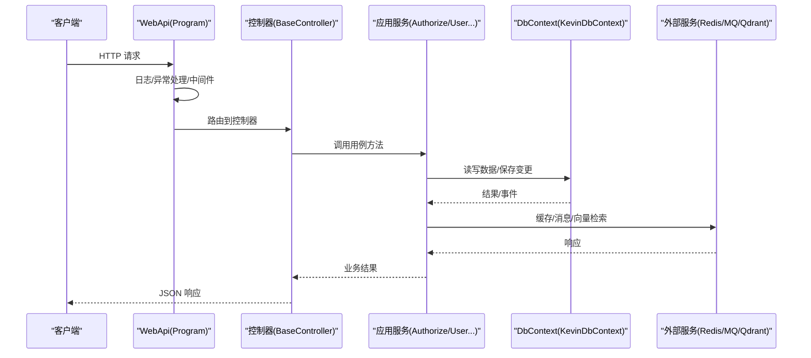
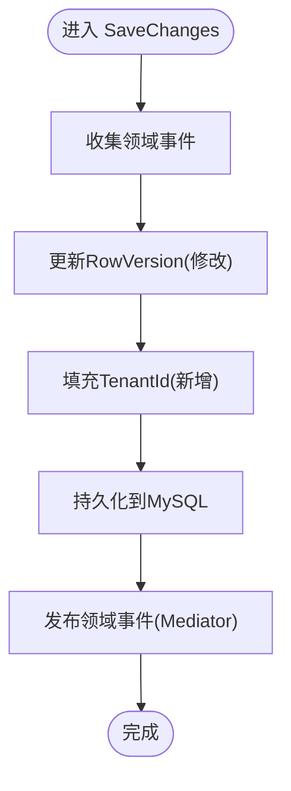
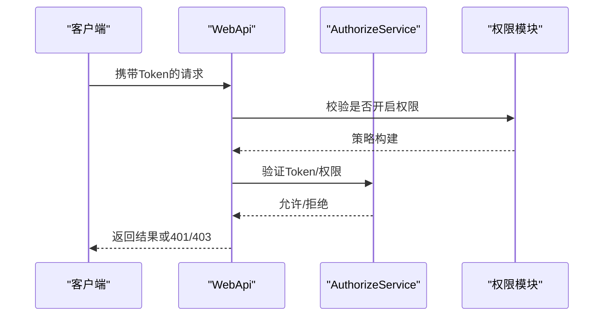
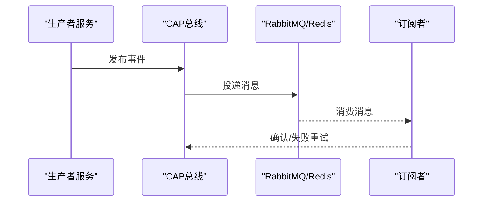
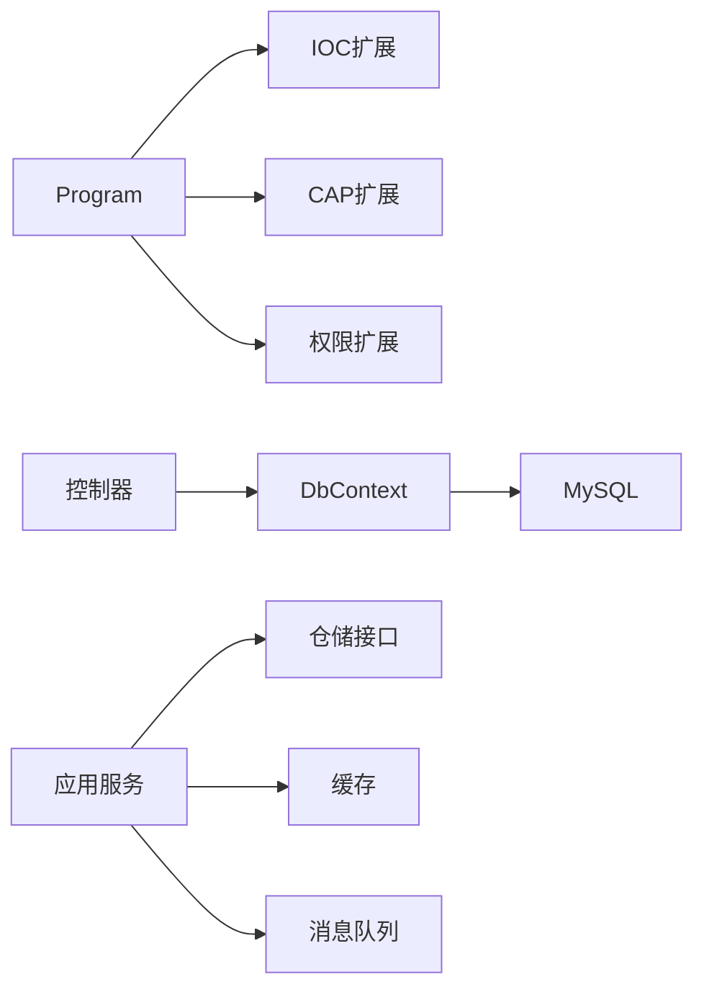

# 架构设计概览

<cite>
**本文引用的文件**
- [NetCoreKevin.sln](file://NetCoreKevin.sln)
- [SYSTEM_DOCUMENTATION.md](file://SYSTEM_DOCUMENTATION.md)
- [Program.cs](file://App/WebApi/Program.cs)
- [ModuleInitializer.cs（应用层）](file://App/Application/ModuleInitializer.cs)
- [ModuleInitializer.cs（核心应用层）](file://Kevin/Application/ModuleInitializer.cs)
- [ServiceCollectionExtensions.cs（IOC）](file://Kevin/kevin.Module/kevin.Ioc/ServiceCollectionExtensions.cs)
- [ApiControllerBase.cs](file://Kevin/ Kevin.Web.Basics/Controllers/ApiControllerBase.cs)
- [BaseController.cs](file://Kevin/ Kevin.Web.Basics/Controllers/BaseController.cs)
- [KevinDbContext.cs](file://Kevin/ Kevin.EntityFrameworkCore/Database/KevinDbContext.cs)
- [ServiceCollectionExtensions.cs（CAP）](file://Kevin/ kevin.Module/kevin.Cap/ServiceCollectionExtensions.cs)
- [ServiceCollectionExtensions.cs（Consul）](file://Kevin/ kevin.Module/kevin.Consul/ServiceCollectionExtensions.cs)
- [ServiceCollectionExtensions.cs（权限）](file://Kevin/ kevin.Module/kevin.Permission/ServiceCollectionExtensions.cs)
- [AuthorizeService.cs](file://Kevin/Application/Services/AuthorizeService.cs)
- [vue.config.js](file://vue/kevin.web.vue/vue.config.js)
</cite>

## 目录
1. [简介](#简介)
2. [项目结构](#项目结构)
3. [核心组件](#核心组件)
4. [架构总览](#架构总览)
5. [详细组件分析](#详细组件分析)
6. [依赖关系分析](#依赖关系分析)
7. [性能与可扩展性](#性能与可扩展性)
8. [故障排查指南](#故障排查指南)
9. [结论](#结论)
10. [附录](#附录)

## 简介
本项目是一个基于 .NET 9 的企业级 AI 中台智能体 SaaS 平台，采用前后端分离与模块化分层架构。后端以 ASP.NET Core Web API 为入口，结合 EF Core、Redis、RabbitMQ/CAP、Hangfire、Qdrant、Ollama 等基础设施，提供认证授权、多租户、AI 知识库与智能体、任务调度、消息总线、文件存储、代码生成等能力。前端使用 Vue 3，通过代理访问后端 API。

## 项目结构
整体解决方案按“应用模块 + 核心模块 + 共享/基础模块”组织：
- App：业务应用层，包含 WebApi、Application、Domain、RepositorieRps、AppShare
- Kevin：核心能力模块，包含 Application、Domain、EntityFrameworkCore、Web.Basics、以及大量可插拔的 kevin.Module（如 CAP、Permission、SignalR、Hangfire、RAG、SMS、Email、SnowflakeId、Consul、FileStorage 等）
- Test：单元测试与集成测试
- vue：前端工程

图表来源
- [NetCoreKevin.sln:14-87](file://NetCoreKevin.sln#L14-L87)
- [SYSTEM_DOCUMENTATION.md:44-90](file://SYSTEM_DOCUMENTATION.md#L44-L90)

章节来源
- [NetCoreKevin.sln:14-87](file://NetCoreKevin.sln#L14-L87)
- [SYSTEM_DOCUMENTATION.md:44-90](file://SYSTEM_DOCUMENTATION.md#L44-L90)

## 核心组件
- 启动与管道：Program 负责环境初始化、日志、服务注册、异常处理、中间件装配与运行。
- 控制器基类：ApiControllerBase 注入 DbContext、CurrentUser、Configuration、分布式锁；BaseController 提供通用接口。
- 领域与数据：KevinDbContext 统一配置 MySQL、自动表映射、索引、种子数据、领域事件发布、乐观并发、多租户字段填充。
- 应用服务：各 Service 组合仓储与服务，实现业务编排。
- 模块扩展：通过 ModuleInitializer 与 IOC 扩展批量注册服务，支持权限、CAP、SignalR、Hangfire、RAG、短信、邮件、雪花ID、CORS、版本化 Swagger 等。
- 前端：Vue 工程通过 devServer 代理访问后端 API。

章节来源
- [Program.cs:23-85](file://App/WebApi/Program.cs#L23-L85)
- [ApiControllerBase.cs:9-20](file://Kevin/ Kevin.Web.Basics/Controllers/ApiControllerBase.cs#L9-L20)
- [BaseController.cs:11-146](file://Kevin/ Kevin.Web.Basics/Controllers/BaseController.cs#L11-L146)
- [KevinDbContext.cs:83-133](file://Kevin/ Kevin.EntityFrameworkCore/Database/KevinDbContext.cs#L83-L133)
- [KevinDbContext.cs:165-305](file://Kevin/ Kevin.EntityFrameworkCore/Database/KevinDbContext.cs#L165-L305)
- [KevinDbContext.cs:405-484](file://Kevin/ Kevin.EntityFrameworkCore/Database/KevinDbContext.cs#L405-L484)
- [ModuleInitializer.cs（应用层）:12-19](file://App/Application/ModuleInitializer.cs#L12-L19)
- [ModuleInitializer.cs（核心应用层）:17-27](file://Kevin/Application/ModuleInitializer.cs#L17-L27)
- [ServiceCollectionExtensions.cs（IOC）:10-15](file://Kevin/kevin.Module/kevin.Ioc/ServiceCollectionExtensions.cs#L10-L15)
- [vue.config.js:5-18](file://vue/kevin.web.vue/vue.config.js#L5-L18)

## 架构总览
系统采用分层+模块化架构，面向微服务就绪：
- 表现层：ASP.NET Core Web API（App.WebApi），暴露 RESTful 接口，Swagger 文档，鉴权与限流过滤器。
- 应用层：用例编排与跨领域协调（App.Application、kevin.Application）。
- 领域层：实体、事件、接口定义（App.Domain、kevin.Domain）。
- 基础设施层：EF Core、缓存、消息队列、文件存储、向量库、任务调度等（kevin.Module 下的各子模块）。

图表来源
- [SYSTEM_DOCUMENTATION.md:44-64](file://SYSTEM_DOCUMENTATION.md#L44-L64)
- [Program.cs:23-85](file://App/WebApi/Program.cs#L23-L85)
- [ServiceCollectionExtensions.cs（权限）:14-25](file://Kevin/ kevin.Module/kevin.Permission/ServiceCollectionExtensions.cs#L14-L25)
- [ServiceCollectionExtensions.cs（CAP）:13-49](file://Kevin/ kevin.Module/kevin.Cap/ServiceCollectionExtensions.cs#L13-L49)

章节来源
- [SYSTEM_DOCUMENTATION.md:44-64](file://SYSTEM_DOCUMENTATION.md#L44-L64)
- [Program.cs:23-85](file://App/WebApi/Program.cs#L23-L85)

## 详细组件分析

### 请求处理流程（API -> 应用 -> 领域 -> 数据）

图表来源
- [Program.cs:23-85](file://App/WebApi/Program.cs#L23-L85)
- [BaseController.cs:11-146](file://Kevin/ Kevin.Web.Basics/Controllers/BaseController.cs#L11-L146)
- [AuthorizeService.cs:13-30](file://Kevin/Application/Services/AuthorizeService.cs#L13-L30)
- [KevinDbContext.cs:405-484](file://Kevin/ Kevin.EntityFrameworkCore/Database/KevinDbContext.cs#L405-L484)

章节来源
- [Program.cs:23-85](file://App/WebApi/Program.cs#L23-L85)
- [BaseController.cs:11-146](file://Kevin/ Kevin.Web.Basics/Controllers/BaseController.cs#L11-L146)
- [AuthorizeService.cs:13-30](file://Kevin/Application/Services/AuthorizeService.cs#L13-L30)
- [KevinDbContext.cs:405-484](file://Kevin/ Kevin.EntityFrameworkCore/Database/KevinDbContext.cs#L405-L484)

### 数据库访问与领域事件
- 自动表映射与命名：扫描程序集并应用 TableAttribute，统一前缀与小写列名。
- 默认索引：根据配置对常用字段建索引。
- 种子数据：在 OnModelCreating 中集中应用配置。
- 领域事件：SaveChanges/Async 时收集 IDomainEvents 并通过 Mediator 发布。
- 乐观并发：修改实体时更新 RowVersion。
- 多租户：新增记录自动填充 TenantId。

图表来源
- [KevinDbContext.cs:165-305](file://Kevin/ Kevin.EntityFrameworkCore/Database/KevinDbContext.cs#L165-L305)
- [KevinDbContext.cs:405-484](file://Kevin/ Kevin.EntityFrameworkCore/Database/KevinDbContext.cs#L405-L484)
- [KevinDbContext.cs:486-524](file://Kevin/ Kevin.EntityFrameworkCore/Database/KevinDbContext.cs#L486-L524)

章节来源
- [KevinDbContext.cs:165-305](file://Kevin/ Kevin.EntityFrameworkCore/Database/KevinDbContext.cs#L165-L305)
- [KevinDbContext.cs:405-484](file://Kevin/ Kevin.EntityFrameworkCore/Database/KevinDbContext.cs#L405-L484)
- [KevinDbContext.cs:486-524](file://Kevin/ Kevin.EntityFrameworkCore/Database/KevinDbContext.cs#L486-L524)

### 认证与授权
- 可选启用：通过配置开关决定是否启用认证策略。
- 策略：要求已认证用户，并通过自定义 IdentityVerification 进行授权断言。
- Token：结合 JWT 模块签发与刷新令牌。

图表来源
- [ServiceCollectionExtensions.cs（权限）:14-25](file://Kevin/ kevin.Module/kevin.Permission/ServiceCollectionExtensions.cs#L14-L25)
- [AuthorizeService.cs:13-30](file://Kevin/Application/Services/AuthorizeService.cs#L13-L30)

章节来源
- [ServiceCollectionExtensions.cs（权限）:14-25](file://Kevin/ kevin.Module/kevin.Permission/ServiceCollectionExtensions.cs#L14-L25)
- [AuthorizeService.cs:13-30](file://Kevin/Application/Services/AuthorizeService.cs#L13-L30)

### 分布式事务与异步通信（CAP + RabbitMQ/Redis）
- 传输层：支持 RabbitMQ 与 Redis 两种模式。
- 持久化：可选择 MySQL/InMemory 存储执行状态。
- 可视化：内置 Dashboard。
- 重试与分组：失败重试间隔、次数、消费者线程数、组名前缀等可配置。

图表来源
- [ServiceCollectionExtensions.cs（CAP）:13-49](file://Kevin/ kevin.Module/kevin.Cap/ServiceCollectionExtensions.cs#L13-L49)
- [ServiceCollectionExtensions.cs（CAP）:50-74](file://Kevin/ kevin.Module/kevin.Cap/ServiceCollectionExtensions.cs#L50-L74)

章节来源
- [ServiceCollectionExtensions.cs（CAP）:13-49](file://Kevin/ kevin.Module/kevin.Cap/ServiceCollectionExtensions.cs#L13-L49)
- [ServiceCollectionExtensions.cs（CAP）:50-74](file://Kevin/ kevin.Module/kevin.Cap/ServiceCollectionExtensions.cs#L50-L74)

### 服务发现与配置中心（Consul）
- 提供扩展点 AddKevinConsul，当前为空实现，便于后续接入 Consul 作为服务发现与配置中心。

章节来源
- [ServiceCollectionExtensions.cs（Consul）:9-12](file://Kevin/ kevin.Module/kevin.Consul/ServiceCollectionExtensions.cs#L9-L12)

### 模块装配与IOC
- 替换控制器创建器为自定义 IocServiceBaseControllerActivator，使控制器由容器管理。
- 运行所有模块初始化器，批量注册 Scoped 服务，并将服务加入全局集合以便跨层访问。

章节来源
- [ServiceCollectionExtensions.cs（IOC）:10-15](file://Kevin/kevin.Module/kevin.Ioc/ServiceCollectionExtensions.cs#L10-L15)
- [ModuleInitializer.cs（应用层）:12-19](file://App/Application/ModuleInitializer.cs#L12-L19)
- [ModuleInitializer.cs（核心应用层）:17-27](file://Kevin/Application/ModuleInitializer.cs#L17-L27)

### 前端与后端通信
- 开发期通过 vue.config.js 将 /VarApi 代理到 http://localhost:9901，简化跨域与调试。
- 生产部署可通过反向代理（Nginx/IIS）统一入口。

章节来源
- [vue.config.js:5-18](file://vue/kevin.web.vue/vue.config.js#L5-L18)

## 依赖关系分析
- 入口依赖：Program 依赖日志、HTTP 客户端、IOC、权限、CAP、Cors、版本化等扩展。
- 控制器依赖：ApiControllerBase 注入 DbContext、CurrentUser、Configuration、分布式锁。
- 应用服务依赖：仓储接口、缓存、短信、令牌服务等。
- 数据层依赖：MySQL、EF Core、领域事件总线（MediatR）、雪花ID。
- 模块依赖：CAP 依赖 RabbitMQ/Redis/MySQL；权限模块依赖配置开关；Consul 预留扩展。

图表来源
- [Program.cs:23-85](file://App/WebApi/Program.cs#L23-L85)
- [ApiControllerBase.cs:9-20](file://Kevin/ Kevin.Web.Basics/Controllers/ApiControllerBase.cs#L9-L20)
- [ServiceCollectionExtensions.cs（CAP）:13-49](file://Kevin/ kevin.Module/kevin.Cap/ServiceCollectionExtensions.cs#L13-L49)
- [ServiceCollectionExtensions.cs（权限）:14-25](file://Kevin/ kevin.Module/kevin.Permission/ServiceCollectionExtensions.cs#L14-L25)

章节来源
- [Program.cs:23-85](file://App/WebApi/Program.cs#L23-L85)
- [ApiControllerBase.cs:9-20](file://Kevin/ Kevin.Web.Basics/Controllers/ApiControllerBase.cs#L9-L20)
- [ServiceCollectionExtensions.cs（CAP）:13-49](file://Kevin/ kevin.Module/kevin.Cap/ServiceCollectionExtensions.cs#L13-L49)
- [ServiceCollectionExtensions.cs（权限）:14-25](file://Kevin/ kevin.Module/kevin.Permission/ServiceCollectionExtensions.cs#L14-L25)

## 性能与可扩展性
- 数据库优化：默认索引字段、关闭级联删除、合理迁移与种子数据。
- 缓存：Redis 缓存热点数据，降低数据库压力。
- 异步与并发：CAP 消费者线程数可调，避免阻塞；SaveChangesAsync 提升吞吐。
- 可扩展性：模块化插件式扩展（CAP、权限、SignalR、Hangfire、RAG、短信、邮件、文件存储、雪花ID、CORS、版本化 Swagger），按需启用。
- 微服务就绪：预留 Consul 服务发现与配置中心扩展；CAP 提供最终一致性与可靠消息；分布式锁保障并发安全。

[本节为通用指导，不直接分析具体文件]

## 故障排查指南
- 启动失败：检查端口占用、环境变量、连接字符串、证书配置。
- 数据库连接失败：核对 MySQL 地址、端口、凭据与迁移是否成功。
- Redis 连接失败：核对连接串与密码。
- CAP 消息未消费：检查 RabbitMQ/Redis 连通性、Dashboard 状态、消费者线程与重试配置。
- 权限拦截：确认 IsOpenPermission 配置与策略是否正确加载。
- 日志定位：查看应用日志与错误日志，必要时开启 SQL 日志。

章节来源
- [SYSTEM_DOCUMENTATION.md:535-610](file://SYSTEM_DOCUMENTATION.md#L535-L610)
- [Program.cs:66-85](file://App/WebApi/Program.cs#L66-L85)
- [ServiceCollectionExtensions.cs（权限）:14-25](file://Kevin/ kevin.Module/kevin.Permission/ServiceCollectionExtensions.cs#L14-L25)
- [ServiceCollectionExtensions.cs（CAP）:13-49](file://Kevin/ kevin.Module/kevin.Cap/ServiceCollectionExtensions.cs#L13-L49)

## 结论
本项目采用清晰的分层与模块化架构，围绕 ASP.NET Core 生态构建了企业级 AI 中台能力。通过 EF Core 统一数据访问、CAP 实现可靠消息与最终一致性、权限模块提供细粒度控制、可插拔模块支撑快速扩展。该架构在保证可维护性的同时，具备良好的可扩展性与微服务就绪能力，适合持续演进与规模化部署。

[本节为总结性内容，不直接分析具体文件]

## 附录
- 技术栈与架构图参考：见系统文档中的技术栈与架构图说明。
- 关键配置项：连接字符串、IsOpenPermission、Hangfire、CORS、代码生成器等。
- 默认账户与访问地址：见系统文档。

章节来源
- [SYSTEM_DOCUMENTATION.md:27-43](file://SYSTEM_DOCUMENTATION.md#L27-L43)
- [SYSTEM_DOCUMENTATION.md:118-129](file://SYSTEM_DOCUMENTATION.md#L118-L129)
- [SYSTEM_DOCUMENTATION.md:173-186](file://SYSTEM_DOCUMENTATION.md#L173-L186)
- [SYSTEM_DOCUMENTATION.md:697-704](file://SYSTEM_DOCUMENTATION.md#L697-L704)