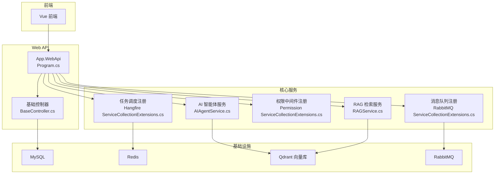
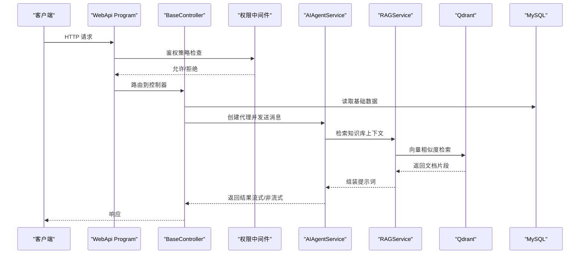
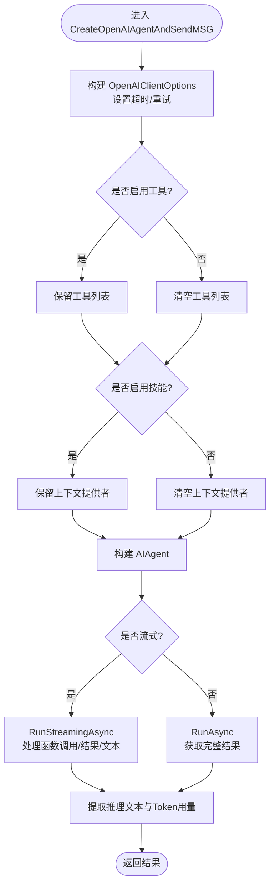
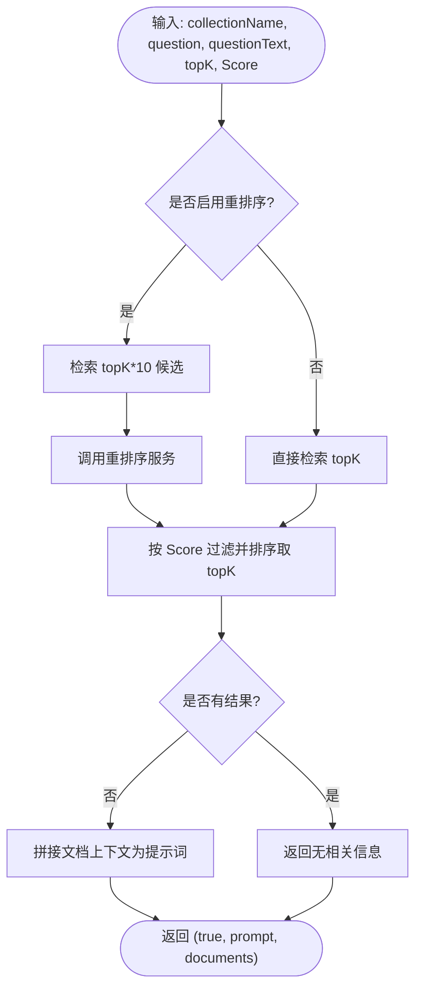
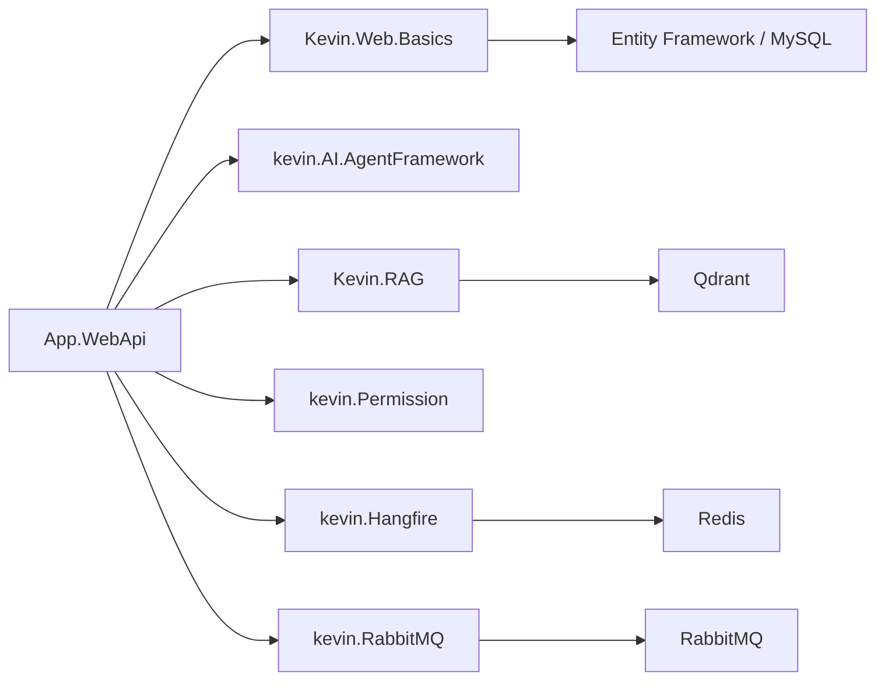

# 项目概述

<cite>
**本文引用的文件**
- [SYSTEM_DOCUMENTATION.md](file://SYSTEM_DOCUMENTATION.md)
- [Program.cs](file://App/WebApi/Program.cs)
- [BaseController.cs](file://Kevin/Kevin.Web.Basics/Controllers/BaseController.cs)
- [AIAgentService.cs](file://Kevin/kevin.Module/kevin.AI.AgentFramework/AIAgentService.cs)
- [RAGService.cs](file://Kevin/kevin.Module/Kevin.RAG/RAGService.cs)
- [ServiceCollectionExtensions.cs（Hangfire）](file://Kevin/kevin.Module/kevin.Hangfire/ServiceCollectionExtensions.cs)
- [ServiceCollectionExtensions.cs（权限）](file://Kevin/kevin.Module/kevin.Permission/ServiceCollectionExtensions.cs)
- [ServiceCollectionExtensions.cs（RabbitMQ）](file://Kevin/kevin.Module/kevin.RabbitMQ/ServiceCollectionExtensions.cs)
- [CodeGenerator.vue](file://vue/kevin.web.vue/src/pages/CodeGenerator.vue)
- [PermissionMg.vue](file://vue/kevin.web.vue/src/pages/PermissionMg.vue)
</cite>

## 目录
1. [简介](#简介)
2. [项目结构](#项目结构)
3. [核心组件](#核心组件)
4. [架构总览](#架构总览)
5. [详细组件分析](#详细组件分析)
6. [依赖关系分析](#依赖关系分析)
7. [性能与可观测性](#性能与可观测性)
8. [故障排查指南](#故障排查指南)
9. [快速开始](#快速开始)
10. [结论](#结论)

## 简介
NetCoreKevin 是基于 .NET 9 构建的企业级 AI 中台智能体 SaaS 框架，采用前后端分离与分层架构，提供 AI 智能体、知识库检索增强（RAG）、任务调度、权限管理、消息队列、文件存储与代码生成器等企业级能力。其目标是为企业应用开发提供“开箱即用”的一体化解决方案：统一的认证授权、多租户隔离、可扩展的 AI 技能与工具体系、可靠的异步与分布式通信、以及面向生产环境的运维与监控能力。

## 项目结构
- 前端（Vue3）：页面路由、AI 对话、知识库管理、权限管理等界面位于 vue/kevin.web.vue。
- 后端（ASP.NET Core）：API 入口在 App/WebApi；核心领域与服务在 Kevin 目录下按模块划分。
- 模块化设计：通过 kevin.Module 下的子模块（如 Hangfire、RabbitMQ、RAG、AgentFramework、Permission、CodeGenerator 等）实现能力解耦与按需装配。
- 数据访问：EF Core 配置与数据库上下文位于 Kevin.EntityFrameworkCore。

图表来源
- [Program.cs:23-85](file://App/WebApi/Program.cs#L23-L85)
- [BaseController.cs:1-147](file://Kevin/Kevin.Web.Basics/Controllers/BaseController.cs#L1-L147)
- [AIAgentService.cs:1-491](file://Kevin/kevin.Module/kevin.AI.AgentFramework/AIAgentService.cs#L1-L491)
- [RAGService.cs:1-81](file://Kevin/kevin.Module/Kevin.RAG/RAGService.cs#L1-L81)
- [ServiceCollectionExtensions.cs（Hangfire）:1-91](file://Kevin/kevin.Module/kevin.Hangfire/ServiceCollectionExtensions.cs#L1-L91)
- [ServiceCollectionExtensions.cs（权限）:1-28](file://Kevin/kevin.Module/kevin.Permission/ServiceCollectionExtensions.cs#L1-L28)
- [ServiceCollectionExtensions.cs（RabbitMQ）:1-39](file://Kevin/kevin.Module/kevin.RabbitMQ/ServiceCollectionExtensions.cs#L1-L39)

章节来源
- [SYSTEM_DOCUMENTATION.md:5-90](file://SYSTEM_DOCUMENTATION.md#L5-L90)

## 核心组件
- AI 智能体：基于 AgentFramework/OpenAI 协议封装，支持流式输出、工具调用、技能加载与重试策略。
- 知识库系统（RAG）：结合 Qdrant 向量检索与可选重排序（Rerank），将文档片段组装为提示词上下文。
- 任务调度：基于 Hangfire，支持 Redis 持久化或内存存储，提供定时任务与可视化面板。
- 权限管理：基于 ASP.NET Core Authorization 与自定义鉴权策略，支持开关控制与细粒度校验。
- 消息队列：基于 RabbitMQ 的生产者/消费者抽象，支持自动重连与异步消费。
- 文件存储：统一接口抽象，支持多种云存储（腾讯云 COS、阿里云 OSS、七牛云等）。
- 代码生成器：根据实体与区域配置自动生成仓储、服务、接口等代码，提升研发效率。

章节来源
- [SYSTEM_DOCUMENTATION.md:11-22](file://SYSTEM_DOCUMENTATION.md#L11-L22)
- [AIAgentService.cs:28-195](file://Kevin/kevin.Module/kevin.AI.AgentFramework/AIAgentService.cs#L28-L195)
- [RAGService.cs:19-78](file://Kevin/kevin.Module/Kevin.RAG/RAGService.cs#L19-L78)
- [ServiceCollectionExtensions.cs（Hangfire）:15-88](file://Kevin/kevin.Module/kevin.Hangfire/ServiceCollectionExtensions.cs#L15-L88)
- [ServiceCollectionExtensions.cs（权限）:10-25](file://Kevin/kevin.Module/kevin.Permission/ServiceCollectionExtensions.cs#L10-L25)
- [ServiceCollectionExtensions.cs（RabbitMQ）:10-36](file://Kevin/kevin.Module/kevin.RabbitMQ/ServiceCollectionExtensions.cs#L10-L36)
- [CodeGenerator.vue:1-192](file://vue/kevin.web.vue/src/pages/CodeGenerator.vue#L1-L192)

## 架构总览
- 分层架构：表现层（Controllers）→ 应用层（Services）→ 领域层（Entities/Interfaces）→ 数据访问层（Repositories/EF Core）。
- 模块化设计：通过 kevin.Module 下各扩展模块以 DI 方式注入，便于按需启用与独立演进。
- 微服务就绪：CAP 事件总线、RabbitMQ、Consul 服务发现、分布式锁等能力为拆分与横向扩展奠定基础。
- 安全与可观测性：统一异常处理、日志（log4net）、缓存、签名校验、CORS、Swagger 版本化等。

图表来源
- [Program.cs:23-85](file://App/WebApi/Program.cs#L23-L85)
- [BaseController.cs:1-147](file://Kevin/Kevin.Web.Basics/Controllers/BaseController.cs#L1-L147)
- [AIAgentService.cs:28-195](file://Kevin/kevin.Module/kevin.AI.AgentFramework/AIAgentService.cs#L28-L195)
- [RAGService.cs:19-78](file://Kevin/kevin.Module/Kevin.RAG/RAGService.cs#L19-L78)

## 详细组件分析

### AI 智能体（AIAgentService）
- 功能要点：
  - 支持 OpenAI 兼容协议的 ChatClient 与 AIAgent 构建，具备工具调用审批、技能上下文提供者开关。
  - 流式与非流式两种模式，支持推理过程文本提取与 Token 用量统计。
  - 内置重试机制与网络超时配置，保障稳定性。
- 关键流程：
  - 构造客户端 → 配置工具/技能 → 构建 Agent → 执行 RunAsync/RunStreamingAsync → 回调/解析结果。

图表来源
- [AIAgentService.cs:28-195](file://Kevin/kevin.Module/kevin.AI.AgentFramework/AIAgentService.cs#L28-L195)
- [AIAgentService.cs:197-247](file://Kevin/kevin.Module/kevin.AI.AgentFramework/AIAgentService.cs#L197-L247)
- [AIAgentService.cs:249-486](file://Kevin/kevin.Module/kevin.AI.AgentFramework/AIAgentService.cs#L249-L486)

章节来源
- [AIAgentService.cs:1-491](file://Kevin/kevin.Module/kevin.AI.AgentFramework/AIAgentService.cs#L1-L491)

### 知识库检索（RAGService）
- 功能要点：
  - 基于集合名与问题向量进行相似度检索，支持可选重排序（AliRerank 等）。
  - 将检索到的文档片段拼接为结构化提示词上下文，供大模型回答使用。
- 复杂度与优化：
  - topK 控制返回数量，Score 阈值过滤低相关片段，减少噪声。
  - 重排序阶段可进一步提升相关性质量。

图表来源
- [RAGService.cs:19-78](file://Kevin/kevin.Module/Kevin.RAG/RAGService.cs#L19-L78)

章节来源
- [RAGService.cs:1-81](file://Kevin/kevin.Module/Kevin.RAG/RAGService.cs#L1-L81)

### 任务调度（Hangfire）
- 功能要点：
  - 支持 Redis 持久化与内存存储两种模式，提供服务器端调度与 Web 面板。
  - 通过扩展方法集中注册，避免重复注入。
- 使用建议：
  - 生产环境建议使用 Redis 存储以保证任务可靠性与跨实例共享。

章节来源
- [ServiceCollectionExtensions.cs（Hangfire）:1-91](file://Kevin/kevin.Module/kevin.Hangfire/ServiceCollectionExtensions.cs#L1-L91)

### 权限管理（Authorization）
- 功能要点：
  - 通过配置开关控制是否启用权限验证。
  - 默认策略要求已认证用户，并通过自定义 IdentityVerification 进行细粒度授权判断。
- 集成点：
  - 在应用启动时通过 ServiceCollectionExtensions 注册到 ASP.NET Core 管道。

章节来源
- [ServiceCollectionExtensions.cs（权限）:1-28](file://Kevin/kevin.Module/kevin.Permission/ServiceCollectionExtensions.cs#L1-L28)

### 消息队列（RabbitMQ）
- 功能要点：
  - 封装连接工厂、生产者与消费者服务，支持自动重连与异步消费。
  - 通过 Options 配置主机、端口、凭据与虚拟主机。
- 适用场景：
  - 解耦业务模块、异步处理耗时任务、事件驱动架构。

章节来源
- [ServiceCollectionExtensions.cs（RabbitMQ）:1-39](file://Kevin/kevin.Module/kevin.RabbitMQ/ServiceCollectionExtensions.cs#L1-L39)

### 代码生成器（前端 CodeGenerator.vue）
- 功能要点：
  - 选择区域 → 选择实体 → 调用后端接口生成代码文件。
  - 提供步骤引导与错误提示，提升易用性。
- 后端接口参考：
  - 获取区域列表、实体列表、生成代码（详见文档中的 API 说明）。

章节来源
- [CodeGenerator.vue:1-192](file://vue/kevin.web.vue/src/pages/CodeGenerator.vue#L1-L192)
- [SYSTEM_DOCUMENTATION.md:271-378](file://SYSTEM_DOCUMENTATION.md#L271-L378)

### 权限管理（前端 PermissionMg.vue）
- 功能要点：
  - 提供权限的增删改查、搜索与分页。
  - 表单包含名称、区域、模块、功能、HTTP 方法与类型等字段。
- 交互流程：
  - 加载数据 → 编辑/新增 → 提交保存 → 刷新列表。

章节来源
- [PermissionMg.vue:1-548](file://vue/kevin.web.vue/src/pages/PermissionMg.vue#L1-L548)

## 依赖关系分析
- 运行时依赖：
  - MySQL：主数据存储。
  - Redis：缓存、Hangfire 任务存储、会话与会话状态。
  - Qdrant：向量检索，支撑 RAG。
  - RabbitMQ：消息队列，支撑 CAP 事件与异步通信。
- 模块内依赖：
  - WebApi 依赖 Kevin.Web.Basics（控制器基类、过滤器等）。
  - 应用服务依赖 Domain 实体与接口。
  - 各模块通过 ServiceCollectionExtensions 统一注册，降低耦合。

图表来源
- [Program.cs:23-85](file://App/WebApi/Program.cs#L23-L85)
- [ServiceCollectionExtensions.cs（Hangfire）:15-88](file://Kevin/kevin.Module/kevin.Hangfire/ServiceCollectionExtensions.cs#L15-L88)
- [ServiceCollectionExtensions.cs（RabbitMQ）:10-36](file://Kevin/kevin.Module/kevin.RabbitMQ/ServiceCollectionExtensions.cs#L10-L36)
- [RAGService.cs:19-78](file://Kevin/kevin.Module/Kevin.RAG/RAGService.cs#L19-L78)

## 性能与可观测性
- 性能优化：
  - 流式输出与重试策略提升 AI 响应体验与鲁棒性。
  - RAG 检索通过 topK 与 Score 阈值控制上下文规模，降低 LLM 负载。
  - Hangfire 使用 Redis 持久化，避免任务丢失。
- 可观测性：
  - 统一日志（log4net）记录请求与异常。
  - Hangfire Dashboard 可视化任务执行情况。
  - 可通过 Redis Insight、Prometheus + Grafana 监控缓存与数据库。

[本节为通用指导，不直接分析具体文件]

## 故障排查指南
- 常见问题定位：
  - 数据库连接失败：检查连接字符串与 MySQL 服务状态。
  - Redis 连接失败：检查密码、端口与防火墙。
  - Qdrant 连接失败：检查 URL 与向量库健康检查。
  - Hangfire 任务不执行：确认 Redis 可用且服务已启动。
  - AI 工具调用失败：检查工具注册与 InitData 参数传递。
- 建议步骤：
  - 查看日志文件（log_*.txt、error_*.txt、http_*.txt）。
  - 使用 Swagger 调试接口，逐步缩小问题范围。
  - 对关键路径添加更详细的日志与指标上报。

章节来源
- [SYSTEM_DOCUMENTATION.md:551-610](file://SYSTEM_DOCUMENTATION.md#L551-L610)

## 快速开始
- 环境准备：
  - .NET SDK 9.0+、MySQL 8.0+、Redis 7.0+、Qdrant 1.7+（可选用于 AI 功能）。
- 启动步骤：
  - 配置 appsettings.json 的连接字符串与环境变量。
  - 运行迁移脚本初始化数据库。
  - 启动 App.WebApi 项目，访问 Swagger 与 Hangfire 面板。
- 默认账户：
  - 用户名 admin，密码 123456，租户 ID 1000。

章节来源
- [SYSTEM_DOCUMENTATION.md:94-186](file://SYSTEM_DOCUMENTATION.md#L94-L186)

## 结论
NetCoreKevin 以模块化与分层架构为基础，围绕 AI 智能体与知识库检索构建了企业级 SaaS 的核心能力，同时提供了任务调度、权限管理、消息队列、文件存储与代码生成器等配套组件。其设计兼顾了可维护性、可扩展性与生产可用性，适合用于快速搭建企业级 AI 中台与智能化应用平台。