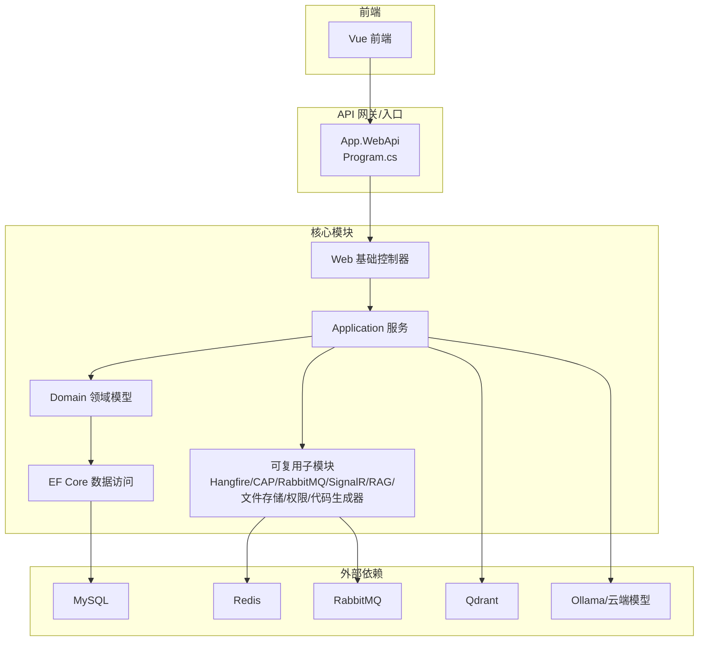
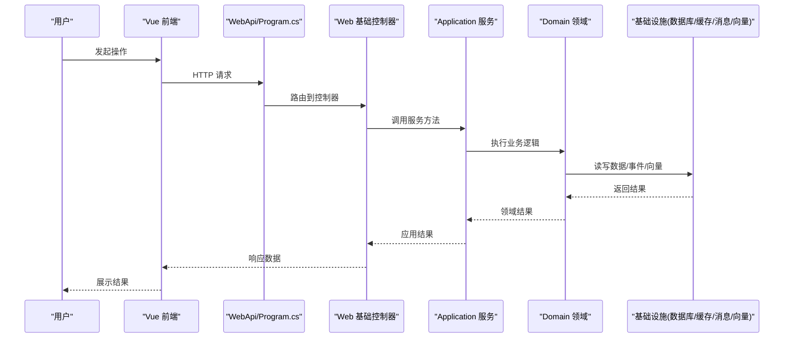
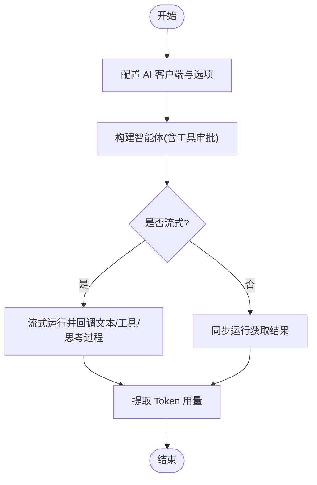
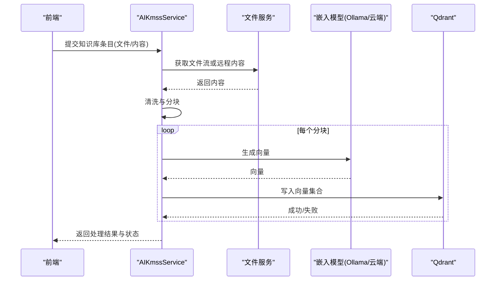
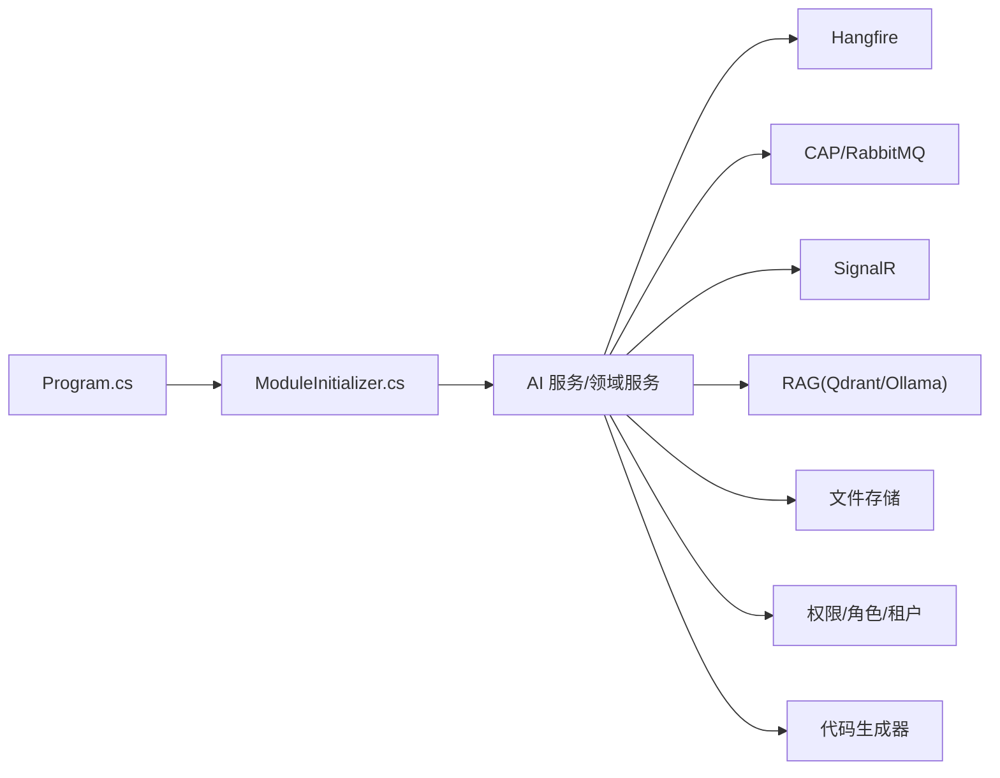

# 项目简介

<cite>
**本文引用的文件**
- [SYSTEM_DOCUMENTATION.md](file://SYSTEM_DOCUMENTATION.md)
- [Program.cs](file://App/WebApi/Program.cs)
- [AIAgentService.cs](file://Kevin/kevin.Module/kevin.AI.AgentFramework/AIAgentService.cs)
- [AIKmssService.cs](file://Kevin/Application/Services/AI/AIKmssService.cs)
- [ModuleInitializer.cs](file://Kevin/Application/ModuleInitializer.cs)
- [Kevin.Hangfire.csproj](file://Kevin/kevin.Module/kevin.Hangfire/Kevin.Hangfire.csproj)
- [CodeGeneratorController.cs](file://Kevin/Kevin.Web.Basics/Controllers/CodeGeneratorController.cs)
- [FileController.cs](file://Kevin/Kevin.Web.Basics/Controllers/FileController.cs)
- [MessageController.cs](file://Kevin/Kevin.Web.Basics/Controllers/MessageController.cs)
- [PermissionController.cs](file://Kevin/Kevin.Web.Basics/Controllers/PermissionController.cs)
- [RoleController.cs](file://Kevin/Kevin.Web.Basics/Controllers/RoleController.cs)
- [TenantController.cs](file://Kevin/Kevin.Web.Basics/Controllers/TenantController.cs)
- [UserController.cs](file://Kevin/Kevin.Web.Basics/Controllers/UserController.cs)
- [SignalRController.cs](file://Kevin/Kevin.Web.Basics/Controllers/SignalRController.cs)
- [Kevin.ALL.Module\KevinAllModuleMarker.cs](file://Kevin/kevin.Module/Kevin.ALL.Module/KevinAllModuleMarker.cs)
</cite>

## 目录
1. [引言](#引言)
2. [项目结构](#项目结构)
3. [核心组件](#核心组件)
4. [架构总览](#架构总览)
5. [详细组件分析](#详细组件分析)
6. [依赖关系分析](#依赖关系分析)
7. [性能与扩展性](#性能与扩展性)
8. [故障排查指南](#故障排查指南)
9. [结论](#结论)
10. [附录](#附录)

## 引言
NetCoreKevin 是企业级 AI 中台智能体 SaaS 框架，基于 .NET 9 构建，采用前后端分离与模块化设计，面向企业场景提供“AI 智能体 + 知识库 + 任务调度 + 权限管理 + 消息队列 + 文件存储 + 代码生成器”的一体化能力。其核心价值在于：
- 以 AgentFramework 为核心的智能体编排，支持多步推理、工具调用与技能加载；
- 基于 Qdrant 的 RAG 检索增强，结合本地离线模型（Ollama）与云端嵌入服务，实现企业私有知识的高效利用；
- 微服务就绪的分层架构，具备一库多租户、分布式事件通信、可观测性与高可用部署能力；
- 完善的工程化支撑：统一认证授权、消息总线、缓存、日志、文件存储与自动化代码生成，显著降低企业 AI 应用落地成本。

目标用户包括：企业 IT 部门、AI 平台团队、业务系统开发者与系统集成商。差异化优势体现在：将 AI 智能体与通用企业基础设施深度集成，提供开箱即用的知识库、权限、消息、任务与文件等能力，并支持本地离线模型与多云存储，兼顾安全合规与灵活扩展。

**章节来源**
- [SYSTEM_DOCUMENTATION.md:5-22](file://SYSTEM_DOCUMENTATION.md#L5-L22)

## 项目结构
项目采用清晰的分层与模块化组织：
- 应用入口与 Web API：位于 App/WebApi，负责启动、中间件配置与对外暴露接口；
- 核心模块 Kevin：包含 Application（服务）、Domain（实体与接口）、Entity Framework Core 数据访问、Web 基础控制器与大量可复用子模块（如 Hangfire、CAP、RabbitMQ、SignalR、RAG、文件存储、权限、代码生成器等）；
- 前端 Vue 应用：提供统一的控制台与管理界面，覆盖 AI 对话、知识库、任务、权限、租户、消息等页面；
- 共享与测试：Share 定义 DTO/枚举/接口，Test 提供单元测试与集成测试。

**图表来源**
- [Program.cs:23-85](file://App/WebApi/Program.cs#L23-L85)
- [Kevin.ALL.Module\KevinAllModuleMarker.cs:1-10](file://Kevin/kevin.Module/Kevin.ALL.Module/KevinAllModuleMarker.cs#L1-L10)

**章节来源**
- [SYSTEM_DOCUMENTATION.md:44-90](file://SYSTEM_DOCUMENTATION.md#L44-L90)
- [Program.cs:23-85](file://App/WebApi/Program.cs#L23-L85)

## 核心组件
- AI 智能体：通过 AIAgentService 封装 OpenAI 协议客户端，支持流式输出、工具调用审批、思考过程提取与 Token 用量统计；
- 知识库系统：AIKmssService 负责文档解析、分块、向量化与入库 Qdrant，支持多种文件格式与远程文件源；
- 任务调度：基于 Hangfire 的定时任务能力，持久化于 Redis，提供可视化面板；
- 权限管理：提供用户、角色、权限、租户等控制器与服务，支持细粒度授权；
- 消息队列：集成 CAP 与 RabbitMQ，实现可靠的事件发布订阅；
- 文件存储：统一抽象 IFileStorage，支持腾讯云 COS、阿里云 OSS、七牛云等；
- 代码生成器：根据数据库实体自动生成仓储、服务、DTO 等代码，提升开发效率。

**章节来源**
- [AIAgentService.cs:18-195](file://Kevin/kevin.Module/kevin.AI.AgentFramework/AIAgentService.cs#L18-L195)
- [AIKmssService.cs:15-449](file://Kevin/Application/Services/AI/AIKmssService.cs#L15-L449)
- [Kevin.Hangfire.csproj:1-19](file://Kevin/kevin.Module/kevin.Hangfire/Kevin.Hangfire.csproj#L1-L19)
- [PermissionController.cs](file://Kevin/Kevin.Web.Basics/Controllers/PermissionController.cs)
- [RoleController.cs](file://Kevin/Kevin.Web.Basics/Controllers/RoleController.cs)
- [TenantController.cs](file://Kevin/Kevin.Web.Basics/Controllers/TenantController.cs)
- [UserController.cs](file://Kevin/Kevin.Web.Basics/Controllers/UserController.cs)
- [MessageController.cs](file://Kevin/Kevin.Web.Basics/Controllers/MessageController.cs)
- [FileController.cs](file://Kevin/Kevin.Web.Basics/Controllers/FileController.cs)
- [CodeGeneratorController.cs](file://Kevin/Kevin.Web.Basics/Controllers/CodeGeneratorController.cs)

## 架构总览
系统遵循分层架构与模块化设计：
- 表现层：Vue 前端通过 REST/SSE/SignalR 与后端交互；
- API 层：ASP.NET Core 控制器暴露标准化接口，统一鉴权、签名、日志与异常处理；
- 应用层：服务编排业务流程，协调领域对象与外部系统；
- 领域层：承载核心业务规则与实体；
- 基础设施层：EF Core、缓存、消息、向量数据库、文件存储、任务调度等。

**图表来源**
- [Program.cs:23-85](file://App/WebApi/Program.cs#L23-L85)
- [ModuleInitializer.cs:15-27](file://Kevin/Application/ModuleInitializer.cs#L15-L27)

**章节来源**
- [SYSTEM_DOCUMENTATION.md:44-90](file://SYSTEM_DOCUMENTATION.md#L44-L90)

## 详细组件分析

### AI 智能体组件
- 功能要点：创建智能体、发送消息、流式输出、工具调用审批、思考过程提取、Token 用量统计；
- 关键流程：配置 OpenAI 客户端 -> 构建 Agent -> 执行 RunAsync/RunStreamingAsync -> 回调工具与文本 -> 统计用量；
- 适用场景：对话问答、联网搜索、工具编排、多步推理。

**图表来源**
- [AIAgentService.cs:37-195](file://Kevin/kevin.Module/kevin.AI.AgentFramework/AIAgentService.cs#L37-L195)

**章节来源**
- [AIAgentService.cs:18-195](file://Kevin/kevin.Module/kevin.AI.AgentFramework/AIAgentService.cs#L18-L195)

### 知识库系统组件
- 功能要点：文档上传/解析、分块、向量化、入库 Qdrant、状态跟踪；
- 关键流程：读取文件/内容 -> 清洗与分块 -> 调用嵌入模型生成向量 -> 批量写入 Qdrant -> 更新状态；
- 适用场景：企业私有文档问答、检索增强生成（RAG）。

**图表来源**
- [AIKmssService.cs:241-429](file://Kevin/Application/Services/AI/AIKmssService.cs#L241-L429)

**章节来源**
- [AIKmssService.cs:15-449](file://Kevin/Application/Services/AI/AIKmssService.cs#L15-L449)

### 任务调度组件
- 功能要点：基于 Hangfire 的定时任务，支持 Redis 持久化与 Dashboard 监控；
- 适用场景：周期性数据同步、报表生成、AI 任务触发等。

**章节来源**
- [Kevin.Hangfire.csproj:1-19](file://Kevin/kevin.Module/kevin.Hangfire/Kevin.Hangfire.csproj#L1-L19)

### 权限管理组件
- 功能要点：用户、角色、权限、租户等管理能力，细粒度授权；
- 适用场景：企业多租户、RBAC 控制、审计与合规。

**章节来源**
- [PermissionController.cs](file://Kevin/Kevin.Web.Basics/Controllers/PermissionController.cs)
- [RoleController.cs](file://Kevin/Kevin.Web.Basics/Controllers/RoleController.cs)
- [TenantController.cs](file://Kevin/Kevin.Web.Basics/Controllers/TenantController.cs)
- [UserController.cs](file://Kevin/Kevin.Web.Basics/Controllers/UserController.cs)

### 消息队列组件
- 功能要点：CAP 事件总线与 RabbitMQ 集成，提供可靠的消息发布订阅；
- 适用场景：跨服务异步通信、最终一致性、解耦与弹性。

**章节来源**
- [MessageController.cs](file://Kevin/Kevin.Web.Basics/Controllers/MessageController.cs)

### 文件存储组件
- 功能要点：统一抽象 IFileStorage，支持多种云存储；提供上传、下载、删除、缩略图等能力；
- 适用场景：知识库附件、图片、文档等统一管理。

**章节来源**
- [FileController.cs](file://Kevin/Kevin.Web.Basics/Controllers/FileController.cs)

### 代码生成器组件
- 功能要点：根据数据库实体自动生成仓储、服务、DTO 等代码，减少重复劳动；
- 适用场景：快速搭建 CRUD、规范代码结构、提升交付效率。

**章节来源**
- [CodeGeneratorController.cs](file://Kevin/Kevin.Web.Basics/Controllers/CodeGeneratorController.cs)

## 依赖关系分析
- 运行时入口：Program.cs 初始化日志、服务注册、中间件与 Kestrel；
- 模块装配：ModuleInitializer 批量注册服务，注入当前用户上下文；
- 子模块：Hangfire、CAP、RabbitMQ、SignalR、RAG、文件存储、权限、代码生成器等以独立项目形式提供，便于按需启用；
- 外部依赖：MySQL、Redis、Qdrant、RabbitMQ、Ollama/云端模型。

**图表来源**
- [Program.cs:23-85](file://App/WebApi/Program.cs#L23-L85)
- [ModuleInitializer.cs:15-27](file://Kevin/Application/ModuleInitializer.cs#L15-L27)

**章节来源**
- [Program.cs:23-85](file://App/WebApi/Program.cs#L23-L85)
- [ModuleInitializer.cs:15-27](file://Kevin/Application/ModuleInitializer.cs#L15-L27)

## 性能与扩展性
- 异步与流式：AI 智能体支持流式输出与重试策略，降低首字延迟并提高鲁棒性；
- 缓存与并发：Redis 作为缓存与任务调度持久化，提升吞吐与可用性；
- 向量检索：Qdrant 提供高效相似度检索，配合分块与去重策略优化召回质量；
- 可扩展性：模块化设计允许按业务域启用/禁用子模块，便于水平扩展与灰度发布；
- 可观测性：日志、HTTP 日志、Hangfire Dashboard 与 SignalR 实时通信，便于监控与排障。

[本节为通用指导，不直接分析具体文件]

## 故障排查指南
- 启动失败：检查端口占用、环境变量、连接字符串与证书配置；
- 数据库连接失败：确认 MySQL 服务与连接串；
- Redis 连接失败：确认 Redis 服务与密码；
- Qdrant 连接失败：确认 URL 与健康检查；
- AI 工具调用失败：检查工具注册与参数传递，查看日志；
- Hangfire 任务不执行：检查 Redis 连接与任务状态。

**章节来源**
- [SYSTEM_DOCUMENTATION.md:551-610](file://SYSTEM_DOCUMENTATION.md#L551-L610)

## 结论
NetCoreKevin 为企业级 AI 中台提供了完整的技术栈与工程化能力，将智能体、知识库、任务调度、权限、消息、文件与代码生成有机融合，既满足企业安全合规与多租户需求，又具备微服务就绪的高扩展性。通过模块化设计与清晰的职责划分，团队可以快速构建稳定、可维护、易扩展的 AI 应用与平台。

[本节为总结性内容，不直接分析具体文件]

## 附录
- 技术栈与版本：.NET 9、ASP.NET Core、EF Core、MySQL、Redis、Qdrant、Hangfire、CAP、IdentityServer4、AgentFramework、Ollama；
- 部署方式：Docker、Linux systemd 服务；
- 默认访问：API、Swagger、Hangfire 面板；
- 联系方式与社区：仓库地址、教学文档与交流群信息。

**章节来源**
- [SYSTEM_DOCUMENTATION.md:27-43](file://SYSTEM_DOCUMENTATION.md#L27-L43)
- [SYSTEM_DOCUMENTATION.md:116-186](file://SYSTEM_DOCUMENTATION.md#L116-L186)
- [SYSTEM_DOCUMENTATION.md:446-530](file://SYSTEM_DOCUMENTATION.md#L446-L530)
- [SYSTEM_DOCUMENTATION.md:693-724](file://SYSTEM_DOCUMENTATION.md#L693-L724)