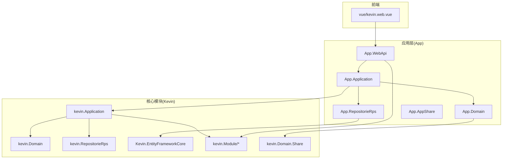
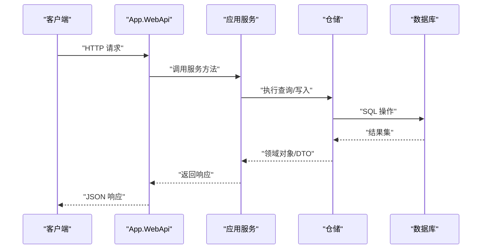
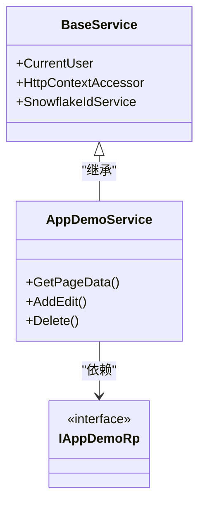
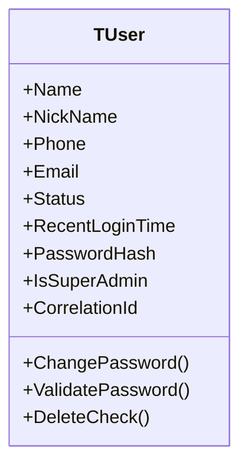
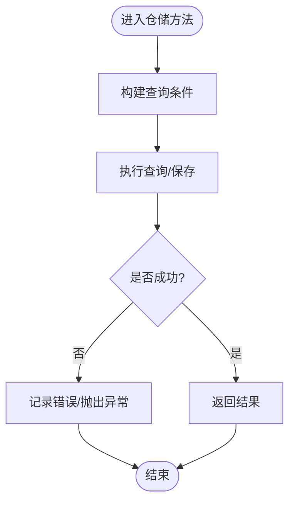
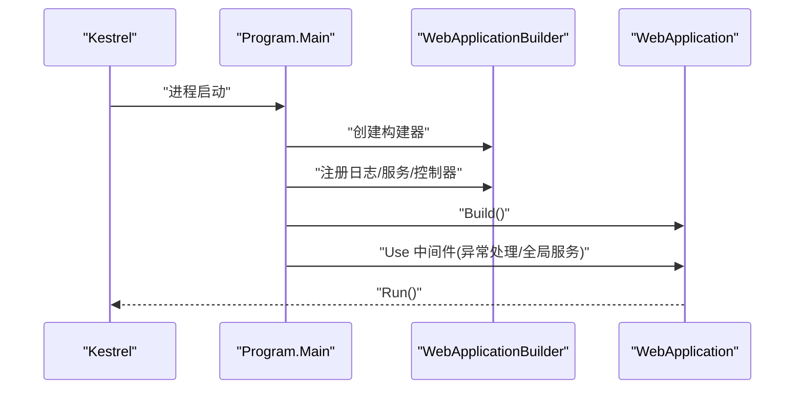
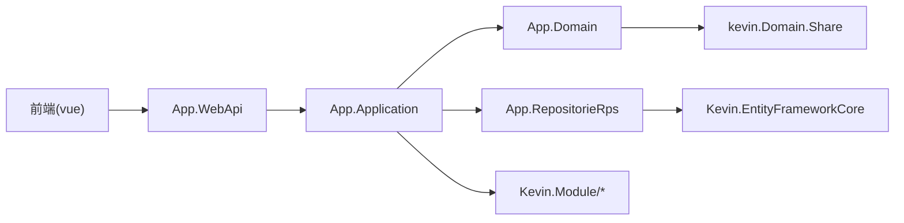

# 项目结构说明

<cite>
**本文引用的文件**
- [NetCoreKevin.sln](file://NetCoreKevin.sln)
- [Program.cs](file://App/WebApi/Program.cs)
- [ModuleInitializer.cs（应用层）](file://App/Application/ModuleInitializer.cs)
- [ModuleInitializer.cs（核心模块应用层）](file://Kevin/Application/ModuleInitializer.cs)
- [appsettings.json](file://App/WebApi/appsettings.json)
- [TAppDemo.cs](file://App/Domain/Entities/TAppDemo.cs)
- [AppDemoService.cs](file://App/Application/Services/v1/AppDemoService.cs)
- [AppDemoRp.cs](file://App/RepositorieRps/Repositories/v1/AppDemoRp.cs)
- [TUser.cs](file://Kevin/Domain/Entities/TUser.cs)
- [UserService.cs](file://Kevin/Application/Services/UserService.cs)
- [BaseService.cs](file://Kevin/Application/Services/BaseService.cs)
- [KevinAllModuleMarker.cs](file://Kevin/kevin.Module/Kevin.ALL.Module/KevinAllModuleMarker.cs)
- [Kevin.ALL.Module.csproj](file://Kevin/kevin.Module/Kevin.ALL.Module/Kevin.ALL.Module.csproj)
- [App.Share.csproj](file://App/AppShare/App.Share.csproj)
- [kevin.Domain.Share.csproj](file://Kevin/kevin.Share/kevin.Domain.Share.csproj)
</cite>

## 目录
1. [简介](#简介)
2. [项目结构总览](#项目结构总览)
3. [核心组件](#核心组件)
4. [架构总览](#架构总览)
5. [详细组件分析](#详细组件分析)
6. [依赖关系分析](#依赖关系分析)
7. [性能与扩展性考虑](#性能与扩展性考虑)
8. [故障排查指南](#故障排查指南)
9. [结论](#结论)
10. [附录：命名规范与约定](#附录：命名规范与约定)

## 简介
本项目采用前后端分离与领域驱动设计（DDD）的分层架构，后端以 .NET 9 为基础，通过模块化与多项目组织实现高内聚、低耦合。顶层目录包含：
- App：业务应用层，按 Application、Domain、RepositorieRps、WebApi 分层，承载具体业务实体、服务、仓储与对外 API。
- Kevin：核心能力与通用模块集合，提供权限、缓存、消息、AI、存储、日志、SignalR、分布式锁等可复用能力。
- vue：前端 Vue 应用，提供管理界面与 AI 交互页面。
- Test：单元测试与集成测试。
- Doc：文档与图片资源。
- InitData：初始化数据说明。

本说明旨在帮助新成员快速理解目录职责、分层原则、模块间依赖与通信机制，以及命名与代码组织约定。

## 项目结构总览
整体解决方案由多个子项目组成，按“应用域 + 核心模块”的方式划分。关键入口为 WebApi 的 Program，负责启动 ASP.NET Core 管道、注册日志、配置服务、启用中间件并运行应用。各模块通过统一的模块初始化器进行服务注册与装配。

图表来源
- [Program.cs:23-85](file://App/WebApi/Program.cs#L23-L85)
- [Kevin.ALL.Module.csproj:89-113](file://Kevin/kevin.Module/Kevin.ALL.Module/Kevin.ALL.Module.csproj#L89-L113)

章节来源
- [NetCoreKevin.sln:6-87](file://NetCoreKevin.sln#L6-L87)
- [Program.cs:23-85](file://App/WebApi/Program.cs#L23-L85)

## 核心组件
- 应用入口与管道：Program 负责环境设置、日志、服务配置、控制器注册、异常处理、全局服务注入与运行。
- 模块初始化器：Application 层的 ModuleInitializer 通过统一接口批量注册服务，便于扩展与维护。
- 共享契约：kevin.Domain.Share 与 App.AppShare 提供跨项目共享的 DTO、枚举、接口与基础类型。
- 仓储与数据库：EntityFrameworkCore 提供 DbContext 与拦截器；仓储实现继承通用 Repository，封装 CRUD 与分页查询。
- 服务层：BaseService 提供当前用户、雪花ID、上下文访问等公共能力；业务服务组合仓储与外部服务完成用例编排。
- 模块聚合：Kevin.ALL.Module 聚合所有核心能力模块，作为统一引用点。

章节来源
- [Program.cs:23-85](file://App/WebApi/Program.cs#L23-L85)
- [ModuleInitializer.cs（应用层）:10-19](file://App/Application/ModuleInitializer.cs#L10-L19)
- [ModuleInitializer.cs（核心模块应用层）:15-27](file://Kevin/Application/ModuleInitializer.cs#L15-L27)
- [App.Share.csproj:19-21](file://App/AppShare/App.Share.csproj#L19-L21)
- [kevin.Domain.Share.csproj:1-22](file://Kevin/kevin.Share/kevin.Domain.Share.csproj#L1-L22)
- [AppDemoRp.cs:1-13](file://App/RepositorieRps/Repositories/v1/AppDemoRp.cs#L1-L13)
- [BaseService.cs:7-39](file://Kevin/Application/Services/BaseService.cs#L7-L39)
- [KevinAllModuleMarker.cs:1-10](file://Kevin/kevin.Module/Kevin.ALL.Module/KevinAllModuleMarker.cs#L1-L10)

## 架构总览
系统遵循 DDD 分层与模块化思想：
- 表现层：WebApi 暴露 RESTful API，使用过滤器、版本控制、Swagger 等。
- 应用层：编排用例，协调领域与基础设施，持有当前用户与上下文信息。
- 领域层：定义实体、值对象、领域服务与事件，表达核心业务规则。
- 基础设施层：EF Core、缓存、消息队列、文件存储、日志、认证授权等。
- 前端：Vue 应用通过 HTTP/SignalR 与后端交互。

图表来源
- [AppDemoService.cs:14-23](file://App/Application/Services/v1/AppDemoService.cs#L14-L23)
- [AppDemoRp.cs:1-13](file://App/RepositorieRps/Repositories/v1/AppDemoRp.cs#L1-L13)

## 详细组件分析

### 应用层（App.Application）
- 职责：实现用例编排，组合仓储与外部服务，处理输入输出转换与事务边界。
- 组织方式：按功能域与版本号（如 v1）划分服务目录，便于演进与兼容。
- 服务注册：通过 ModuleInitializer 批量扫描 IService 并注册到容器，同时维护全局服务索引。

图表来源
- [BaseService.cs:7-39](file://Kevin/Application/Services/BaseService.cs#L7-L39)
- [AppDemoService.cs:1-84](file://App/Application/Services/v1/AppDemoService.cs#L1-L84)

章节来源
- [ModuleInitializer.cs（应用层）:10-19](file://App/Application/ModuleInitializer.cs#L10-L19)
- [AppDemoService.cs:14-84](file://App/Application/Services/v1/AppDemoService.cs#L14-L84)

### 领域层（App.Domain / Kevin.Domain）
- 职责：定义实体、基础基类、领域事件与接口抽象。
- 组织方式：实体按功能域分组（如 AI、Organizational），接口与实现分离，便于替换与测试。
- 示例：TUser 体现用户领域模型与行为（密码校验、删除保护）。

图表来源
- [TUser.cs:1-99](file://Kevin/Domain/Entities/TUser.cs#L1-L99)

章节来源
- [TUser.cs:1-99](file://Kevin/Domain/Entities/TUser.cs#L1-L99)

### 仓储层（App.RepositorieRps / kevin.RepositorieRps）
- 职责：封装对数据库的访问，提供统一查询与持久化能力。
- 组织方式：按领域与版本划分，仓储实现继承通用 Repository，减少重复代码。
- 示例：AppDemoRp 演示标准仓储实现模式。

图表来源
- [AppDemoRp.cs:1-13](file://App/RepositorieRps/Repositories/v1/AppDemoRp.cs#L1-L13)

章节来源
- [AppDemoRp.cs:1-13](file://App/RepositorieRps/Repositories/v1/AppDemoRp.cs#L1-L13)

### 表现层（App.WebApi）
- 职责：接收 HTTP 请求，路由到控制器与服务，处理横切关注点（日志、异常、鉴权、限流等）。
- 启动流程：设置环境变量、注册日志、配置服务、添加控制器、启用中间件、运行应用。
- 配置：通过 appsettings.* 文件管理不同环境的配置项，包括代码生成区域、第三方 API、消息通道等。

图表来源
- [Program.cs:23-85](file://App/WebApi/Program.cs#L23-L85)

章节来源
- [Program.cs:23-85](file://App/WebApi/Program.cs#L23-L85)
- [appsettings.json:117-130](file://App/WebApi/appsettings.json#L117-L130)

### 核心模块聚合（Kevin.ALL.Module）
- 职责：聚合所有核心能力模块，作为统一引用点，确保产物可用。
- 内容：包含 AI、缓存、CAP、Consul、CORS、分布式锁、文件存储、HTTP 客户端、IOC、日志、权限、SignalR、短信、RAG、SnowflakeId、Swagger 版本控制等。

章节来源
- [KevinAllModuleMarker.cs:1-10](file://Kevin/kevin.Module/Kevin.ALL.Module/KevinAllModuleMarker.cs#L1-L10)
- [Kevin.ALL.Module.csproj:89-113](file://Kevin/kevin.Module/Kevin.ALL.Module/Kevin.ALL.Module.csproj#L89-L113)

### 共享契约（kevin.Domain.Share / App.AppShare）
- 职责：提供跨项目共享的 DTO、枚举、接口与基础类型，降低耦合度。
- 组织方式：kevin.Domain.Share 为核心共享库；App.AppShare 为应用级共享库，引用核心共享库。

章节来源
- [kevin.Domain.Share.csproj:1-22](file://Kevin/kevin.Share/kevin.Domain.Share.csproj#L1-L22)
- [App.Share.csproj:19-21](file://App/AppShare/App.Share.csproj#L19-L21)

## 依赖关系分析
- 应用层依赖领域层与仓储层，并通过共享契约解耦。
- 核心模块通过模块化聚合，被应用层按需引入。
- 前端通过 HTTP/SignalR 与后端交互，不直接依赖后端内部结构。

图表来源
- [Kevin.ALL.Module.csproj:89-113](file://Kevin/kevin.Module/Kevin.ALL.Module/Kevin.ALL.Module.csproj#L89-L113)
- [App.Share.csproj:19-21](file://App/AppShare/App.Share.csproj#L19-L21)

章节来源
- [NetCoreKevin.sln:6-87](file://NetCoreKevin.sln#L6-L87)

## 性能与扩展性考虑
- 依赖注入与模块化：通过 ModuleInitializer 与 IOC 模块，支持按功能域扩展与替换实现。
- 缓存与异步：服务层可使用缓存与异步 IO，减少数据库压力与提升吞吐。
- 分布式能力：CAP、RabbitMQ、Redis 分布式锁、Consul 服务发现等增强可扩展性与容错性。
- 日志与监控：log4Net 与自定义拦截器提供可观测性，便于定位问题与优化。
- 代码生成：通过配置区域与模板，自动生成仓储与服务，提高一致性并减少样板代码。

[本节为通用指导，无需特定文件来源]

## 故障排查指南
- 启动失败：检查 Program 中的日志注册与环境变量设置，确认配置文件路径与连接串正确。
- 服务未注册：确认 ModuleInitializer 已正确扫描 IService 并添加到容器。
- 权限或鉴权问题：检查过滤器与权限模块配置，确认 Token 与签名验证逻辑。
- 数据库访问异常：检查仓储实现与 EF Core 配置，确认表结构与映射正确。
- 前端联调：确认 API 地址、跨域配置与 Swagger 版本匹配。

章节来源
- [Program.cs:23-85](file://App/WebApi/Program.cs#L23-L85)
- [ModuleInitializer.cs（应用层）:10-19](file://App/Application/ModuleInitializer.cs#L10-L19)
- [ModuleInitializer.cs（核心模块应用层）:15-27](file://Kevin/Application/ModuleInitializer.cs#L15-L27)

## 结论
本项目通过清晰的分层与模块化设计，实现了高内聚、低耦合的可扩展架构。应用层聚焦用例编排，领域层表达核心业务，基础设施层提供通用能力，前端提供友好交互。借助共享契约与模块聚合，团队可并行开发、独立演进，并快速集成新的能力（如 AI、消息、缓存等）。建议新成员从 Program 入口入手，逐步理解各层职责与依赖关系，结合代码生成与模块初始化器高效扩展功能。

[本节为总结，无需特定文件来源]

## 附录：命名规范与约定
- 目录与项目命名
  - 应用域：App.*（如 App.Domain、App.Application、App.RepositorieRps、App.WebApi）
  - 核心模块：kevin.*（如 kevin.Domain、kevin.Application、kevin.RepositorieRps、kevin.Module/*）
  - 共享契约：kevin.Domain.Share、App.AppShare
- 分层与包结构
  - Domain：Entities、Interfaces（IServices/IRepositories）、Events、EventHandlers
  - Application：Services（按域与版本划分）、TaskModuleConfigs
  - RepositorieRps：Repositories（按域与版本划分）
  - WebApi：Controllers（按域与版本划分）、Filters、Extensions
- 接口与实现
  - 接口前缀 I（如 IAppDemoService、IAppDemoRp）
  - 实现后缀 Service/Rp（如 AppDemoService、AppDemoRp）
- 版本管理
  - 通过 v1、v2 等目录区分 API 版本，便于向后兼容与平滑升级
- 配置与代码生成
  - 在 appsettings.* 中配置 CodeGeneratorSetting，指定实体路径、仓储与服务命名空间，自动生成代码

章节来源
- [appsettings.json:117-130](file://App/WebApi/appsettings.json#L117-L130)
- [AppDemoService.cs:1-84](file://App/Application/Services/v1/AppDemoService.cs#L1-L84)
- [AppDemoRp.cs:1-13](file://App/RepositorieRps/Repositories/v1/AppDemoRp.cs#L1-L13)