#  :dizzy: NetCoreKevin介绍
|  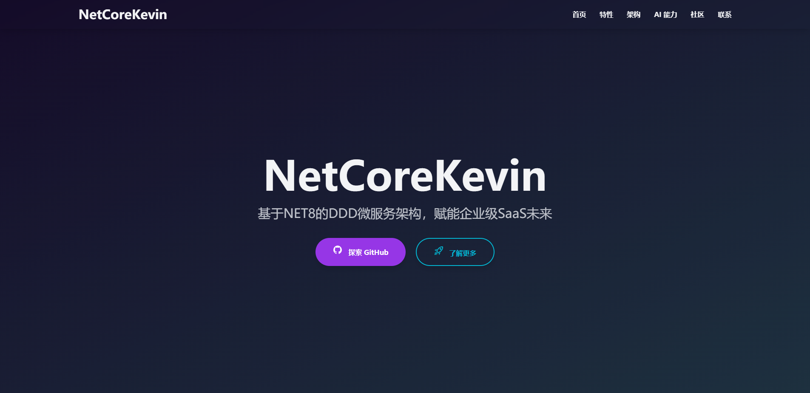 | 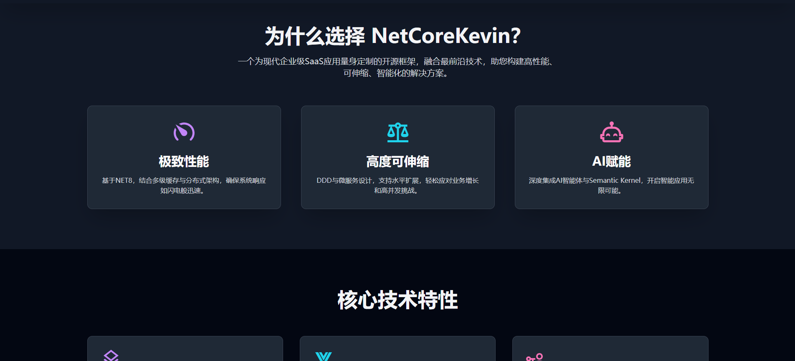  |  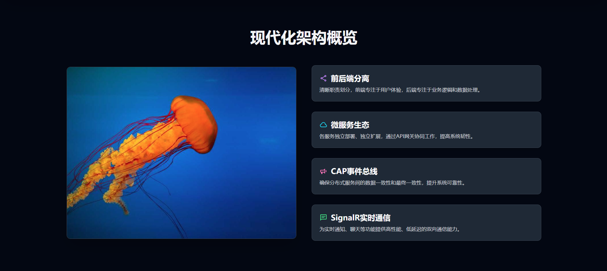  |
|---|---|---|
| 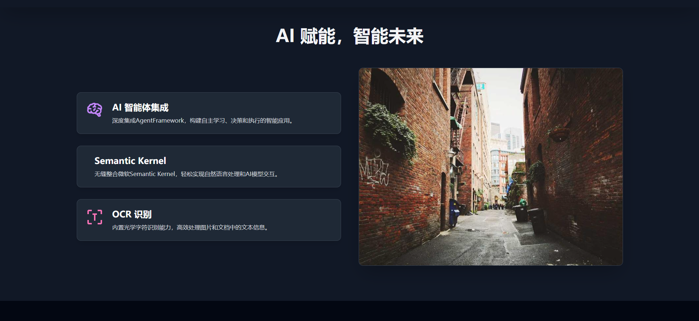  |  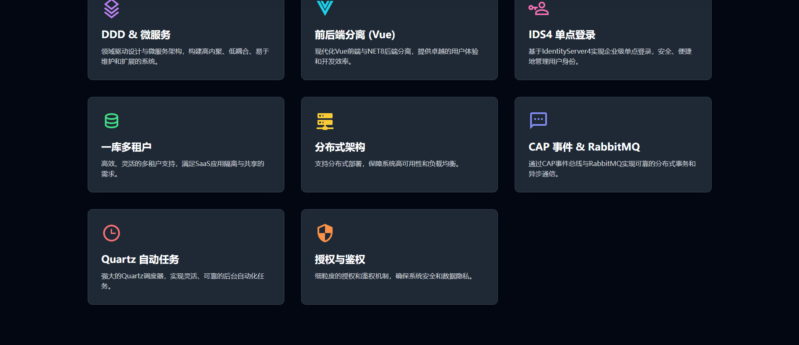|  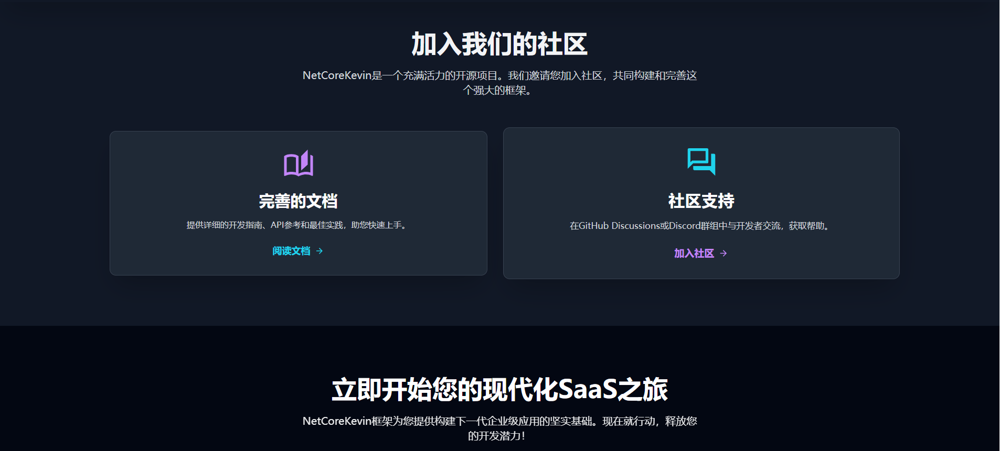 |

#  :barber: 知识库AI智能体效果图 
|   | 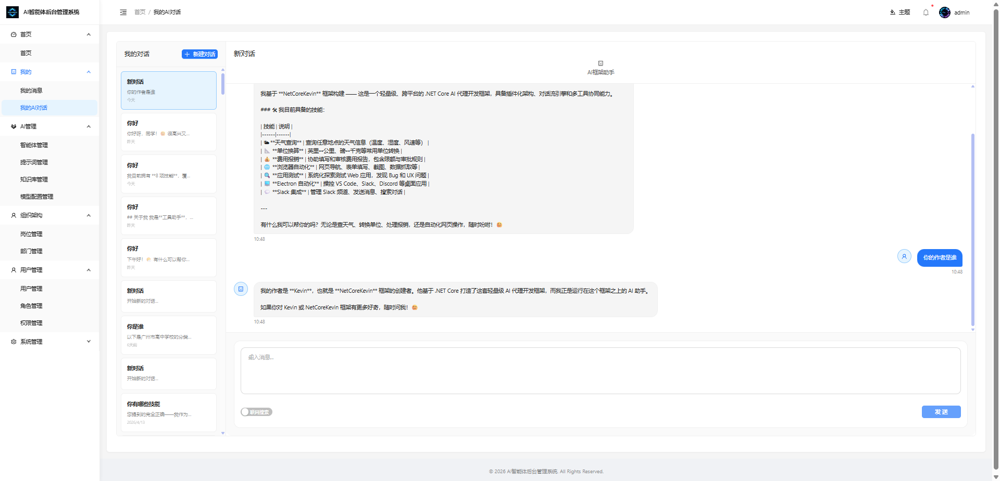  | 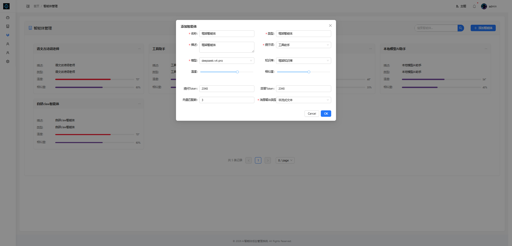  |
|---|---|---|

#  :zap: AI智能体技能效果图 
|    | 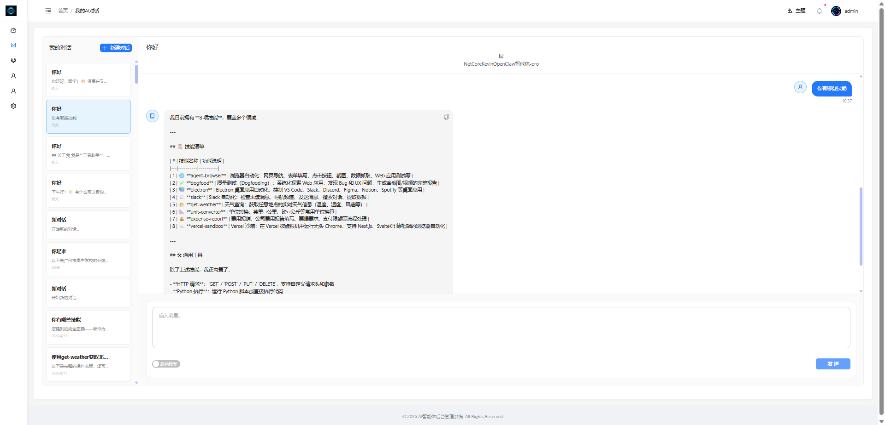 |  |
|---|---|---|

# 🌐后台管理系统效果图（基于VUE3-AntDesign） 

| 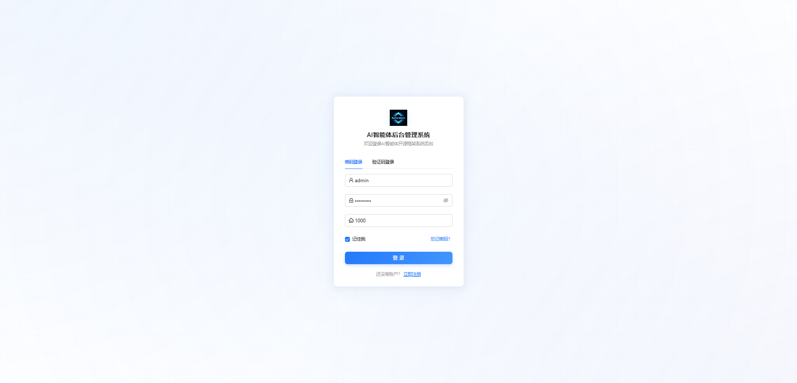  |  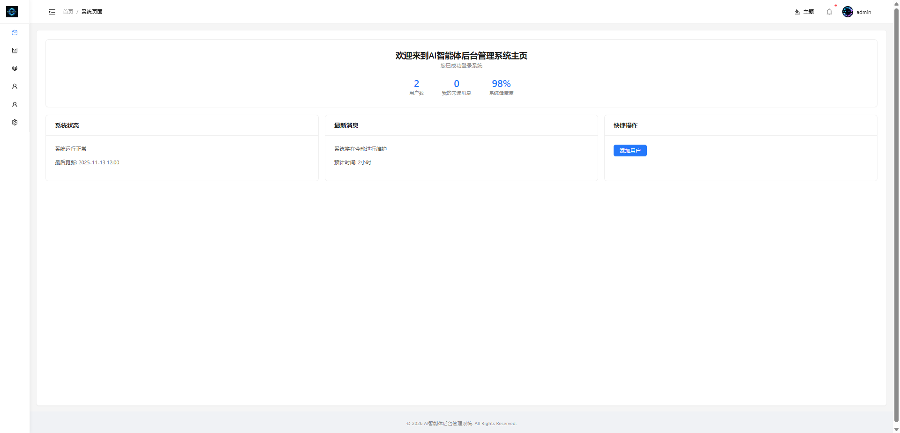 | 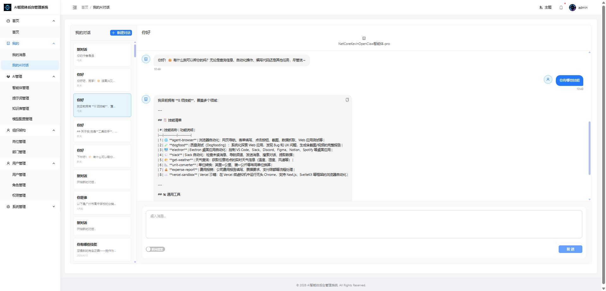   |  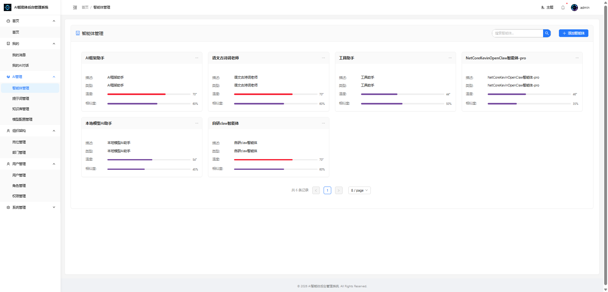 |
|---|---|---|---|
| 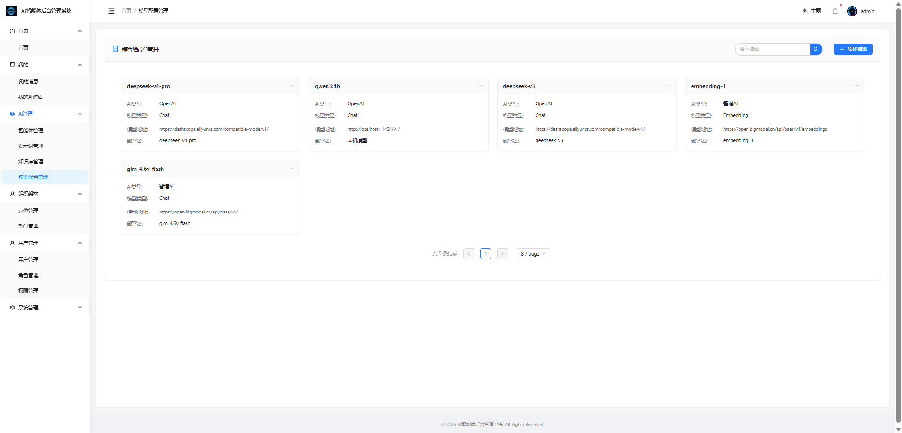   |  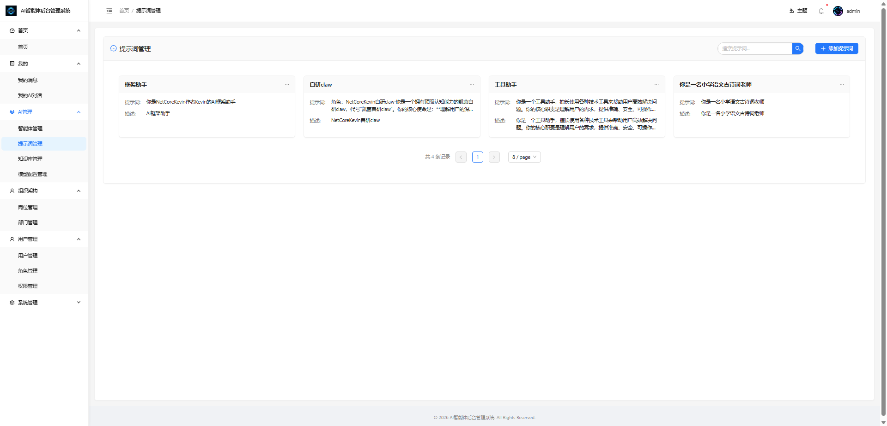 | 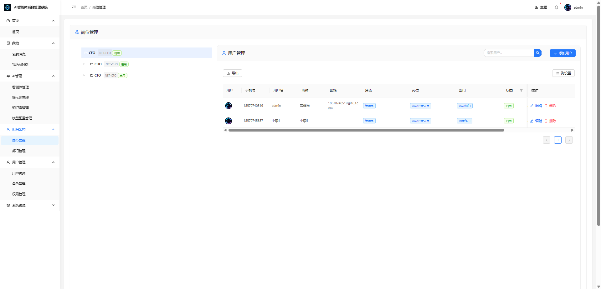  |  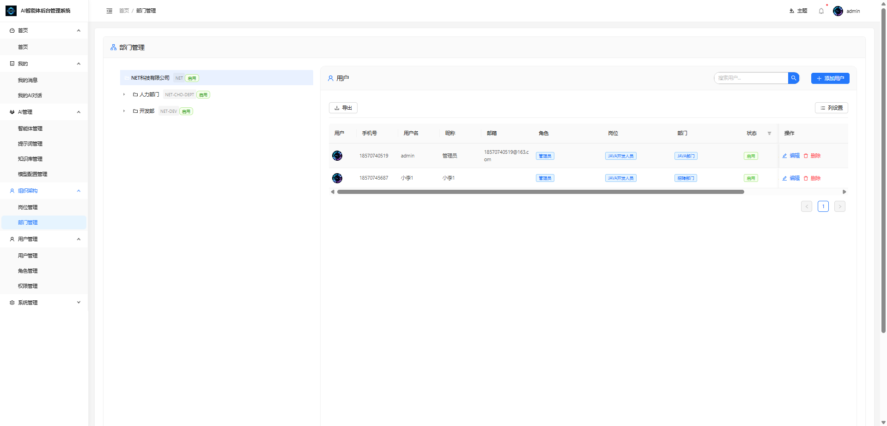 |
|   | 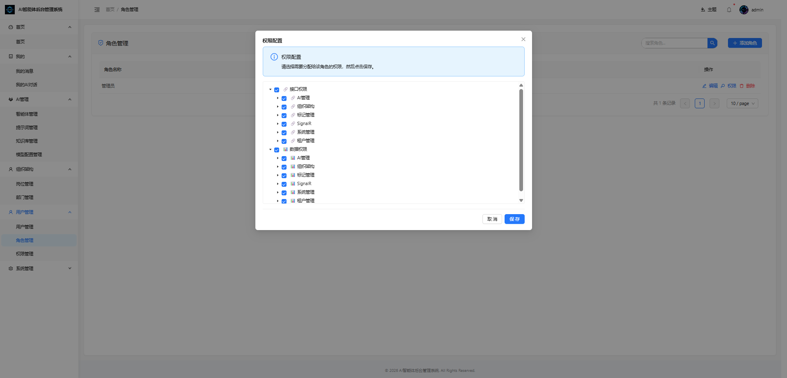  |   |   |


#  :envelope:  NetCoreKevin前言
基于NET搭建-AI知识库智能体-现代化Saas企业级前后端分离架构：前端Vue3、IDS4单点登录、多缓存、自动任务、分布式、一库多租户、日志、授权和鉴权、CAP集成事件、SignalR、领域事件、MCP协议服务、IOC模块化注入、代码生成器、自动任务、AI、AgentFramework智能体、AISemanticKernel集成、RAG检索增强、AI知识库、AI联网搜索
解耦设计都可以单独引用项目启动时注意相关Redis、db链接配置等相关配置详情可见下面的上手教程


# 教学文档地址 [[教学文档地址](https://blog.csdn.net/weixin_42629287/category_13037923.html)]


# 📦 项目启动与配置

- 1. 配置 Redis 和数据库
- 项目启动前需配置 Redis 和数据库连接字符串。
- 数据库结构可通过脚本生成。
- 2. Docker 配置
- 项目支持 Docker 部署，Dockerfile 和配置文件已提供。
- 3. JSON 配置
- 项目使用 JSON 文件进行配置，包括缓存、短信、日志、AI 等模块。

# 🧰上手教程

-   第一步
-   `json配置文件请配置好数据库链接默认使用MySQL（可自行更改）EFCore框架 不熟悉的可以看看微软官网文档`
-   第二步
-   `执行初始化数据库命令：在vs中“程序包管理控制台”选择Kevin.EntityFrameworkCore项目 执行NuGet命令  Add-Migration "初始化数据库"  在执行=》 Update-Database  执行完成后开始第三步`
-   第三步
-   `启动App.WebApi第一次启动会初始化种子数据 种子数据配置可以在kevin.Domain.BaseDatas下面查看和更改 启动后通过http://localhost:9901/swagger/index.html路由查看接口页面和如下页面`
-   第四步
-  `启动App.AuthorizationService项目统一授权中心`
-   第五步
-   `在vue文件夹下面启动前端 前端运行步骤：1、安装依赖npm install 2、运行npm run serve 3、打包npm run build`

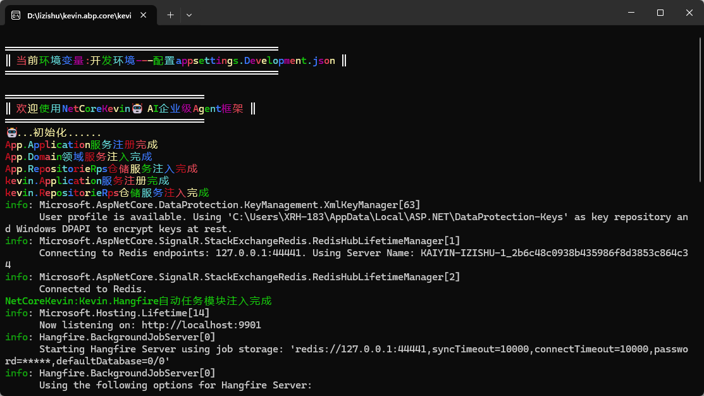

# 🧰AI智能体教程

-   第一步
-   `请先完成上手教程在进行AI智能体教程`
-   第二步
-   `下载安装Qdrant--官网有教程 安装后配置json文件QdrantClientSetting 默认是localhost不需要动的`
-   第三步
-   `注册AI账户 教程以智谱AI为例 去[官网](https://open.bigmodel.cn)注册登录后获取APIKey`
-   第四步
-  `配置向量模型和对话模型默认如下`

|||
|--|--| 

-   第五步
-   `新建知识库选择向量模型(如果不选择请在json配置中配置)2048（默认）：最高精度，适合对准确性要求极高的场景===》配置智能体==》新建对话就OK了`

|||  |
|--|--|--|

# 🧰基于Ollama部署本地模型
Ollama 支持多种操作系统，包括 macOS、Windows、Linux 以及通过 Docker 容器运行。
Ollama 对硬件要求不高，旨在让用户能够轻松地在本地运行、管理和与大型语言模型进行交互。
CPU：多核处理器（推荐 4 核或以上）。
GPU：如果你计划运行大型模型或进行微调，推荐使用具有较高计算能力的 GPU（如 NVIDIA 的 CUDA 支持）。
内存：至少 8GB RAM，运行较大模型时推荐 16GB 或更高。
存储：需要足够的硬盘空间来存储预训练模型，通常需要 10GB 至数百 GB 的空间，具体取决于模型的大小。 

Ollama 官方下载地址：[https://ollama.com/download](https://ollama.com/download)

1.安装后运行模型 可根据电脑配置自由选择模型 可以使用qwen3:4b来进行测试
ollama run qwen3:4b
系统配置如下
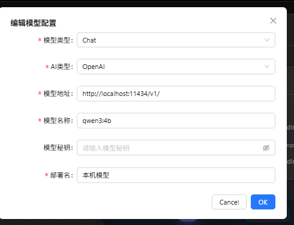

# 🌐 自动任务配置（Hangfire）
默认基于redis方式注册Hangfire可在Kevin.Hangfire.ServiceCollectionExtensions自行添加或调整注入方式

1.继承IModuleConfigTasks类实现ConfigTasks会在项目启动时自动注册任务，并且自动任务可以基于接口类直接调用应用服务

```
    /// <summary>
    /// AIKmssTasks配置任务设置
    /// </summary>
    public class AIKmssModuleConfigTasks : IModuleConfigTasks
    {  
        /// <summary>
        /// 配置任务
        /// </summary>
        public Task<bool> ConfigTasks(IRecurringJobManager recurringJobManager)
        {
            recurringJobManager.AddOrUpdate<IAIKmssService>(
                recurringJobId: "每6分钟检测是否有AI文档知识库需要处理",      // 唯一的 ID，用于后续修改或删除
                (s) => s.ProcessKmssVectorData(default),
                "0 0/6 0/1 * * ? ", new RecurringJobOptions
                {
                    TimeZone = TimeZoneInfo.Local,        // 指定时区（默认UTC） 
                }
            );
            return Task.FromResult(true);
        } 
    }
```
# 🌐 新项目使用教程(基于NetCoreKevin进行二次开发)

1.新建项目直接引用Kevin.Web.Basics
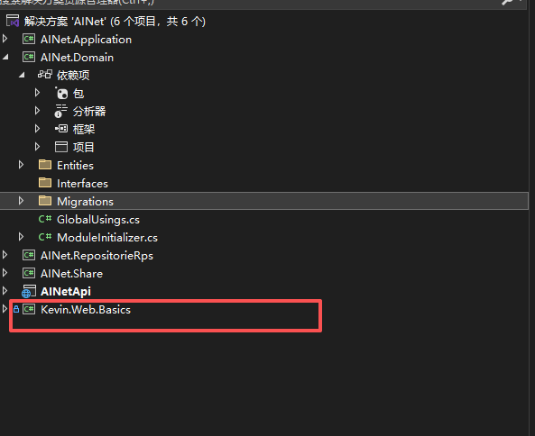

2.copy所有的appsettings.json文件到新项目还有Program的代码

3.调整配置文件的数据库和redis配置以及json中MigrationsAssembly为新项目的程序集，如上图应设“AINet.Domain”

4.项目结构可参考上图或者开源架构中的App模块

5.因为引用的Kevin.Web.Basics模块 后续更新同步只需拉取NetCoreKevin新代码，好处是可以即保持框架更新也可以开发自己的业务

# 🌐 项目概述
NetCoreKevin 是一个基于 DDD（Domain-Driven Design） 和 微服务架构 的 .NET 8 Web API 项目，其核心目标是提供一个可复用、模块化、可扩展的架构平台。它集成了以下关键功能：

    身份认证与授权（基于 IdentityServer4）
    多缓存支持（Redis、内存缓存）
    分布式系统支持（CAP 集成事件）
    多租户支持（一库多租户）
    任务调度
    日志系统（log4Net）
    实时通信（SignalR）
    AI 集成（SemanticKernel、OCR 验证码识别）
    短信服务（阿里云、腾讯云）
    文件存储（阿里云、腾讯云）
    自动化爬虫（Selenium）
    模块化依赖注入（IOC）
    多版本 API 兼容
    单元测试支持
    Docker 支持
    RabbitMQ

 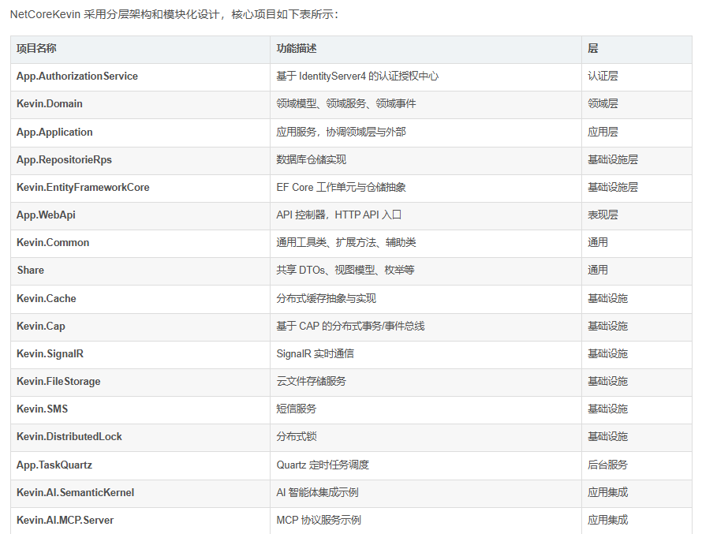


# 🧩 项目结构详解
以下是项目的核心模块及其功能说明：

一、 核心安全与认证

授权服务：基于IdentityServer4，提供用户登录认证和API访问授权。

权限服务：实现基于API接口的细粒度访问控制。

二、 业务架构层

领域层：存放核心业务逻辑与规则（DDD核心）。

应用服务层：协调领域逻辑，处理具体业务用例。

仓储层：封装所有数据库的增删改查操作。

API层：提供对外RESTful接口。

三、 通用技术支持

工具库：包含常用辅助类、扩展方法等。

工作单元：基于EF Core，管理数据库事务。

缓存服务：支持多种分布式缓存。

日志系统：基于log4Net记录运行日志。

文件存储：支持云存储的文件上传下载。

短信服务：集成主流云平台发送短信。

四、 分布式与集成

服务发现：使用Consul进行微服务注册与发现。

事件总线：基于CAP处理分布式事件通信。

领域事件：基于MediatR处理进程内事件。

HTTP客户端：封装HTTP/2.0调用，用于外部API访问。

分布式锁：控制分布式环境下的资源并发访问。

五、 AI与智能模块

AI基础模块：集成语义理解、OCR识别等AI能力。

智能体服务：基于AgentFramework的AI智能体系统。

知识库系统：使用Qdrant向量数据库实现RAG检索增强。

联网搜索：集成搜索引擎API，支持实时信息获取。

智能体管理：智能体生命周期管理、工具调用和工作流编排。

六、 特定功能模块

任务调度：基于Hangfire执行定时任务。

实时通信：基于SignalR实现服务端消息推送。

爬虫服务：基于Selenium进行网页数据采集。

七、 基础设施与配置

IOC容器：提供模块化依赖注入。

跨域配置：管理Web跨域访问策略。

共享模型：存放系统通用的DTO、枚举等。

数据初始化：提供数据库结构和初始数据的SQL脚本。

Web工具层：包含全局过滤器、中间件等Web相关基础组件。


# 🧰 技术亮点
技术点	说明

- .NET 8	最新的 .NET 框架，性能更优，支持更多新特性
- DDD	领域驱动设计，将复杂业务逻辑抽象为模块化结构
- 微服务架构	通过 Consul、CAP、Quartz 等实现服务解耦和分布式管理
- CAP	消息总线，用于跨服务事件通信
- MediatR	领域事件处理
- IdentityServer4	安全认证中心，支持 OAuth2 和 OpenID Connect
- Hangfire	定时任务调度
- EF Core	ORM 工具，用于数据库操作
- Docker	容器化部署，便于环境管理
- AI 集成	SemanticKernel、MCP 服务、OCR 验证码识别等 AI 技术

# 🧠 AI 集成说明
AI 模块包括：

- SemanticKernel：语义理解框架，支持自然语言处理。
- OCR 验证码识别：通过 AI 技术识别验证码图像。
- MCP 服务：用于 AI 服务通信或协议扩展。

# 📝 总结
NetCoreKevin 是一个非常完整的微服务架构项目，结合了 DDD、CAP、Hangfire、EFCore 等多种技术，并集成了 AI、OCR、短信、文件存储等实用功能。其模块化设计使得每个功能都可以独立引用，非常适合大型企业级应用的开发。
## Star History

<a href="https://www.star-history.com/?repos=junkai-li%2FNetCoreKevin&type=timeline&legend=bottom-right">
 <picture>
   <source media="(prefers-color-scheme: dark)" srcset="https://api.star-history.com/chart?repos=junkai-li/NetCoreKevin&type=timeline&theme=dark&legend=bottom-right" />
   <source media="(prefers-color-scheme: light)" srcset="https://api.star-history.com/chart?repos=junkai-li/NetCoreKevin&type=timeline&legend=bottom-right" />
   
 </picture>
</a>

        
    
# 🌐交流群

 |   |     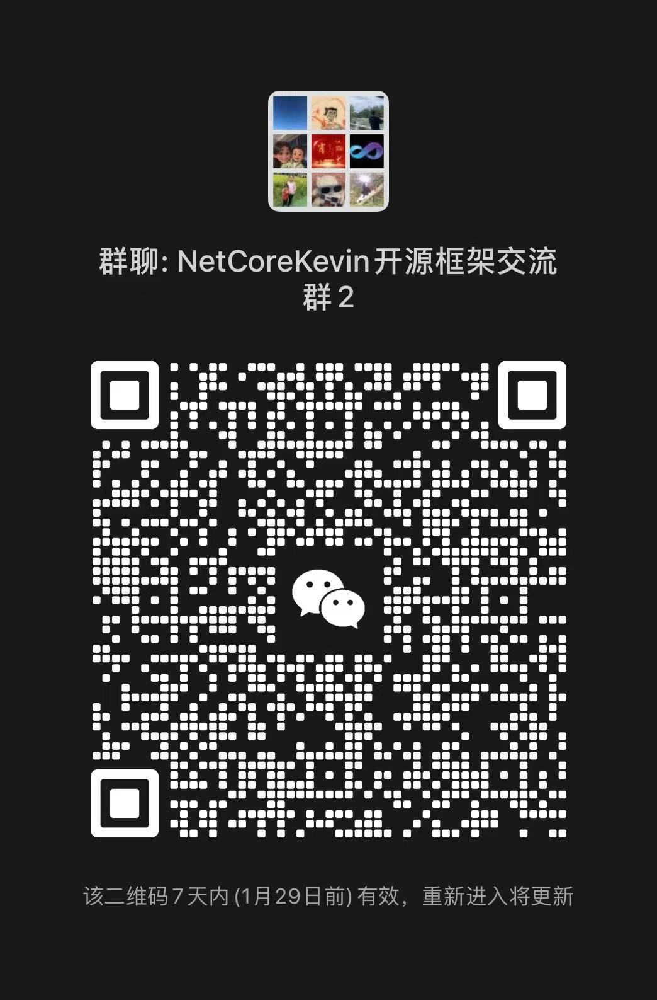  | 
|---|---|

# DDD思想    
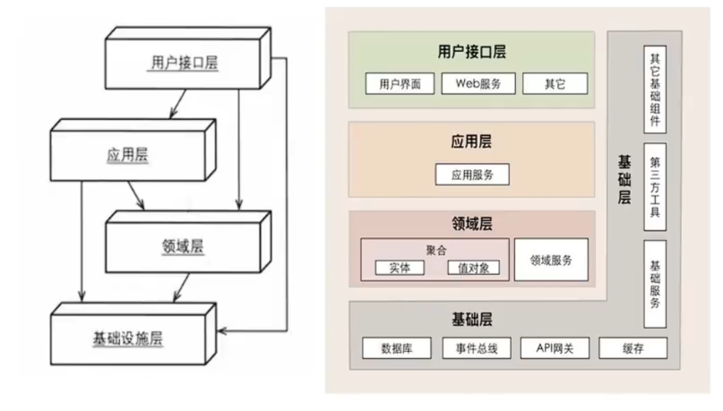
# 思维导图
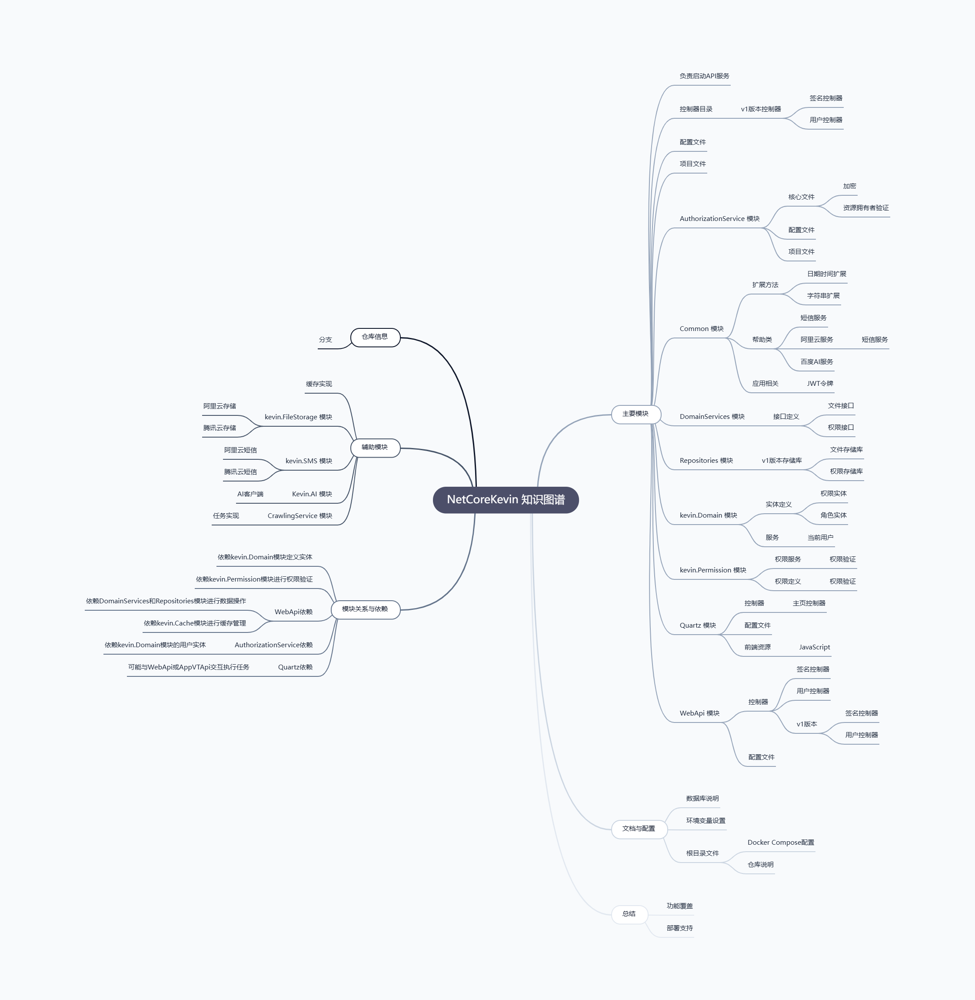

