# NetCoreKevin

> 是基于 .NET 9 构建的企业级 AI中台智能体 SaaS 前后端分离架构，集成了 AI 知识库智能体、Skill技能管理、本地离线AI模型调用、智能体技能可控加载、AI联网搜索、智能体权限管控、一库多租户、分布式系统、微服务架构等核心能力。

---

## 📷 功能效果图

### AI 智能体技能工具管理
| 动态管理 | 智能体配置 | 对话交互 |
|---------|----------|---------|
| 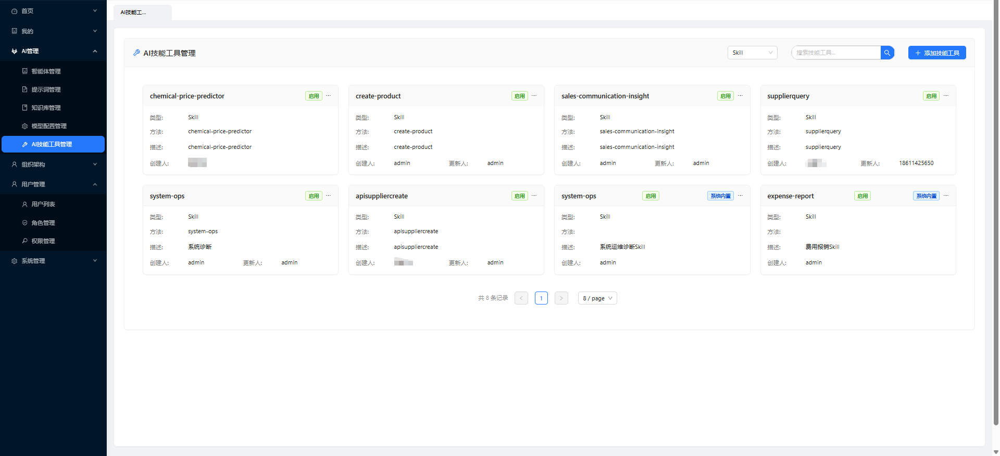 | 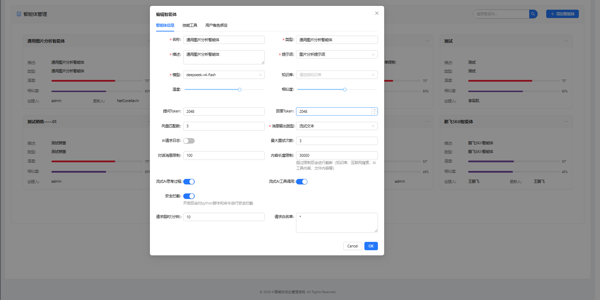 | 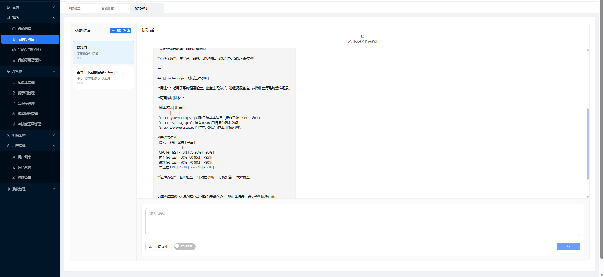 |

### Skill动态管理
| 界面管理 | 在线编辑 | 动态配置 |
|---------|----------|---------|
| 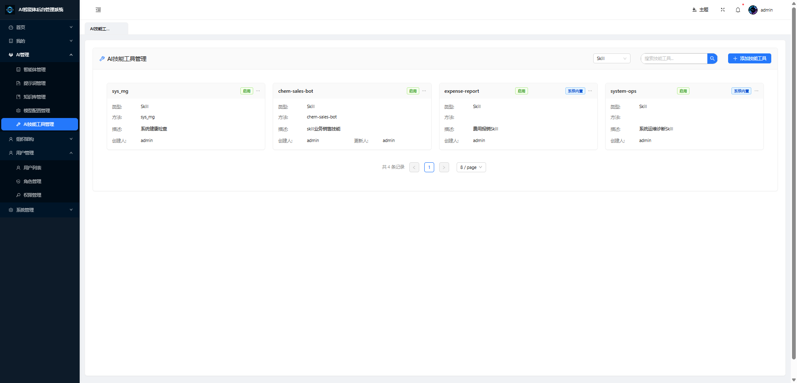 | 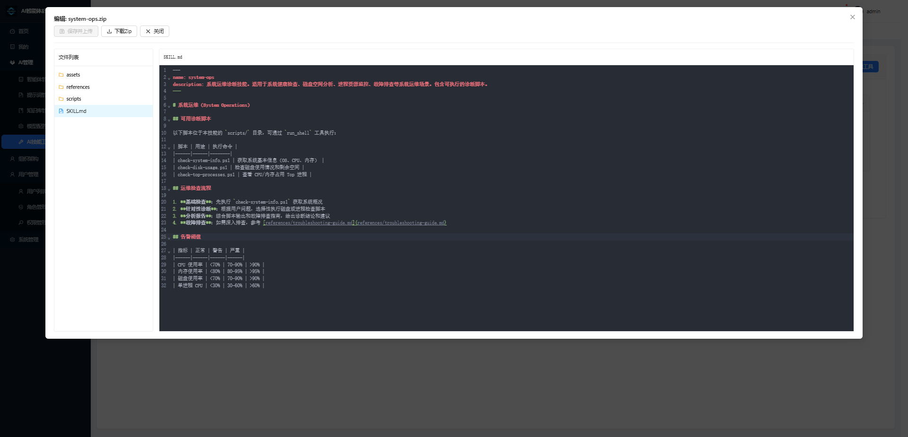 | 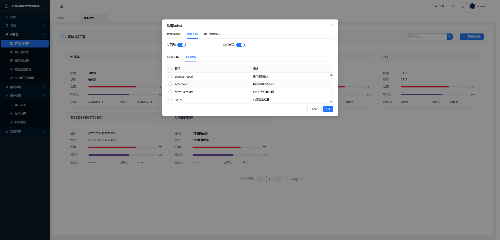 |

### AI 知识库系统
| 知识库管理 | 文档上传 | 智能问答 |
|-----------|---------|---------|
| 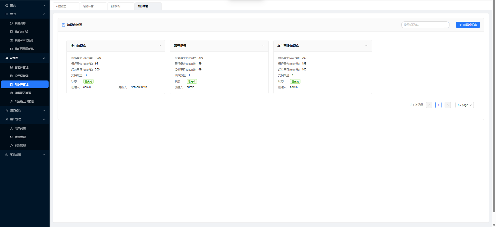 | 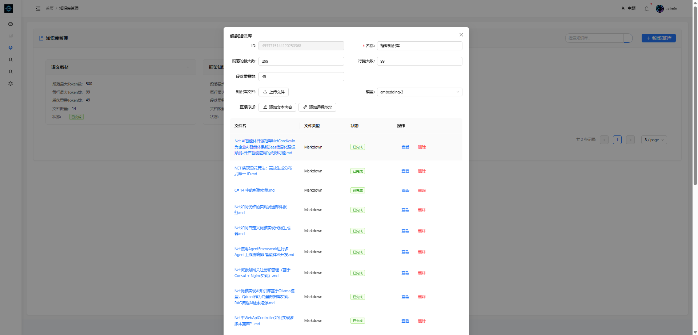 | 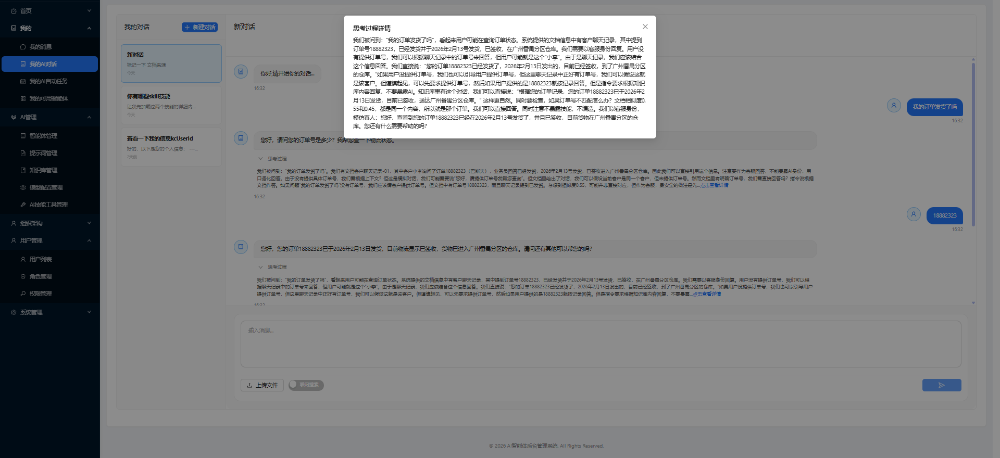 |

### AI 智能体技能
| 技能列表 | 技能配置 | 技能执行 |
|---------|---------|---------|
| 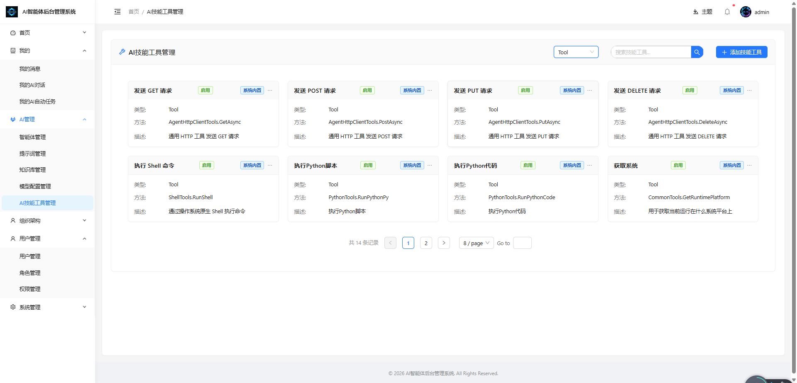 | 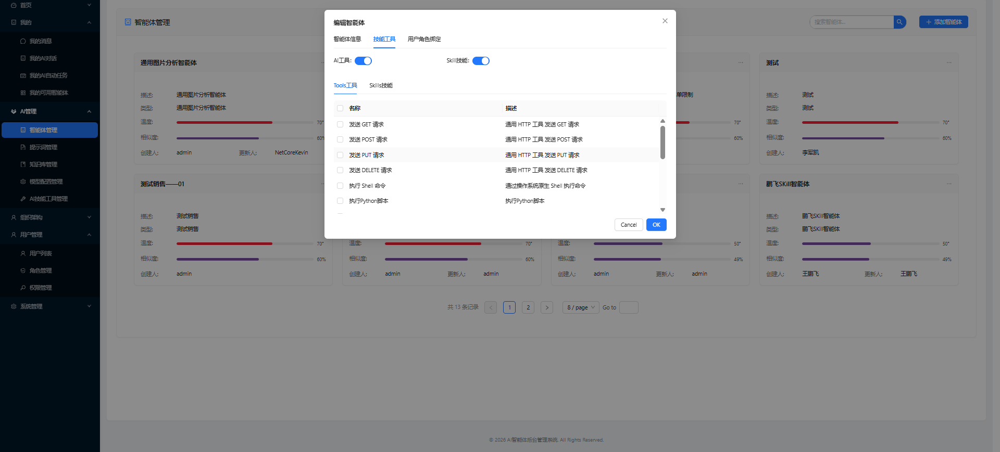 | 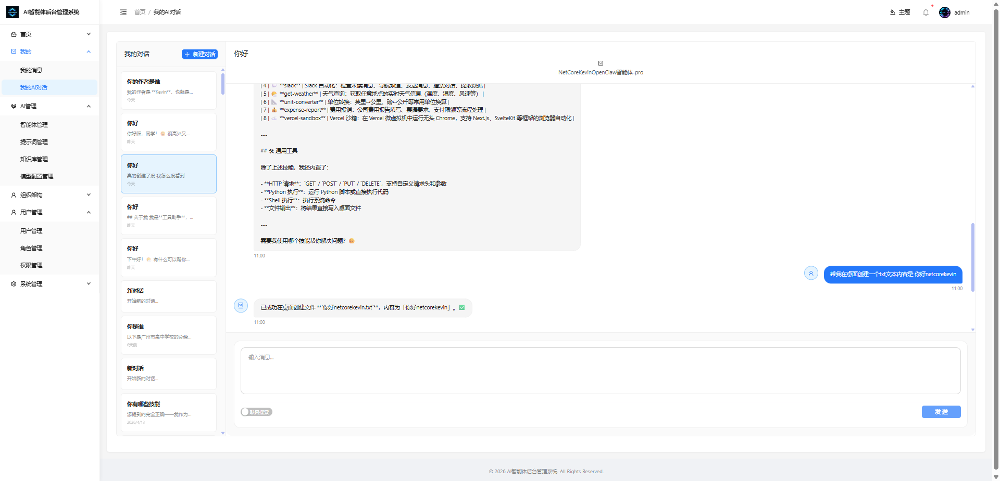 |

### 智能体自动任务调度
| 任务列表 | 任务配置 | 执行记录 |
|---------|---------|---------|
| 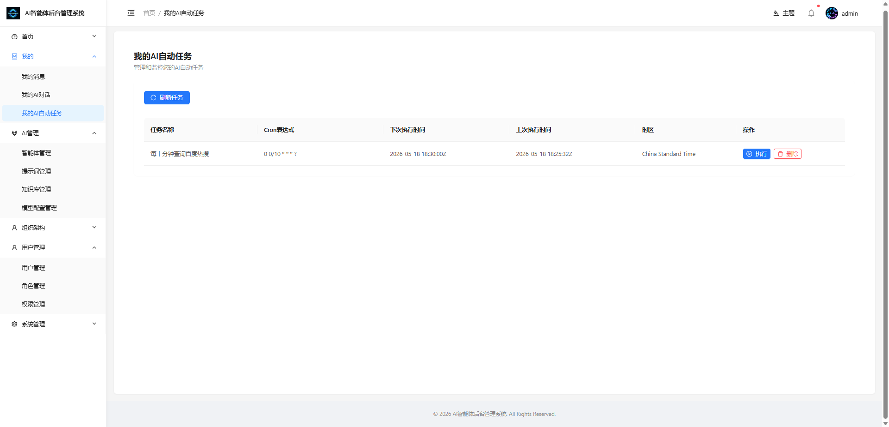 | 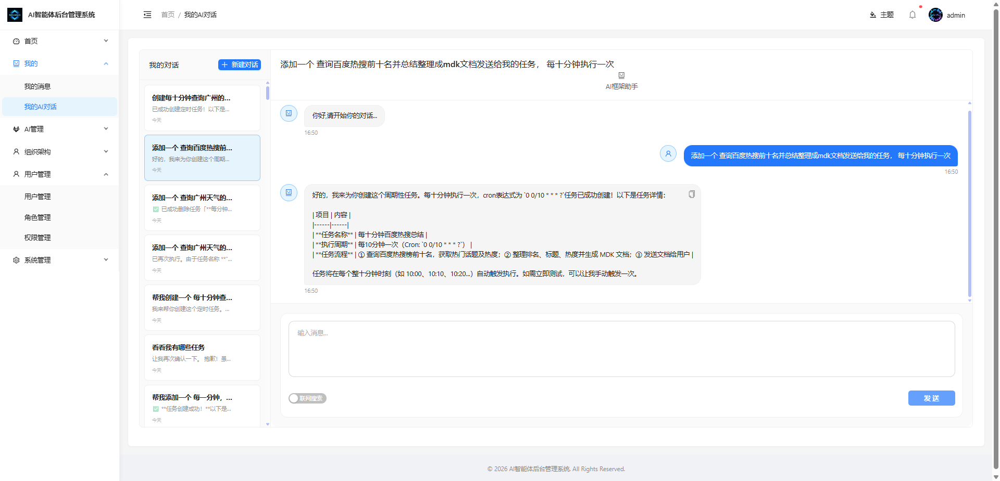 | 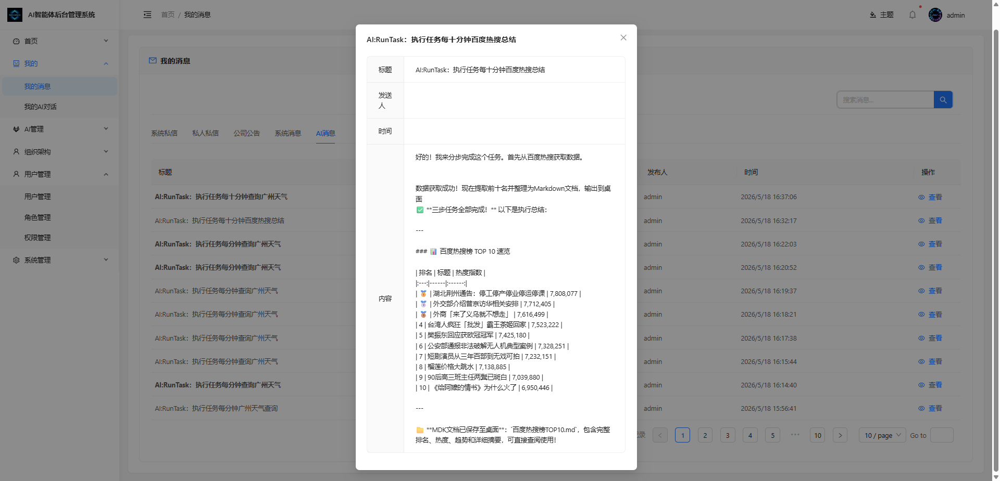 |

### 后台管理系统 (Vue3 + AntDesign)
| 用户管理 | 角色管理 | 权限管理 | 系统配置 |
|---------|---------|---------|---------|
| 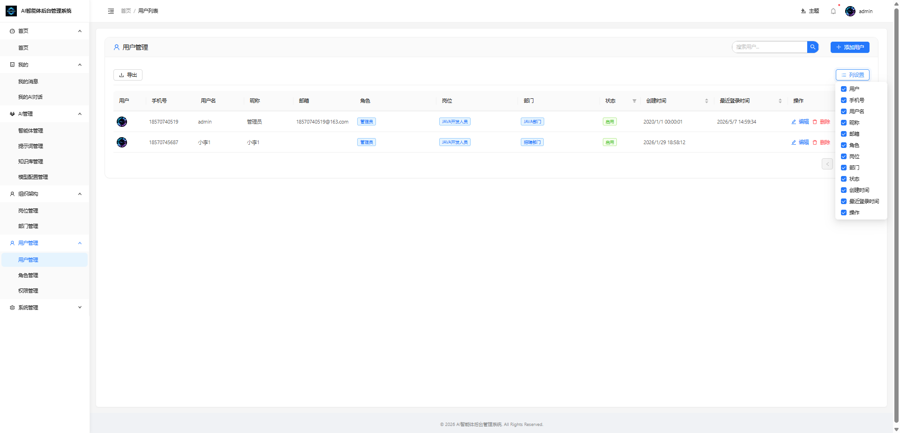 |  | 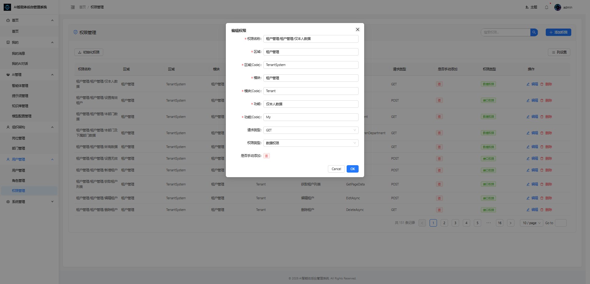 | 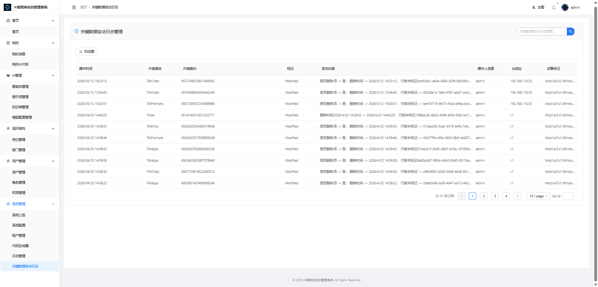 |

---

## ✨ 技术亮点

| 技术点 | 说明 |
|--------|------|
| **.NET 9** | 最新 LTS 版本，性能更优，支持更多新特性 |
| **DDD 架构** | 领域驱动设计，模块化结构，便于维护扩展 |
| **微服务架构** | 基于 Consul、CAP、Hangfire 实现服务解耦 |
| **AI 集成** | AgentFramework 1.9、Skill 动态管理、Ollama 本地模型支持 |
| **RAG 检索增强** | Qdrant 向量数据库实现知识库问答 |
| **多租户支持** | 一库多租户架构，数据隔离 |
| **分布式缓存** | Redis 缓存层，支持多种缓存策略 |
| **日志系统** | log4net 日志框架，支持多级别日志 |

---

## 🚀 快速开始

### 环境要求

- .NET SDK 9.0+
- MySQL 8.0+
- Redis 7.0+
- Qdrant 1.7+（AI 功能）

### 配置步骤

**1. 配置数据库连接**

编辑 `App/WebApi/appsettings.json`：

```json
{
  "ConnectionStrings": {
    "dbConnection": "server=127.0.0.1;port=3306;database=kevin_app;user id=root;password=admin123",
    "redisConnection": "127.0.0.1:6379,DefaultDatabase=0,password=123456"
  }
}
```

**2. 初始化数据库**

在 **程序包管理控制台** 执行：

```powershell
# 选择 Kevin.EntityFrameworkCore 项目
Add-Migration "初始化数据库"
Update-Database
```

**3. 启动应用**

```bash
cd App/WebApi
dotnet run --environment Development
```

**4. 访问地址**

| 服务 | 地址 |
|------|------|
| API | http://localhost:9901 |
| Swagger | http://localhost:9901/swagger |
| Hangfire | http://localhost:9901/pchangfire|

### 默认账户

| 用户名 | 密码 | 租户 |
|--------|------|------|
| admin | 123456 | 1000 |

---

## 🧠 AI 智能体配置

### AI智能体教程

-   第一步
-   `请先完成上手教程在进行AI智能体教程`
-   第二步
-   `下载安装Qdrant--官网有教程 安装后配置json文件QdrantClientSetting 默认是localhost不需要动的`
-   第三步
-   `注册AI账户 教程以智谱AI为例 去[官网](https://open.bigmodel.cn)注册登录后获取APIKey`
-   第四步
-  `配置向量模型和对话模型默认如下`

|||
|--|--| 

-   第五步
-   `新建知识库选择向量模型(如果不选择请在json配置中配置)2048（默认）：最高精度，适合对准确性要求极高的场景===》配置智能体==》新建对话就OK了`
 
|||
|--|--| 

### 🧰基于Ollama部署本地模型

- Ollama 支持多种操作系统，包括 macOS、Windows、Linux 以及通过 Docker 容器运行。
- Ollama 对硬件要求不高，旨在让用户能够轻松地在本地运行、管理和与大型语言模型进行交互。
- CPU：多核处理器（推荐 4 核或以上）。
- GPU：如果你计划运行大型模型或进行微调，推荐使用具有较高计算能力的 GPU（如 NVIDIA 的 CUDA 支持）。
- 内存：至少 8GB RAM，运行较大模型时推荐 16GB 或更高。
- 存储：需要足够的硬盘空间来存储预训练模型，通常需要 10GB 至数百 GB 的空间，具体取决于模型的大小。 
- Ollama 官方下载地址：[https://ollama.com/download](https://ollama.com/download)
- 1.安装后运行模型 可根据电脑配置自由选择模型 可以使用qwen3:4b来进行测试
- ollama run qwen3:4b
- 系统配置如下
- 
 
###  自动任务配置（Hangfire）
默认基于redis方式注册Hangfire可在Kevin.Hangfire.ServiceCollectionExtensions自行添加或调整注入方式

1.继承IModuleConfigTasks类实现ConfigTasks会在项目启动时自动注册任务，并且自动任务可以基于接口类直接调用应用服务

```
    /// <summary>
    /// AIKmssTasks配置任务设置
    /// </summary>
    public class AIKmssModuleConfigTasks : IModuleConfigTasks
    {  
        /// <summary>
        /// 配置任务
        /// </summary>
        public Task<bool> ConfigTasks(IRecurringJobManager recurringJobManager)
        {
            recurringJobManager.AddOrUpdate<IAIKmssService>(
                recurringJobId: "每6分钟检测是否有AI文档知识库需要处理",      // 唯一的 ID，用于后续修改或删除
                (s) => s.ProcessKmssVectorData(default),
                "0 0/6 0/1 * * ? ", new RecurringJobOptions
                {
                    TimeZone = TimeZoneInfo.Local,        // 指定时区（默认UTC） 
                }
            );
            return Task.FromResult(true);
        } 
    }
```

### 1. 安装 Qdrant

```bash
# 使用 Docker 启动 Qdrant
docker run -p 6333:6333 qdrant/qdrant
```

### 2. 配置 AI 模型

**智谱 AI：**
```json
{
  "OllamaApiSetting": {
    "Url": "https://open.bigmodel.cn/api/paas/v4/embeddings",
    "DefaultModel": "embedding-3",
    "ApiKey": "your-api-key"
  }
}
```

**Ollama 本地模型：**
```json
{
  "OllamaApiSetting": {
    "Url": "http://localhost:11434/api/embeddings",
    "DefaultModel": "qwen3:4b"
  }
}
```

### 3. 使用流程

1. 注册 AI 账户获取 API Key
2. 在系统中配置模型
3. 创建知识库并上传文档
4. 配置智能体并绑定技能
5. 开始智能对话

---

## 📁 项目结构

```
kevin.abp.core/
├── App/                    # 业务应用模块
│   ├── Application/        # 应用服务层
│   ├── Domain/             # 领域层
│   ├── RepositorieRps/     # 仓储实现
│   └── WebApi/             # API 入口
├── Kevin/                  # 核心框架模块
│   ├── Application/        # 核心服务
│   │   └── Services/AI/    # AI 相关服务
│   ├── Domain/             # 核心领域模型
│   ├── Kevin.EntityFrameworkCore/  # EF Core 实现
│   └── Kevin.Web.Basics/   # Web 基础组件
├── Doc/                    # 文档资源
└── InitData/               # 初始化数据
```

---

## 🛠️ 功能模块

| 模块 | 功能 | 状态 |
|------|------|------|
| **用户管理** | 用户CRUD、权限绑定 | ✅ |
| **角色管理** | 角色CRUD、权限配置 | ✅ |
| **权限管理** | 菜单权限、API权限 | ✅ |
| **AI 智能体** | 智能对话、工具调用 | ✅ |
| **知识库** | 文档管理、RAG检索 | ✅ |
| **任务调度** | Hangfire定时任务 | ✅ |
| **消息服务** | 钉钉消息推送 | ✅ |
| **文件存储** | 多云存储支持 | ✅ |

---

## 📖 文档资源

- **详细文档**: [SYSTEM_DOCUMENTATION.md](SYSTEM_DOCUMENTATION.md)
- **教学文档**: [CSDN 专栏](https://blog.csdn.net/weixin_42629287/category_13037923.html)
- **新项目教程**: [基于 NetCoreKevin 二次开发](https://gitee.com/netkevin-li/ainet)

---

## 🤝 交流社区

| 微信 | 交流群 |
|------|--------|
|  |  |

---

## 📊 Star History

<a href="https://www.star-history.com/?repos=junkai-li/NetCoreKevin&type=timeline">
  <picture>
    <source media="(prefers-color-scheme: dark)" srcset="https://api.star-history.com/chart?repos=junkai-li/NetCoreKevin&type=timeline&theme=dark" />
    <source media="(prefers-color-scheme: light)" srcset="https://api.star-history.com/chart?repos=junkai-li/NetCoreKevin&type=timeline" />
    
  </picture>
</a>

---

**版本**: v1.0  
**License**: MIT  
**维护者**: NetCoreKevin 开发团队
