<style>
.lang-switch { position: fixed; top: 20px; right: 20px; z-index: 9999; display: flex; gap: 8px; }
.lang-switch button { padding: 8px 16px; border: 1px solid #ddd; border-radius: 4px; cursor: pointer; font-size: 14px; background: #fff; transition: all 0.3s; }
.lang-switch button:hover { background: #f5f5f5; }
.lang-switch button.active { background: #1890ff; color: #fff; border-color: #1890ff; }
.en { display: none; }
body.lang-en .zh { display: none; }
body.lang-en .en { display: block; }
</style>
<script>
function switchLang(lang) {
    document.body.className = lang === 'en' ? 'lang-en' : '';
    localStorage.setItem('doc-lang', lang);
    document.querySelectorAll('.lang-switch button').forEach(btn => {
        btn.classList.toggle('active', btn.dataset.lang === lang);
    });
}
document.addEventListener('DOMContentLoaded', function() {
    var savedLang = localStorage.getItem('doc-lang') || 'zh';
    switchLang(savedLang);
});
</script>
<div class="lang-switch">
    <button data-lang="zh" class="active" onclick="switchLang('zh')">中文</button>
    <button data-lang="en" onclick="switchLang('en')">English</button>
</div>

# NetCoreKevin

<span class="zh">> 是基于 .NET 9 构建的企业级 AI中台智能体 SaaS 前后端分离架构，集成了 AI 知识库智能体、多智能体协同、Skill技能管理、本地离线AI模型调用、智能体技能可控加载、AI联网搜索、智能体权限管控、一库多租户、分布式系统、微服务架构等核心能力。</span><span class="en">> An enterprise-level AI Platform Agent SaaS architecture built on .NET 9 with separation of frontend and backend, integrating core capabilities including AI knowledge base agents, multi-agent collaboration, Skill management, local offline AI model calling, controllable skill loading, AI web search, agent permission management, single-database multi-tenancy, distributed systems, and microservices architecture.</span>

---

## <span class="zh">📷 功能效果图</span><span class="en">📷 Feature Preview</span>

### <span class="zh">AI 智能体技能工具管理</span><span class="en">AI Agent Skill Tool Management</span>
| <span class="zh">动态管理</span><span class="en">Dynamic Management</span> | <span class="zh">智能体配置</span><span class="en">Agent Configuration</span> | <span class="zh">对话交互</span><span class="en">Chat Interaction</span> |
|---------|----------|---------|
| 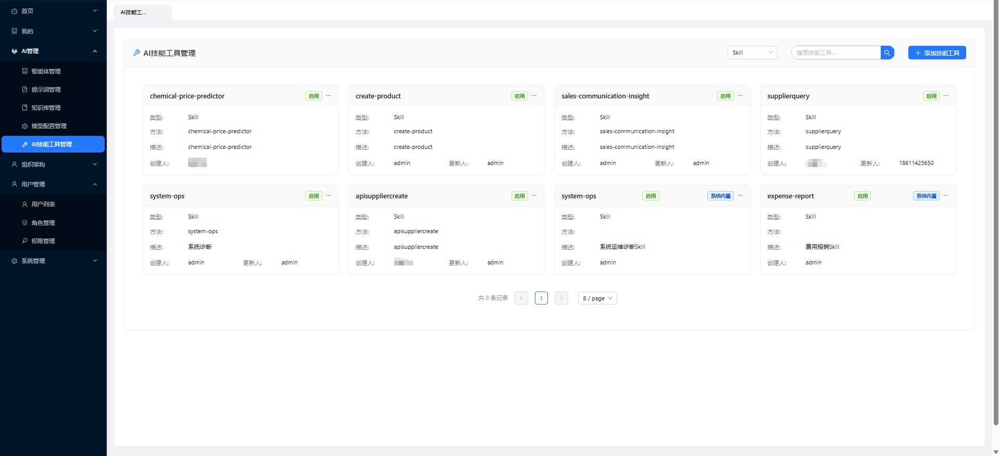 | 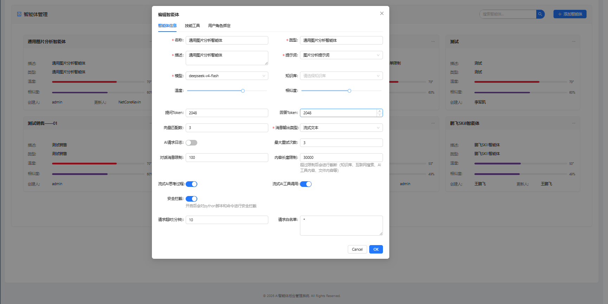 | 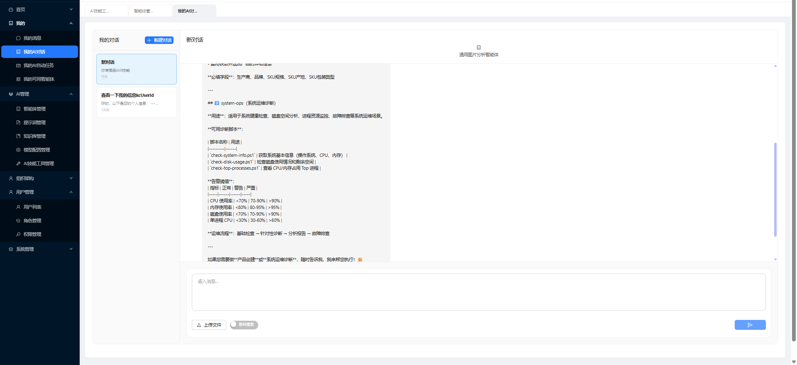 |

### <span class="zh">Skill动态管理</span><span class="en">Skill Dynamic Management</span>
| <span class="zh">界面管理</span><span class="en">Interface Management</span> | <span class="zh">在线编辑</span><span class="en">Online Editing</span> | <span class="zh">动态配置</span><span class="en">Dynamic Configuration</span> |
|---------|----------|---------|
| 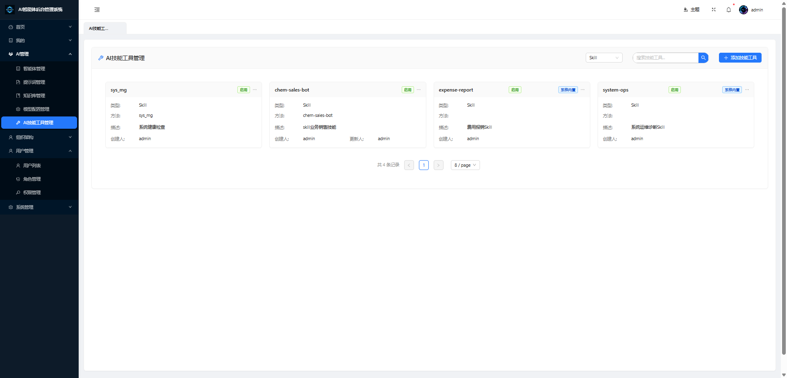 | 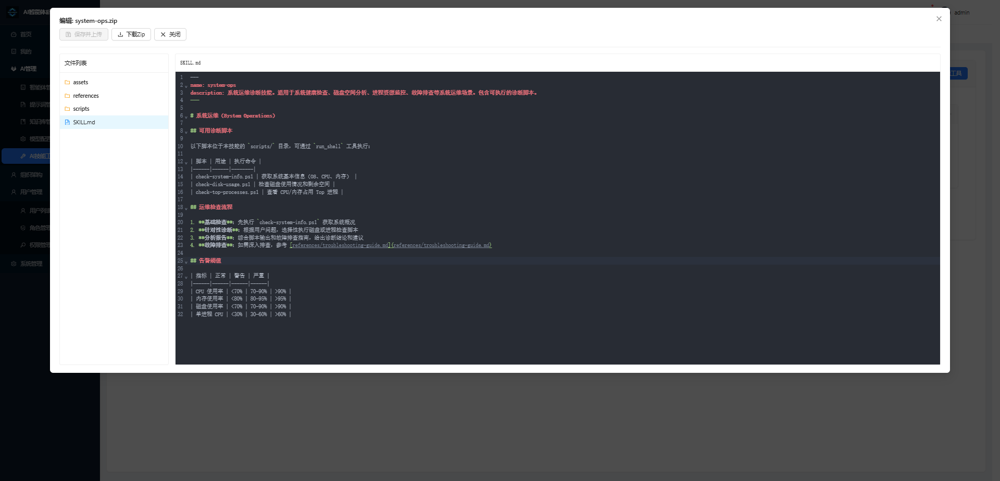 | 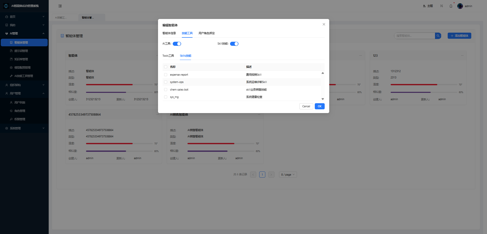 |

### <span class="zh">AI 知识库系统</span><span class="en">AI Knowledge Base System</span>
| <span class="zh">知识库管理</span><span class="en">Knowledge Base Management</span> | <span class="zh">文档上传</span><span class="en">Document Upload</span> | <span class="zh">智能问答</span><span class="en">Intelligent Q&A</span> |
|-----------|---------|---------|
| 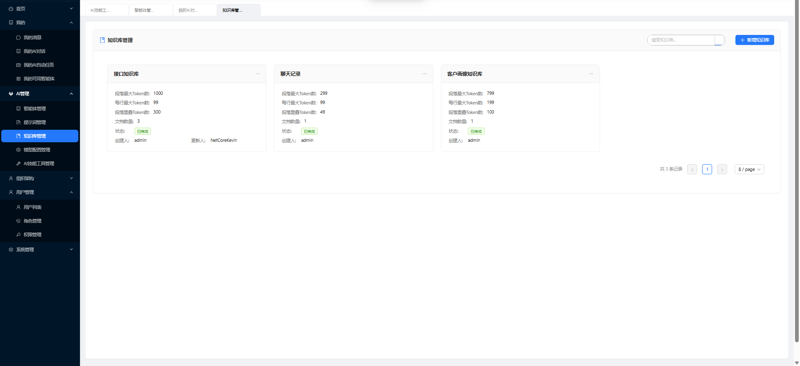 | 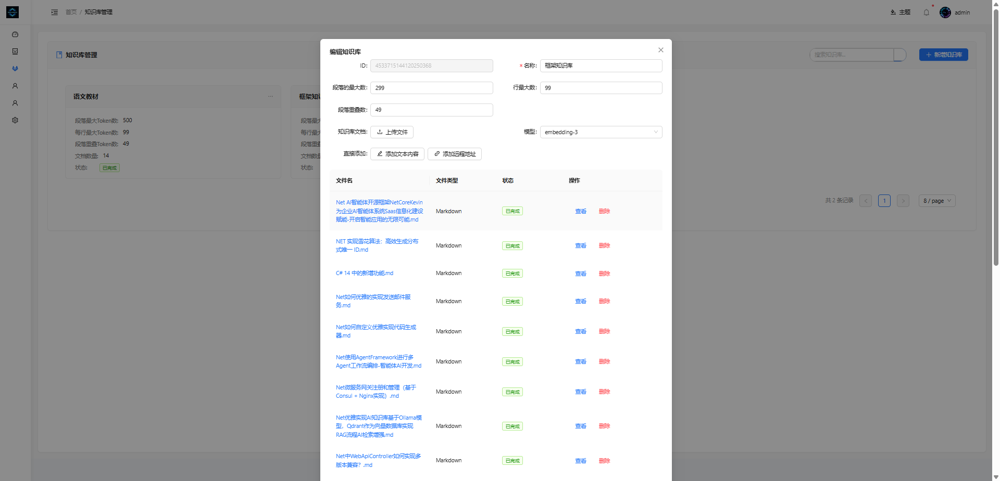 | 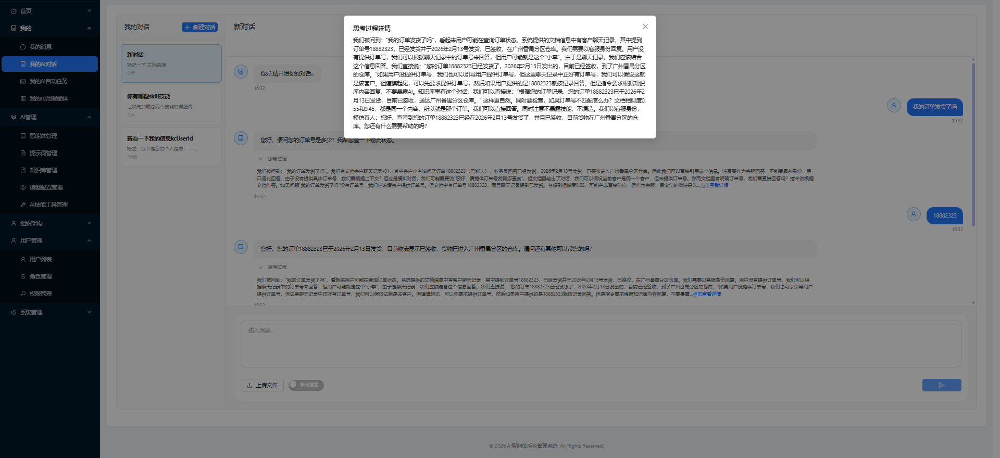 |

### <span class="zh">AI 智能体技能</span><span class="en">AI Agent Skills</span>
| <span class="zh">技能列表</span><span class="en">Skill List</span> | <span class="zh">技能配置</span><span class="en">Skill Configuration</span> | <span class="zh">技能执行</span><span class="en">Skill Execution</span> |
|---------|---------|---------|
| 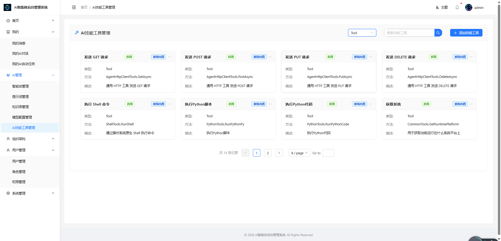 | 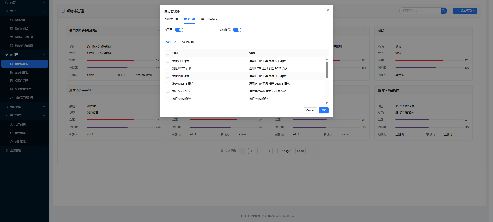 | 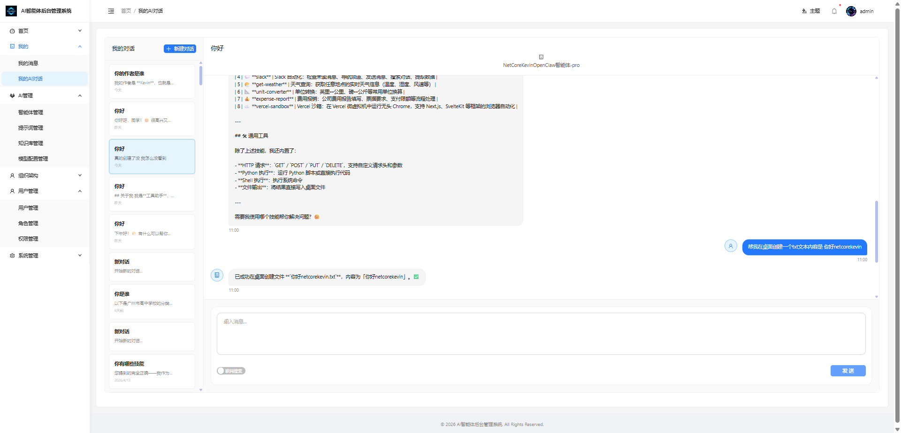 |

### <span class="zh">AI 智能体自动任务调度</span><span class="en">AI Agent Auto Task Scheduling</span>
| <span class="zh">任务列表</span><span class="en">Task List</span> | <span class="zh">任务配置</span><span class="en">Task Configuration</span> | <span class="zh">执行记录</span><span class="en">Execution Records</span> |
|---------|---------|---------|
| 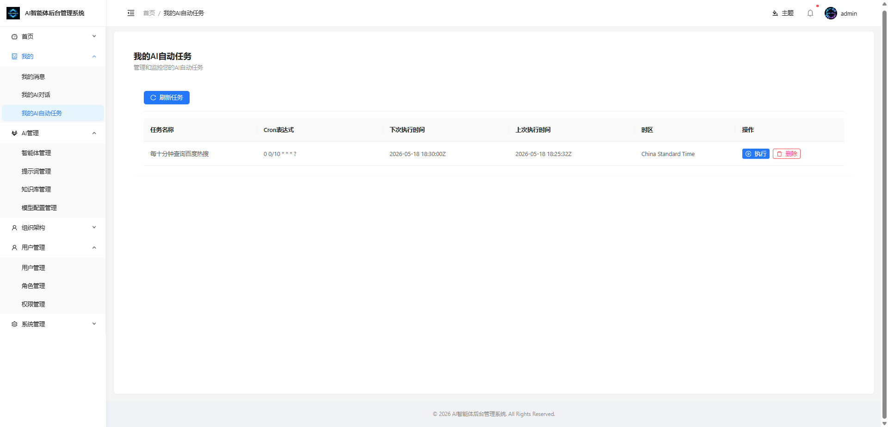 | 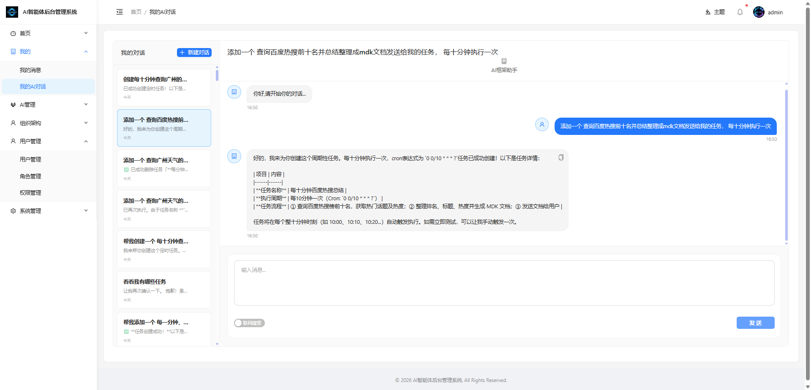 | 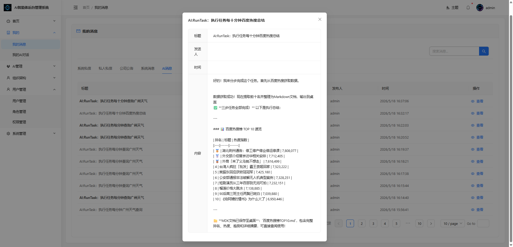 |

### <span class="zh">后台管理系统 (Vue3 + AntDesign)</span><span class="en">Backend Management System (Vue3 + AntDesign)</span>
| <span class="zh">用户管理</span><span class="en">User Management</span> | <span class="zh">角色管理</span><span class="en">Role Management</span> | <span class="zh">权限管理</span><span class="en">Permission Management</span> | <span class="zh">系统配置</span><span class="en">System Configuration</span> |
|---------|---------|---------|---------|
| 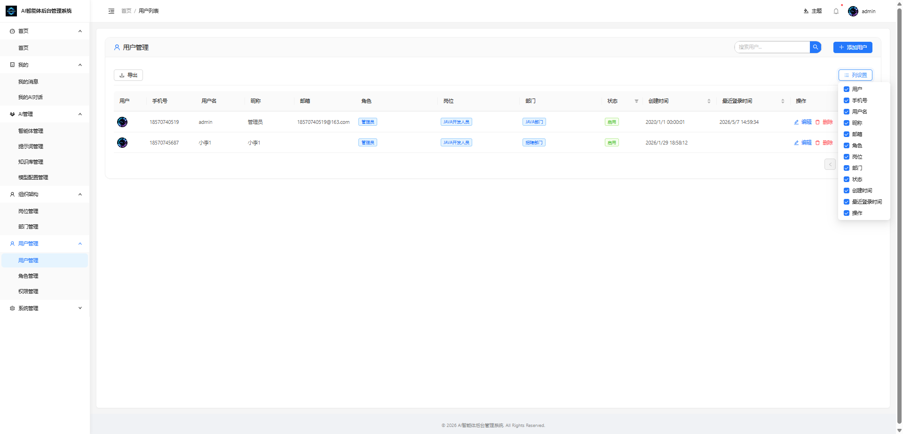 | 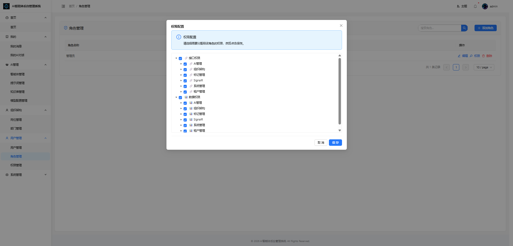 | 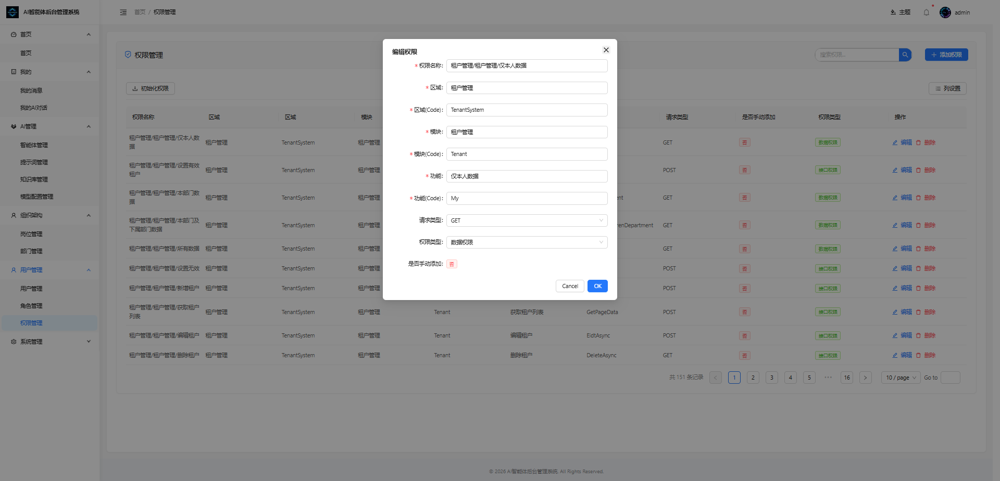 | 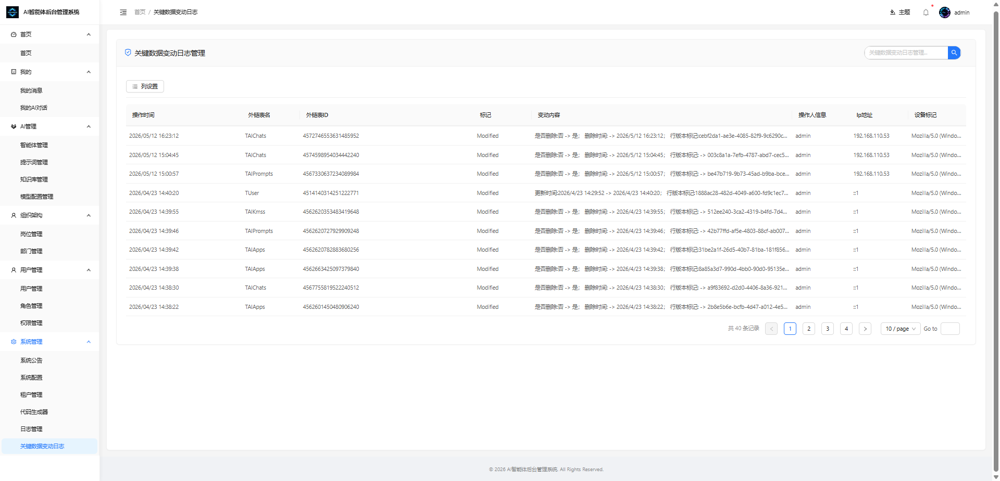 |

---

## <span class="zh">✨ 技术亮点</span><span class="en">✨ Technical Highlights</span>

| <span class="zh">技术点</span><span class="en">Technology</span> | <span class="zh">说明</span><span class="en">Description</span> |
|--------|------|
| **.NET 9** | <span class="zh">最新 LTS 版本，性能更优，支持更多新特性</span><span class="en">Latest LTS version, better performance, more features</span> |
| **DDD 架构** | <span class="zh">领域驱动设计，模块化结构，便于维护扩展</span><span class="en">Domain-driven design, modular structure, easy to maintain and extend</span> |
| **微服务架构** | <span class="zh">基于 Consul、CAP、Hangfire 实现服务解耦</span><span class="en">Service decoupling based on Consul, CAP, Hangfire</span> |
| **AI 集成** | <span class="zh">AgentFramework 1.9、Skill 动态管理、Ollama 本地模型支持</span><span class="en">AgentFramework 1.9, Skill dynamic management, Ollama local model support</span> |
| **RAG 检索增强** | <span class="zh">Qdrant 向量数据库实现知识库问答</span><span class="en">Qdrant vector database for knowledge base Q&A</span> |
| **多租户支持** | <span class="zh">一库多租户架构，数据隔离</span><span class="en">Single-database multi-tenancy architecture, data isolation</span> |
| **分布式缓存** | <span class="zh">Redis 缓存层，支持多种缓存策略</span><span class="en">Redis cache layer, supports multiple caching strategies</span> |
| **日志系统** | <span class="zh">log4net 日志框架，支持多级别日志</span><span class="en">log4net logging framework, supports multi-level logging</span> |

---

## <span class="zh">🚀 快速开始</span><span class="en">🚀 Quick Start</span>

### <span class="zh">环境要求</span><span class="en">Environment Requirements</span>

- .NET SDK 9.0+
- MySQL 8.0+
- Redis 7.0+
- Qdrant 1.7+<span class="zh">（AI 功能）</span><span class="en">(AI Features)</span>

### <span class="zh">配置步骤</span><span class="en">Configuration Steps</span>

<span class="zh">**1. 配置数据库连接**</span><span class="en">**1. Configure Database Connection**</span>

<span class="zh">编辑 `App/WebApi/appsettings.json`：</span><span class="en">Edit `App/WebApi/appsettings.json`:</span>

```json
{
  "ConnectionStrings": {
    "dbConnection": "server=127.0.0.1;port=3306;database=kevin_app;user id=root;password=admin123",
    "redisConnection": "127.0.0.1:6379,DefaultDatabase=0,password=123456"
  }
}
```

<span class="zh">**2. 初始化数据库**</span><span class="en">**2. Initialize Database**</span>

<span class="zh">在 **程序包管理控制台** 执行：</span><span class="en">Execute in **Package Manager Console**:</span>

```powershell
# <span class="zh">选择 Kevin.EntityFrameworkCore 项目</span><span class="en">Select Kevin.EntityFrameworkCore project</span>
Add-Migration "<span class="zh">初始化数据库</span><span class="en">Initialize Database</span>"
Update-Database
```

<span class="zh">**3. 启动应用**</span><span class="en">**3. Start Application**</span>

```bash
cd App/WebApi
dotnet run --environment Development
```

<span class="zh">**4. 访问地址**</span><span class="en">**4. Access Address**</span>

| <span class="zh">服务</span><span class="en">Service</span> | <span class="zh">地址</span><span class="en">Address</span> |
|------|------|
| API | http://localhost:9901 |
| Swagger | http://localhost:9901/swagger |
| Hangfire | http://localhost:9901/pchangfire|

### <span class="zh">默认账户</span><span class="en">Default Account</span>

| <span class="zh">用户名</span><span class="en">Username</span> | <span class="zh">密码</span><span class="en">Password</span> | <span class="zh">租户</span><span class="en">Tenant</span> |
|--------|------|------|
| admin | 123456 | 1000 |

---

## <span class="zh">🧠 AI 智能体配置</span><span class="en">🧠 AI Agent Configuration</span>

### <span class="zh">AI智能体教程</span><span class="en">AI Agent Tutorial</span>

-   <span class="zh">第一步</span><span class="en">Step 1</span>
-   <span class="zh">`请先完成上手教程在进行AI智能体教程`</span><span class="en">`Please complete the getting started tutorial before proceeding with the AI agent tutorial`</span>
-   <span class="zh">第二步</span><span class="en">Step 2</span>
-   <span class="zh">`下载安装Qdrant--官网有教程 安装后配置json文件QdrantClientSetting 默认是localhost不需要动的`</span><span class="en">`Download and install Qdrant - official website has tutorials. After installation, configure the json file QdrantClientSetting. Default is localhost, no changes needed.`</span>
-   <span class="zh">第三步</span><span class="en">Step 3</span>
-   <span class="zh">`注册AI账户 教程以智谱AI为例 去[官网](https://open.bigmodel.cn)注册登录后获取APIKey`</span><span class="en">`Register AI account. Tutorial uses Zhipu AI as example. Go to [official website](https://open.bigmodel.cn) to register and get APIKey.`</span>
-   <span class="zh">第四步</span><span class="en">Step 4</span>
-  <span class="zh">`配置向量模型和对话模型默认如下`</span><span class="en">`Configure vector model and chat model as follows`</span>

|||
|--|--| 

-   <span class="zh">第五步</span><span class="en">Step 5</span>
-   <span class="zh">`新建知识库选择向量模型(如果不选择请在json配置中配置)2048（默认）：最高精度，适合对准确性要求极高的场景===》配置智能体==》新建对话就OK了`</span><span class="en">`Create a new knowledge base and select a vector model (if not selected, configure in json). 2048 (default): highest precision, suitable for scenarios requiring high accuracy ===> Configure agent ===> Create new chat and you're good to go.`</span>
 
|||
|--|--| 

### <span class="zh">🧰基于Ollama部署本地模型</span><span class="en">🧰 Deploying Local Models with Ollama</span>

- <span class="zh">Ollama 支持多种操作系统，包括 macOS、Windows、Linux 以及通过 Docker 容器运行。</span><span class="en">Ollama supports multiple operating systems, including macOS, Windows, Linux, and Docker containers.</span>
- <span class="zh">Ollama 对硬件要求不高，旨在让用户能够轻松地在本地运行、管理和与大型语言模型进行交互。</span><span class="en">Ollama has low hardware requirements, designed to let users easily run, manage, and interact with large language models locally.</span>
- <span class="zh">CPU：多核处理器（推荐 4 核或以上）。</span><span class="en">CPU: Multi-core processor (recommended 4 cores or more).</span>
- <span class="zh">GPU：如果你计划运行大型模型或进行微调，推荐使用具有较高计算能力的 GPU（如 NVIDIA 的 CUDA 支持）。</span><span class="en">GPU: If you plan to run large models or fine-tune, recommend using a GPU with high computing power (such as NVIDIA CUDA support).</span>
- <span class="zh">内存：至少 8GB RAM，运行较大模型时推荐 16GB 或更高。</span><span class="en">Memory: At least 8GB RAM, 16GB or higher recommended for larger models.</span>
- <span class="zh">存储：需要足够的硬盘空间来存储预训练模型，通常需要 10GB 至数百 GB 的空间，具体取决于模型的大小。</span><span class="en">Storage: Sufficient disk space to store pre-trained models, typically 10GB to hundreds of GB depending on model size.</span>
- Ollama 官方下载地址：[https://ollama.com/download](https://ollama.com/download)
- <span class="zh">1.安装后运行模型 可根据电脑配置自由选择模型 可以使用qwen3:4b来进行测试</span><span class="en">1. After installation, run the model. You can freely choose a model based on your computer configuration. You can use qwen3:4b for testing.</span>
- ollama run qwen3:4b
- <span class="zh">系统配置如下</span><span class="en">System configuration as follows</span>
- 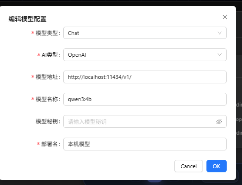
 
### <span class="zh">自动任务配置（Hangfire）</span><span class="en">Auto Task Configuration (Hangfire)</span>
<span class="zh">默认基于redis方式注册Hangfire可在Kevin.Hangfire.ServiceCollectionExtensions自行添加或调整注入方式</span><span class="en">Hangfire is registered via Redis by default. You can add or adjust the injection method in Kevin.Hangfire.ServiceCollectionExtensions.</span>

<span class="zh">1.继承IModuleConfigTasks类实现ConfigTasks会在项目启动时自动注册任务，并且自动任务可以基于接口类直接调用应用服务</span><span class="en">1. Inherit IModuleConfigTasks and implement ConfigTasks. Tasks will be automatically registered on startup, and auto tasks can directly call application services based on interface classes.</span>

```
    /// <summary>
    /// <span class="zh">AIKmssTasks配置任务设置</span><span class="en">AIKmssTasks Configuration Task Settings</span>
    /// </summary>
    public class AIKmssModuleConfigTasks : IModuleConfigTasks
    {  
        /// <summary>
        /// <span class="zh">配置任务</span><span class="en">Configure Tasks</span>
        /// </summary>
        public Task<bool> ConfigTasks(IRecurringJobManager recurringJobManager)
        {
            recurringJobManager.AddOrUpdate<IAIKmssService>(
                recurringJobId: "<span class="zh">每6分钟检测是否有AI文档知识库需要处理</span><span class="en">Check every 6 minutes if AI document knowledge base needs processing</span>",      // <span class="zh">唯一的 ID，用于后续修改或删除</span><span class="en">Unique ID for later modification or deletion</span>
                (s) => s.ProcessKmssVectorData(default),
                "0 0/6 0/1 * * ? ", new RecurringJobOptions
                {
                    TimeZone = TimeZoneInfo.Local,        // <span class="zh">指定时区（默认UTC）</span><span class="en">Specify time zone (default UTC)</span> 
                }
            );
            return Task.FromResult(true);
        } 
    }
```

### <span class="zh">1. 安装 Qdrant</span><span class="en">1. Install Qdrant</span>

```bash
# <span class="zh">使用 Docker 启动 Qdrant</span><span class="en">Start Qdrant with Docker</span>
docker run -p 6333:6333 qdrant/qdrant
```

### <span class="zh">2. 配置 AI 模型</span><span class="en">2. Configure AI Models</span>

<span class="zh">**智谱 AI：**</span><span class="en">**Zhipu AI:**</span>
```json
{
  "OllamaApiSetting": {
    "Url": "https://open.bigmodel.cn/api/paas/v4/embeddings",
    "DefaultModel": "embedding-3",
    "ApiKey": "your-api-key"
  }
}
```

<span class="zh">**Ollama 本地模型：**</span><span class="en">**Ollama Local Model:**</span>
```json
{
  "OllamaApiSetting": {
    "Url": "http://localhost:11434/api/embeddings",
    "DefaultModel": "qwen3:4b"
  }
}
```

### <span class="zh">3. 使用流程</span><span class="en">3. Usage Process</span>

1. <span class="zh">注册 AI 账户获取 API Key</span><span class="en">Register AI account to get API Key</span>
2. <span class="zh">在系统中配置模型</span><span class="en">Configure models in the system</span>
3. <span class="zh">创建知识库并上传文档</span><span class="en">Create knowledge base and upload documents</span>
4. <span class="zh">配置智能体并绑定技能</span><span class="en">Configure agent and bind skills</span>
5. <span class="zh">开始智能对话</span><span class="en">Start intelligent conversation</span>

---

## <span class="zh">📁 项目结构</span><span class="en">📁 Project Structure</span>

```
kevin.abp.core/
├── App/                    # <span class="zh">业务应用模块</span><span class="en">Business Application Module</span>
│   ├── Application/        # <span class="zh">应用服务层</span><span class="en">Application Service Layer</span>
│   ├── Domain/             # <span class="zh">领域层</span><span class="en">Domain Layer</span>
│   ├── RepositorieRps/     # <span class="zh">仓储实现</span><span class="en">Repository Implementation</span>
│   └── WebApi/             # <span class="zh">API 入口</span><span class="en">API Entry</span>
├── Kevin/                  # <span class="zh">核心框架模块</span><span class="en">Core Framework Module</span>
│   ├── Application/        # <span class="zh">核心服务</span><span class="en">Core Services</span>
│   │   └── Services/AI/    # <span class="zh">AI 相关服务</span><span class="en">AI Related Services</span>
│   ├── Domain/             # <span class="zh">核心领域模型</span><span class="en">Core Domain Models</span>
│   ├── Kevin.EntityFrameworkCore/  # <span class="zh">EF Core 实现</span><span class="en">EF Core Implementation</span>
│   └── Kevin.Web.Basics/   # <span class="zh">Web 基础组件</span><span class="en">Web Basic Components</span>
├── Doc/                    # <span class="zh">文档资源</span><span class="en">Documentation Resources</span>
└── InitData/               # <span class="zh">初始化数据</span><span class="en">Initialization Data</span>
```

---

## <span class="zh">🛠️ 功能模块</span><span class="en">🛠️ Feature Modules</span>

| <span class="zh">模块</span><span class="en">Module</span> | <span class="zh">功能</span><span class="en">Features</span> | <span class="zh">状态</span><span class="en">Status</span> |
|------|------|------|
| <span class="zh">**用户管理**</span><span class="en">**User Management**</span> | <span class="zh">用户CRUD、权限绑定</span><span class="en">User CRUD, permission binding</span> | ✅ |
| <span class="zh">**角色管理**</span><span class="en">**Role Management**</span> | <span class="zh">角色CRUD、权限配置</span><span class="en">Role CRUD, permission configuration</span> | ✅ |
| <span class="zh">**权限管理**</span><span class="en">**Permission Management**</span> | <span class="zh">菜单权限、API权限</span><span class="en">Menu permissions, API permissions</span> | ✅ |
| <span class="zh">**AI 智能体**</span><span class="en">**AI Agent**</span> | <span class="zh">智能对话、工具调用</span><span class="en">Intelligent conversation, tool calling</span> | ✅ |
| <span class="zh">**知识库**</span><span class="en">**Knowledge Base**</span> | <span class="zh">文档管理、RAG检索</span><span class="en">Document management, RAG retrieval</span> | ✅ |
| <span class="zh">**任务调度**</span><span class="en">**Task Scheduling**</span> | <span class="zh">Hangfire定时任务</span><span class="en">Hangfire scheduled tasks</span> | ✅ |
| <span class="zh">**消息服务**</span><span class="en">**Message Service**</span> | <span class="zh">钉钉消息推送</span><span class="en">DingTalk message push</span> | ✅ |
| <span class="zh">**文件存储**</span><span class="en">**File Storage**</span> | <span class="zh">多云存储支持</span><span class="en">Multi-cloud storage support</span> | ✅ |

---

## <span class="zh">📖 文档资源</span><span class="en">📖 Documentation Resources</span>

- <span class="zh">**详细文档**</span><span class="en">**Detailed Documentation**</span>: [SYSTEM_DOCUMENTATION.md](SYSTEM_DOCUMENTATION.md)
- <span class="zh">**教学文档**</span><span class="en">**Tutorial Documentation**</span>: [CSDN 专栏](https://blog.csdn.net/weixin_42629287/category_13037923.html)
- <span class="zh">**新项目教程**</span><span class="en">**New Project Tutorial**</span>: [基于 NetCoreKevin 二次开发](https://gitee.com/netkevin-li/ainet)

---

## <span class="zh">🤝 交流社区</span><span class="en">🤝 Community</span>

| <span class="zh">微信</span><span class="en">WeChat</span> | <span class="zh">交流群</span><span class="en">Community Group</span> |
|------|--------|
|  |  |

---

## <span class="zh">📊 Star History</span><span class="en">📊 Star History</span>

<a href="https://www.star-history.com/?repos=junkai-li/NetCoreKevin&type=timeline">
  <picture>
    <source media="(prefers-color-scheme: dark)" srcset="https://api.star-history.com/chart?repos=junkai-li/NetCoreKevin&type=timeline&theme=dark" />
    <source media="(prefers-color-scheme: light)" srcset="https://api.star-history.com/chart?repos=junkai-li/NetCoreKevin&type=timeline" />
    
  </picture>
</a>

---

**<span class="zh">版本</span><span class="en">Version</span>**: v1.0  
**License**: MIT  
**<span class="zh">维护者</span><span class="en">Maintainer</span>**: <span class="zh">NetCoreKevin 开发团队</span><span class="en">NetCoreKevin Development Team</span>